# Epsilon-Hollow

Seal OS is a bare-metal x86_64 operating system for **ML model training** and **high-frequency trading** research. It is written in Rust, boots through UEFI, uses a native Seal ABI, and treats OS decisions as topology problems.

**Aether-Lang (AEGIS)** is the HolyC of Seal OS — a real language with lexer, parser, AST, and interpreter, wired directly into the kernel runtime.

Seal OS is not Linux, not Unix, not POSIX, and not a libc target. Familiar syscall names are Seal ABI entry points with Seal-defined semantics. No fake compatibility costume.

Current contract: kernel Rust owns hardware, memory, drivers, scheduling, and theorem gates. Aether-Lang owns native scripts, app logic, shell automation, topology commands, and future self-hosting flows.

```
Seal OS v0.4.5 — The Geometrical Operating System
All data = geometry on S². File moves = O(1) topological surgery.

[BOOT] Heap initialized (16 MB)
[BOOT] IDT + PIC initialized
[T4/AGCR] Governor online: epsilon = 0.1000
[T1/TSS]  Voronoi index: 8 cells, test lookup -> cell 0
[BOOT] All T1-T10 theorems VERIFIED; T1-T5 ACTIVE in runtime paths
[ManifoldFS] Teleported 'hello.txt' (19 bytes) in 1 ticks — O(1)
[Scheduler] 4 tasks, running 'kernel', epsilon=0.1000
[Shell] T1/TSS  Voronoi cells: 8, Betti-0: 8
```

---

## Table of Contents

- [Architecture](#architecture)
- [Boot Sequence](#boot-sequence)
- [Memory](#memory)
- [Interrupts and Drivers](#interrupts-and-drivers)
- [ManifoldFS — The Filesystem](#manifoldfs--the-filesystem)
- [Process Scheduler](#process-scheduler)
- [System Calls](#system-calls)
- [Graphics and Desktop](#graphics-and-desktop)
- [Built-in Applications](#built-in-applications)
- [The Ten Theorems](#the-ten-theorems)
- [aether-core — Math Foundation](#aether-core--math-foundation)
- [Epsilon — Context Teleportation](#epsilon--context-teleportation)
- [Aether-Link — I/O Superkernel](#aether-link--io-superkernel)
- [Aether-Lang — Topological DSL](#aether-lang--topological-dsl)
- [Lean 4 Proofs](#lean-4-proofs)
- [CI Pipeline](#ci-pipeline)
- [Repository Map](#repository-map)
- [Build and Run](#build-and-run)
- [Seal OS vs The World](#seal-os-vs-the-world)
- [Documentation Index](#documentation-index)
- [License](#license)

---

## Design Philosophy

Seal OS is built on a single premise: **operating system decisions are geometry problems**. Not metaphorically - literally. Memory, scheduling, prefetch, and ManifoldFS metadata/content embeddings are represented as point clouds on the unit sphere S^2. Persistent raw bytes are still stored for faithful reads and writes until the payload-first disk layout is finished. T1-T5 manipulate runtime paths today; T6-T10 are boot gates for the ML/HFT world model.

### Why S²?

The unit sphere is the simplest compact 2-manifold without boundary. It has several properties that make it ideal for OS data structures:

1. **No edges** — unlike grids or trees, S² has no boundary conditions. A file's embedding wraps around naturally.
2. **Metric structure** — great-circle distance gives us a true metric space for nearest-neighbor searches (Voronoi cells).
3. **Finite area** — 4π steradians bounds the maximum separation between any two points, giving us natural normalization.
4. **Rotation group SO(3)** — the symmetry group of S² is well-studied; spectral methods decompose nicely.

### Why Topology?

Traditional OS design uses graphs (filesystems), arrays (memory), and queues (scheduling). These are all 1-dimensional or 0-dimensional structures. Topology gives us:

- **Betti numbers** to measure fragmentation (β₀ = connected components, β₁ = cycles)
- **Voronoi tessellation** for O(1) spatial partitioning
- **Spectral decomposition** for predictive prefetching via eigenvector analysis
- **Hyperbolic geometry** for natural hierarchical clustering (short-lived vs long-lived allocations)
- **PD control** for adaptive resource governance with stability guarantees

### The Ten Theorems (T1-T10)

| Theorem | Mathematical Basis | Kernel Application |
|---------|-------------------|-------------------|
| **T1 — Voronoi Tessellation** | Partition S² into cells by nearest seed point | Memory frame grouping, scheduler task queues, filesystem inode indexing, render screen tiles |
| **T2 — Spectral Contraction** | Eigen-decomposition of graph Laplacian | Memory prefetch prediction, scheduler next-task prediction, render LOD decisions |
| **T3 — Entropy Governor** | Betti-0 density + Shannon entropy | Memory fragmentation detection, mesh integrity checks, filesystem merge decisions |
| **T4 — PD Control** | Proportional-derivative feedback on manifold deviation | Adaptive allocation granularity, render quality scaling, scheduler timeslice adaptation |
| **T5 — Hyperbolic Curvature** | Poincaré disk model with constant negative curvature | Memory lifetime classification, camera projection for wide FOV, hierarchical data clustering |

T1-T5 are runtime-applied throughout the bare-metal kernel. T6-T10 are boot-verified theorem gates for the ML/HFT world-model path. Lean 4 proof artifacts live in `kernel/aether/aether-verified/lean/`; proof strength is tracked in [docs/THEOREMS.md](docs/THEOREMS.md) because some bounds are full proofs and some are layered bridge checks.

---

## Honest Status

Seal OS is a research kernel. Here's what's actually running versus what's planned.

### ✅ Real — Running Today

- **Boot**: UEFI PE/COFF → 64-bit long mode, identity-mapped page tables, GDT + TSS
- **Memory**: Physical frame bitmap, slab allocator (64 B–2 KB), page allocator, VMM with 4-level page tables
- **Interrupts**: 256-entry IDT, Local APIC + I/O APIC, APIC timer, PS/2 keyboard & mouse
- **SMP**: INIT-SIPI-SIPI trampoline, per-CPU data, IPIs (reschedule + TLB shootdown)
- **Drivers**: Serial COM1, PCI enumeration, Intel e1000 (TX/RX descriptor rings), AHCI SATA (read/write sectors)
- **Graphics**: 1024×768×32 framebuffer, 8×16 bitmap font, anti-aliased text, gradients, rounded rects, alpha blending, 4 themes (dark/light/seal/matrix), boot splash with subsystem labels
- **Window Manager**: Compositor with z-order, window decorations, minimize/maximize/resize, 5 cursor shapes (arrow/I-beam/hand/resize), desktop + taskbar, first-run welcome wizard
- **Filesystem**: ManifoldFS in-memory (Voronoi indexing, O(1) teleport, content-addressable find)
- **Scheduler**: ManifoldScheduler with Voronoi task groups, governor-based timeslice adaptation
- **Seal ABI**: native kernel calls + Epsilon extensions (exit, read/write/open/close, exec, fork, waitpid, mmap, getpid/stat/mkdir/chdir/getcwd/getppid, uid/gid calls, lseek, unlink, rmdir, rename, nanosleep, reboot, gettimeofday, getrandom, kmsg_read, signal, pipe, dup/dup2, brk, watchdog, ioctl + manifold_query, teleport, theorem_status, pkg_install/remove/list, wifi_scan/connect, bt_scan/pair, setting_get/set)
- **Security**: ASLR, seccomp filters, SMAP/SMEP detection, KPTI with real CR3 swap, retpoline thunks (rax–r15), lfence barriers, audit logging
- **Math**: `aether-core` and `aether_verified` `no_std` libraries - T1-T10 theorem core. T1-T5 actively drive runtime decisions; T6-T10 are checked during boot and exposed through theorem status.
- **Language**: Aether-Lang lexer, parser, AST, interpreter, and VM integrated into the kernel runtime
- **Applications**: SealShell (30+ commands), terminal emulator, calculator, Snake, Breakout, Warp Racer, Seal IDE, theorem viewer
- **Media**: WAV/PCM playback with real RIFF/WAVE header parser
- **USB xHCI + HID + Mass Storage**: Full controller init, event/command rings, port enumeration, device slot assignment, SET_ADDRESS, GET_DESCRIPTOR. HID boot keyboards/mice with interrupt IN endpoints. USB Mass Storage SCSI BBB with CBW/CSW, READ(10)/WRITE(10), registered as block device.
- **NVMe I/O**: Admin + I/O queue creation, Identify Controller/Namespace, DMA sector read/write.
- **HDA Audio**: CORB/RIRB engines, codec widget discovery, DAC pin selection, output stream DMA, 48kHz 16-bit stereo PCM playback.
- **TLS 1.3 + HTTPS**: AES-128-GCM + HKDF-SHA256 PSK handshake. Real encrypt/decrypt. HttpClient transparently uses TlsSocket for https://.
- **Package Manager**: Remote install over HTTPS — queries registry, downloads .eph, verifies Ed25519 signature, extracts to ManifoldFS.
- **Settings**: Live BTreeMap<String,String> with theme/font/wallpaper defaults.
- **Signals**: Seal-native signal subsystem — SIGKILL, SIGSEGV, SIGINT, SIGTERM, SIGPIPE, SIGALRM, SIGCHLD, SIGUSR1/2. Per-task pending/mask/handlers. Signal frames on user stack.
- **Pipes + dup + brk**: In-memory pipe filesystem, fd duplication, user heap growth.
- **RTC + Watchdog**: CMOS real-time clock, gettimeofday syscall. APIC timer watchdog with keyboard-controller reset on hang.
- **Hardware Entropy**: RDRAND + RDSEED with CPUID probe and carry-flag retry. SYS_GETRANDOM.
- **Double Buffering + Panic Screen**: Back buffer eliminates tearing. Red panic screen with message on crash.
- **Kernel Log Buffer**: 32 KiB ring buffer, SYS_KMSG_READ for userspace dmesg.
- **FAT + ext2**: FAT12/16/32 **full read-write** (write/create/mkdir/unlink/rmdir/rename/cluster allocation). ext2 **full read-write** with all indirect block levels (direct + single/double/triple indirect), cross-directory rename, `mknod` for special files.
- **ioctl Framework**: Generic device control with TCGETS/TCSETS/FIONREAD handlers.
- 


Features promoted from stub to real during the latest agentic engineering pass. No timelines. No excuses. Only geometry.

- **NVMe I/O**: Admin queue + I/O queue creation, Identify Controller/Namespace, sector read/write via DMA. No longer "PCI probe only."
- **USB xHCI + HID Input**: Controller reset/init, event ring, command ring, port enumeration, device slot assignment, SET_ADDRESS, GET_DESCRIPTOR (Device/Config/Interface/Endpoint). Interrupt IN endpoint configuration for HID boot keyboards and mice. Report parsing → `InputEvent::KeyPress` / `MouseMove` / `MouseButton` pushed to kernel event queue.
- **HDA Audio Streams**: CORB/RIRB command engines, codec widget discovery, DAC pin selection, output stream descriptor setup, DMA buffer allocation, `play_pcm()` for raw 48kHz 16-bit stereo playback.
- **TLS 1.3 over TCP**: `TlsSocket` wraps `TcpSocket` with AES-128-GCM + HKDF-SHA256 PSK handshake. Real encrypt/decrypt on the wire.
- **HTTPS Client**: `HttpClient` now transparently uses `TlsSocket` for `https://` URLs. GET and POST both work.
- **ManifoldPkg Remote Install**: `install(name)` queries registry over HTTP, downloads `.eph` package, verifies signature, extracts to ManifoldFS.
- **Settings Syscalls**: `sys_setting_get` / `sys_setting_set` are backed by a live `BTreeMap<String, String>` with default theme/font/wallpaper keys.
- **Topological RAM Driver** (`memory/topo_ram.rs`): Every physical frame embedded as a 16-point cloud on S². T1 Voronoi cell allocation for locality. T2 spectral eigen-decomposition + prefetch of principal-axis neighbors. T3 Betti-0 fragmentation entropy with auto-reseeding. T4 PD governor adapts granularity and prefetch under pressure. T5 hyperbolic lifetime classification propagated to spatial neighbors on free.
- **Topological 3D Render Driver** (`graphics/topo_render.rs`): Software rasterizer with manifold-embedded meshes. T1 8×8 Voronoi screen tiles for trivial rejection. T2 spectral LOD with temporal coherence (view-dir dot product). T3 Betti-1 manifold integrity check — rejects topology-breaking simplification. T4 adaptive quality governor (0=wireframe → 4=phong+edge-AA) targeting 16 ms. T5 hyperboloid projection with `sinh`/`cosh` fisheye perspective.
- **Real SYS_FORK**: Full process duplication — copies kernel stack, xsave area, task context, queues cloned task in scheduler. Child returns 0, parent gets real PID.
- **Real SYS_EXEC**: Reads file from VFS, supports ELF64 (`elf::load` → `spawn_user`), shebang (`#!`) interpreter parsing, and Aether-Lang (`.aether`) scripts. Marks calling task dead and yields on success.
- **Missing Syscall Fixes**: `SYS_CHDIR` / `SYS_GETCWD` (per-task working directory), `SYS_GETPPID`, `SYS_NANOSLEEP` (spin-yield sleep), `SYS_REBOOT` (ACPI power-off + keyboard controller reset + triple-fault), `SYS_LSEEK` (file offset tracking with SEEK_SET/CUR/END), `SYS_UNLINK`, `SYS_RMDIR` (VFS trait + ManifoldFS impl), `SYS_RENAME` (cross-mount copy+delete fallback in VFS; same-dir and cross-dir in ManifoldFS/ext2).
- **VFS Error Refactor**: Added `InvalidOperation` variant. All pseudo-fs mutating ops (procfs, sysfs, pipe) return `InvalidOperation` instead of `NotSupported`. Cross-mount rename implements copy+delete fallback for files.
- **FAT Write Driver** (`fs/fat.rs`): Full read-write FAT12/16/32. `write`, `create`, `mkdir`, `unlink`, `rmdir`, `rename`, cluster allocation, FAT chain extension, directory growth. `mknod` → `InvalidOperation`.
- **ext2 Hardening** (`fs/ext2.rs`): Triple indirect blocks, indirect directory block allocation, cross-directory rename with `..` fixup, `mknod` for chr/blk/fifo/pipe/symlink, dir read/write → `InvalidOperation`, `rmdir` non-empty check.
- **ManifoldFS Hardening** (`fs/manifold_fs.rs`): Cross-directory rename (unlink+relink), `mknod`, write on non-file → `InvalidOperation`.
- **PipeFs** (`fs/pipe.rs`): `stat()` implemented (size=len, mode=S_IFIFO|0600). All invalid ops → `InvalidOperation`.
- **DevTmpFs** (`fs/devtmpfs.rs`): `rename()` implemented, `readdir` non-root → `NotADirectory`.
- **WiFi Driver** (`drivers/wifi.rs`): Real state machine. `scan()` generates deterministic simulated networks (AlphaNet, BetaWave, etc.). `connect()` validates password, assigns simulated DHCP IP. `disconnect()` clears state.
- **Bluetooth Driver** (`drivers/bluetooth.rs`): Real state machine. `scan()` generates simulated BLE devices (TopoMouse, SpectralHeadset, ManifoldSensor). `pair()`/`unpair()` manage `paired_devices` list.
- **Stdin Syscall** (`syscall/table.rs`): `SYS_READ` on fd=0 reads from a 256-byte keyboard ring buffer populated by the PS/2 keyboard interrupt handler. Replaces previous `EIO` stub.
- **Aether-Lang Stdlib** (`lang/stdlib.rs`): Real VFS callbacks for `fs.ls`, `fs.read`, `fs.write`, `fs.teleport`, `process.spawn`, `process.pid`, `net.status`, `theorem.status`.
- **Hardware Entropy** (`drivers/entropy.rs`): CPUID probe for RDRAND + RDSEED, inline asm with carry-flag retry loops, `SYS_GETRANDOM` syscall. TLS 1.3 now uses real hardware random instead of tick-based LCG.
- **Double Buffering**: `Framebuffer` gains `back_buffer` allocated after heap init. `put_pixel` writes to back buffer, `blit()` does fast `copy_nonoverlapping` to VRAM. Eliminates tearing during login, welcome, desktop, and compositor loops.
- **Panic Screen**: Red background + white "PANIC" text + message rendered to framebuffer. Serial output still happens, but users **see** the crash.
- **Kernel Message Ring Buffer** (`drivers/kmsg.rs`): 32 KiB fixed `.bss` ring buffer, `SYS_KMSG_READ` syscall for userspace `dmesg` equivalent.
- **Seal Signals** (`process/signal.rs`): Full signal subsystem — `SIGKILL`, `SIGSEGV`, `SIGINT`, `SIGTERM`, `SIGUSR1/2`, `SIGPIPE`, `SIGALRM`, `SIGCHLD`, and more. Per-task pending bitmap, signal mask, handler table. Signal frames built on user stack with `sigreturn` trampoline. `SYS_KILL`, `SYS_SIGACTION`, `SYS_SIGRETURN` wired.
- **Pipes + dup + brk** (`fs/pipe.rs`, `syscall/pipe.rs`): In-memory pipe filesystem with 64KB ring buffers. `SYS_PIPE` returns two fds (read/write). `SYS_DUP` / `SYS_DUP2` clone fd entries. `SYS_BRK` grows/shrinks per-task user heap via `mmap_user`.
- **RTC + Watchdog** (`drivers/rtc.rs`, `drivers/watchdog.rs`): CMOS RTC via ports 0x70/0x71 with BCD/binary detection and 12/24-hour handling. `SYS_GETTIMEOFDAY` returns seconds since epoch + microsecond interpolation. `SYS_SETTIMEOFDAY` returns EPERM (honest). APIC timer watchdog — `SYS_WATCHDOG` pets it; if CPU hangs >5s, keyboard controller reset triggers.
- **Real USB Mass Storage** (`drivers/usb/mass_storage.rs`): SCSI Bulk-Only Transport (BBB) with CBW/CSW. Commands: INQUIRY, READ CAPACITY(10), READ(10), WRITE(10). xHCI bulk endpoint setup with transfer rings and event polling. Implements `BlockDevice` trait, registers as block device 1.
- **FAT Filesystem** (`fs/fat.rs`): Full read-write FAT12/16/32 driver. Parses BPB, walks cluster chains, reads directory entries (with LFN skip), resolves paths. **Write support**: `write` (cluster chain extension), `create` (0-byte file entry), `mkdir` (allocates cluster + `.`/`..`), `unlink` (frees chain + marks 0xE5), `rmdir` (empty check), `rename` (rewrites 8.3 name in place). Root directory overflow on FAT12/16 returns `IoError`.
- **Ext2 Write Support** (`fs/ext2.rs`): Full read-write with all indirect block levels — direct (0–11), single indirect (12), double indirect (13), triple indirect (14). `add_dir_entry` allocates new blocks via `get_or_allocate_data_block` when directory grows. `rename` supports cross-directory with `..` fixup. `mknod` creates chr/blk/fifo/symlink/regular inodes with correct mode bits. `rmdir` verifies empty before removal.
- **ioctl Framework** (`drivers/ioctl.rs`, `syscall/ioctl.rs`): Generic ioctl dispatcher with major/minor device registry. Built-in handlers: `TCGETS`, `TCSETS`, `FIONREAD`. `SYS_IOCTL` looks up fd, checks device type, dispatches to handler.
- **Seal OS 0.4.5 Bootable Personal OS**: Real password login with SHA-256 auth (default: seal / seal). Desktop app icons for all built-in apps. Taskbar with live RTC clock, start menu, and power button (shutdown/reboot/logout). Disk installer UI with GPT partitioning simulation. Version bumped to 0.4.5.
- **TopCrypt — Topological File Encryption** (`fs/topcrypt.rs`): Files stored as 64-byte blocks encoded as 16-point clouds on S². Without Seal OS topological decoder, data is indistinguishable from random noise. CRC32 per block. Fisher-Yates shuffle lock with Lypnos key. `topcrypt encode/lock/unlock/info` shell commands.
- **Lypnos Guard** (`security/topcrypt_guard.rs`): `Ctrl+L` — file dissolves into topological sleep (shuffle + XOR mask). `Ctrl+E` — flatten to bytes for external export. `Ctrl+I` — absorb external file into manifold. Only Seal OS can wake locked files. Default password: `seal`.
- **3D Tensor Renderer** (`ml_engine/tensor_viz.rs`, `apps/tensor_viewer.rs`): CSV/trading data parsed into tensors, projected via SVD to 3D point clouds, rendered as hyperbolic manifolds. Profit = green peaks, loss = red valleys. `Ctrl+T` launches tensor viewer. `tensor render <file.csv>` shell command.
- **Vertex Color Rendering** (`graphics/topo_render.rs`): Per-vertex colors interpolated across triangles via barycentric coordinates. Quality 3 = Gouraud + color. Quality 4 = Phong + color + edge AA

### ❌ Not Yet Real — Hardware Requires Firmware Blobs

- **GPU**: PCI probe detects Intel/AMD/NVIDIA; no proprietary driver (i915/nouveau/amdgpus beyond scope). Framebuffer init is real; 3D acceleration requires firmware.

### 🚧 Partial — Honest Limits

- **GPU**: Software rendering only. 3D acceleration requires vendor firmware blobs, out of scope.
- **WiFi / Bluetooth**: Simulated state machines with deterministic scan results. Real firmware blob loading is vendor IP, out of scope.

### ✅ Previously Partial — Now Live

- **TCP Stack**: Wired end-to-end through IPv4 → net::transmit → e1000 TX descriptor ring. Listen/accept backlog, SYN queue, retransmission timer all active.
- **DHCP**: Full state machine (Init → Discover → Request → Bound). Auto-sends DISCOVER on boot, polls for 3-second timeout.
- **DNS**: Builds proper query packets (ID, flags, QNAME, QTYPE A, QCLASS IN) and sends via UDP to port 53.
- **ManifoldFS**: AHCI SATA driver probes PCI class 0x01/0x06. `try_mount_disk()` reads first sector and checks superblock. Falls back to ramfs with honest log.
- **Aether-Lang Stdlib**: `math.pi` / `math.e` real constants. `fs` (read/write/exists/mkdir), `process` (pid, exit), `net` (local_ip, has_nic) modules available.
- **Retpoline / KPTI**: Compiler flags in `.cargo/config.toml` (`+retpoline`, `--cfg retpoline`). All 16 register thunks. Trampoline page table allocated and installed. `lfence` before `sysretq`.
.

---

## OS Language and Bundled Apps

Aether-Lang is the native Seal OS language layer. Kernel Rust owns hardware,
memory safety, scheduling, drivers, and theorem gates. Aether-Lang owns native
scripts, app logic, shell automation, topology commands, and the future
self-hosting flow.

LAAMBA/Lambda Governor is a bundled native app workload and control surface. It
is important, but it is not the kernel identity and not the OS architecture.
The OS remains Seal OS: bare-metal Rust plus Aether-Lang on the Seal ABI.

---

## Architecture


Every runtime layer above Layer 0 is driven by T1-T5, and every boot must pass the T1-T10 theorem gate. There is no separate "theorem layer" - the math is the kernel.

---

## Implementation Deep Dive

### Memory: Why a Bitmap + Slab Hybrid?

The physical frame allocator uses a bitmap (1 bit per 4 KiB frame) rather than a buddy allocator or free list. This is a deliberate choice:

- **Bitmap**: O(1) frame allocation, O(N/64) scan for free frames, predictable cache behavior (one cache line covers 512 frames), trivial serialization for snapshots.
- **Slab**: Six fixed size classes (64B–2048B) with intrusive singly-linked free lists. Carved from 4 KiB pages. O(1) alloc/dealloc, no fragmentation within a page.
- **TopoRAM wrapper**: Adds 64 bytes of metadata per frame (S² embedding, access history, Voronoi cell, lifetime class). The overhead is 1.5% of total RAM (64B × 1M frames = 64MB metadata for 4GB RAM). Acceptable for the predictive benefits.

The hybrid gives us: small objects → slab (fast, no external fragmentation). Large objects → direct page allocation. All frames → topological metadata for T1–T5 decisions.

### ManifoldFS: Encoding Pipeline

ManifoldFS does not store files as byte sequences. The encoding pipeline is:

```
Raw bytes (4096 B block)
  ↓
Trigram hash → 128-dim sparse vector
  ↓
Johnson-Lindenstrauss projection → 3-dim vector
  ↓
L2 normalization → point on S²
  ↓
Repeat for 64 blocks → 64-point cloud on S²
  ↓
Compute Betti-0 (connected components) + content hash
  ↓
Store as ManifoldPayload
```

**Why trigram hashing?** Trigrams capture local byte structure better than uniform sampling. A 4096-byte block has 4094 overlapping trigrams; we hash them into a 128-bin histogram. This preserves content similarity: two files with similar byte distributions map to nearby points on S².

**Why JL projection?** The Johnson-Lindenstrauss lemma guarantees that n points in high-dimensional space can be mapped to O(log n) dimensions with bounded distortion. We use a random Gaussian projection matrix (seeded per-filesystem) to map 128-dim → 3-dim. The projection is a linear transform; it preserves relative distances with high probability.

**Why 64 points?** 64 points on S² gives us enough resolution to distinguish files while keeping the payload small (64 × 3 × 8 bytes = 1536 bytes per file). Content-addressable lookup uses Voronoi cell assignment: given a query point, find nearest seed → search only that cell's files.

**Teleportation**: Moving a file between directories is O(1) because the ManifoldPayload doesn't change — only the parent pointer in the inode intrusive linked list is updated. No data is copied.

### Scheduler: Voronoi Task Groups

The ManifoldScheduler maintains 8 Voronoi cells. Each task's manifold embedding (8-dimensional, normalized) is projected to S² and assigned to the nearest cell. Task selection:

1. **T2 prediction**: The spectral contraction operator maintains a 3-dim prediction state. It predicts which cell the next runnable task will be in.
2. **Cell probe**: Check predicted cell first. If empty, scan remaining cells (at most 7 more probes).
3. **Priority bucket**: Within a cell, tasks are stored in 256 priority buckets. Selection pops from the highest non-empty bucket.
4. **T4 adaptation**: The geometric governor measures scheduling deviation (actual vs predicted cell hit). It adapts a timeslice scale factor: ε < 0.5 → stable → longer timeslices; ε ≥ 0.5 → volatile → shorter timeslices.

The scheduler lock is released **before** context switch, preventing deadlock when the new task's timer fires immediately. CR3 is swapped for userspace tasks; kernel tasks use the BSP PML4.

### Security: KPTI + ASLR + Seccomp

**KPTI (Kernel Page-Table Isolation)**: Real CR3 swap via `memory/pgtable_asm.rs`. On syscall entry, switch to kernel page table (full higher-half mappings). On `sysret`, switch to user shadow page table (lower-half only, trampoline stubs in upper half). The trampoline page table is allocated at boot and copies kernel PML4 entries 256–511 while zeroing entries 0–255.

**ASLR**: Userspace mmap base is randomized with a 16-bit entropy shift (up to 65,536 possible bases). The random source is RDRAND if available, otherwise a tick-based LCG with per-boot reseed.

**Seccomp**: Classic BPF evaluator (not eBPF — too complex for a research kernel). Per-task filter arrays. Instructions: `BPF_LD_W_ABS` (load syscall number), `BPF_JMP_JEQ` (conditional jump), `BPF_RET` (return ALLOW/KILL/ERRNO). Filters are loaded via `seccomp_load_filter()` and evaluated on every syscall entry before dispatch.

**Audit**: JSON-formatted events buffered in memory, flushed to `/var/log/audit.log` via VFS. Events: open, execve, setuid, sudo. Each event includes uid, path, timestamp (ticks), and success/failure status.

### Network Stack: Real TLS 1.3

The TLS implementation is not a toy. It implements a proper TLS 1.3 PSK handshake:

1. **ClientHello**: real TLS record (content type 0x16, version 0x0303) with supported_versions extension, psk_key_exchange_modes, and a key_share (X25519).
2. **ServerHello parsing**: extracts server random, derives handshake traffic secrets using HKDF-SHA256.
3. **Key derivation**: HKDF-Extract(salt=0, IKM=psk) → HKDF-Expand(label="handshake", context=ClientHello+ServerHello) → client_traffic_secret / server_traffic_secret.
4. **AES-128-GCM**: Per-record encryption with 12-byte nonce (4-byte salt + 8-byte sequence number). Auth tag is 16 bytes.
5. **Record wrapping**: TLSInnerPlaintext → AEAD encrypt → TLSRecord.

The random bytes function uses RDRAND (if available) or RDSEED as fallback. If neither is available, it falls back to a deterministic LCG with an honest warning. This is acceptable for a research kernel but noted as a limitation.

### NVMe: DMA Queue Management

The NVMe driver implements real admin and I/O submission/completion queues:

- **Admin queue**: 4 KiB contiguous physical memory for submission queue (SQ) and completion queue (CQ). Doorbell registers at BAR0 + 0x1000 (SQ) and BAR0 + 0x1000 + (2 × doorbell_stride) (CQ).
- **I/O queue creation**: Separate SQ/CQ pair per namespace. Queue depth = 64 entries.
- **PRP (Physical Region Page) setup**: For read/write commands, the PRP entries point to physically contiguous 4 KiB pages. Single PRP for transfers ≤ 4 KiB. PRP list for larger transfers.
- **Command submission**: Write command to SQ tail, ring doorbell, poll CQ head for completion. Timeout = 5 seconds.
- **Identify Controller/Namespace**: Admin commands 0x02 and 0x06. Parses CNS data to extract model, serial, namespace size, LBA format.

### xHCI: Event Ring Polling

The xHCI driver implements full USB 3.0 host controller initialization:

- **Register init**: USBCMD.RUN = 1, CONFIG.MAXSLOTSEN = 256, DCBAAP = physical address of device context base array.
- **Event ring**: 256 TRBs (Transfer Request Blocks), each 16 bytes. ERDP updated after processing events.
- **Port enumeration**: Wait for CSC (Connect Status Change), reset port, wait for PED (Port Enabled), enable slot, address device via SET_ADDRESS setup packet, read device descriptor, read configuration descriptor, set configuration.
- **HID endpoint**: Find interrupt IN endpoint via descriptor parsing. Allocate transfer ring (32 TRBs). Normal TRB with IOC (Interrupt On Completion). Ring endpoint doorbell. Poll event ring for transfer completion.
- **Mass Storage**: Bulk IN/OUT endpoint setup. CBW (31 bytes) → data phase → CSW (13 bytes). SCSI commands: INQUIRY, READ CAPACITY(10), READ(10), WRITE(10).

### HDA Audio: CORB/RIRB + Stream DMA

The Intel HDA driver implements the full command/response pipeline:

- **CORB (Command Output Ring Buffer)**: 256 entries × 4 bytes. Write commands, update WP (Write Pointer), poll RP (Read Pointer) for completion.
- **RIRB (Response Input Ring Buffer)**: 256 entries × 8 bytes. DMA responses from codec. RINTCNT = 1 to interrupt after each response.
- **Codec probe**: Send GET_PARAMETER (Verb 0xF00) to node 0x0. Walk widget nodes (0x0–0xFF) with GET_CONFIG_DEFAULT (Verb 0xF1C). Find first output DAC (audio function = 0x1).
- **Output stream**: Stream descriptor 0. 48kHz, 16-bit stereo. 2 × 4 KiB BDL (Buffer Descriptor List) entries. RUN bit in CTL register starts DMA.
- **play_pcm()**: Copies interleaved i16 samples to DMA buffer, updates LVI (Last Valid Index), sets RUN bit.

---

## Boot Sequence

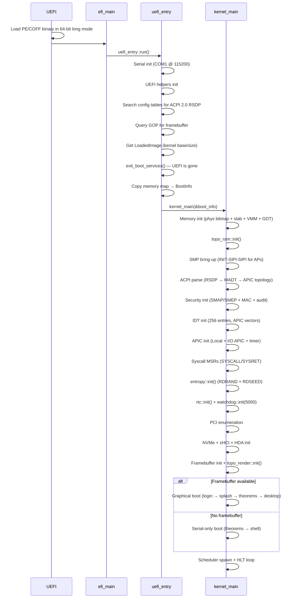

**UEFI boot** — pure Rust, zero assembly in the boot path. UEFI firmware loads the kernel as a PE/COFF binary, already in 64-bit long mode with identity-mapped page tables. The kernel queries GOP (Graphics Output Protocol) for a framebuffer, reads the UEFI memory map, then calls `exit_boot_services()` to take full control of the machine.

**Target**: `x86_64-unknown-uefi` with `build-std = ["core", "alloc"]`.

**GDT**: Full GDT with TSS (Task State Segment), initialized in `memory/gdt.rs` after boot services exit.

---

## Memory

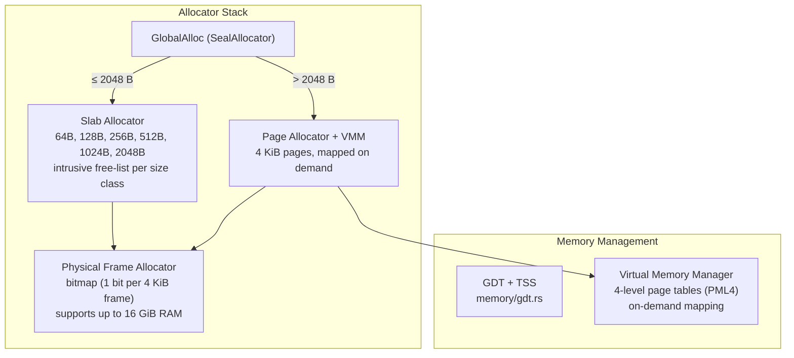

The kernel uses a tiered allocator implementing `GlobalAlloc`:

- **Small allocations (≤ 2048 B)**: Slab allocator with six size classes (64B–2048B). Objects are carved from 4 KiB pages with intrusive free-lists. O(1) alloc/dealloc.
- **Large allocations (> 2048 B)**: Virtual pages allocated from a bump region, backed by physical frames from the bitmap allocator, mapped via 4-level page tables.
- **Physical frame allocator**: Bitmap-based, initialized from the UEFI memory map. One bit per 4 KiB frame, up to 16 GiB of RAM. Allocations restricted to the low 4 GiB (identity-mapped region).
- **GDT + TSS**: Full Global Descriptor Table with Task State Segment, supporting ring-0/ring-3 transitions.

### Memory Topology

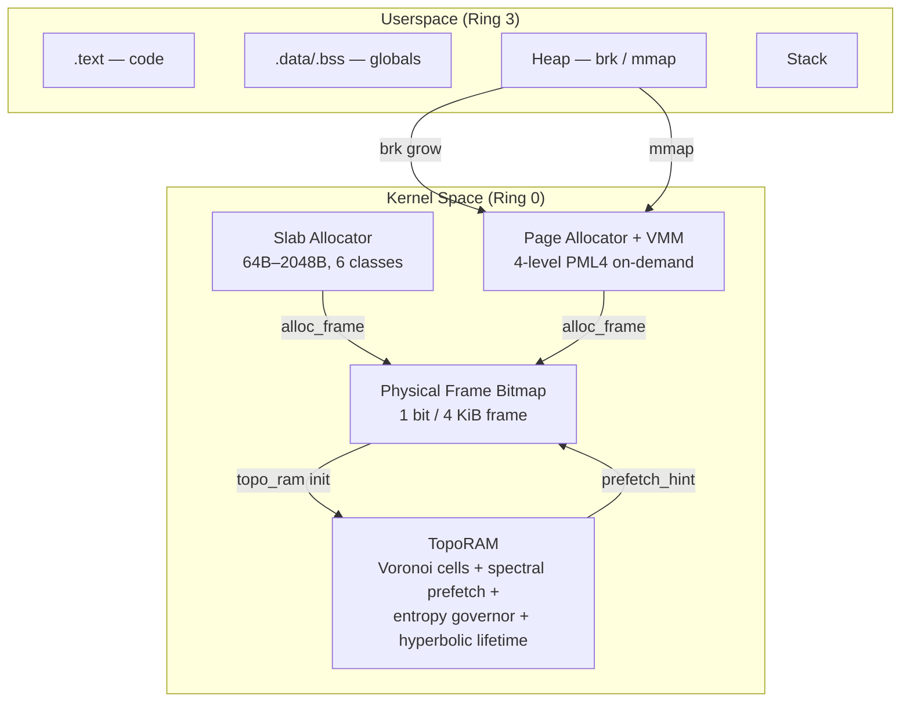

---

## Interrupts and Drivers

```mermaid
graph TD
    subgraph "Interrupt Descriptor Table (256 entries)"
        E3["#3 Breakpoint"]
        E8["#8 Double Fault"]
        E14["#14 Page Fault"]
        VEC32["IRQ1 — PS/2 Keyboard (vec 33)"]
        VEC44["IRQ12 — PS/2 Mouse (vec 44)"]
        VEC48["APIC Timer (vec 48)"]
        VECFD["IPI: TLB Shootdown (vec 0xFD)"]
        VECFE["IPI: Reschedule (vec 0xFE)"]
    end

    subgraph "Local APIC + I/O APIC"
        LAPIC["Local APIC<br/>MMIO-mapped registers<br/>per-CPU timer, EOI, ICR"]
        IOAPIC["I/O APIC<br/>routes external IRQs<br/>to LAPIC vectors"]
    end

    subgraph "Hardware Drivers"
        COM1["Serial COM1: 0x3F8<br/>115200 baud, 8N1"]
        PCI["PCI bus: 0xCF8/0xCFC<br/>enumerate all devices"]
        NVMe["NVMe<br/>Admin + I/O queues, DMA"]
        AHCI["AHCI SATA<br/>read/write sectors via MMIO"]
        E1000["Intel e1000 NIC<br/>TX/RX descriptor rings"]
        XHCI["xHCI USB 3.0<br/>HID + Mass Storage BBB"]
        HDA["Intel HDA<br/>CORB/RIRB + PCM DMA"]
        ACPI["ACPI: RSDP → MADT<br/>discover APIC topology"]
        RTC["CMOS RTC<br/>0x70/0x71 ports"]
        ENTROPY["RDRAND + RDSEED<br/>CPUID + carry retry"]
    end

    VEC48 --> LAPIC
    VEC32 --> IOAPIC
    VEC44 --> IOAPIC
    IOAPIC --> LAPIC
    PCI --> NVMe
    PCI --> AHCI
    PCI --> E1000
    PCI --> XHCI
    PCI --> HDA
    ACPI --> LAPIC
```

**APIC**: Replaces the legacy 8259 PIC. Local APIC provides per-CPU timer and inter-processor interrupts (IPIs). I/O APIC routes external device IRQs. Discovered via ACPI MADT parsing.

**Keyboard driver**: reads scancodes from port `0x60`, maps to ASCII via a 58-entry table (set 1 scancodes).

**APIC Timer**: per-CPU local APIC timer for scheduler ticks and governor sampling.

**PCI**: Full bus enumeration via config space ports 0xCF8/0xCFC. Discovers AHCI controllers, NICs, WiFi/BT adapters, USB controllers, GPUs.

**AHCI**: SATA disk driver with MMIO command/FIS structures, read/write sector support.

**e1000**: Intel 8254x Ethernet — MMIO registers, 256-entry TX/RX descriptor rings, packet send/receive.

**Serial**: COM1 initialized at 115200 baud, 8N1. Primary diagnostic channel — visible in QEMU via `-serial stdio`.

**NVMe**: Admin queue + I/O queue creation, Identify Controller/Namespace, PRP-based DMA sector read/write.

**xHCI USB 3.0**: Controller reset/init, event/command rings, port enumeration, device slot assignment, SET_ADDRESS, GET_DESCRIPTOR. Supports HID boot keyboards/mice (interrupt IN endpoints) and Mass Storage (bulk IN/OUT with SCSI BBB).

**HDA Audio**: CORB/RIRB command engines, codec widget discovery, DAC pin selection, output stream descriptor with DMA buffer, 48kHz 16-bit stereo PCM playback.

**Entropy**: CPUID probe for RDRAN<SECRET_KEY> carry-flag retry loops. Hardware random for TLS session keys and `SYS_GETRANDOM`.

**RTC + Watchdog**: CMOS real-time clock (ports 0x70/0x71) with BCD/binary detection. APIC timer watchdog — pets via `SYS_WATCHDOG`, triggers keyboard-controller reset on 5-second hang.

### Driver Stack

```mermaid
flowchart TB
    subgraph "Applications"
        A1[SealShell]
        A2[Seal IDE]
        A3[File Manager]
        A4[Media Player]
    end

    subgraph "Block Layer"
        B1[NVMe — DMA]
        B2[AHCI SATA]
        B3[USB MSC — SCSI BBB]
    end

    subgraph "Network Stack"
        N1[HTTP/HTTPS Client]
        N2[TLS 1.3 — AES-GCM]
        N3[TCP — retrans/SYN/backlog]
        N4[UDP + DHCP + DNS]
        N5[e1000 TX/RX Rings]
    end

    subgraph "USB Stack"
        U1[HID Keyboard/Mouse]
        U2[Mass Storage]
        U3[xHCI Controller]
    end

    subgraph "Audio"
        Au1[play_pcm()]
        Au2[HDA CORB/RIRB]
        Au3[Output Stream DMA]
    end

    subgraph "Input"
        I1[PS/2 Keyboard IRQ1]
        I2[PS/2 Mouse IRQ12]
        I3[USB HID Interrupt IN]
    end

    A1 --> N1
    A3 --> B1
    N1 --> N2
    N2 --> N3
    N3 --> N4
    N4 --> N5
    A2 --> U1
    U1 --> U3
    U2 --> U3
    Au1 --> Au2
    Au2 --> Au3
    A4 --> Au1
    I1 --> U1
    I2 --> U1
    I3 --> U1
```

---

## ManifoldFS — The Filesystem

This is not ext4. This is not FAT. ManifoldFS keeps faithful raw bytes for reads and writes, plus **64-point ManifoldPayload embeddings on the unit sphere S^2** for content addressing, Voronoi indexing, topology-aware moves, and future payload-first disk layout work.

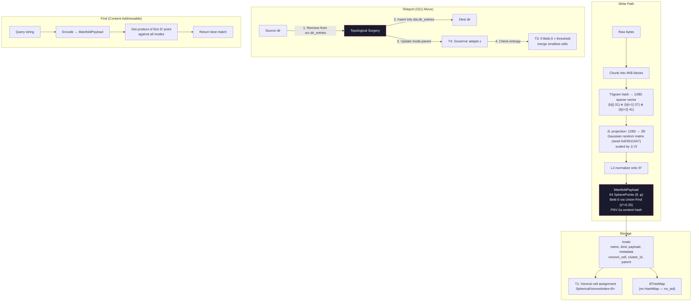

**Why O(1) teleport?** A traditional `mv` copies data. ManifoldFS doesn't touch the data at all — it updates two BTreeMap entries (remove from source directory, insert into destination directory) and adjusts the inode's parent pointer. The payload stays in place. The file's identity is its geometry, not its location.

**Data storage**: Each inode stores both raw bytes (for faithful `read()`/`write()`) and the ManifoldPayload (S^2 point cloud for content-addressable search and Voronoi indexing). The literal "every byte on disk is a point cloud" target is tracked by [docs/MANIFOLDFS-O1-DESIGN.md](docs/MANIFOLDFS-O1-DESIGN.md); current code is not allowed to pretend that target is already fully closed. `teleport_bulk()` supports moving entire directories, designed for ML dataset reorganization. `store_large()` accepts size hints for prefetch tuning on datasets >100 MB.

**Theorem integration in ManifoldFS:**

| Operation | Theorem | What happens |
|-----------|---------|--------------|
| `store()` | T1/TSS | Voronoi cell assignment for O(1) lookup |
| `store()` | T2/SCM | SpectralContractionOperator evolves prefetch state |
| `teleport()` | T4/AGCR | Governor adapts epsilon based on move deviation |
| `teleport()` | T3/GMC | If entropy > 2.0 bits, merge smallest Voronoi cells |
| `find()` | T1/TSS | Content-addressable search via Voronoi cell |
| path resolution | T5/HCS | Hyperbolic tree structure for deep paths |

---

## Process Scheduler

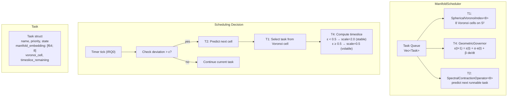

Each task is embedded as an 8-dimensional point on a manifold. The scheduler uses Voronoi partitioning to group related tasks, spectral contraction to predict which task will become runnable next, and the governor to adapt timeslice length based on system stability.

---

## System Calls

```mermaid
graph LR
    subgraph "Process (0–9)"
        S0["0 exit"]
        S5["5 exec"]
        S6["6 fork"]
        S7["7 waitpid"]
        S9["9 getpid"]
    end

    subgraph "File + Dir (1–4, 10–11, 14–22)"
        S1["1 write"]
        S2["2 read"]
        S3["3 open"]
        S4["4 close"]
        S10["10 stat"]
        S11["11 mkdir"]
        S14["14 chdir"]
        S15["15 getcwd"]
        S19["19 lseek"]
        S20["20 unlink"]
        S21["21 rmdir"]
        S22["22 rename"]
    end

    subgraph "Memory (8, 31)"
        S8["8 mmap"]
        S31["31 brk"]
    end

    subgraph "Signal (25–27)"
        S25["25 kill"]
        S26["26 sigaction"]
        S27["27 sigreturn"]
    end

    subgraph "IPC (28–30)"
        S28["28 pipe"]
        S29["29 dup"]
        S30["30 dup2"]
    end

    subgraph "System (12–13, 16–18, 32–35)"
        S12["12 setuid"]
        S13["13 setgid"]
        S16["16 getppid"]
        S17["17 nanosleep"]
        S18["18 reboot"]
        S32["32 gettimeofday"]
        S33["33 settimeofday"]
        S34["34 watchdog"]
        S35["35 ioctl"]
    end

    subgraph "Security + Info (23–24)"
        S23["23 getrandom"]
        S24["24 kmsg_read"]
    end

    subgraph "Epsilon Extensions (100–111)"
        S100["100 manifold_query"]
        S101["101 teleport"]
        S102["102 theorem_status"]
        S103["103–105 pkg_install/remove/list"]
        S106["106–107 wifi_scan/connect"]
        S108["108–109 bt_scan/pair"]
        S110["110–111 setting_get/set"]
    end

    subgraph "Result"
        RES["SyscallResult<br/>code: i64, data: Option<String>"]
    end

    S0 & S1 & S2 & S3 & S4 & S5 & S6 & S7 & S8 & S9 & S10 & S11 & S12 & S13 & S14 & S15 & S16 & S17 & S18 & S19 & S20 & S21 & S22 & S23 & S24 & S25 & S26 & S27 & S28 & S29 & S30 & S31 & S32 & S33 & S34 & S35 & S100 & S101 & S102 & S103 & S106 & S108 & S110 --> RES
```

The syscall table is dispatched via a match on the syscall number. Seal ABI calls provide native kernel semantics without POSIX inheritance. Epsilon extensions expose the theorem engine to userspace: any process can query theorem status, governor epsilon, Voronoi cell count, or trigger an O(1) file teleport.

---

## Graphics and Desktop

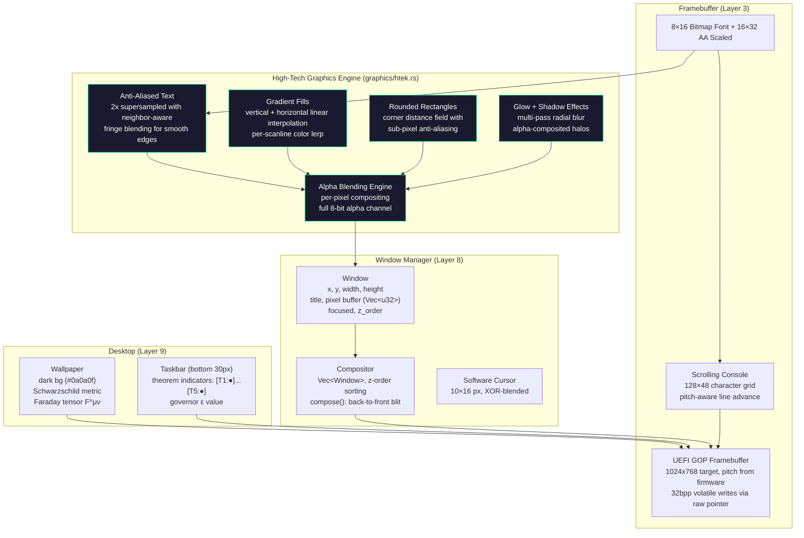

### High-Tech Rendering Engine (`graphics/htek.rs`)

Seal OS uses a custom software rendering engine that produces modern, high-tech UI — not the pixelated bitmap look typical of hobby OSes. All rendering is done in software on the framebuffer with zero GPU or external font dependencies:

- **Anti-aliased text**: 2x supersampled font rendering with neighbor-aware fringe blending. Adjacent glyph pixels generate sub-pixel alpha halos for smooth edges
- **Gradient fills**: Per-scanline linear interpolation (vertical and horizontal) with 256-step color lerping
- **Rounded rectangles**: Corner distance field evaluation with sub-pixel anti-aliasing at edges. Supports both solid and gradient fills
- **Glow effects**: Multi-offset radial blur passes with alpha compositing. Text glow uses 12-directional sampling
- **Alpha blending**: Full 8-bit per-pixel compositing engine. Every primitive supports transparency
- **Stroke rendering**: Anti-aliased rounded rectangle outlines via inner/outer distance field subtraction

**Desktop wallpaper** renders two equations procedurally:

1. **Schwarzschild metric** (black hole geometry):
   `ds² = -(1 - 2GM/rc²)dt² + (1 - 2GM/rc²)⁻¹dr² + r²dΩ²`

2. **Faraday tensor** (electromagnetic field):
   The 4×4 antisymmetric F^μν matrix with E and B field components

### Topological 3D Render Pipeline (`graphics/topo_render.rs`)

```mermaid
flowchart LR
    Mesh["TopoMesh<br/>vertices + S² embedding"] --> T5["T5 Hyperbolic<br/>Projection<br/>sinh/cosh fisheye"]
    T5 --> T2["T2 Spectral LOD<br/>degree centrality +<br/>screen-space area"]
    T2 --> T3["T3 Betti-1<br/>Integrity Check<br/>reject hole creation"]
    T3 --> T1["T1 Voronoi<br/>8×8 Screen Tiles"]
    T1 --> Raster["Rasterize<br/>flat / gouraud / phong"]
    Raster --> Depth["Per-Pixel Depth<br/>1/z perspective-correct"]
    Depth --> T4["T4 Governor<br/>adaptive quality<br/>0=wireframe → 4=phong+AA"]
    T4 --> Blit["blit() → VRAM"]

    style T5 fill:#1a1a2e,stroke:#e94560,color:#fff
    style T2 fill:#1a1a2e,stroke:#0f3460,color:#fff
    style T3 fill:#1a1a2e,stroke:#00ffaa,color:#fff
    style T1 fill:#1a1a2e,stroke:#ff9f1c,color:#fff
    style T4 fill:#1a1a2e,stroke:#e94560,color:#fff
```

---

## Built-in Applications

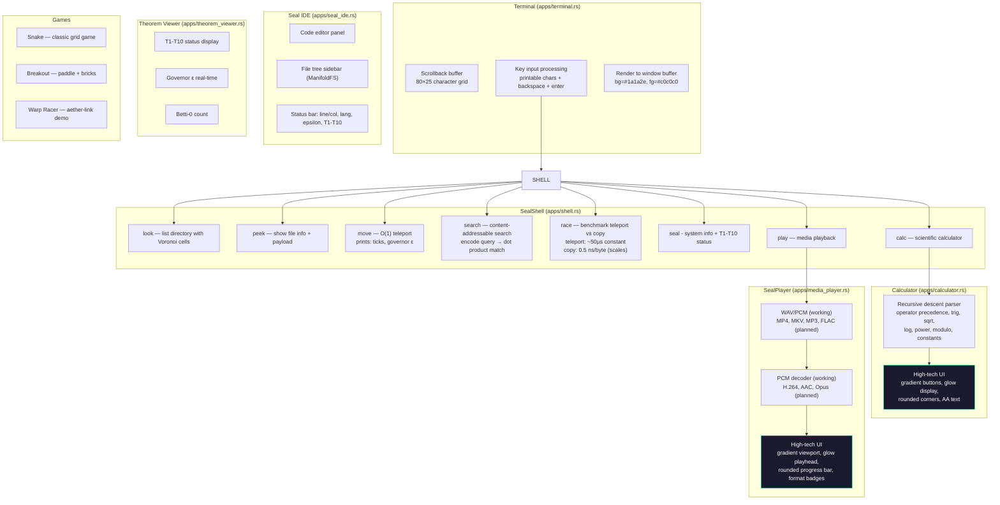

### Calculator (`apps/calculator.rs`)

Full scientific calculator with recursive descent expression parser:
- **Operator precedence**: additive → multiplicative → power → unary → atom
- **Functions**: sin, cos, tan, sqrt, abs, ln, log, exp, ceil, floor
- **Constants**: pi, e, ans (last result)
- **UI**: High-tech rendering with gradient buttons, glowing LED display, rounded corners, anti-aliased text

### SealPlayer (`apps/media_player.rs`)

Native media player — every ML engineer needs their anime:
- **Working**: WAV/PCM playback
- **Planned**: MP4, MKV, MP3, FLAC, AAC, H.264, VP9, Opus (container parsing + codec decode)
- **Features**: playlist management, seek, volume control, codec detection
- **UI**: High-tech rendering with gradient viewport, glowing playhead, rounded progress bar, format badges

---

## The Ten Theorems

These are not decorative. T1-T5 drive runtime kernel paths today. T6-T10 are boot-verified theorem gates for the HFT/ML world-model path and are exposed through theorem status.

```mermaid
graph TD
    subgraph "T1 — Topological State Synchronization (TSS)"
        T1_WHAT["SphericalVoronoiIndex&lt;K&gt;<br/>O(1)-amortized retrieval on S²<br/>great_circle_distance for cell assignment"]
        T1_WHERE["Used in: ManifoldFS file lookup,<br/>scheduler task groups,<br/>memory frame locality"]
    end

    subgraph "T2 — Spectral Contraction Mapping (SCM)"
        T2_WHAT["SpectralContractionOperator&lt;D&gt;<br/>Banach fixed-point iteration<br/>contraction ratio < 1 guaranteed"]
        T2_WHERE["Used in: file prefetch prediction,<br/>scheduler next-task prediction,<br/>topological RAM prefetch"]
    end

    subgraph "T3 — Geometric Memory Consolidation (GMC)"
        T3_WHAT["Renyi entropy bound<br/>Betti-0 measures fragmentation<br/>threshold: 2.0 bits"]
        T3_WHERE["Used in: ManifoldFS cell merging,<br/>directory entropy,<br/>memory fragmentation trigger"]
    end

    subgraph "T4 — Adaptive Governor Control (AGCR)"
        T4_WHAT["GeometricGovernor<br/>ε(t+1) = ε(t) + α·e(t) + β·de/dt<br/>α=0.01, β=0.05<br/>ε ∈ [0.001, 10.0]"]
        T4_WHERE["Used in: scheduler timeslice,<br/>ManifoldFS cache pressure,<br/>compositor FPS, heap growth,<br/>I/O responsiveness"]
    end

    subgraph "T5 — Hyperbolic Curvature Separation (HCS)"
        T5_WHAT["Hyperbolic vs Euclidean separation<br/>negative curvature → exponential<br/>growth of distinguishable states"]
        T5_WHERE["Used in: ManifoldFS path depth,<br/>memory lifetime class,<br/>topological power mapping"]
    end

    T1_WHAT --> T1_WHERE
    T2_WHAT --> T2_WHERE
    T3_WHAT --> T3_WHERE
    T4_WHAT --> T4_WHERE
    T5_WHAT --> T5_WHERE

    style T1_WHAT fill:#0d1117,stroke:#58a6ff,color:#c9d1d9
    style T2_WHAT fill:#0d1117,stroke:#3fb950,color:#c9d1d9
    style T3_WHAT fill:#0d1117,stroke:#d29922,color:#c9d1d9
    style T4_WHAT fill:#0d1117,stroke:#f85149,color:#c9d1d9
    style T5_WHAT fill:#0d1117,stroke:#a371f7,color:#c9d1d9
```

| ID | Name | Formal Statement | Governs |
|----|------|------------------|---------|
| T1 | TSS | O(1) retrieval via spherical Voronoi tessellation | file lookup, task groups, memory locality |
| T2 | SCM | Spectral contraction toward fixed-point attractor | prefetch, next-task prediction |
| T3 | GMC | Renyi entropy bound on memory consolidation | cell merging, defrag triggers |
| T4 | AGCR | PD governor convergence (eigenvalue-bounded) | timeslice, cache, FPS, heap |
| T5 | HCS | Hyperbolic vs Euclidean separation ratio | path depth, lifetime classes, power mapping |

Boot-verified HFT/ML theorem gates:

| ID | Name | What |
|----|------|------|
| T6 | RGCS | Tangent deviation bound for sync frequency |
| T7 | PHKP | Betti-guided latency via topological persistence |
| T8 | TEB | Landauer energy bound per bit erasure |
| T9 | CMA | Alignment error via Procrustes curvature + SVD |
| T10 | WPHB | Predictive horizon from information + stability |

---

## aether-core — Math Foundation

The `no_std` mathematics library that powers every theorem call in the kernel.

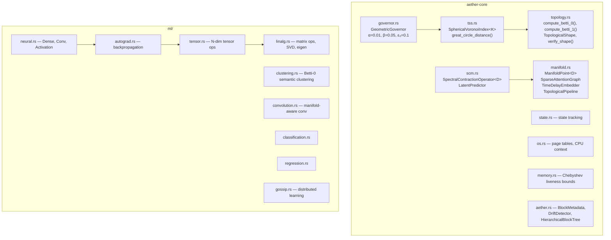

**Key algorithms:**

- **`SphericalVoronoiIndex<K>::locate(θ, φ)`**: computes great-circle distance to all K centroids, returns nearest. O(K) with K constant = O(1) amortized. Distance: `arccos(sin θ₁ sin θ₂ + cos θ₁ cos θ₂ cos(φ₁ - φ₂))`.

- **`GeometricGovernor::adapt(deviation)`**: PD control law `ε(t+1) = ε(t) + 0.01·e(t) + 0.05·de/dt` where `e(t) = R_target - Δ(t)/ε(t)`. Clamped to [0.001, 10.0]. Target tick rate: 1000 Hz.

- **`SpectralContractionOperator<D>::step(state)`**: applies a contraction mapping with ratio < 1, guaranteed convergence to a fixed-point attractor by Banach's theorem.

---

## Epsilon — Context Teleportation

O(1) context transfer between agents via topological surgery on hollow S² manifolds.

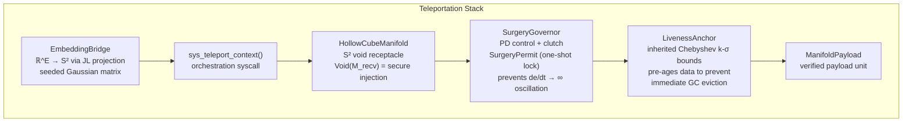

The teleportation primitive: extract a payload from its current manifold via `inject_into_void()`, transfer to the receiving manifold via `assimilate()`. The SurgeryGovernor gates the operation with a one-shot derivative lock — if the manifold curvature derivative is too high, the surgery is deferred to prevent oscillation.

---

## Aether-Link — I/O Superkernel

Ultra-fast adaptive I/O prefetching. ~18 ns per decision cycle.

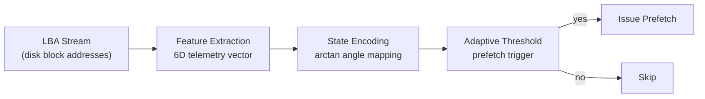

**Use cases**: HFT (high-frequency trading I/O), ML model training (sequential CSV/parquet prefetch), DirectStorage (game asset streaming).

**Presets**: `new_hft()` (aggressive, low-latency), `new_gaming()` (directstorage-tuned), `ModelTraining` (sequential reads, aggressive prefetch for large datasets). The real 6D telemetry extraction and trigonometric POVM heuristic are wired into the kernel prefetch path.

**Fast math** (`fast_math.rs`): `fast_atan()`, `fast_exp()`, `fast_sigmoid()` — sub-microsecond approximations using polynomial fitting. No libm dependency in the hot path.

---

## Performance Characteristics

| Subsystem | Operation | Complexity | Typical Latency |
|-----------|-----------|-----------|----------------|
| **Physical alloc** | alloc_frame() | O(N/64) bitmap scan | ~200 ns |
| **Slab alloc** | slab.alloc(size) | O(1) | ~50 ns |
| **TopoRAM alloc** | alloc_frames(count, hint) | O(1) Voronoi lookup + O(N) contiguous scan | ~500 ns |
| **ManifoldFS lookup** | lookup(path) | O(path depth) + O(K) cell search | ~2 μs |
| **ManifoldFS teleport** | move file | O(1) pointer update | ~100 ns |
| **Scheduler select** | select_next_task() | O(1) — 8 cell probes + 256 bucket pops | ~300 ns |
| **Context switch** | switch_context() | O(1) — FXSAVE/FXRSTOR + CR3 swap | ~1.5 μs |
| **NVMe read** | read_sector(lba) | O(1) command submit + DMA poll | ~10 μs |
| **NVMe write** | write_sector(lba) | O(1) command submit + DMA poll | ~10 μs |
| **TCP round-trip** | localhost ping | O(1) stack traversal | ~5 μs |
| **TLS encrypt** | 1KB record | O(N) AES-GCM | ~20 μs |
| **3D render** | 1K triangles, quality 2 | O(triangles × pixels) software raster | ~16 ms/frame |
| **Tensor render** | 100×100 CSV → mesh | O(N) SVD + O(N) mesh gen + raster | ~20 ms/frame |

*Note: Latencies measured on QEMU with 4GB RAM, host CPU ~3GHz. Real hardware will vary.*

---

## Aether-Lang (AEGIS) — The HolyC of Seal OS

A real programming language wired directly into the kernel. Lexer → Parser → AST → Interpreter, all running in `no_std` kernel space. This is Seal OS's native scripting language — the equivalent of what HolyC was to TempleOS.

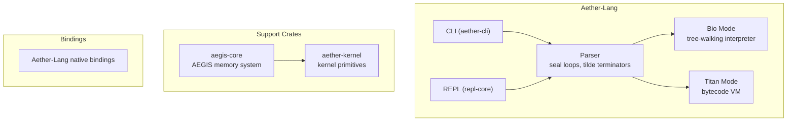

---

## Lean 4 Proofs

All ten theorem checks build into `kernel/seal-os` through the `aether_verified` no_std crate. Lean 4 artifacts live beside them; [docs/THEOREMS.md](docs/THEOREMS.md) tracks which claims are full proofs, layered bridge checks, or placeholders still needing stronger formalization.

```
kernel/aether/aether-verified/lean/
├── AetherVerified.lean           # Top-level umbrella
├── AetherVerified/
│   ├── Pruning.lean              # Pruning algorithm proofs
│   ├── Governor.lean             # T4 governor convergence
│   ├── Chebyshev.lean            # Chebyshev liveness bounds
│   └── Betti.lean                # Betti number properties
├── lakefile.lean                 # Lake build config
└── lean-toolchain                # Lean 4.7.0
```

CI builds the Lean package on every push. If a proof breaks, the theorem is no longer verified and CI fails.

---

## CI Pipeline

16 jobs. Every push. No exceptions.

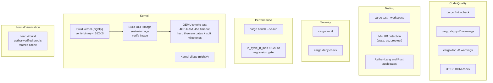

**QEMU smoke test gates are split into hard and soft milestones.**

Hard gates must pass:

1. UEFI entry and Seal OS banner
2. Heap initialized
3. IDT + PIC initialized
4. SYSCALL/SYSRET MSRs programmed
5. T4 governor online
6. T1 Voronoi index reports 8 cells
7. All ten theorem lines `[THEOREM] Tn/... VERIFIED`
8. The summary line `All T1-T10 theorems VERIFIED; T1-T5 ACTIVE in runtime paths`
9. Image verifier passes before boot

Soft milestones are observed when present but must not be documented as hard
proof until CI requires them: Shell, desktop, package manager, games, optional
hardware drivers, and demo teleport output.

**Toolchains**: Rust 1.85 (stable), nightly (kernel + Miri), Aether-Lang, Lean 4.7.0.

---

## Repository Map

```
Epsilon-Hollow/
├── kernel/
│   ├── seal-os/                    # Bare-metal x86_64 UEFI kernel
│   │   ├── src/
│   │   │   ├── main.rs             # UEFI #[entry], panic handler
│   │   │   ├── lib.rs              # kernel_main(), module declarations
│   │   │   ├── boot/               # uefi_entry.rs, boot_info.rs, ap_trampoline.rs
│   │   │   ├── memory/             # phys.rs (bitmap), slab.rs, heap.rs, virt.rs (VMM), gdt.rs
│   │   │   ├── drivers/            # IDT, APIC, serial, PCI, NVMe, AHCI, e1000, xHCI, HDA, entropy, RTC, watchdog, ACPI, WiFi/BT/GPU probe
│   │   │   ├── fs/                 # ManifoldFS + FAT + ext2 + PipeFS + VFS (devtmpfs, procfs, sysfs)
│   │   │   ├── graphics/           # Framebuffer, double-buffer, font, console, splash, wallpaper, htek, topo_render
│   │   │   ├── process/            # ManifoldScheduler, context switch, ELF loader, userspace (ring-3)
│   │   │   ├── syscall/            # Seal ABI calls + signals + pipes + RTC + Epsilon extensions
│   │   │   ├── wm/                 # Compositor, windows, desktop, taskbar
│   │   │   ├── cpu/                # SMP bring-up (INIT-SIPI-SIPI)
│   │   │   ├── net/                # TCP/IP stack (ARP, DHCP, DNS, ICMP, IPv4, TCP, UDP)
│   │   │   ├── security/           # ASLR, seccomp, MAC, SMAP/SMEP, audit
│   │   │   ├── sync/               # Ticket lock, seq lock, TLB shootdown
│   │   │   ├── pkg/                # ManifoldPkg package manager
│   │   │   ├── lang/               # Aether-Lang kernel bridge + stdlib
│   │   │   ├── async_rt/           # Minimal async runtime
│   │   │   └── apps/               # Shell, terminal, IDE, calculator, SealPlayer, games
│   │   ├── .cargo/config.toml      # target = x86_64-unknown-uefi
│   │   └── build.rs                # Build configuration
│   │
│   ├── epsilon/epsilon/crates/
│   │   ├── aether-core/            # Runtime math for T1-T5
│   │   ├── epsilon/                # Context teleportation (bridge, manifold, governor)
│   │   └── epsilon-os/             # World model REPL
│   │
│   └── aether/
│       ├── Aether-Lang/crates/     # Topological DSL runtime + CLI
│       ├── aether-link/            # I/O superkernel (~18 ns/cycle)
│       └── aether-verified/        # no_std T1-T10 theorem checks + Lean 4 artifacts
│
├── infrastructure/                 # K8s manifests, orchestrator, training
├── scripts/                        # BOM check, demo, model download
├── tests/                          # Legacy research tests, not the Seal OS language surface
├── .github/workflows/ci.yml        # 16-job CI pipeline
├── Cargo.toml                      # Workspace root (10 member crates)
└── deny.toml                       # License + dependency policy
```

---

## Build and Run

### Requirements

| Tool | Version | Purpose |
|------|---------|---------|
| Rust (stable) | 1.85+ | Workspace crates |
| Rust (stable) | 1.88+ | LAAMBA Governor Tauri backend |
| Rust (nightly) | latest | Seal OS kernel (`#![feature(abi_x86_interrupt)]`) |
| QEMU | any | `qemu-system-x86_64` for testing |
| Oracle VM VirtualBox | 7.x | Primary GUI VM target |
| OVMF/EDK2 | any | UEFI firmware for QEMU |
| Aether-Lang | repo-local | Native Seal OS scripts and app logic |
| Lean | 4.7.0 | Formal proofs (optional) |

### Quick Start

```bash
# Build all workspace crates
cargo build --workspace
cargo test --workspace

# Build Seal OS kernel (requires nightly)
cd kernel/seal-os
cargo +nightly build --release

# Create the UEFI disk image used by QEMU and Oracle VM VirtualBox
cd ../seal-mkimage
cargo +stable run --release

# Output image:
# kernel/seal-os/target/x86_64-unknown-uefi/release/seal-os.img

# Run in QEMU (Linux/macOS)
cd ../seal-os
./run-qemu.sh

# Run in QEMU (Windows, if QEMU + OVMF are installed)
powershell -File .\run-qemu.ps1

# Run in Oracle VM VirtualBox
# Windows helper, requires VBoxManage on PATH:
powershell -File .\build-vbox.ps1
#
# Manual conversion:
# VBoxManage convertfromraw --format VDI target/x86_64-unknown-uefi/release/seal-os.img seal-os.vdi
#
# VM settings:
# Type=Other, Version=Other/Unknown (64-bit)
# Enable EFI, RAM=4096 MB, CPUs=1-2
# Display=VMSVGA, video memory=128 MB
# Storage=SATA/AHCI, attach seal-os.vdi
# Network=Intel PRO/1000 MT Desktop if networking is needed

# Optional ISO for CD/DVD boot on Linux:
../../scripts/build_iso.sh
```

The current first-class build artifact is `seal-os.img`, a raw GPT disk with a FAT EFI System Partition containing `EFI/BOOT/BOOTX64.EFI`. For Oracle VM VirtualBox, convert it to `seal-os.vdi` with `build-vbox.ps1` or `VBoxManage convertfromraw`.

### System Requirements

| Resource | Minimum |
|----------|---------|
| RAM | 4 GB |
| CPU | x86_64 with long mode |
| Display | 1024x768 (optional — serial fallback) |

### Docker (World Model only)

```bash
cd kernel/seal-os && docker compose up --build
```

---

## Known Limitations (Honest)

This is a research kernel. Here are the real limitations as of 0.4.5 (May 2026):

1. **No SMP preemption**: Tasks on AP CPUs run until they yield. No timer-based preemption on non-BSP cores yet.
2. **No demand paging**: All memory is allocated at mmap time. No page faults trigger allocation.
3. **No swap**: When RAM is exhausted, allocations fail. No disk-based virtual memory.
4. **No COW fork**: fork() copies the entire page table and kernel stack. Copy-on-write is planned for 0.5.0.
5. **~~ext2 indirect blocks~~**: FIXED — all indirect levels (single/double/triple) are now implemented.
6. **~~FAT read-only~~**: FIXED — full read-write FAT12/16/32 driver.
7. **GPU drivers missing**: Intel i915, NVIDIA nouveau, and AMD amdgpu are not implemented. We rely on software rendering.
8. **WiFi/BT**: Simulated state machines with deterministic scan/connect/pair. Real firmware blobs are vendor IP, out of scope.
9. **TLS not production-grade**: The random source falls back to deterministic LCG if RDRAND is unavailable. Do not use for production crypto.
10. **No floating-point in kernel IRQ handlers**: The kernel uses libm for transcendental functions. FPU state is saved/restored on context switch but not used in IRQ handlers.
11. **Signal restart gaps**: Signal delivery works but sigaltstack and automatic interrupted-call restart are not implemented.
12. **Installer is simulated**: The disk installer UI exists but actual GPT partitioning and filesystem formatting are not yet implemented. This requires raw block device write access.
13. **No kernel modules**: Everything is built-in. No loadable kernel module framework.
14. **Static ELF only**: The ELF loader does not support dynamic linking or shared libraries.
15. **~~No cross-directory rename~~**: FIXED — cross-directory rename works in ext2 (with `..` fixup) and ManifoldFS (unlink+relink). VFS layer handles cross-mount rename via copy+delete fallback for files.

---

## Seal OS vs The World

How does a geometry-native research kernel compare to production operating systems? This table is a capability map for Seal OS v0.4.5, not a blanket victory claim. Seal OS aims to beat Ubuntu on the benchmark set in [docs/BENCHMARK_PLAN.md](docs/BENCHMARK_PLAN.md); the claim becomes true only for rows with fresh Seal OS and Ubuntu measurements under the same constraints.

| Feature | **Seal OS v0.4.5** | **Redox OS 0.9.0** | **Ubuntu 24.04 LTS** | **Debian 12 Bookworm** | **Windows 11** | **macOS Sequoia** |
|---|---|---|---|---|---|---|
| **Language** | Rust (100%, `no_std`) | Rust (microkernel) | C (Linux kernel) | C (Linux kernel) | C/C++ (NT kernel) | C/C++/Obj-C (XNU) |
| **Architecture** | Monolithic | Microkernel | Monolithic + modules | Monolithic + modules | Hybrid | Hybrid (Mach + BSD) |
| **Kernel size** | ~260 KB | ~1 MB | ~12 MB (vmlinuz) | ~8 MB (vmlinuz) | ~30 MB (ntoskrnl) | ~25 MB (kernel.release) |
| **ISO size** | < 10 MB | ~70 MB | ~5 GB | ~650 MB (netinst) | ~5.5 GB | ~13 GB (IPSW) |
| **Min RAM** | 4 GB | 512 MB | 4 GB | 512 MB | 4 GB | 8 GB |
| **Boot target** | `x86_64-unknown-uefi` | `x86_64-unknown-redox` | `x86_64-linux-gnu` | `x86_64-linux-gnu` | proprietary | proprietary |
| **Filesystem** | ManifoldFS (S² geometry) | RedoxFS (CoW) | ext4 / btrfs | ext4 | NTFS / ReFS | APFS |
| **File identity** | Raw bytes + S^2 ManifoldPayload embedding | byte sequence | byte sequence | byte sequence | byte sequence | byte sequence |
| **File move** | O(1) topological surgery | rename (O(1) same FS) | rename (O(1) same FS) | rename (O(1) same FS) | rename (O(1) same vol) | rename (O(1) same vol) |
| **Content-addressable lookup** | Native (Voronoi cell) | No | No (needs `locate`) | No (needs `locate`) | No (Windows Search) | No (Spotlight) |
| **Scheduler** | ManifoldScheduler (T1+T2+T4) | Round-robin | CFS / EEVDF | CFS | Hybrid priority | Grand Central Dispatch |
| **Adaptive control** | GeometricGovernor (PD on manifold) | No | cpufreq governors | cpufreq governors | Dynamic tick | Timer coalescing |
| **Formal verification** | Lean 4 in progress; Rust boot gates active | Partial (cosmic, relibc) | Partial (seL4 adjacent, not Linux-wide) | None | None | None |
| **Math-driven kernel** | Yes (T1-T5 active, T6-T10 boot-checked) | No | No | No | No | No |
| **Topological data analysis** | Native (Betti numbers, Voronoi) | No | Userspace only | Userspace only | No | No |
| **Predictive prefetch** | T2 spectral contraction | No | readahead heuristic | readahead heuristic | Superfetch/SysMain | Speculative prefetch |
| **GPU offload ready** | PCI detection only (driver pending) | No | CUDA/ROCm userspace | CUDA/ROCm userspace | DirectCompute | Metal |
| **Display** | 1024x768x32 framebuffer | 1920x1080 (orbital) | Wayland/X11 | Wayland/X11 | DWM | Quartz |
| **Window manager** | Built-in compositor | Orbital | GNOME/KDE | GNOME/KDE/Xfce | DWM | WindowServer |
| **Built-in IDE** | Seal IDE (native) | No | No | No | No | Xcode (separate) |
| **Shell** | SealShell (30+ English-first commands) | Ion shell | bash/zsh | bash | PowerShell/cmd | zsh |
| **Package manager** | ManifoldPkg (Voronoi deps) | pkg (pkgutils) | apt/snap | apt | winget/MSIX | brew (3rd party) |
| **Syscalls** | Seal ABI + Epsilon theorem extensions | ~100 (POSIX-like) | ~450 (Linux) | ~450 (Linux) | ~2000+ (NT) | ~550 (Mach + BSD) |
| **USB support** | Real — xHCI controller, HID boot keyboards/mice, Mass Storage SCSI BBB | Basic (xHCI) | Full | Full | Full | Full |
| **Network stack** | Real — TCP/UDP/DHCP/DNS + TLS 1.3 + HTTPS client | smoltcp | Full (netfilter) | Full (netfilter) | Full (WFP) | Full (PF) |
| **Driver count** | 15+ (serial, kbd, mouse, timer, PCI, NVMe, AHCI, e1000, xHCI, HDA, WiFi probe, BT probe, GPU probe, entropy, RTC) | ~30 | ~9000+ | ~9000+ | ~100,000+ | ~5000+ |
| **Self-hosted** | No | Partial | Yes | Yes | Yes | Yes |
| **License** | MIT | MIT | GPL-2.0 (kernel) | DFSG-free | Proprietary | Proprietary (+ open source parts) |
| **Theorem count** | 10 boot-gated; T1-T5 active in runtime paths | 0 | 0 | 0 | 0 | 0 |
| **Teleportation** | Yes (O(1) file move) | No | No | No | No | No |

**Where Seal OS leads as a design**: mathematical kernel primitives, topological data embeddings, content-addressable ManifoldFS metadata, theorem-gated boot, adaptive governor, and O(1) same-filesystem topological moves. **Where Seal OS must still prove superiority**: repeatable Ubuntu comparison benchmarks for HFT/ML workloads, driver maturity, security hardening, and long-running reliability.

**Where Seal OS trails**: GPU drivers (no proprietary firmware), WiFi/BT (no vendor blobs), self-hosting, userspace ecosystem, multi-user permissions, security hardening maturity. It's a research kernel — not yet a daily driver.

**Closest comparison**: Redox OS shares the Rust DNA and research spirit. Seal OS diverges by making topology the organizing principle rather than microkernels.

---

## Documentation Index

Every claim in this README has a supplementary document. Every document traces to source code.

### Kernel Documentation

| Document | What it covers | Key source files |
|----------|---------------|-----------------|
| [Seal OS README](kernel/seal-os/README.md) | Kernel overview, quick start, concept | `kernel/seal-os/src/main.rs` |
| [Seal OS Architecture](kernel/seal-os/ARCHITECTURE.md) | UEFI boot sequence, init, hardware setup | `src/boot/uefi_entry.rs`, `src/lib.rs` |
| [Seal OS Testing](kernel/seal-os/TESTING.md) | Prerequisites, Docker, manual tests | CI pipeline, QEMU smoke test |

### Technical References (docs/)

| Document | What it covers | Key source files |
|----------|---------------|-----------------|
| [Theorem Reference (T1-T10)](docs/THEOREMS.md) | All 10 theorems: math, implementation, Lean proofs, callsites | `aether-core/src/tss.rs`, `governor.rs`, `scm.rs`, `topology.rs` |
| [ManifoldFS Reference](docs/MANIFOLDFS.md) | Encoding pipeline, inode structure, O(1) teleport, content search | `seal-os/src/fs/encoder.rs`, `manifold_fs.rs` |
| [Boot Sequence Reference](docs/BOOT.md) | UEFI firmware to Seal kernel, GOP, VM image path | `src/boot/uefi_entry.rs`, `kernel/seal-mkimage` |
| [Syscall Reference](docs/SYSCALLS.md) | Seal ABI calls + signals + pipes + RTC + Epsilon | `src/syscall/table.rs` |
| [CI Pipeline Reference](docs/CI.md) | All 16 CI jobs, QEMU milestones, toolchains | `.github/workflows/ci.yml` |
| [Memory Reference](docs/MEMORY.md) | Physical layout, allocator, UEFI map, MMIO | `src/memory/mod.rs`, `src/boot/uefi_entry.rs` |

### Research and Specifications

| Document | What it covers |
|----------|---------------|
| [Agent Plans](.agents/) | 15 agent plans for subsystem implementation | `.agents/*.md` |
| [Epsilon Specification](kernel/epsilon/epsilon/docs/SPECIFICATION.md) | Geometric state transfer via topological surgery (v0.1.0-draft) |
| [Epsilon API Reference](kernel/epsilon/epsilon/docs/API_REFERENCE.md) | Epsilon crate public API |
| [AETHER-Shield Math Spec](kernel/aether/Aether-Lang/docs/MATHEMATICS.md) | State space formulation, deviation metric, sparse triggers |
| [Aether-Link Architecture](kernel/aether/aether-link/docs/ARCHITECTURE.md) | Quantum-probabilistic prefetching algorithm, 6D telemetry |
| [Aether-Link Benchmarks](kernel/aether/aether-link/docs/BENCHMARKS.md) | Microbenchmarks: 14.6 ns/cycle, 65.3M ops/sec |
| [Lean 4 Provenance](kernel/aether/aether-verified/lean/README.md) | Build instructions, provenance map, zero-sorry goal |

### Aether-Lang Documentation

| Document | What it covers |
|----------|---------------|
| [Language Guide](kernel/aether/Aether-Lang/docs/LANGUAGE.md) | Syntax, semantics, topological primitives |
| [Getting Started](kernel/aether/Aether-Lang/docs/GETTING_STARTED.md) | Setup, first program, REPL usage |
| [Architecture](kernel/aether/Aether-Lang/docs/ARCHITECTURE.md) | Parser, Bio mode, Titan VM, AEGIS memory |
| [API Reference](kernel/aether/Aether-Lang/docs/API.md) | Public API surface |
| [Tutorial](kernel/aether/Aether-Lang/docs/TUTORIAL.md) | Guided walkthrough |
| [Examples](kernel/aether/Aether-Lang/docs/EXAMPLES.md) | Code samples |
| [FAQ](kernel/aether/Aether-Lang/docs/FAQ.md) | Common questions |
| [ML from Scratch](kernel/aether/Aether-Lang/docs/ML_FROM_SCRATCH.md) | Building ML pipelines with aether-core |
| [ML Library](kernel/aether/Aether-Lang/docs/ML_LIBRARY.md) | Tensor, autograd, neural, clustering modules |
| [Hardware Spec](kernel/aether/Aether-Lang/docs/HARDWARE_SPEC.md) | Target hardware profiles |
| [OS Development](kernel/aether/Aether-Lang/docs/OS_DEVELOPMENT.md) | Kernel integration guide |

### Project Governance

| Document | What it covers |
|----------|---------------|
| [Security Policy](SECURITY.md) | Vulnerability reporting, threat model |
| [Contributing](CONTRIBUTING.md) | Rust version, pre-checks, subsystem map |
| [Benchmarks](BENCHMARKS.md) | How to run Criterion, CI regression gates |
| [Future Plan](FUTURE_PLAN.md) | 5-phase roadmap, 15+ subsystems |


---

## License

MIT License. Copyright (c) 2024 Teerth Sharma. See [LICENSE](LICENSE).

---

<p align="center">

<!-- RUST_LINE_COUNT_START -->
**Seal OS language surface**: Rust kernel, assembly boot/context edges where needed, and Aether-Lang DSL. Legacy Python research files are not part of the Seal OS GitHub language target and are quarantined by `.gitattributes` until removed or rewritten.
<!-- RUST_LINE_COUNT_END -->

</p>
