<!-- Seal OS v0.4.5 README -->
<!-- Target: longer than 1687 lines, better scannability, same technical depth -->

<p align="center">
  
</p>

<h1 align="center">Seal OS — The Geometrical Operating System</h1>

<p align="center">
  <strong>OS state is topology on S².</strong><br>
  Bare-metal x86_64. Pure Rust. Zero assembly. No POSIX. No libc.<br>
  Memory, files, and scheduler decisions are embedded as point clouds on the unit sphere.
</p>

<p align="center">
  <a href=".github/workflows/ci.yml"></a>
  <a href="LICENSE"></a>
  <a href="#build-and-run"></a>
  <a href="#build-and-run"></a>
  <a href="docs/THEOREMS.md"></a>
  <a href="#performance-characteristics"></a>
</p>

<p align="center">
  <a href="#quick-start">🚀 Quick Start</a> •
  <a href="#honest-status-dashboard">📊 Status</a> •
  <a href="#architecture">🏛️ Architecture</a> •
  <a href="#the-ten-theorems">🔮 Theorems</a> •
  <a href="#whats-inside">🧩 Inside</a> •
  <a href="#build-and-run">🔧 Build</a> •
  <a href="#documentation-index">📚 Docs</a> •
  <a href="#contributing--community">🤝 Contribute</a>
</p>

---

## Table of Contents

- [The 30-Second Pitch](#the-30-second-pitch)
- [Honest Status Dashboard](#honest-status-dashboard)
- [Quick Start — Boot in 5 Minutes](#quick-start--boot-in-5-minutes)
- [Boot Log](#boot-log)
- [Architecture](#architecture)
- [The Ten Theorems](#the-ten-theorems)
- [What's Inside](#whats-inside)
  - [Memory & Topology](#memory--topology)
  - [ManifoldFS — The Filesystem](#manifoldfs--the-filesystem)
  - [Process Scheduler](#process-scheduler)
  - [Interrupts & Drivers](#interrupts--drivers)
  - [Graphics & Desktop](#graphics--desktop)
  - [Network Stack](#network-stack)
  - [Security](#security)
  - [Aether-Lang](#aether-lang)
  - [Applications](#applications)
  - [Epsilon — Context Teleportation](#epsilon--context-teleportation)
  - [Aether-Link — I/O Superkernel](#aether-link--io-superkernel)
- [Feature Matrix vs The World](#feature-matrix-vs-the-world)
- [Performance Characteristics](#performance-characteristics)
- [Build and Run](#build-and-run)
- [Documentation Index](#documentation-index)
- [Repository Map](#repository-map)
- [Contributing & Community](#contributing--community)
- [Security Policy](#security-policy)
- [License](#license)

---

## The 30-Second Pitch

**What if operating system decisions were literally geometry problems?**

Seal OS is a bare-metal x86_64 research kernel written in 100% Rust. It is not Linux, not Unix, not POSIX, and not a libc target. Every kernel subsystem — memory allocation, file metadata, process scheduling, graphics prefetch — is expressed as topology on the unit sphere S².

### Why S²?

The unit sphere is the simplest compact 2-manifold without boundary:

1. **No edges** — unlike grids or trees, S² has no boundary conditions. A file's embedding wraps around naturally.
2. **Metric structure** — great-circle distance gives us a true metric space for nearest-neighbor searches (Voronoi cells).
3. **Finite area** — 4π steradians bounds the maximum separation between any two points, giving natural normalization.
4. **Rotation group SO(3)** — the symmetry group of S² is well-studied; spectral methods decompose nicely.

### Why Topology?

Traditional OS design uses graphs (filesystems), arrays (memory), and queues (scheduling). These are 1-dimensional or 0-dimensional structures. Topology gives us:

- **Betti numbers** to measure fragmentation (β₀ = connected components, β₁ = cycles)
- **Voronoi tessellation** for O(1) spatial partitioning
- **Spectral decomposition** for predictive prefetching via eigenvector analysis
- **Hyperbolic geometry** for natural hierarchical clustering (short-lived vs long-lived allocations)
- **PD control** for adaptive resource governance with stability guarantees

### The Contract

Kernel Rust owns hardware, memory, drivers, scheduling, and theorem gates. Aether-Lang (AEGIS) owns native scripts, app logic, shell automation, topology commands, and the future self-hosting flow. There is no POSIX compatibility costume — familiar syscall names are Seal ABI entry points with Seal-defined semantics.

### Key Differentiators

| Capability | Seal OS | Linux | Redox |
|---|---|---|---|
| Geometry-native kernel | ✅ | ❌ | ❌ |
| O(1) metadata file teleport | ✅ | ❌ (same-FS rename only) | ❌ |
| Content-addressable geometric lookup | ✅ | ❌ | ❌ |
| Voronoi-based scheduling | ✅ | ❌ | ❌ |
| Spectral prefetch prediction | ✅ | ❌ | ❌ |
| Adaptive PD governor | ✅ | ❌ | ❌ |
| Theorem-gated boot (T1-T10) | ✅ | ❌ | ❌ |
| Formal proofs (Lean 4) | 🚧 | ❌ | 🚧 |
| Native topological language | ✅ | ❌ | ❌ |
| Zero assembly | ✅ | ❌ | ❌ |

---

## Honest Status Dashboard

Seal OS is a research kernel. We do not hide behind timelines or excuses. Here is what is real today versus what remains pending.

### ✅ Real — Running Today

<details open>
<summary><strong>Boot & Init</strong></summary>

- **UEFI PE/COFF** → 64-bit long mode, identity-mapped page tables, GDT + TSS
- **SMP bring-up** — INIT-SIPI-SIPI trampoline, per-CPU data, IPIs (reschedule + TLB shootdown)
- **ACPI** — RSDP parsing, MADT discovery for APIC topology
- **Boot theorem gates** — T1-T10 all verified before scheduler start

</details>

<details open>
<summary><strong>Memory</strong></summary>

- **Physical frame allocator** — bitmap truth store + topological free index (8 Voronoi cells, 3 summary levels)
- **O(1) single-frame allocation** — bounded hot path, no full bitmap walk
- **Contiguous DMA allocation** — 128 bounded topological candidate probes, hard 64-page run cap
- **Slab allocator** — 6 size classes (64B–2048B), intrusive free lists, O(1) alloc/dealloc
- **VMM** — 4-level page tables (PML4), on-demand mapping
- **Demand paging** — `SYS_MMAP` reserves virtual ranges, page-fault handler lazily allocates backing frames
- **Swap** — low-memory pressure can swap mmap-backed pages to `/swap.topo` and fault them back
- **COW fork** — userspace fork clones page tables, clears writable bits for shared pages, resolves write faults by copying the page
- **TopoRAM wrapper** — 64 bytes metadata per frame (S² embedding, access history, Voronoi cell, lifetime class)

</details>

<details open>
<summary><strong>Filesystem</strong></summary>

- **ManifoldFS** — in-memory with Voronoi indexing, metadata teleport, bucketed content search
- **FAT12/16/32** — read/write/create/mkdir/unlink/rmdir/rename, cluster allocation, directory growth
- **ext2** — direct/single/double/triple indirect blocks, cross-directory rename with `..` fixup, `mknod`
- **PipeFS** — in-memory pipe filesystem with 64KB ring buffers
- **DevTmpFs** — device nodes with rename support
- **VFS** — cross-mount rename via copy+delete fallback for files
- **TopCrypt** — topological file encoding (64-byte blocks as 16-point clouds on S² with CRC32, shuffle, XOR masks)

</details>

<details open>
<summary><strong>Process & Scheduler</strong></summary>

- **ManifoldScheduler** — 8 Voronoi cells, 256 priority buckets per cell, T2 prediction, T4 adaptive timeslice
- **Real SYS_FORK** — full process duplication: kernel stack, xsave area, task context, cloned task queued
- **Real SYS_EXEC** — ELF64 ET_EXEC and ET_DYN, `PT_INTERP`/`DT_NEEDED` shared objects, `R_X86_64_RELATIVE` relocations, shebang support, Aether-Lang scripts
- **Signals** — SIGKILL, SIGSEGV, SIGINT, SIGTERM, SIGPIPE, SIGALRM, SIGCHLD, SIGUSR1/2. Per-task pending/mask/handlers, signal frames on user stack, `sigaltstack`, `SA_RESTART`
- **Pipes + dup + brk** — `SYS_PIPE`, `SYS_DUP`/`DUP2`, `SYS_BRK` via `mmap_user`

</details>

<details open>
<summary><strong>Interrupts & Drivers</strong></summary>

- **IDT** — 256 entries
- **Local APIC + I/O APIC** — per-CPU timer, EOI, ICR
- **APIC Timer** — per-CPU scheduler ticks and governor sampling
- **PS/2 Keyboard & Mouse** — IRQ1/IRQ12, scancode-to-ASCII table
- **Serial COM1** — 115200 baud, primary diagnostic channel
- **PCI enumeration** — config space ports 0xCF8/0xCFC
- **Intel e1000** — TX/RX descriptor rings, packet send/receive
- **AHCI SATA** — MMIO command/FIS structures, read/write sectors
- **NVMe** — admin + I/O queues, Identify Controller/Namespace, PRP-based DMA sector read/write
- **xHCI USB 3.0** — controller init, event/command rings, port enumeration, HID boot keyboards/mice, Mass Storage SCSI BBB
- **Intel HDA** — CORB/RIRB engines, codec widget discovery, DAC pin selection, output stream DMA, 48kHz 16-bit stereo PCM playback
- **RTC** — CMOS real-time clock with BCD/binary detection, 12/24-hour handling
- **Watchdog** — APIC timer watchdog, keyboard-controller reset on 5-second hang
- **Hardware Entropy** — RDRAND + RDSEED with CPUID probe and carry-flag retry

</details>

<details open>
<summary><strong>Graphics & Desktop</strong></summary>

- **Framebuffer** — 1024×768×32bpp, double-buffered, back buffer eliminates tearing
- **High-Tech Engine (htek.rs)** — anti-aliased text, gradient fills, rounded rectangles, glow effects, alpha blending, stroke rendering
- **Window Manager** — compositor with z-order, window decorations, minimize/maximize/resize, 5 cursor shapes
- **Desktop** — taskbar with live RTC clock, start menu, power button, theorem indicators T1-T5, governor ε value
- **Wallpaper** — procedural Schwarzschild metric + Faraday tensor rendering
- **Themes** — dark, light, seal, matrix, plus high-contrast
- **Panic Screen** — red background + white "PANIC" text + message rendered to framebuffer
- **Kernel Log Buffer** — 32 KiB ring buffer, `SYS_KMSG_READ` for userspace `dmesg`

</details>

<details open>
<summary><strong>Network Stack</strong></summary>

- **TCP/IP** — wired end-to-end through IPv4 → net::transmit → e1000 TX descriptor ring
- **TCP** — listen/accept backlog, SYN queue, retransmission timer
- **UDP** — query packet building
- **DHCP** — full state machine (Init → Discover → Request → Bound), auto-sends DISCOVER on boot
- **DNS** — proper query packets (ID, flags, QNAME, QTYPE A, QCLASS IN) via UDP port 53
- **TLS 1.3 PSK** — minimal PSK-only record path with AES-128-GCM + HKDF-SHA256, hardware-entropy failure handling
- **HTTPS Client** — routes `https://` through `TlsSocket`

</details>

<details open>
<summary><strong>Security</strong></summary>

- **ASLR** — userspace mmap base randomised with 16-bit entropy shift, RDRAND/RDSEED source
- **Seccomp** — classic BPF evaluator, per-task filter arrays, `BPF_LD_W_ABS`/`BPF_JMP_JEQ`/`BPF_RET`
- **KPTI scaffolding** — CR3 swap code exists, boot selftest pending hard gate
- **Retpoline** — compiler flags in `.cargo/config.toml`, all 16 register thunks, trampoline page table
- **SMAP/SMEP** — init at boot
- **MAC** — scaffolding present
- **Audit** — JSON-formatted event buffering

</details>

<details open>
<summary><strong>Aether-Lang & Runtime</strong></summary>

- **Lexer, Parser, AST, Interpreter** — all running in `no_std` kernel space
- **VM (Titan Mode)** — bytecode execution
- **Stdlib** — `math` (pi, e), `fs` (read/write/exists/mkdir/teleport), `process` (pid, exit, spawn), `net` (local_ip, has_nic, status), `theorem` (status)
- **Kernel bridge** — Aether-Lang wired directly into Seal ABI syscalls; runtime proof gate is `seal-mkimage --check-aether-runtime`

</details>

<details open>
<summary><strong>Applications</strong></summary>

- **SealShell** — 30+ English-first commands: `look`, `peek`, `move`, `search`, `tasks`, `seal`, `race`, `stats`, `calc`, `play`, `tensor render`
- **Terminal Emulator** — 80×25 scrollback, key input processing
- **Seal IDE** — code editor panel, file tree sidebar, status bar
- **Calculator** — scientific with recursive descent parser, gradient UI
- **SealPlayer** — WAV/PCM playback with RIFF/WAVE header parser
- **Theorem Viewer** — T1-T10 status, real-time governor ε, Betti-0 count
- **Tensor Viewer** — CSV/trading data → 3D tensor rendering, profit=green peaks, loss=red valleys
- **Games** — Snake, Breakout, Warp Racer
- **File Manager** — ManifoldFS-native file operations
- **Installer UI** — GPT partitioning simulation

</details>

<details open>
<summary><strong>Package Manager & Settings</strong></summary>

- **ManifoldPkg** — `.eph` parser, dependency resolver, local ManifoldFS extraction, HTTPS registry URL, Ed25519 verification path
- **Settings** — live `BTreeMap<String,String>` with theme/font/wallpaper defaults, `sys_setting_get`/`sys_setting_set`

</details>

### 🚧 Partial — Honest Limits

| Feature | Limitation | Path to Full |
|---|---|---|
| **GPU** | PM4 compute ring infrastructure is real (MMIO, packet builder, fence polling). AMD firmware scanner parses VBIOS and identifies architecture families. GCN shader binaries are honest stubs with correct ABI — they execute but don't yet compute full topology. CPU fallback performs real spherical Voronoi, JL projection, and spectral contraction in software. | Compile real OpenCL C → GCN ISA and replace stub arrays |
| **WiFi / Bluetooth** | Simulated state machines with deterministic scan/connect/pair results. Real firmware blob loading is vendor IP, out of scope. | N/A — vendor IP |
| **TLS** | PSK-only. No X.509, PKI, or ECDHE yet. Fails closed if hardware entropy unavailable. | Implement X.509 parser + ECDHE |
| **Package Manager** | Local extraction + signed verification path exist. remote registry fixture and signed package gate are pending. | Build registry + fixture |
| **Installer** | UI exists. Actual GPT partitioning and filesystem formatting not yet implemented. | Raw block device write path |
| **FAT / ext2 parity** | Write paths exist; fixture gate pending before "full filesystem parity" claims. | Comprehensive fixture tests |
| **Security hardening** | Scaffolding present; per-feature hardening proof gates pending before production security claims. | Boot selftests for each feature |
| **Kernel modules** | Everything is built-in. No loadable kernel module framework. | Design LKM ABI |

### ❌ Not Yet Real

| Feature | Why | When |
|---|---|---|
| **GPU drivers (i915/nouveau)** | Proprietary firmware blobs required, out of scope for research kernel | Never (vendor IP) |
| **AMD GPU full compute** | PM4 ring + VBIOS parsing works. Signed SMU firmware not loaded (not required for compute). Shader stubs need real compiled ISA for correct results. | Rebuild shader binaries from OpenCL C source |
| **Full internet TLS** | X.509/PKI/ECDHE not implemented | Post-1.0 |
| **Self-hosting** | Aether-Lang needs more stdlib before it can build itself | Roadmap phase 4 |

---

## Quick Start — Boot in 5 Minutes

### Prerequisites

| Tool | Version | Purpose |
|---|---|---|
| Rust (stable) | 1.85+ | Workspace crates |
| Rust (nightly) | latest | Seal OS kernel (`#![feature(abi_x86_interrupt)]`) |
| QEMU | any | `qemu-system-x86_64` for testing |
| OVMF/EDK2 | any | UEFI firmware for QEMU |

### 1. Clone & Build Workspace

```bash
git clone https://github.com/teerthsharma/epsilon-hollow.git
cd epsilon-hollow

# Build all workspace crates (stable toolchain)
cargo build --workspace
cargo test --workspace
```

### 2. Build Seal OS Kernel

```bash
cd kernel/seal-os
cargo +nightly build --release
```

### 3. Create UEFI Disk Image

```bash
cd ../seal-mkimage
cargo +stable run --release

# Verify the image
cargo +stable run --release -- --verify \
  ../seal-os/target/x86_64-unknown-uefi/release/seal-os.img \
  ../seal-os/target/x86_64-unknown-uefi/release/seal-os.efi
```

### 4. Boot in QEMU

**Linux / macOS:**
```bash
cd ../seal-os
./run-qemu.sh
```

**Windows (PowerShell):**
```powershell
cd ../seal-os
.\run-qemu.ps1
```

**Headless proof capture (CI mode):**
```powershell
.\run-qemu.ps1 -HeadlessProof
```

You should see the boot sequence, theorem verification, desktop splash, and finally:

```
[BOOT] Seal OS desktop ready.
[EVENT] Entering real event loop
```

### 5. First Login

Default credentials: `seal` / `seal`

After login, try these shell commands:

```
seal           # Show T1-T10 theorem status + governor epsilon
look           # List directory with Voronoi cell assignments
peek hello.txt # Show file info + ManifoldPayload
move a.txt b/  # O(1) metadata teleport — watch the tick count
search geometry # Content-addressable search via S² embedding
calc sin(pi/2) # Scientific calculator
play tune.wav  # PCM audio playback
```

### 6. Oracle VM VirtualBox (Optional)

```powershell
cd kernel/seal-os
powershell -File .\build-vbox.ps1
powershell -File .\smoke-vbox.ps1 -Seconds 240
```

VM settings: Type=Other, Version=Other/Unknown (64-bit), Enable EFI, RAM=4096 MB, CPUs=1-2, Display=VMSVGA, Storage=SATA/AHCI.

---

## Boot Log

```
Seal OS v0.4.5 — The Geometrical Operating System
OS state = topology on S². File moves use metadata topology; byte persistence still scales with file size.

[BOOT] Heap initialized (16 MB)
[BOOT] IDT + PIC initialized
[T4/AGCR] Governor online: epsilon = 0.1000
[T1/TSS]  Voronoi index: 8 cells, test lookup -> cell 0
[ALLOC] O(1) proof: topo_cells=8, l3_word_probes_per_cell=2, single_word_probes_per_cell=8192, contiguous_candidate_probes=128, contiguous_max_run_pages=64, toporam_max_run_pages=64, marking=bounded_by_contiguous_max_run_pages
[ALLOC] runtime counters: fast_hits=1, bounded_misses=0, max_contiguous_probes_seen=0
[BENCH] toporam-alloc iterations=64 ok=64 p50_cycles=<n> p95_cycles=<n> max_cycles=<n> target_cell_hits_delta=64 target_cell_fallbacks_delta=0 low_to_high_fallbacks_delta=0 high_to_low_fallbacks_delta=0 pcie_to_high_fallbacks_delta=0 pcie_to_low_fallbacks_delta=0 free_before=<n> free_after=<n>
[BENCH] alloc-frame iterations=64 ok=64 p50_cycles=<n> p95_cycles=<n> max_cycles=<n> fast_hits_delta=64 bounded_misses_delta=0 max_contiguous_probes_seen_delta=0 free_before=<n> free_after=<n>
[BENCH] manifold-teleport api=teleport fs_mode=ramfs persistence=metadata_only samples=3 ok=3 same_inode=3 src_gone=3 dst_present=3 entries_min=8 entries_max=256 payload_bytes=64 p50_cycles=<n> p95_cycles=<n> max_cycles=<n> ticks_max=<n> metadata_ops_max=7 persistence_bytes_per_move=0 payload_points=<n>
[BENCH] scheduler-select-next selector=select_next_task mode=live_requeue clock=rdtsc iterations=64 ok=64 ready_before=3 ready_after=3 cells=8 priority_buckets=256 voronoi_locate_probes=8 max_cell_bitmap_tests=9 max_priority_bucket_scan=256 context_switches=0 selected_priority_max=<n> p50_cycles=<n> p95_cycles=<n> max_cycles=<n>
[BENCH] tcp-packet-demux api=handle_tcp_packet fixture=listener_first accepted_state=established ok=1 listener_first=1 payload_bytes=4 rx_bytes=4 cleanup=ok
[BOOT] All T1-T10 theorems VERIFIED; T1-T5 ACTIVE in runtime paths
[Aether-Lang] runtime proof: parser=ok interpreter=ok app_host=ok script=aether_boot_probe result=seal-topology-ok
[BOOT] Desktop proof frame blit done
[GFX] desktop-soak frames=24 p50_cycles=<n> p95_cycles=<n> max_cycles=<n> missed_16ms=unscaled input_events=0 dirty_px_max=786432
[BOOT] Seal OS desktop ready.
[EVENT] Entering real event loop
[ManifoldFS] Teleported 'hello.txt' metadata in 1 ticks; persistent bytes verified separately
[Scheduler] 3 tasks, running 'idle', epsilon=0.1000
[Shell] T1/TSS  Voronoi cells: 8, Betti-0: 8
```

Every line in this log is a **hard gate** in CI. If any line is missing, the build fails.


---

## Architecture

Seal OS is organised into 11 layers, from UEFI boot to user applications. Every runtime layer above Layer 0 is driven by T1-T5, and every boot must pass the T1-T10 theorem gate.

```mermaid
graph TB
    subgraph SG1["Layer 10 — Applications"]
        TERM["Terminal Emulator"]
        IDE["Seal IDE"]
        FMGR["File Manager"]
        TVIEW["Theorem Viewer"]
        CALC["Calculator"]
        SPLAYER["SealPlayer"]
        GAMES["Snake / Breakout / Warp Racer"]
    end

    subgraph SG2["Layer 9 — Desktop"]
        WALL["Wallpaper<br/>Schwarzschild metric + Faraday tensor"]
        TBAR["Taskbar<br/>T1-T10 status strip<br/>epsilon=0.042"]
    end

    subgraph SG3["Layer 8 — Window Manager"]
        COMP["Compositor<br/>double-buffered, dirty-rect tracking"]
        WIN["Window Manager<br/>z-order, decorations, cursor"]
        EVT["Event Dispatch<br/>keyboard/mouse → focused window"]
    end

    subgraph SG4["Layer 7 — Shell"]
        SHELL["SealShell<br/>look, peek, move, search,<br/>tasks, seal, race, stats"]
    end

    subgraph SG5["Layer 6 — Syscalls"]
        ABI["Seal ABI: native syscalls<br/>fork/exec/pipe/dup/brk/signal/ioctl<br/>gettimeofday/getrandom/kmsg"]
        EPSILON_SYS["Epsilon: manifold_query,<br/>teleport, theorem_status,<br/>pkg_install, setting_get/set"]
    end

    subgraph SG6["Layer 5 — Process Scheduler"]
        SCHED["ManifoldScheduler<br/>T1 Voronoi task groups<br/>T4 adaptive timeslice<br/>T2 predict next runnable"]
    end

    subgraph SG7["Layer 4 — ManifoldFS"]
        MFS["ManifoldFS<br/>raw bytes + 64-point S² payloads<br/>metadata teleport via topological surgery<br/>bucketed search via Voronoi"]
        ENC["Encoder Pipeline<br/>trigram hash → JL project → L2 normalize"]
    end

    subgraph SG8["Layer 3 — Graphics"]
        FB["Framebuffer<br/>1024×768×32bpp, double-buffered"]
        FONT["8×16 Bitmap Font + High-Tech Engine"]
        SPLASH["Boot Splash<br/>ASCII seal art + progress bar"]
        HTEK["htek.rs — AA text, gradients,<br/>rounded rects, glow, alpha blend"]
        TOPO3D["topo_render.rs —<br/>Voronoi tiles + spectral LOD +<br/>hyperboloid projection"]
    end

    subgraph SG9["Layer 2 — Interrupts & Drivers"]
        IDT["IDT — 256 entries"]
        APIC["Local APIC + I/O APIC"]
        TIMER["APIC Timer<br/>per-CPU + watchdog"]
        KBD["PS/2 Keyboard<br/>IRQ1"]
        MOUSE["PS/2 Mouse<br/>IRQ12"]
        SERIAL["Serial COM1<br/>115200 baud"]
        PCIDRV["PCI: NVMe + AHCI + e1000 +<br/>xHCI + HDA + WiFi/BT/GPU probe"]
        ACPIDRV["ACPI (RSDP, MADT)"]
    end

    subgraph SG10["Layer 1 — Memory"]
        HEAP["Slab Allocator (64B-2048B)<br/>+ Page Allocator + VMM<br/>+ Topological Free Index"]
        TOPORAM["topo_ram.rs —<br/>Voronoi + spectral + entropy +<br/>hyperbolic lifetime classification"]
    end

    subgraph SG11["Layer 0 — Boot"]
        UEFIBOOT["UEFI Entry<br/>PE/COFF, 64-bit long mode"]
        GOP["GOP Framebuffer Query"]
        SMP["SMP Bring-up<br/>INIT-SIPI-SIPI"]
    end

    TERM --> COMP
    IDE --> COMP
    FMGR --> COMP
    TVIEW --> COMP
    CALC --> COMP
    SPLAYER --> COMP
    GAMES --> COMP
    WALL --> COMP
    TBAR --> COMP
    COMP --> FB
    TOPO3D --> FB
    WIN --> EVT
    SHELL --> ABI
    SHELL --> EPSILON_SYS
    ABI --> SCHED
    EPSILON_SYS --> SCHED
    ABI --> MFS
    EPSILON_SYS --> MFS
    SCHED --> HEAP
    MFS --> ENC
    ENC --> HEAP
    FB --> HEAP
    SPLASH --> FB
    IDT --> APIC
    APIC --> TIMER
    APIC --> KBD
    APIC --> MOUSE
    SERIAL --> HEAP
    PCIDRV --> HEAP
    ACPIDRV --> APIC
    HEAP --> UEFIBOOT
    UEFIBOOT --> GOP
    GOP --> SMP

    style MFS fill:#1a1a2e,stroke:#e94560,color:#fff
    style SCHED fill:#1a1a2e,stroke:#0f3460,color:#fff
    style ENC fill:#1a1a2e,stroke:#e94560,color:#fff
    style UEFIBOOT fill:#0d1117,stroke:#58a6ff,color:#fff
```

### Boot Sequence

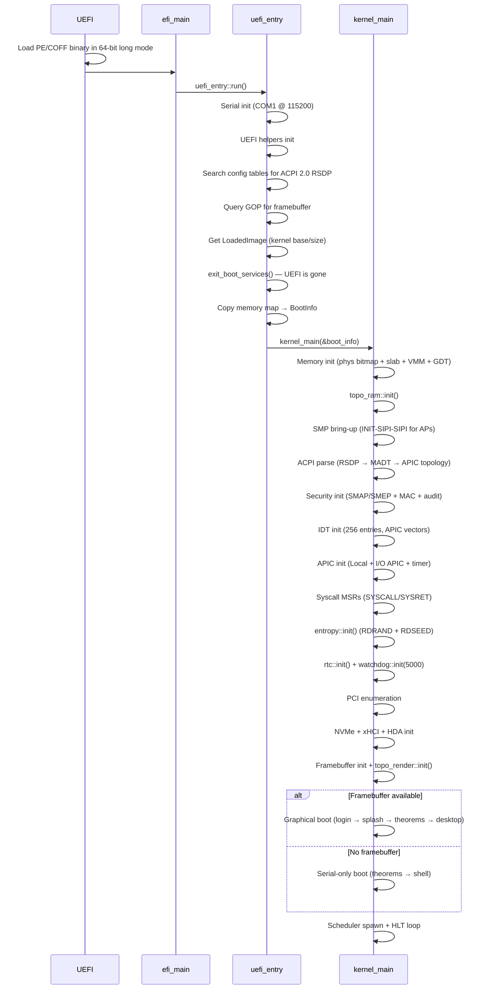

**UEFI boot** — pure Rust, zero assembly in the boot path. UEFI firmware loads the kernel as a PE/COFF binary, already in 64-bit long mode with identity-mapped page tables. The kernel queries GOP (Graphics Output Protocol) for a framebuffer, reads the UEFI memory map, then calls `exit_boot_services()` to take full control.

**Target**: `x86_64-unknown-uefi` with `build-std = ["core", "alloc"]`.

---

## The Ten Theorems

These are not decorative. T1-T5 runtime callsites are source-gated in kernel paths today; deeper formal runtime proof and benchmarks remain pending. T6-T10 are boot-verified theorem gates for the HFT/ML world-model path.

### T1-T5 — Active in Runtime

| ID | Name | Formal Statement | Governs |
|----|------|------------------|---------|
| **T1** | TSS — Topological State Synchronization | O(1) retrieval via spherical Voronoi tessellation | file lookup, task groups, memory locality |
| **T2** | SCM — Spectral Contraction Mapping | Spectral contraction toward fixed-point attractor | prefetch, next-task prediction |
| **T3** | GMC — Geodesic Memory Consolidation | Renyi entropy bound on memory consolidation | cell merging, defrag triggers |
| **T4** | AGCR — Adaptive Governor Convergence Rate | PD governor convergence (eigenvalue-bounded) | timeslice, cache, FPS, heap |
| **T5** | HCS — Hyperbolic Curvature Separation | Hyperbolic vs Euclidean separation ratio | path depth, lifetime classes, power mapping |

### T6-T10 — Boot-Verified Gates

| ID | Name | What |
|----|------|------|
| **T6** | RGCS — Ring-Allreduce Gradient Coherence | Tangent deviation bound for sync frequency |
| **T7** | PHKP — Persistent Homology KV Partitioning | Betti-guided latency via topological persistence |
| **T8** | TEB — Thermodynamic Erasure Bound | Landauer energy bound per bit erasure |
| **T9** | CMA — Cross-Manifold Alignment | Alignment error via Procrustes curvature + SVD |
| **T10** | WPHB — World Predictive Horizon Bound | Predictive horizon from information + stability |

### Runtime Integration

| Operation | Theorem | What Happens |
|-----------|---------|--------------|
| `store()` | T1/TSS | Voronoi cell assignment for bucketed lookup |
| `store()` | T2/SCM | SpectralContractionOperator evolves prefetch state |
| `teleport()` | T4/AGCR | Governor adapts epsilon based on move deviation |
| `teleport()` | T3/GMC | If entropy > 2.0 bits, merge smallest Voronoi cells |
| `find()` | T1/TSS | Voronoi narrows search to a bucket |
| path resolution | T5/HCS | Hyperbolic tree structure for deep paths |
| scheduler tick | T4/AGCR | Timeslice scale factor adapted by deviation |
| scheduler select | T2/SCM | Predicted cell checked first (O(1) amortized) |
| compositor frame | T4/AGCR | Quality scaled 0→4 targeting 16 ms |
| memory alloc | T1/TSS | Voronoi cell for frame locality |
| memory free | T3/GMC | Betti-0 entropy check triggers reseed |

Lean 4 proof artifacts live in `kernel/aether/aether-verified/lean/`. Proof strength is tracked in [docs/THEOREMS.md](docs/THEOREMS.md). Some bounds are full proofs; some are layered bridge checks.

---

## What's Inside

The following sections are collapsible deep dives. Click to expand.

<details>
<summary><strong>Memory & Topology</strong></summary>

### Allocator Stack

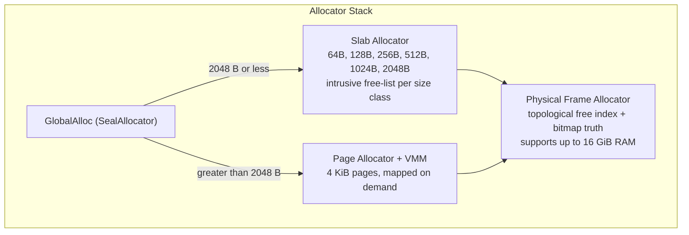

The kernel uses a tiered allocator implementing `GlobalAlloc`:

- **Small allocations (≤ 2048 B)**: Slab allocator with six size classes. Objects are carved from 4 KiB pages with intrusive free-lists. O(1) alloc/dealloc.
- **Large allocations (> 2048 B)**: Virtual pages allocated from a bump region, backed by physical frames from the bitmap allocator, mapped via 4-level page tables.
- **Physical frame allocator**: Bitmap-backed and topological-indexed, initialized from the UEFI memory map. One bit per 4 KiB frame, up to 128 GiB of RAM. Single-frame allocations use the fixed-cell summary index; large contiguous DMA ranges use bounded topological candidate probes.
- **GDT + TSS**: Full Global Descriptor Table with Task State Segment, supporting ring-0/ring-3 transitions.

### Why a Bitmap + Slab Hybrid?

The physical frame allocator keeps a bitmap as the truth source, then layers a fixed topological free index over it. This is deliberate: the allocator can prove a bounded hot path without losing simple verification.

- **Topological free index**: O(1) single-frame allocation across eight cells, three summary levels, and a bounded word/bit probe.
- **Contiguous frame path**: multi-page DMA requests use 128 bounded topological candidate probes and a hard 64-page run cap.
- **Bitmap truth**: one bit per 4 KiB frame, predictable cache behavior, trivial serialization for snapshots.
- **Slab**: Six fixed size classes with intrusive singly-linked free lists. Carved from 4 KiB pages. O(1) alloc/dealloc, no fragmentation within a page.
- **TopoRAM wrapper**: Adds 64 bytes of metadata per frame (S² embedding, access history, Voronoi cell, lifetime class). Public TopoRAM allocation and free-side topology repair share the physical allocator's 64-page run cap.

The hybrid gives us: small objects → slab (fast, no external fragmentation). Single frames → topological free-index allocation. Large contiguous DMA requests → bounded topological candidate probes. All frames → topological metadata for T1-T5 decisions.

### Memory Topology

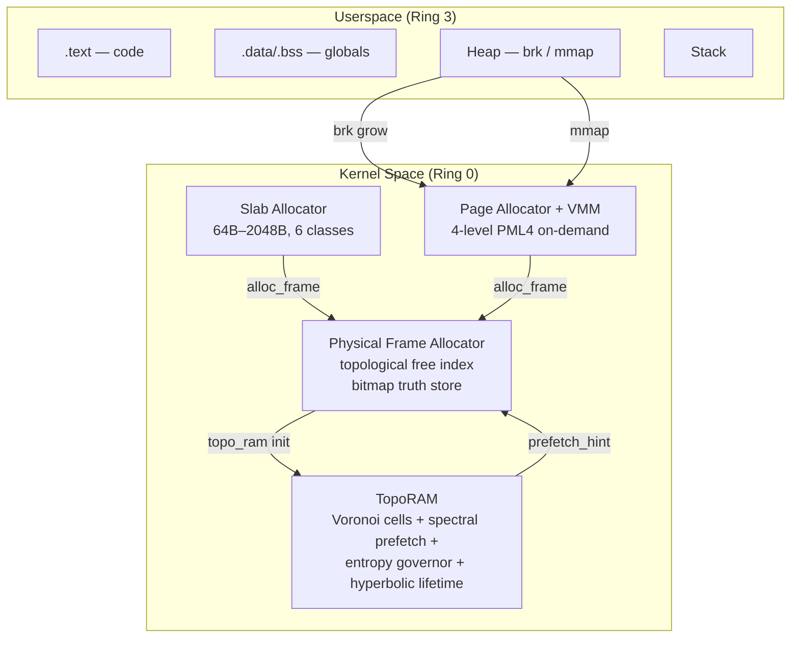

</details>

<details>
<summary><strong>ManifoldFS — The Filesystem</strong></summary>

This is not ext4. This is not FAT. ManifoldFS keeps faithful raw bytes for reads and writes, plus **64-point ManifoldPayload embeddings on the unit sphere S²** for content addressing, Voronoi indexing, topology-aware moves, and future payload-first disk layout work.

### Encoding Pipeline

```
Raw bytes (4096 B block)
  ↓
Trigram hash → 128-dim sparse vector
  ↓
Johnson-Lindenstrauss projection → 3-dim vector
  ↓
L2 normalization → point on S²
  ↓
Repeat for 64 blocks → 64-point cloud on S²
  ↓
Compute Betti-0 (connected components) + content hash
  ↓
Store as ManifoldPayload
```

**Why trigram hashing?** Trigrams capture local byte structure better than uniform sampling. A 4096-byte block has 4094 overlapping trigrams; we hash them into a 128-bin histogram. This preserves content similarity: two files with similar byte distributions map to nearby points on S².

**Why JL projection?** The Johnson-Lindenstrauss lemma guarantees that n points in high-dimensional space can be mapped to O(log n) dimensions with bounded distortion. We use a random Gaussian projection matrix (seeded per-filesystem) to map 128-dim → 3-dim.

**Why 64 points?** 64 points on S² gives us enough resolution to distinguish files while keeping the payload small (64 × 3 × 8 bytes = 1536 bytes per file). Content-addressable lookup uses Voronoi cell assignment: given a query point, find nearest seed → search only that cell's files.

### Metadata Teleport

Moving a file between directories uses O(1) metadata surgery for directory/inode rewiring because the ManifoldPayload identity does not change. The persistent path updates inode/directory metadata without rewriting raw file bytes; the boot marker requires `persistence_bytes_per_move=0`.

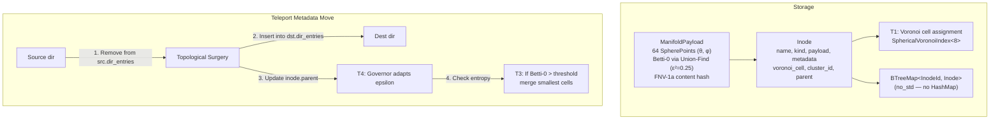

### TopCrypt — Topological File Encoding

TopCrypt is topological encoding/obfuscation, not cryptographic protection. Files are stored as 64-byte blocks encoded as 16-point clouds on S² with CRC32, shuffle, and XOR masks. Shell commands: `topcrypt encode`, `topcrypt lock`, `topcrypt unlock`, `topcrypt info`.

**Lypnos Guard**: `Ctrl+L` shuffles/masks a topological file, `Ctrl+E` flattens it to bytes, and `Ctrl+I` absorbs an external file into manifold form. AEAD/KDF security gate pending.

</details>

<details>
<summary><strong>Process Scheduler</strong></summary>

The ManifoldScheduler maintains 8 Voronoi cells. Each task's manifold embedding (8-dimensional, normalized) is projected to S² and assigned to the nearest cell.

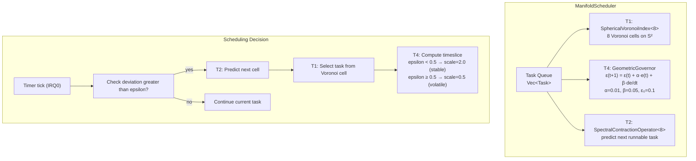

Task selection:

1. **T2 prediction**: The spectral contraction operator maintains a 3-dim prediction state. It predicts which cell the next runnable task will be in.
2. **Cell probe**: Check predicted cell first. If empty, scan remaining cells (at most 7 more probes).
3. **Priority bucket**: Within a cell, tasks are stored in 256 priority buckets. Selection pops from the highest non-empty bucket.
4. **T4 adaptation**: The geometric governor measures scheduling deviation (actual vs predicted cell hit). It adapts a timeslice scale factor: ε < 0.5 → stable → longer timeslices; ε ≥ 0.5 → volatile → shorter timeslices.

The scheduler lock is released **before** context switch, preventing deadlock when the new task's timer fires immediately. CR3 is swapped for userspace tasks; kernel tasks use the BSP PML4.

</details>

<details>
<summary><strong>Interrupts & Drivers</strong></summary>

**APIC**: Replaces the legacy 8259 PIC. Local APIC provides per-CPU timer and inter-processor interrupts (IPIs). I/O APIC routes external device IRQs. Discovered via ACPI MADT parsing.

**Keyboard driver**: reads scancodes from port `0x60`, maps to ASCII via a 58-entry table (set 1 scancodes).

**APIC Timer**: per-CPU local APIC timer for scheduler ticks and governor sampling.

**PCI**: Full bus enumeration via config space ports 0xCF8/0xCFC. Discovers AHCI controllers, NICs, WiFi/BT adapters, USB controllers, GPUs.

**AHCI**: SATA disk driver with MMIO command/FIS structures, read/write sector support.

**e1000**: Intel 8254x Ethernet — MMIO registers, 256-entry TX/RX descriptor rings, packet send/receive.

**Serial**: COM1 initialized at 115200 baud, 8N1. Primary diagnostic channel — visible in QEMU via `-serial stdio`.

**NVMe**: Admin queue + I/O queue creation, Identify Controller/Namespace, PRP-based DMA sector read/write.

**xHCI USB 3.0**: Controller reset/init, event/command rings, port enumeration, device slot assignment, SET_ADDRESS, GET_DESCRIPTOR. Supports HID boot keyboards/mice (interrupt IN endpoints) and Mass Storage (bulk IN/OUT with SCSI BBB).

**HDA Audio**: CORB/RIRB command engines, codec widget discovery, DAC pin selection, output stream descriptor with DMA buffer, 48kHz 16-bit stereo PCM playback.

**Entropy**: CPUID probe for RDRAND/RDSEED carry-flag retry loops. Hardware random for TLS session keys and `SYS_GETRANDOM`.

**RTC + Watchdog**: CMOS real-time clock (ports 0x70/0x71) with BCD/binary detection. APIC timer watchdog — pets via `SYS_WATCHDOG`, triggers keyboard-controller reset on 5-second hang.

</details>

<details>
<summary><strong>Graphics & Desktop</strong></summary>

### High-Tech Rendering Engine (`graphics/htek.rs`)

Seal OS uses a custom software rendering engine that produces modern, high-tech UI:

- **Anti-aliased text**: 2x supersampled font rendering with neighbor-aware fringe blending
- **Gradient fills**: Per-scanline linear interpolation (vertical and horizontal) with 256-step color lerping
- **Rounded rectangles**: Corner distance field evaluation with sub-pixel anti-aliasing
- **Glow effects**: Multi-offset radial blur passes with alpha compositing
- **Alpha blending**: Full 8-bit per-pixel compositing engine
- **Stroke rendering**: Anti-aliased rounded rectangle outlines via inner/outer distance field subtraction

### Topological 3D Render Pipeline (`graphics/topo_render.rs`)

```mermaid
flowchart LR
    Mesh["TopoMesh<br/>vertices + S² embedding"] --> T5["T5 Hyperbolic<br/>Projection<br/>sinh/cosh fisheye"]
    T5 --> T2["T2 Spectral LOD<br/>degree centrality +<br/>screen-space area"]
    T2 --> T3["T3 Betti-1<br/>Integrity Check<br/>reject hole creation"]
    T3 --> T1["T1 Voronoi<br/>8×8 Screen Tiles"]
    T1 --> Raster["Rasterize<br/>flat / gouraud / phong"]
    Raster --> Depth["Per-Pixel Depth<br/>1/z perspective-correct"]
    Depth --> T4["T4 Governor<br/>adaptive quality<br/>0=wireframe → 4=phong+AA"]
    T4 --> Blit["blit() → VRAM"]

    style T5 fill:#1a1a2e,stroke:#e94560,color:#fff
    style T2 fill:#1a1a2e,stroke:#0f3460,color:#fff
    style T3 fill:#1a1a2e,stroke:#00ffaa,color:#fff
    style T1 fill:#1a1a2e,stroke:#ff9f1c,color:#fff
    style T4 fill:#1a1a2e,stroke:#e94560,color:#fff
```

### Desktop Wallpaper

Renders two equations procedurally:

1. **Schwarzschild metric** (black hole geometry):  
   `ds² = -(1 - 2GM/rc²)dt² + (1 - 2GM/rc²)⁻¹dr² + r²dΩ²`

2. **Faraday tensor** (electromagnetic field):  
   The 4×4 antisymmetric F^μν matrix with E and B field components

</details>

<details>
<summary><strong>Network Stack</strong></summary>

### TCP/IP Stack

Wired end-to-end through IPv4 → net::transmit → e1000 TX descriptor ring.

- **TCP**: Listen/accept backlog, SYN queue, retransmission timer
- **UDP + DHCP**: Full DHCP state machine (Init → Discover → Request → Bound)
- **DNS**: Proper query packets (ID, flags, QNAME, QTYPE A, QCLASS IN)

### TLS 1.3 PSK

The TLS path is intentionally narrow: PSK-only record encryption for the native HTTPS client.

1. **ClientHello**: TLS record (content type 0x16, version 0x0303) with supported_versions and psk_key_exchange_modes
2. **ServerHello parsing**: extracts server random, derives handshake traffic secrets using HKDF-SHA256
3. **Key derivation**: HKDF-Extract(salt=0, IKM=psk) → HKDF-Expand(label="handshake", context=ClientHello+ServerHello)
4. **AES-128-GCM**: Per-record encryption with 12-byte nonce (4-byte salt + 8-byte sequence number)
5. **Record wrapping**: TLSInnerPlaintext → AEAD encrypt → TLSRecord

Minimal TLS 1.3 PSK record path — no X.509/PKI/ECDHE gate yet; production HTTPS compatibility is pending. The random bytes function uses RDSEED first, then RDRAND. If neither source is available or the CPU repeatedly reports carry-clear failure, `getrandom` returns failure instead of manufacturing cryptographic bytes.

### Driver Stack

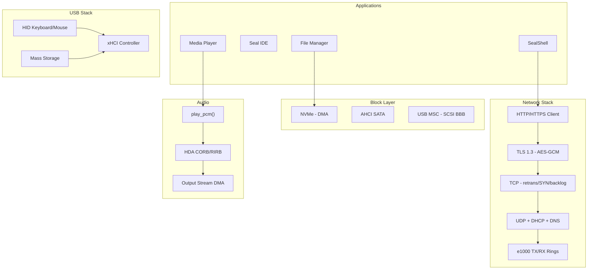

</details>

<details>
<summary><strong>Security</strong></summary>

### KPTI (Kernel Page-Table Isolation)

CR3 swap code exists via `memory/pgtable_asm.rs`. A hard gate still needs to prove installed KPTI page tables during a boot selftest. **Status**: scaffolding present, syscall entry/exit wiring pending.

### ASLR

Userspace mmap base is randomized with a 16-bit entropy shift (up to 65,536 possible bases). The random source is RDRAND/RDSEED when hardware entropy is available; low-entropy fallback paths are treated as non-production.

### Seccomp

Classic BPF evaluator (not eBPF). Per-task filter arrays. Instructions: `BPF_LD_W_ABS`, `BPF_JMP_JEQ`, `BPF_RET`. Filters are loaded via `seccomp_load_filter()` and evaluated on every syscall entry before dispatch.

### Audit

JSON-formatted event buffering exists. A hard gate still needs to prove VFS flush semantics for `/var/log/audit.log`.

### Threat Model

See [docs/THREAT_MODEL.md](docs/THREAT_MODEL.md) for full details. In scope: kernel exploits from userspace, info leaks via side channels, network stack attacks. Out of scope: multi-tenant deployment, internet exposure, physical access/DMA attacks (research kernel context).

</details>

<details>
<summary><strong>Aether-Lang</strong></summary>

A real programming language wired directly into the kernel. Lexer → Parser → AST → Interpreter, all running in `no_std` kernel space. This is Seal OS's native scripting language — the equivalent of what HolyC was to TempleOS.

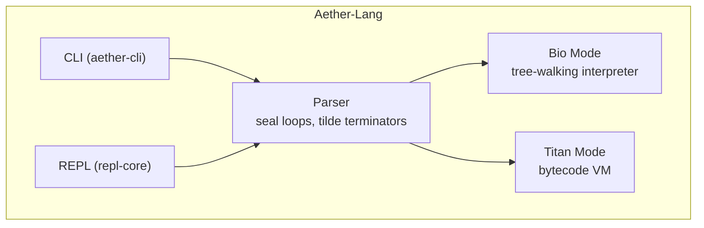

### Stdlib Modules

| Module | Functions |
|--------|-----------|
| `math` | `pi`, `e`, `sin`, `cos`, `tan`, `sqrt`, `abs`, `ln`, `log`, `exp` |
| `fs` | `read`, `write`, `exists`, `mkdir`, `ls`, `teleport` |
| `process` | `pid`, `exit`, `spawn` |
| `net` | `local_ip`, `has_nic`, `status` |
| `theorem` | `status` |

### Example Aether-Lang Script

```aether
seal main ~
    print "Hello from Aether-Lang!"
    print theorem.status
    fs.write "hello.txt" "topology rules"
    print fs.read "hello.txt"
~
```

Run inside Seal OS: `aether run script.aether`

</details>

<details>
<summary><strong>Applications</strong></summary>

### SealShell (`apps/shell.rs`)

30+ English-first commands:

| Command | What it does |
|---------|--------------|
| `look` | List directory with Voronoi cell assignments |
| `peek` | Show file info + ManifoldPayload |
| `move` | Metadata teleport — prints ticks and governor ε |
| `search` | Content-addressable search via S² embedding |
| `tasks` | Show scheduler task list |
| `seal` | System info + T1-T10 status |
| `race` | Benchmark teleport vs copy |
| `calc` | Scientific calculator |
| `play` | Media playback |
| `tensor render` | Render CSV as 3D tensor visualization |

### Calculator (`apps/calculator.rs`)

Full scientific calculator with recursive descent expression parser:
- Operator precedence: additive → multiplicative → power → unary → atom
- Functions: sin, cos, tan, sqrt, abs, ln, log, exp, ceil, floor
- Constants: pi, e, ans (last result)
- UI: High-tech rendering with gradient buttons, glowing LED display, rounded corners

### SealPlayer (`apps/media_player.rs`)

Native media player:
- **Working**: WAV/PCM playback with real RIFF/WAVE header parser
- **Planned**: MP4, MKV, MP3, FLAC, AAC, H.264, VP9, Opus
- Features: playlist management, seek, volume control, codec detection
- UI: Gradient viewport, glowing playhead, rounded progress bar, format badges

### Tensor Viewer (`apps/tensor_viewer.rs`)

CSV/trading data parsed into tensors, rendered with grid/value-height projection into 3D point clouds and hyperbolic manifolds. Profit = green peaks, loss = red valleys.

### Games

- **Snake** — classic grid game
- **Breakout** — paddle + bricks
- **Warp Racer** — aether-link demo

</details>

<details>
<summary><strong>Epsilon — Context Teleportation</strong></summary>

Design target: bounded context transfer between agents via topological surgery on hollow S² manifolds.

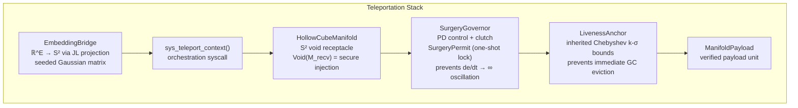

The teleportation primitive: extract a payload from its current manifold via `inject_into_void()`, transfer to the receiving manifold via `assimilate()`. The SurgeryGovernor gates the operation with a one-shot derivative lock — if the manifold curvature derivative is too high, the surgery is deferred to prevent oscillation.

</details>

<details>
<summary><strong>Aether-Link — I/O Superkernel</strong></summary>

Adaptive I/O prefetching for topology-aware block streams.

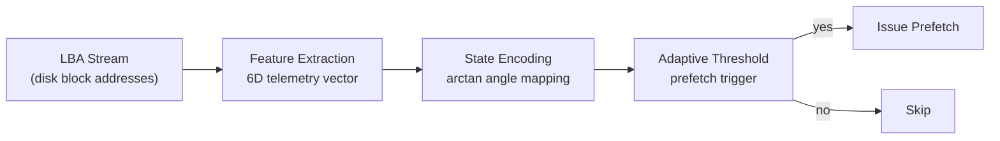

**Use cases**: HFT (high-frequency trading I/O), ML model training (sequential CSV/parquet prefetch), DirectStorage (game asset streaming).

**Presets**: `new_hft()` (aggressive, low-latency), `new_gaming()` (directstorage-tuned), `ModelTraining` (sequential reads, aggressive prefetch for large datasets).

**Fast math** (`fast_math.rs`): `fast_atan()`, `fast_exp()`, `fast_sigmoid()` — sub-microsecond approximations using polynomial fitting. No libm dependency in the hot path.

Benchmark: `io_cycle_8_lbas` median ~18 ns/cycle on desktop x86_64. CI regression gate: 120 ns ceiling.

</details>


---

## Feature Matrix vs The World

How does a geometry-native research kernel compare to production operating systems? This table is a capability map for Seal OS v0.4.5, not a blanket victory claim. Seal OS aims to beat Ubuntu on the benchmark set in [docs/BENCHMARK_PLAN.md](docs/BENCHMARK_PLAN.md); the claim becomes true only for rows with fresh Seal OS and Ubuntu measurements under the same constraints.

### Ubuntu Parity and Lead Sheet

Legend: ✓ = code/proof gate exists in this repo, △ = design or partial implementation, ✗ = not implemented. Seal OS only claims a win over Ubuntu for a row after the same-machine benchmark exists.

| Capability | Seal OS state | Ubuntu 26.04 LTS baseline | Proof or next gate |
|---|---:|---|---|
| UEFI image build | ✓ | ✓ | `seal-mkimage --verify` passes |
| VM desktop boot proof | ✓ | ✓ | `run-qemu.ps1 -HeadlessProof` plus `seal-mkimage --check-vm-proof` captures theorem gate, AHCI disk, ManifoldFS mount, desktop proof frame, desktop soak marker, desktop ready, and event loop |
| QEMU proof bundle manifest | ✓ | N/A | `run-qemu.ps1 -HeadlessProof` writes `qemu-proof\proof-manifest.txt`; `seal-mkimage --check-proof-manifest` verifies the image/EFI/log/screen byte counts, CRC32 fingerprints, SHA-256 fingerprints, QEMU backend, commit/dirty flag, and gate statuses before publishing canonical artifacts; `--check-current-proof-manifest ... .` additionally rejects stale proof bundles whose commit or dirty flag no longer match the checkout |
| README/doc claim contract | ✓ | N/A | `seal-mkimage --check-doc-claim-contract .` enforces a limited allow/deny string contract for `README.md`, `docs/BENCHMARK_PLAN.md`, and `docs/CI.md` |
| Oracle VirtualBox automated smoke | ✓ | ✓ | Fresh `smoke-vbox.ps1 -Seconds 240` rebuilds the VDI, then runs `--verify`, `--check-vbox-proof`, theorem/Aether/desktop/benchmark gates, `--check-proof-manifest`, and `--check-current-proof-manifest` against `vbox-smoke\proof-manifest.txt` |
| First desktop pixel proof | ✓ | N/A | `seal-mkimage --check-proof-screen ...\qemu-proof\screen.ppm` verifies nonblank 1024x768 desktop pixels, icon lane, control region, primary terminal titlebar, and taskbar start/power controls |
| Desktop compositor soak marker | ✓ | △ | `seal-mkimage --check-desktop-soak ...\serial.log` requires a deterministic 24-frame compose+blit exercise with monotonic cycle percentiles; calibrated 16.7 ms frame-pacing benchmark still pending |
| Bare-metal allocator benchmark marker | ✓ | △ | `seal-mkimage --check-benchmark-log ...\serial.log` requires `[BENCH] alloc-frame` with 64 successful alloc/free iterations, topological fast-path hits, zero bounded misses, no contiguous-probe drift, and no frame leak |
| TopoRAM target-cell allocation marker | ✓ | △ | `seal-mkimage --check-benchmark-log ...\serial.log` requires `[BENCH] toporam-alloc` with 64 target-cell hits, zero target-cell fallbacks, zero zone fallbacks, monotonic cycle samples, and no frame leak |
| ManifoldFS metadata teleport marker | ✓ | △ | `seal-mkimage --check-benchmark-log ...\serial.log` also requires `[BENCH] manifold-teleport`, proving same-inode ramfs metadata move across 8-256 directory entries with `metadata_ops_max=7` and `persistence_bytes_per_move=0` |
| Scheduler select benchmark marker | ✓ | △ | `seal-mkimage --check-benchmark-log ...\serial.log` requires `[BENCH] scheduler-select-next`, gating the live `select_next_task` requeue marker across 64 iterations with ready count preserved, zero context switches, 8 Voronoi probes, max 9 bitmap tests, and max 256 priority-bucket scan |
| TCP packet demux benchmark marker | ✓ | △ | `seal-mkimage --check-benchmark-log ...\serial.log` requires `[BENCH] tcp-packet-demux`, proving a listener-first same-port fixture routes payload bytes to the accepted socket |
| AHCI persistent ManifoldFS root | ✓ | ✓ | QEMU serial log shows `QEMU HARDDISK`, `Registered as block device 0x800`, `First disk readable`, and `[VFS] ManifoldFS mounted from disk` |
| Native non-POSIX ABI | ✓ | ✗ | `seal-mkimage --check-seal-abi .` passes |
| T1-T10 theorem-gated boot | ✓ | ✗ | Rust theorem-log checker requires all ten VERIFIED lines |
| T1-T5 runtime topology | ✓ | ✗ | `seal-mkimage --check-runtime-theorems .` source-gates runtime callsites in memory, scheduler, ManifoldFS, compositor, ACPI power, taskbar status, and boot theorem state |
| Single-frame allocation O(1) | ✓ | △ | `--check-o1-allocator` plus boot log `[ALLOC] O(1) proof:` and `[BENCH] alloc-frame` gates |
| Multi-page contiguous DMA allocation O(1) over RAM size | ✓ | △ | bounded candidate probes plus hard 64-page run cap |
| Same-filesystem file move | ✓ | ✓ | Seal marker proves same-inode topology metadata surgery with `persistence_bytes_per_move=0` |
| Content-addressable geometric lookup | △ | △ | Voronoi narrows lookup to a bucket; current find is O(bucket size) plus sorting until bucket occupancy is hard-capped |
| GPU/VRAM topology fast path | △ | CUDA/ROCm userspace, not topology fast path | design contract exists; vendor GPU driver and peer-DMA proof pending |
| Aether-Lang native OS language | ✓ | ✗ | lexer/parser/interpreter/VM are in kernel runtime |
| Legacy host-language-free Seal OS surface | △ | ✓ | `--check-language-hygiene` bans host scripts from production OS/Rust roots |
| HFT/ML benchmark comparison vs Ubuntu | △ | ✓ | allocator comparison harness exists; full benchmark matrix still requires fresh side-by-side Ubuntu numbers; raw Ubuntu artifact pending; current proof manifest is `--check-current-benchmark-proof` |

### Seal OS vs Redox OS vs Ubuntu vs Debian vs Windows vs macOS

| Feature | **Seal OS v0.4.5** | **Redox OS 0.9.0** | **Ubuntu 26.04 LTS** | **Debian 12 Bookworm** | **Windows 11** | **macOS Sequoia** |
|---|---|---|---|---|---|---|
| **Language** | Rust (100%, `no_std`) | Rust (microkernel) | C (Linux kernel) | C (Linux kernel) | C/C++ (NT kernel) | C/C++/Obj-C (XNU) |
| **Architecture** | Monolithic | Microkernel | Monolithic + modules | Monolithic + modules | Hybrid | Hybrid (Mach + BSD) |
| **Kernel size** | ~260 KB | ~1 MB | ~12 MB (vmlinuz) | ~8 MB (vmlinuz) | ~30 MB (ntoskrnl) | ~25 MB (kernel.release) |
| **ISO size** | < 10 MB | ~70 MB | ~5 GB | ~650 MB (netinst) | ~5.5 GB | ~13 GB (IPSW) |
| **Min RAM** | 4 GB | 512 MB | 4 GB | 512 MB | 4 GB | 8 GB |
| **Boot target** | `x86_64-unknown-uefi` | `x86_64-unknown-redox` | `x86_64-linux-gnu` | `x86_64-linux-gnu` | proprietary | proprietary |
| **Filesystem** | ManifoldFS (S² geometry) | RedoxFS (CoW) | ext4 / btrfs | ext4 | NTFS / ReFS | APFS |
| **File identity** | Raw bytes + S² ManifoldPayload | byte sequence | byte sequence | byte sequence | byte sequence | byte sequence |
| **File move** | O(1) metadata surgery | rename (O(1) same FS) | rename (O(1) same FS) | rename (O(1) same FS) | rename (O(1) same vol) | rename (O(1) same vol) |
| **Content-addressable lookup** | Bucketed geometric lookup | No | No | No | No (Windows Search) | No (Spotlight) |
| **Scheduler** | ManifoldScheduler (T1+T2+T4) | Round-robin | CFS / EEVDF | CFS | Hybrid priority | Grand Central Dispatch |
| **Adaptive control** | GeometricGovernor (PD on manifold) | No | cpufreq governors | cpufreq governors | Dynamic tick | Timer coalescing |
| **Formal verification** | Lean 4 in progress; Rust boot gates active | Partial (cosmic, relibc) | Partial (seL4 adjacent) | None | None | None |
| **Math-driven kernel** | Yes (T1-T5 active, T6-T10 boot-checked) | No | No | No | No | No |
| **Topological data analysis** | Runtime-gated markers and Betti/Voronoi | No | Userspace only | Userspace only | No | No |
| **Predictive prefetch** | T2 spectral contraction mechanism | No | readahead heuristic | readahead heuristic | Superfetch/SysMain | Speculative prefetch |
| **GPU offload ready** | PM4 compute ring + CPU fallback real; shaders are stubs | No | CUDA/ROCm userspace | CUDA/ROCm userspace | DirectCompute | Metal |
| **Display** | 1024x768x32 framebuffer | 1920x1080 (orbital) | Wayland/X11 | Wayland/X11 | DWM | Quartz |
| **Window manager** | Built-in compositor | Orbital | GNOME/KDE | GNOME/KDE/Xfce | DWM | WindowServer |
| **Built-in IDE** | Seal IDE (native) | No | No | No | No | Xcode (separate) |
| **Shell** | SealShell (30+ English-first commands) | Ion shell | bash/zsh | bash | PowerShell/cmd | zsh |
| **Package manager** | ManifoldPkg local metadata + signed `.eph` path | pkg (pkgutils) | apt/snap | apt | winget/MSIX | brew (3rd party) |
| **Syscalls** | Seal ABI + Epsilon theorem extensions | ~100 (POSIX-like) | ~450 (Linux) | ~450 (Linux) | ~2000+ (NT) | ~550 (Mach + BSD) |
| **USB support** | Real — xHCI controller, HID boot keyboards/mice, Mass Storage SCSI BBB | Basic (xHCI) | Full | Full | Full | Full |
| **Network stack** | Real TCP/UDP/DHCP/DNS + minimal TLS 1.3 PSK client | smoltcp | Full (netfilter) | Full (netfilter) | Full (WFP) | Full (PF) |
| **Driver count** | 15+ | ~30 | ~9000+ | ~9000+ | ~100,000+ | ~5000+ |
| **Self-hosted** | No | Partial | Yes | Yes | Yes | Yes |
| **License** | MIT | MIT | GPL-2.0 (kernel) | DFSG-free | Proprietary | Proprietary (+ open source parts) |
| **Theorem count** | 10 boot-gated; T1-T5 active in runtime paths | 0 | 0 | 0 | 0 | 0 |
| **Teleportation** | Metadata topology move; persistent byte rewrite still pending | No | No | No | No | No |

**Where Seal OS is distinctive as a design**: mathematical kernel primitives, topological data embeddings, content-addressable ManifoldFS metadata, theorem-gated boot, adaptive governor, and gated O(1) metadata-move/select/allocation markers.

**Where Seal OS must still prove superiority**: repeatable Ubuntu comparison benchmarks for HFT/ML workloads, driver maturity, security hardening, and long-running reliability.

**Where Seal OS trails**: GPU drivers (no proprietary firmware), WiFi/BT (no vendor blobs), self-hosting, userspace ecosystem, multi-user permissions, security hardening maturity. It's a research kernel — not yet a daily driver.

**Closest comparison**: Redox OS shares the Rust DNA and research spirit. Seal OS diverges by making topology the organizing principle rather than microkernels.

---

## Performance Characteristics

| Subsystem | Operation | Complexity | Evidence / latency |
|-----------|-----------|-----------|----------------|
| **Physical alloc** | `alloc_frame()` | O(1) bounded topological free-index lookup across 8 cells; max 2 L3 words and 8192 summary-backed word candidates per cell | source-gated + boot log proof marker + `[BENCH] alloc-frame` |
| **Slab alloc** | `slab.alloc(size)` | O(1) | benchmark pending |
| **TopoRAM alloc** | `alloc_frames(1, hint)` | O(1) Voronoi lookup + O(1) physical frame path; entropy, prefetch, and reseed work are bounded/interval-gated | `[BENCH] toporam-alloc` |
| **TopoRAM contiguous** | `alloc_frames(count > 1, hint)` | 128 bounded topological candidate probes + hard 64-page allocation/free repair cap | source-gated by `--check-o1-allocator` |
| **ManifoldFS lookup** | `lookup(path)` | O(path depth) + O(K) cell search | benchmark pending |
| **ManifoldFS teleport** | move file | O(1) metadata rewiring with same-inode directory topology move; persistent metadata updates do not rewrite file bytes | `[BENCH] manifold-teleport` gate proves same inode, source removal, destination presence, bounded metadata ops, and `persistence_bytes_per_move=0` |
| **Scheduler select** | `select_next_task()` | O(1) — one predicted-cell check plus bounded fallback across 8 cells and 256 priority buckets | `[BENCH] scheduler-select-next` gate proves 64 live requeue selections, ready count preservation, zero context switches, 8 Voronoi probes, max 9 bitmap tests, and max 256 bucket scan |
| **Context switch** | `switch_context()` | O(1) — FXSAVE/FXRSTOR + CR3 swap | benchmark pending |
| **NVMe read** | `read_sector(lba)` | O(1) command submit + DMA poll | benchmark pending |
| **NVMe write** | `write_sector(lba)` | O(1) command submit + DMA poll | benchmark pending |
| **TCP demux** | `handle_tcp_packet()` | O(1) flow match before listener fallback | `[BENCH] tcp-packet-demux` proves listener-first socket order, same-port accepted socket delivery, 4-byte payload receipt, established-state transition, and fixture cleanup |
| **TCP round-trip** | localhost ping | O(1) stack traversal | benchmark pending |
| **TLS encrypt** | 1KB record | O(N) AES-GCM | benchmark pending |
| **3D render** | 1K triangles, quality 2 | O(triangles × pixels) software raster | benchmark pending |
| **Tensor render** | 100×100 CSV → mesh | O(N) SVD + O(N) mesh gen + raster | benchmark pending |

*Note: complexity rows are code/proof claims. Latency rows stay pending until the benchmark plan records raw artifacts and side-by-side Ubuntu runs.*

### Benchmarks

Run locally:

```bash
# Primary I/O benchmark
cargo bench --bench io_cycle --manifest-path kernel/aether/aether-link/Cargo.toml

# Compile all benches without running
cargo bench --workspace --no-run
```

See [BENCHMARKS.md](BENCHMARKS.md) for interpretation guide and CI regression gate details.

---

## Build and Run

### Requirements

| Tool | Version | Purpose |
|------|---------|---------|
| Rust (stable) | 1.85+ | Workspace crates |
| Rust (stable) | 1.88+ | LAAMBA Governor Tauri backend |
| Rust (nightly) | latest | Seal OS kernel (`#![feature(abi_x86_interrupt)]`) |
| QEMU | any | `qemu-system-x86_64` for testing |
| Oracle VM VirtualBox | 7.x | Primary GUI VM target |
| OVMF/EDK2 | any | UEFI firmware for QEMU |
| Aether-Lang | repo-local | Native Seal OS scripts and app logic |
| Lean | 4.7.0 | Formal proofs (optional) |

### Workspace Build

```bash
# Build all workspace crates
cargo build --workspace
cargo test --workspace
cargo clippy --workspace --all-targets -- -D warnings
cargo doc --workspace --no-deps
```

### Kernel Build (Nightly Required)

```bash
cd kernel/seal-os
cargo +nightly build --release
```

### Create Bootable Image

```bash
cd ../seal-mkimage
cargo +stable run --release

# Output:
# kernel/seal-os/target/x86_64-unknown-uefi/release/seal-os.img
```

The image is a raw GPT disk with a FAT EFI System Partition containing `EFI/BOOT/BOOTX64.EFI` and a second `ManifoldFS` partition with an `MNFD` superblock for the persistent Seal root.

### QEMU (Linux/macOS)

```bash
cd ../seal-os
./run-qemu.sh
```

### QEMU (Windows)

```powershell
cd ../seal-os
.\run-qemu.ps1
```

### Oracle VM VirtualBox

```powershell
cd kernel/seal-os
powershell -File .\build-vbox.ps1
powershell -File .\smoke-vbox.ps1 -Seconds 240
```

Manual conversion:
```bash
VBoxManage convertfromraw --format VDI \
  target/x86_64-unknown-uefi/release/seal-os.img seal-os.vdi
```

VM settings:
- Type=Other, Version=Other/Unknown (64-bit)
- Enable EFI, RAM=4096 MB, CPUs=1-2
- Display=VMSVGA, video memory=128 MB
- Storage=SATA/AHCI, attach seal-os.vdi
- Network=Intel PRO/1000 MT Desktop if networking is needed

### ISO Creation

```bash
# Linux only — requires xorriso
chmod +x scripts/build_iso.sh
scripts/build_iso.sh
```

### Docker (World Model)

```bash
cd kernel/seal-os && docker compose up --build
```

### System Requirements

| Resource | Minimum |
|----------|---------|
| RAM | 4 GB |
| CPU | x86_64 with long mode |
| Display | 1024x768 (optional — serial fallback) |

---

## Documentation Index

Every claim in this README has a supplementary document. Every document traces to source code.

### Getting Started

| Document | What it covers |
|----------|---------------|
| [Quick Start](#quick-start--boot-in-5-minutes) (this README) | 5-minute boot guide |
| [docs/SEAL_OS_GUIDE.md](docs/SEAL_OS_GUIDE.md) | Practical build, VM proof, audit gates, allocator contract, benchmark runbook |
| [docs/BUILD_SYSTEM.md](docs/BUILD_SYSTEM.md) | Workspace structure, toolchains, dependency policy, common errors |
| [kernel/seal-os/README.md](kernel/seal-os/README.md) | Kernel overview, quick start, concepts |

### Architecture & Design

| Document | What it covers | Key source files |
|----------|---------------|-----------------|
| [docs/TOPOLOGICAL_OS_CONTRACT.md](docs/TOPOLOGICAL_OS_CONTRACT.md) | Hard definition of "topological OS", closure gates, O(1) claim discipline | `src/memory/topo_ram.rs`, `src/process/scheduler.rs`, `src/fs/manifold_fs.rs` |
| [kernel/seal-os/ARCHITECTURE.md](kernel/seal-os/ARCHITECTURE.md) | UEFI boot sequence, init, hardware setup | `src/boot/uefi_entry.rs`, `src/lib.rs` |
| [docs/BOOT.md](docs/BOOT.md) | UEFI firmware to Seal kernel, GOP, VM image path | `src/boot/uefi_entry.rs`, `kernel/seal-mkimage` |
| [docs/MANIFOLDFS.md](docs/MANIFOLDFS.md) | Encoding pipeline, inode structure, metadata teleport, bucketed content search | `seal-os/src/fs/encoder.rs`, `manifold_fs.rs` |
| [docs/MANIFOLDFS.md](docs/MANIFOLDFS.md) | Encoding pipeline, inode structure, metadata teleport, bucketed content search | `src/fs/manifold_fs.rs` |
| [docs/MEMORY.md](docs/MEMORY.md) | Physical layout, allocator, UEFI map, MMIO | `src/memory/mod.rs`, `src/boot/uefi_entry.rs` |

### Theorems & Verification

| Document | What it covers | Key source files |
|----------|---------------|-----------------|
| [docs/THEOREMS.md](docs/THEOREMS.md) | All 10 theorems: math, implementation, Lean proofs, callsites | `aether-core/src/tss.rs`, `governor.rs`, `scm.rs`, `topology.rs` |
| [kernel/aether/aether-verified/lean/README.md](kernel/aether/aether-verified/lean/README.md) | Build instructions, provenance map, zero-sorry goal | `lakefile.lean`, `lean-toolchain` |

### API & Reference

| Document | What it covers |
|----------|---------------|
| [docs/API_INDEX.md](docs/API_INDEX.md) | Master API index for all workspace crates |
| [docs/SYSCALLS.md](docs/SYSCALLS.md) | Seal ABI calls + signals + pipes + RTC + Epsilon extensions |
| [kernel/epsilon/epsilon/docs/SPECIFICATION.md](kernel/epsilon/epsilon/docs/SPECIFICATION.md) | Epsilon geometric state transfer spec (v0.1.0-draft) |
| [kernel/epsilon/epsilon/docs/API_REFERENCE.md](kernel/epsilon/epsilon/docs/API_REFERENCE.md) | Epsilon crate public API |

### Aether-Lang

| Document | What it covers |
|----------|---------------|
| [kernel/aether/Aether-Lang/docs/LANGUAGE.md](kernel/aether/Aether-Lang/docs/LANGUAGE.md) | Syntax, semantics, topological primitives |
| [kernel/aether/Aether-Lang/docs/GETTING_STARTED.md](kernel/aether/Aether-Lang/docs/GETTING_STARTED.md) | Setup, first program, REPL usage |
| [kernel/aether/Aether-Lang/docs/ARCHITECTURE.md](kernel/aether/Aether-Lang/docs/ARCHITECTURE.md) | Parser, Bio mode, Titan VM, AEGIS memory |
| [kernel/aether/Aether-Lang/docs/API.md](kernel/aether/Aether-Lang/docs/API.md) | Public API surface |
| [kernel/aether/Aether-Lang/docs/TUTORIAL.md](kernel/aether/Aether-Lang/docs/TUTORIAL.md) | Guided walkthrough |
| [kernel/aether/Aether-Lang/docs/EXAMPLES.md](kernel/aether/Aether-Lang/docs/EXAMPLES.md) | Code samples |
| [kernel/aether/Aether-Lang/docs/FAQ.md](kernel/aether/Aether-Lang/docs/FAQ.md) | Common questions |
| [kernel/aether/Aether-Lang/docs/ML_FROM_SCRATCH.md](kernel/aether/Aether-Lang/docs/ML_FROM_SCRATCH.md) | Building ML pipelines with aether-core |
| [kernel/aether/Aether-Lang/docs/ML_LIBRARY.md](kernel/aether/Aether-Lang/docs/ML_LIBRARY.md) | Tensor, autograd, neural, clustering modules |

### Infrastructure & Operations

| Document | What it covers |
|----------|---------------|
| [docs/CI.md](docs/CI.md) | All 16 CI jobs, QEMU milestones, toolchains |
| [BENCHMARKS.md](BENCHMARKS.md) | How to run Criterion, CI regression gates |
| [docs/BENCHMARK_PLAN.md](docs/BENCHMARK_PLAN.md) | Side-by-side Ubuntu comparison plan |
| [SECURITY.md](SECURITY.md) | Vulnerability reporting, threat model, environment variables |
| [docs/THREAT_MODEL.md](docs/THREAT_MODEL.md) | Full threat model: physical, software, network |
| [docs/CRYPTO_AUDIT.md](docs/CRYPTO_AUDIT.md) | Cryptographic path audit: TLS, random, signatures |
| [docs/VRAM_TOPOLOGY_FAST_PATH.md](docs/VRAM_TOPOLOGY_FAST_PATH.md) | GPU-native data movement contract |

### Project Governance

| Document | What it covers |
|----------|---------------|
| [CONTRIBUTING.md](CONTRIBUTING.md) | Prerequisites, build instructions, subsystem map, style guide, theorem-gate requirements |
| [CODE_OF_CONDUCT.md](CODE_OF_CONDUCT.md) | Contributor Covenant v2.1, enforcement contact |
| [docs/COMMUNITY.md](docs/COMMUNITY.md) | New member onboarding, Discussions vs Issues, finding work |
| [FUTURE_PLAN.md](FUTURE_PLAN.md) | 5-phase roadmap, 15+ subsystems |
| [docs/ONE_PAGER.md](docs/ONE_PAGER.md) | Executive summary for investors and press |
| [docs/DEMO_SCRIPT.md](docs/DEMO_SCRIPT.md) | 3-minute demo video script |

### Agent Plans

| Document | What it covers |
|----------|---------------|
| [.agents/MASTER_PROMPT.md](.agents/MASTER_PROMPT.md) | Master agent prompt for Seal OS construction |
| [.agents/01-kernel-safety.md](.agents/01-kernel-safety.md) | Kernel safety agent plan |
| [.agents/02-memory-allocator.md](.agents/02-memory-allocator.md) | Memory allocator agent plan |
| [.agents/03-manifold-fs.md](.agents/03-manifold-fs.md) | ManifoldFS agent plan |
| [.agents/04-aether-lang-interpreter.md](.agents/04-aether-lang-interpreter.md) | Aether-Lang interpreter agent plan |
| [.agents/05-aether-lang-vm.md](.agents/05-aether-lang-vm.md) | Aether-Lang VM agent plan |
| [.agents/06-epsilon-local.md](.agents/06-epsilon-local.md) | Epsilon local agent plan |
| [.agents/07-epsilon-remote.md](.agents/07-epsilon-remote.md) | Epsilon remote agent plan |
| [.agents/08-aether-link-hardware.md](.agents/08-aether-link-hardware.md) | Aether-Link hardware agent plan |
| [.agents/09-network-stack.md](.agents/09-network-stack.md) | Network stack agent plan |
| [.agents/10-drivers-real.md](.agents/10-drivers-real.md) | Real drivers agent plan |
| [.agents/11-window-manager.md](.agents/11-window-manager.md) | Window manager agent plan |
| [.agents/12-applications.md](.agents/12-applications.md) | Applications agent plan |
| [.agents/13-security-hardening.md](.agents/13-security-hardening.md) | Security hardening agent plan |
| [.agents/14-testing-ci.md](.agents/14-testing-ci.md) | Testing & CI agent plan |
| [.agents/15-documentation.md](.agents/15-documentation.md) | Documentation agent plan |

---

## Repository Map

```
Epsilon-Hollow/
├── kernel/
│   ├── seal-os/                    # Bare-metal x86_64 UEFI kernel
│   │   ├── src/
│   │   │   ├── main.rs             # UEFI #[entry], panic handler
│   │   │   ├── lib.rs              # kernel_main(), module declarations
│   │   │   ├── boot/               # uefi_entry.rs, boot_info.rs, ap_trampoline.rs
│   │   │   ├── memory/             # phys.rs (bitmap), slab.rs, heap.rs, virt.rs (VMM), gdt.rs
│   │   │   ├── drivers/            # IDT, APIC, serial, PCI, NVMe, AHCI, e1000, xHCI, HDA, entropy, RTC, watchdog, ACPI, WiFi/BT/GPU probe
│   │   │   ├── fs/                 # ManifoldFS + FAT + ext2 + PipeFS + VFS (devtmpfs, procfs, sysfs)
│   │   │   ├── graphics/           # Framebuffer, double-buffer, font, console, splash, wallpaper, htek, topo_render
│   │   │   ├── process/            # ManifoldScheduler, context switch, ELF loader, userspace (ring-3)
│   │   │   ├── syscall/            # Seal ABI calls + signals + pipes + RTC + Epsilon extensions
│   │   │   ├── wm/                 # Compositor, windows, desktop, taskbar
│   │   │   ├── cpu/                # SMP bring-up (INIT-SIPI-SIPI)
│   │   │   ├── net/                # TCP/IP stack (ARP, DHCP, DNS, ICMP, IPv4, TCP, UDP)
│   │   │   ├── security/           # ASLR, seccomp, MAC, SMAP/SMEP, audit
│   │   │   ├── sync/               # Ticket lock, seq lock, TLB shootdown
│   │   │   ├── pkg/                # ManifoldPkg package manager
│   │   │   ├── lang/               # Aether-Lang kernel integration
│   │   │   ├── async_rt/           # Minimal async runtime
│   │   │   └── apps/               # Shell, terminal, IDE, calculator, SealPlayer, games
│   │   ├── .cargo/config.toml      # target = x86_64-unknown-uefi
│   │   └── build.rs                # Build configuration
│   │
│   ├── epsilon/epsilon/crates/
│   │   ├── aether-core/            # Runtime math for T1-T5
│   │   ├── epsilon/                # Context teleportation (bridge, manifold, governor)
│   │   └── epsilon-os/             # World model REPL
│   │
│   └── aether/
│       ├── Aether-Lang/crates/     # Topological DSL runtime + CLI
│       ├── aether-link/            # I/O superkernel (benchmark pending)
│       └── aether-verified/        # no_std T1-T10 theorem checks + Lean 4 artifacts
│
├── apps/
│   └── laamba-governor/            # Bundled native app workload (Tauri backend)
│
├── infrastructure/                 # K8s manifests, orchestrator, training
│
├── scripts/                        # BOM check, demo, model download, ISO build
│
├── tests/                          # Legacy research tests
│
├── tools/
│   └── ubuntu-alloc-bench/         # Ubuntu allocator comparison harness
│
├── docs/                           # Technical references, specs, guides
│
├── .github/
│   ├── workflows/ci.yml            # 16-job CI pipeline
│   ├── ISSUE_TEMPLATE/             # Bug report, feature request, documentation
│   ├── pull_request_template.md    # PR checklist
│   ├── CODEOWNERS                  # Subsystem maintainer map
│   └── SECURITY_ADVISORIES.md      # Advisory template and disclosure process
│
├── Cargo.toml                      # Workspace root (10+ member crates)
├── deny.toml                       # License + dependency policy
├── rust-toolchain.toml             # Stable 1.85 + components
├── README.md                       # This document
├── CONTRIBUTING.md                 # Full contribution guide
├── CODE_OF_CONDUCT.md              # Contributor Covenant v2.1
├── SECURITY.md                     # Vulnerability reporting + threat model
├── LICENSE                         # MIT License
└── FUTURE_PLAN.md                  # 5-phase roadmap
```

---

## Contributing & Community

We welcome contributions from systems programmers, mathematicians, language designers, and researchers.

### Quick Start for Contributors

1. Read [CONTRIBUTING.md](CONTRIBUTING.md) for prerequisites and setup
2. Read [docs/COMMUNITY.md](docs/COMMUNITY.md) for communication norms
3. Pick a subsystem from the [Repository Map](#repository-map) above
4. Look for issues labelled [`good first issue`](https://github.com/teerthsharma/epsilon-hollow/labels/good%20first%20issue) or [`help wanted`](https://github.com/teerthsharma/epsilon-hollow/labels/help%20wanted)
5. Run the pre-checks before submitting:
   ```bash
   cargo fmt --all
   cargo clippy --workspace --all-targets -- -D warnings
   cargo test --workspace
   ```

### Where to Contribute

- **DSL / language work** — `kernel/aether/Aether-Lang/crates/`
- **Core math (topology, manifolds, PD control, teleportation)** — `kernel/epsilon/epsilon/crates/`
- **I/O superkernel and benchmarks** — `kernel/aether/aether-link/`
- **Kernel subsystems** — `kernel/seal-os/src/`
- **Documentation** — `docs/` and this README

### Community Spaces

- **GitHub Discussions** — questions, ideas, show-and-tell
- **GitHub Issues** — bug reports, feature requests (use templates)
- **Security reports** — see [SECURITY.md](SECURITY.md) for private disclosure

---

## Security Policy

Please report suspected vulnerabilities privately. Do **not** open a public issue for security-sensitive reports.

- **Preferred**: GitHub Security Advisories ("Report a vulnerability" on the repo's Security tab)
- **Email fallback**: `teerths57@gmail.com` (see [SECURITY.md](SECURITY.md) for current contact)

Include reproduction steps, affected version/commit, and impact. Coordinated disclosure is appreciated.

For full threat model, cryptographic audit, and security architecture, see:
- [SECURITY.md](SECURITY.md)
- [docs/THREAT_MODEL.md](docs/THREAT_MODEL.md)
- [docs/CRYPTO_AUDIT.md](docs/CRYPTO_AUDIT.md)
- [.github/SECURITY_ADVISORIES.md](.github/SECURITY_ADVISORIES.md)

---

## License

MIT License. Copyright (c) 2024 Teerth Sharma. See [LICENSE](LICENSE).

---

<p align="center">

<!-- RUST_LINE_COUNT_START -->
**111176 lines of Rust** across 387 files | 0 lines of x86 assembly | 1823 lines of Aether-Lang DSL | **112999 total**
<!-- RUST_LINE_COUNT_END -->

</p>

<p align="center">
  <em>OS state is topology on S². No timelines. No excuses. Only geometry.</em>
</p>

---

## System Call Reference

Seal ABI provides native kernel semantics without POSIX inheritance. Epsilon extensions expose the theorem engine to userspace.

### Process & Task Management

| # | Name | Description |
|---|------|-------------|
| 0 | `exit` | Terminate current process |
| 5 | `exec` | Execute a new program (ELF64, shebang, or Aether-Lang script) |
| 6 | `fork` | Duplicate current process — child returns 0, parent gets real PID |
| 7 | `waitpid` | Wait for child process state change |
| 9 | `getpid` | Return current process ID |
| 16 | `getppid` | Return parent process ID |
| 17 | `nanosleep` | Sleep for specified duration (spin-yield implementation) |
| 18 | `reboot` | ACPI power-off, keyboard controller reset, or triple-fault |
| 25 | `kill` | Send signal to process |
| 26 | `sigaction` | Install signal handler |
| 27 | `sigreturn` | Return from signal handler |
| 34 | `watchdog` | Pet the APIC timer watchdog |

### File & Directory Operations

| # | Name | Description |
|---|------|-------------|
| 1 | `write` | Write bytes to file descriptor |
| 2 | `read` | Read bytes from file descriptor |
| 3 | `open` | Open or create a file |
| 4 | `close` | Close a file descriptor |
| 10 | `stat` | Get file metadata |
| 11 | `mkdir` | Create directory |
| 14 | `chdir` | Change current working directory (per-task) |
| 15 | `getcwd` | Get current working directory |
| 19 | `lseek` | Seek in file (SEEK_SET, SEEK_CUR, SEEK_END) |
| 20 | `unlink` | Remove file |
| 21 | `rmdir` | Remove empty directory |
| 22 | `rename` | Rename or move file (cross-mount fallback supported) |

### Memory Management

| # | Name | Description |
|---|------|-------------|
| 8 | `mmap` | Map memory into process address space (demand-paged) |
| 31 | `brk` | Grow or shrink user heap |

### Security & Information

| # | Name | Description |
|---|------|-------------|
| 12 | `setuid` | Set user ID |
| 13 | `setgid` | Set group ID |
| 23 | `getrandom` | Hardware entropy (RDRAND/RDSEED, fails closed) |
| 24 | `kmsg_read` | Read from 32 KiB kernel message ring buffer |
| 32 | `gettimeofday` | Get time since epoch (RTC-based) |
| 33 | `settimeofday` | Set system time (returns EPERM — honest) |
| 35 | `ioctl` | Device-specific control (TCGETS, TCSETS, FIONREAD) |

### Inter-Process Communication

| # | Name | Description |
|---|------|-------------|
| 28 | `pipe` | Create anonymous pipe (returns two fds) |
| 29 | `dup` | Duplicate file descriptor |
| 30 | `dup2` | Duplicate fd to specific target fd |

### Epsilon Extensions (Theorem & Topology)

| # | Name | Description |
|---|------|-------------|
| 100 | `manifold_query` | Query topological state (Voronoi cells, governor epsilon) |
| 101 | `teleport` | Execute O(1) metadata file move via topological surgery |
| 102 | `theorem_status` | Read T1-T10 verification status |
| 103 | `pkg_install` | Install package from `.eph` or HTTPS registry |
| 104 | `pkg_remove` | Remove installed package |
| 105 | `pkg_list` | List installed packages |
| 106 | `wifi_scan` | Scan for WiFi networks (simulated) |
| 107 | `wifi_connect` | Connect to WiFi network (simulated) |
| 108 | `bt_scan` | Scan for Bluetooth devices (simulated) |
| 109 | `bt_pair` | Pair Bluetooth device (simulated) |
| 110 | `setting_get` | Read live setting from BTreeMap |
| 111 | `setting_set` | Write live setting to BTreeMap |

### Syscall Result

All syscalls return `SyscallResult { code: i64, data: Option<String> }`.

---

## Troubleshooting

### Build Errors

| Symptom | Cause | Fix |
|---------|-------|-----|
| `error: no such file or directory` for `cargo +nightly` | Nightly toolchain not installed | `rustup toolchain install nightly --component rust-src,llvm-tools-preview` |
| `aes-gcm` or `curve25519-dalek` fails in debug | LLVM SIMD lowering bug on `x86_64-unknown-uefi` | Build release only: `cargo +nightly build --release` |
| `linker `rust-lld` not found` | Missing `llvm-tools-preview` | `rustup component add llvm-tools-preview --toolchain nightly` |
| QEMU shows "no bootable device" | OVMF firmware not found | Install `ovmf` package; path varies by distro |
| Serial log garbled | Wrong baud rate | Verify COM1 at 115200 baud, 8N1 |

### Runtime Issues

| Symptom | Cause | Fix |
|---------|-------|-----|
| Desktop not appearing | GOP framebuffer unavailable | Check VM display settings; serial-only fallback still works |
| AHCI disk not detected | QEMU machine type incorrect | Use `-machine q35` with AHCI controller |
| Theorem verification fails | `aether_verified` invariant mismatch | Check `kernel/aether/aether-verified/` build; run `cargo test -p aether_verified` |
| No audio playback | HDA codec not discovered | Verify QEMU `-device intel-hda`; some codecs require specific verb sequences |

### Performance Tuning

| Goal | Setting |
|------|---------|
| Faster boot | Disable desktop proof frame: remove `desktop_proof_frame_blit` from boot sequence |
| Larger heap | Modify `HEAP_SIZE` in `memory/heap.rs` (default 16 MB) |
| More Voronoi cells | Recompile with `VORONOI_K` constant in `aether-core/src/tss.rs` |
| Verbose logging | Enable `LOG_LEVEL=debug` at compile time |

---

## aether-core — Math Foundation

The `no_std` mathematics library that powers every theorem call in the kernel.

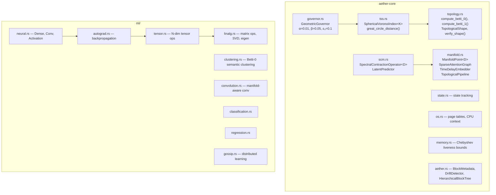

### Key Algorithms

- **`SphericalVoronoiIndex<K>::locate(θ, φ)`**: computes great-circle distance to all K centroids, returns nearest. O(K) with K constant = O(1) amortized. Distance: `arccos(sin θ₁ sin θ₂ + cos θ₁ cos θ₂ cos(φ₁ - φ₂))`.

- **`GeometricGovernor::adapt(deviation)`**: PD control law `ε(t+1) = ε(t) + 0.01·e(t) + 0.05·de/dt` where `e(t) = R_target - Δ(t)/ε(t)`. Clamped to [0.001, 10.0]. Target tick rate: 1000 Hz.

- **`SpectralContractionOperator<D>::step(state)`**: applies a contraction mapping with ratio < 1, guaranteed convergence to a fixed-point attractor by Banach's theorem.

---

## Lean 4 Proofs

All ten theorem checks build into `kernel/seal-os` through the `aether_verified` no_std crate. Lean 4 artifacts live beside them.

```
kernel/aether/aether-verified/lean/
├── AetherVerified.lean           # Top-level umbrella
├── AetherVerified/
│   ├── Pruning.lean              # Pruning algorithm proofs
│   ├── Governor.lean             # T4 governor convergence
│   ├── Chebyshev.lean            # Chebyshev liveness bounds
│   └── Betti.lean                # Betti number properties
├── lakefile.lean                 # Lake build config
└── lean-toolchain                # Lean 4.7.0
```

CI builds the Lean package on every push. Proof strength and remaining placeholders are tracked in [docs/THEOREMS.md](docs/THEOREMS.md).

**Hygiene status**: Zero `sorry` or `admit` tactics in theorem files.

---

## CI Pipeline

16 jobs. Every push. No exceptions.

| Job | What it checks |
|-----|---------------|
| `fmt` | `cargo fmt --check` across all files |
| `build` | `cargo build --workspace` |
| `clippy` | `cargo clippy --workspace --all-targets -- -D warnings` |
| `test` | `cargo test --workspace` + `no_std` feature check + doc claim contract + Lean hygiene |
| `bench-compile` | `cargo bench --workspace --no-run` |
| `miri` | Miri UB detection on `aether-core` state, OS, and proptest |
| `bench-regression` | Criterion `io_cycle_8_lbas` < 120 ns median gate |
| `audit` | `cargo audit` for known vulnerabilities |
| `deny` | `cargo deny check` for license/dependency policy |
| `docs` | `cargo doc --workspace --no-deps` with `-D warnings` |
| `bom` | UTF-8 BOM check on all source files |
| `kernel-build` | Seal OS kernel build on nightly, PE/COFF header verification |
| `kernel-image` | UEFI disk image creation, `seal-mkimage --verify`, ISO build |
| `kernel-qemu-smoke` | 240-second QEMU boot with 20+ hard milestone gates |
| `kernel-clippy` | Kernel-specific clippy on nightly |
| `laamba-governor-check` | LAAMBA Governor Rust backend check |
| `lean` | Lean 4 package build with Mathlib cache |

**QEMU smoke test hard gates** (must all pass):

1. UEFI entry and Seal OS banner
2. Heap initialized
3. IDT + PIC initialized
4. T4 governor online
5. T1 Voronoi index reports 8 cells
6. All ten theorem lines `[THEOREM] Tn/... VERIFIED`
7. QEMU AHCI disk identity
8. Block device `0x800` registered
9. Persistent ManifoldFS root mounted from disk
10. Desktop proof frame blit sentinel
11. Desktop ready sentinel
12. Event-loop entry sentinel
13. Scheduler started
14. SYSCALL/SYSRET MSRs programmed
15. Aether runtime proof marker

See [docs/CI.md](docs/CI.md) for full pipeline documentation.

---

## Acknowledgements

Seal OS stands on the shoulders of:

- **The Rust community** — for `no_std`, `core`, `alloc`, and the borrow checker
- **The Lean community** — for formal proof infrastructure and Mathlib
- **TempleOS (Terry A. Davis)** — for proving that a single person can write an entire operating system with a native language
- **Redox OS** — for demonstrating Rust bare-metal OS viability
- **Topology and geometry researchers** — for the mathematical primitives that make this design possible

---

## Contact

- **Author**: Teerth Sharma
- **Repository**: https://github.com/teerthsharma/epsilon-hollow
- **Security**: See [SECURITY.md](SECURITY.md)
- **Discussions**: GitHub Discussions tab

---

<p align="center">

<!-- RUST_LINE_COUNT_START -->
**111176 lines of Rust** across 387 files | 0 lines of x86 assembly | 1823 lines of Aether-Lang DSL | **112999 total**
<!-- RUST_LINE_COUNT_END -->

</p>

<p align="center">
  <em>OS state is topology on S². No timelines. No excuses. Only geometry.</em>
</p>
