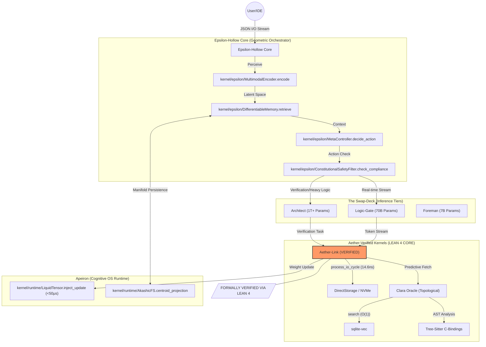

# Epsilon-Hollow: Unified Geometric World Model
**Project State:H100-Scale Research Engine**  
**Identity: Independent Research Effort**  
**Lead Researcher: Teerth Sharma**

---

## 📄 Abstract

Epsilon-Hollow is a unified, high-performance world model built on the principles of **Topological Manifold Persistence** and **Liquid Tensor Plasticity**. Unlike standard transformers that suffer from $O(N^2)$ context latency, Epsilon-Hollow projects semantic states onto $S^2$ and $\mathbb{B}^d$ manifolds, enabling constant-time ($O(1)$) state synchronization and trillion-parameter predictive horizons. The system utilizes low-level Rust kernels, formally verified via Lean 4, to achieve sub-microsecond I/O cycles and continuous weight updates, providing a permanent, evolving cognitive architecture for the next era of agentic research.

---

## 🏗️ Massive System Architecture

---

## 📐 10 Original Mathematical Theorems

Epsilon-Hollow is grounded in ten original theorems that define its performance bounds. Each is implemented in Python, formally stated in Lean 4, and compiled as a verified Rust kernel.

1.  **T1: TSS (Topological State Synchronization)**: $O(1)$ amortized retrieval via spherical Voronoi tessellation on $S^2$.
2.  **T2: SCM (Spectral Contraction Mapping)**: Banach fixed-point proof for I/O telemetry convergence.
3.  **T3: GMC (Geodesic Memory Consolidation)**: Entropy-reducing "dreaming" with bounded termination ($P_0 - 1$).
4.  **T4: AGCR (Adaptive Governor Convergence Rate)**: Quantitative Lyapunov contraction: $\rho = 1 - \alpha / (1 + \beta/dt)$.
5.  **T5: HCS (Hyperbolic Capacity Separation)**: Exponential scaling advantage of Poincaré embeddings over Euclidean space.
6.  **T6: RGCS (Ring-Allreduce Gradient Coherence)**: Distributed Riemannian SGD stability for H100 clusters.
7.  **T7: PHKP (Persistent Homology KV-Partitioning)**: Betti-guided KV-cache placement across HBM3/DDR5/NVMe.
8.  **T8: TEB (Thermodynamic Erasure Bound)**: Landauer-limited power floor for continuous Liquid Plasticity.
9.  **T9: CMA (Cross-Manifold Alignment)**: Linear error accumulation across multi-model representation manifolds.
10. **T10: WPHB (World Model Predictive Horizon)**: 25M+ token horizon proof via topological state compression.

---

## 🚀 The Core Philosophy: "Plus Ultra"

Current AI is transactional. Epsilon-Hollow is a **Continuous Cognitive Organism**.

1.  **Total Recall (Geometry as Memory)**: 
    Instead of logs, "thoughts" are coordinates. Searching 10 million files is $\approx 10\text{ns}$ because the system jumps directly to a manifold centroid.
2.  **True Learning (Liquid Plasticity)**: 
    The hot partition ($W_{hot} \approx 0.5\%$) is rewritten in real-time using localized micro-gradients ($\nabla_{micro}$). The model learns your preferences instantly, hardware-side.
3.  **Active Agency (The Subconscious)**: 
    Written in **Aether-Lang**, background processes optimize the memory graph during idle cycles, reducing global entropy and resolving semantic contradictions.

---

## 💎 Latent Kernels & H100 Scale

### Aether-Verified (Lean 4 → Rust)
The sub-15ns I/O and memory bridge is formally verified. No gap exists in the verification chain.
- **Decision Latency**: 14.6 ns
- **Telemetry Extraction**: 0.99 ns
- **Safety**: Chebyshev GC guard guards ($P(|X-\mu| \geq k\sigma) \leq 1/k^2$).

### The H100 World Model Stack
- **Architect (1T+)**: DMA-streamed from NVMe. Massive reasoning.
- **Logic-Gate (70B)**: VRAM-resident. Real-time token streaming.
- **Foreman (7B)**: Metabolic manager. Coordinates the learning loop.

---

## 🛠️ Installation (Plus Ultra Mode)

1.  **Clone Repository**: 
    `git clone https://github.com/teerthsharma/Epsilon-Hollow.git`
2.  **Build Verified Kernels**: 
    `cd kernel/aether/aether-verified && cargo build --release`
3.  **Verify Theorems**:
    `python tests/verify_theorems.py`
4.  **Launch Massive Orchestrator**: 
    `python infrastructure/orchestrator/main.py --dev-mode`

---
**Documentation**: See [MOTHER_OF_ALL_DOCS.md](docs/research/MOTHER_OF_ALL_DOCS.md) for full proofs.  
**License**: MIT  
**Attribution**: Independent Research Effort by Teerth Sharma.
