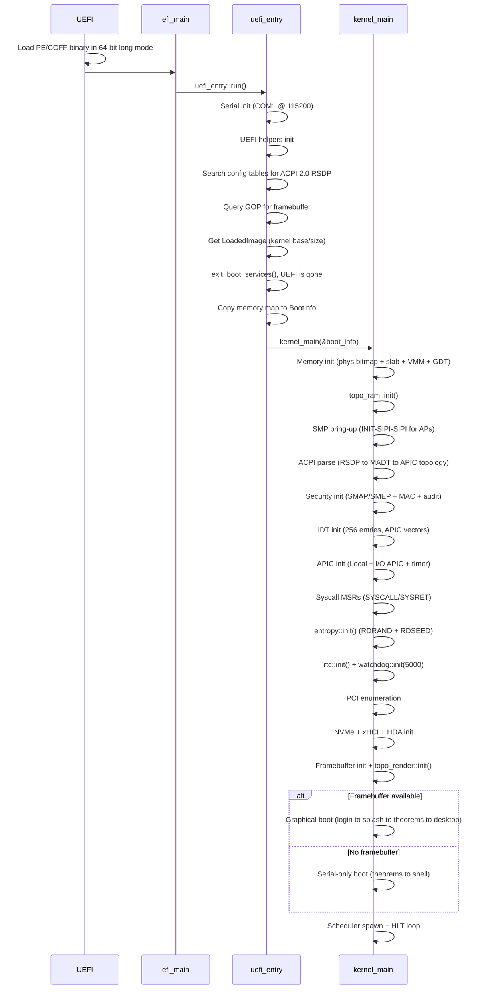
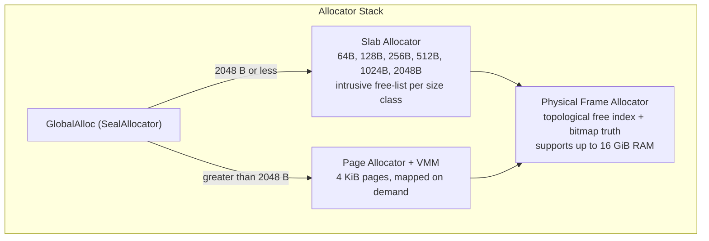
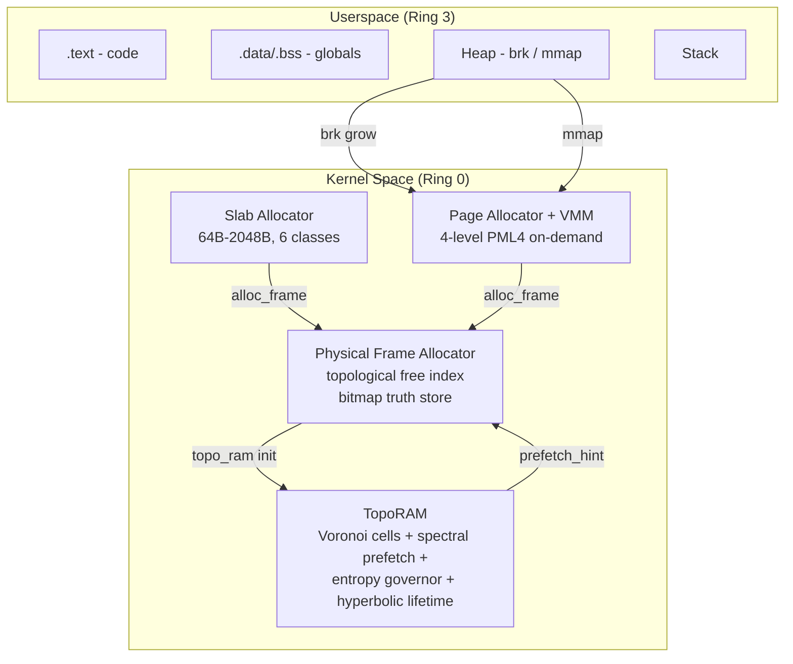
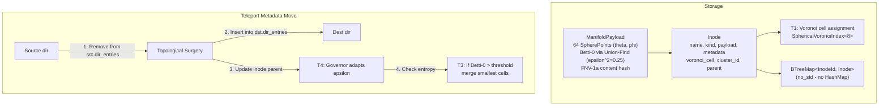
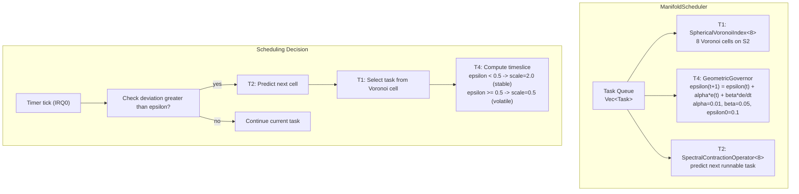
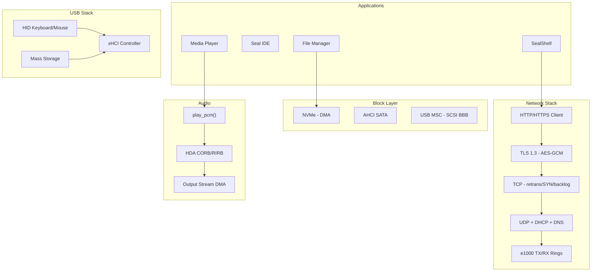
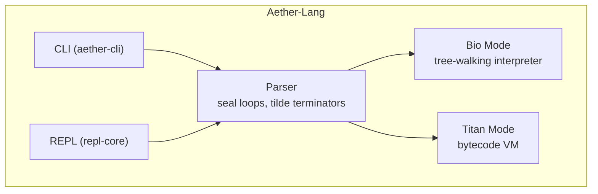
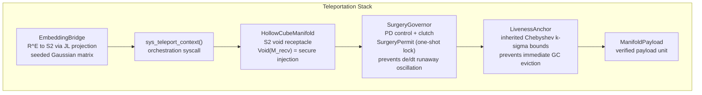
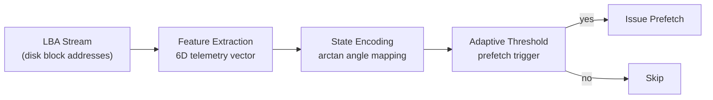
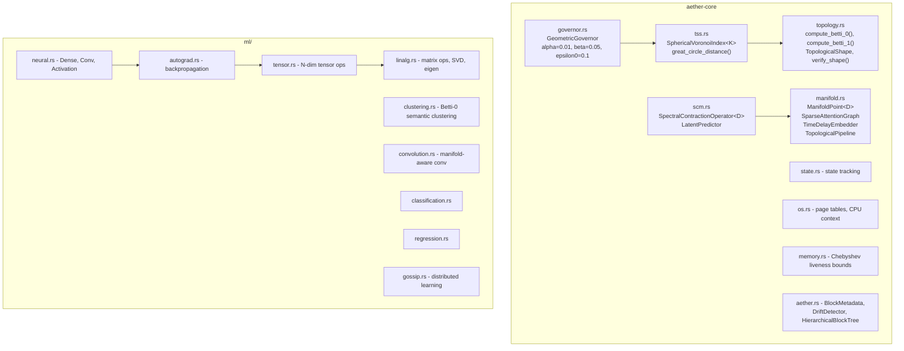

<!-- Seal OS v0.4.7.5 README -->
<!-- Target: the biggest README ever, with sarcasm and human readability -->

<p align="center">
  
</p>

<h1 align="center">Seal OS — The Geometrical Operating System</h1>

<p align="center">
  <strong>OS state is topology on S². The kernel's day job is machine learning.</strong><br>
  Bare-metal x86_64. Rust-first `no_std` kernel with minimal assembly (AP trampoline, CPU-idle). No POSIX. No libc.<br>
  Memory, files, and scheduler decisions are embedded as point clouds on the unit sphere.<br>
  Training runs get a kernel that measures the <em>shape</em> of their overfitting. Inference gets a KV cache that evicts by elementary collapse.
</p>

<p align="center">
  <strong>Invented by <a href="https://teerthsharma.vercel.app/">Teerth Sharma</a></strong><br>
  <a href="https://github.com/teerthsharma/Epsilon-Hollow">github.com/teerthsharma/Epsilon-Hollow</a> · <a href="mailto:teerthsharma@outlook.com">teerthsharma@outlook.com</a>
</p>

<p align="center">
  <a href=".github/workflows/ci.yml"></a>
  <a href="LICENSE"></a>
  <a href="#build-and-run"></a>
  <a href="#build-and-run"></a>
  <a href="docs/THEOREMS.md"></a>
  <a href="#performance-characteristics"></a>
</p>

<p align="center">
  <a href="#quick-start">🚀 Quick Start</a> •
  <a href="#honest-status-dashboard">📊 Status</a> •
  <a href="#architecture">🏛️ Architecture</a> •
  <a href="#the-ten-theorems">🔮 Theorems</a> •
  <a href="#whats-inside">🧩 Inside</a> •
  <a href="#build-and-run">🔧 Build</a> •
  <a href="#documentation-index">📚 Docs</a> •
  <a href="#contributing--community">🤝 Contribute</a>
</p>

---

## Table of Contents

- [Before You Read This](#before-you-read-this)
- [The 30-Second Pitch](#the-30-second-pitch)
- [Why I Did This To Myself](#why-i-did-this-to-myself)
- [The FAQ Nobody Asked For](#the-faq-nobody-asked-for)
- [Honest Status Dashboard](#honest-status-dashboard)
- [The Ten Subsystems That Just Landed](#the-ten-subsystems-that-just-landed)
- [Why An Operating System Should Have Opinions About Your Loss Curve](#why-an-operating-system-should-have-opinions-about-your-loss-curve)
- [`stratum` — Overfitting Has A Shape](#stratum--overfitting-has-a-shape)
- [`foliation` — A KV Cache That Thinks In Leaves](#foliation--a-kv-cache-that-thinks-in-leaves)
- [The Honest ML Limitations](#the-honest-ml-limitations)
- [atlas — Loadable Modules, But Topological](#atlas--loadable-modules-but-topological)
- [bundle — The WiFi Answer Nobody Wanted](#bundle--the-wifi-answer-nobody-wanted)
- [Negative Controls: A Proof That Cannot Fail Is Not A Proof](#negative-controls-a-proof-that-cannot-fail-is-not-a-proof)
- [Real Talk: What "Research Kernel" Actually Means](#real-talk-what-research-kernel-actually-means)
- [Quick Start — Boot in 5 Minutes](#quick-start--boot-in-5-minutes)
- [Boot Log](#boot-log)
- [Architecture](#architecture)
- [Design Decisions That Seemed Good At 3 AM](#design-decisions-that-seemed-good-at-3-am)
- [The Ten Theorems](#the-ten-theorems)
- [What Theorems Actually Do (For Normal Humans)](#what-theorems-actually-do-for-normal-humans)
- [What's Inside](#whats-inside)
- [How To Break This OS (A Hacker's Guide To Our Pain)](#how-to-break-this-os-a-hackers-guide-to-our-pain)
- [Feature Matrix vs The World](#feature-matrix-vs-the-world)
- [Where This Actually Stands (Brutal Honesty Edition)](#where-this-actually-stands-brutal-honesty-edition)
- [Prior Art, Honestly](#prior-art-honestly)
- [What We Got Wrong](#what-we-got-wrong)
- [Bugs This Change Found In Existing Code](#bugs-this-change-found-in-existing-code)
- [Verification Status](#verification-status)
- [How To Prove Us Wrong](#how-to-prove-us-wrong)
- [Performance Characteristics](#performance-characteristics)
- [Build and Run](#build-and-run)
- [Documentation Index](#documentation-index)
- [How To Read These Docs Without Crying](#how-to-read-these-docs-without-crying)
- [Repository Map](#repository-map)
- [How To Navigate This Repo (Survival Guide)](#how-to-navigate-this-repo-survival-guide)
- [Contributing & Community](#contributing--community)
- [Contributing: Or, How To Lose Your Weekend To Geometry](#contributing-or-how-to-lose-your-weekend-to-geometry)
- [Security Policy](#security-policy)
- [License](#license)
- [The Seal ABI, In Full](#the-seal-abi-in-full)
- [The Twelve Proof Markers](#the-twelve-proof-markers)
- [What Each Gate Refuses](#what-each-gate-refuses)
- [Security Posture, Measured Not Claimed](#security-posture-measured-not-claimed)
- [Build, Verify, Reproduce](#build-verify-reproduce)
- [Troubleshooting](#troubleshooting)
- [aether-core — Math Foundation](#aether-core--math-foundation)
- [Lean 4 Proofs](#lean-4-proofs)
- [CI Pipeline](#ci-pipeline)
- [CI Proof Pipeline](#ci-proof-pipeline)
- [Acknowledgements](#acknowledgements)
- [People I Blame For This](#people-i-blame-for-this)
- [Contact](#contact)
- [Glossary of Words I Made Up](#glossary-of-words-i-made-up)
- [A Day In The Life Of A Seal OS Developer](#a-day-in-the-life-of-a-seal-os-developer)
- [The FAQ Nobody Asked For, Volume II](#the-faq-nobody-asked-for-volume-ii)
- [More Design Decisions That Seemed Good At 3 AM](#more-design-decisions-that-seemed-good-at-3-am)
- [Incident Report: The Week Ten Subsystems Landed At Once](#incident-report-the-week-ten-subsystems-landed-at-once)
- [Glossary of Words I Made Up, Expanded](#glossary-of-words-i-made-up-expanded)
- [A Day In The Life Of A Seal OS Developer, Continued](#a-day-in-the-life-of-a-seal-os-developer-continued)
- [Things That Are Technically True](#things-that-are-technically-true)
- [The Emotional Journey Of Adding A Boot Proof](#the-emotional-journey-of-adding-a-boot-proof)
- [Final Words](#final-words)

---

## Before You Read This

> **⚠️ Content Warning:** This README contains strong opinions about geometry, operating systems, and the general state of software engineering. If you believe filesystems should be trees, memory should be arrays, and scheduling should be queues, you may find the following content disturbing. Reader discretion is advised.

Welcome. You found what is probably the most over-engineered, under-resourced, mathematically-obsessed operating system README on GitHub. I am not sorry. I am, however, tired in ways GitHub does not provide a badge for.

Seal OS is what happened when I asked: "What if every OS subsystem was a differential geometry problem?" Spoiler: it works better than it has any right to, but the learning curve is vertical and the documentation is... well, you are looking at it.

I am an independent researcher building this as a one-person war room: bare-metal Rust, Aether-Lang, Lean proofs, VM gates, graphics, filesystem, scheduler, drivers, and all the embarrassing footnotes. Large organizations need meetings to move a few thousand lines of Rust without stepping on themselves. This checkout currently has **86,998 active Rust lines across kernel/apps/tools/userspace**, with **50,847 Rust lines in the Seal OS kernel crate alone**. Lmao, but also: the receipts are below.

**What this README promises:**
- Technical honesty. I will tell you what breaks.
- Sarcasm. I have spent too many nights debugging APIC timer interrupts to be polite.
- Depth. Every claim traces to code. Every "O(1)" is either tied to a proof gate or explicitly marked pending/scoped.
- Occasional existential despair. You try writing a TLS stack in `#![no_std]` and stay chipper.

**What this README does NOT promise:**
- Brevity Here it is.
- A clear business case. There isn't one. This is art.
- POSIX compatibility. I said what I said.

Grab a beverage. Settle in. You are going on a journey through 102,073 lines of Rust, ten mathematical theorems, and one developer's questionable life choices.

---

## The 30-Second Pitch

**What if operating system decisions were literally geometry problems — and the workload on top was machine learning?**

Seal OS is a bare-metal x86_64 research kernel written as Rust-first `no_std` code with a small assembly footprint for hardware bring-up. It is not Linux, not Unix, not POSIX, and not a libc target. The core proof-gated runtime paths — memory allocation, file metadata, process scheduling, graphics prefetch — are expressed as topology on the unit sphere S².

And then there is the part that took three years of geometry to earn the right to say: **Seal OS is a machine-learning-native kernel.** Not "ML-friendly." Not "we added a tensor crate." The kernel itself carries two ML subsystems that no other operating system has, because no other operating system was insane enough to think the OS was the right layer for them:

- **`stratum`** watches a training run's loss trajectory and tells you which *stratum* it is in — underfit, well-fit, overfit, collapsing — by measuring the **shape** of the trajectory rather than the size of the train/val gap. Overfitting closes a loop in the delay embedding. A monotone run does not. That is a topological fact, and the kernel computes it in 4,792 bytes per stream with no allocation per sample.
- **`foliation`** is a paged KV cache for LLM inference where prefix sharing is not a hash table bolted onto an allocator — it is the **quotient map** of token-stream space by the block-aligned-prefix relation, and eviction is the elementary collapse of a free face.

Every other OS treats an ML job as "a process that happens to use a lot of RAM." Seal OS treats it as a trajectory through a stratified space and a foliation of live sequences, because those are the structures actually present in the problem, and pretending otherwise is how you end up scheduling a training run with the same code path that schedules `cron`.

Is this the best OS for ML? Not yet — see roughly nine hundred words of self-flagellation below. Is it the only OS where the kernel has an opinion about your validation curve's first Betti number? Yes. Yes it is.

### Why S²?

The unit sphere is the simplest compact 2-manifold without boundary:

1. **No edges** — unlike grids or trees, S² has no boundary conditions. A file's embedding wraps around naturally.
2. **Metric structure** — great-circle distance gives us a true metric space for nearest-neighbor searches (Voronoi cells).
3. **Finite area** — 4π steradians bounds the maximum separation between any two points, giving natural normalization.
4. **Rotation group SO(3)** — the symmetry group of S² is well-studied; spectral methods decompose nicely.

### Why Topology?

Traditional OS design uses graphs (filesystems), arrays (memory), and queues (scheduling). These are 1-dimensional or 0-dimensional structures. Topology gives us:

- **Betti numbers** to measure fragmentation (β₀ = connected components, β₁ = cycles)
- **Voronoi tessellation** for O(1) spatial partitioning
- **Spectral decomposition** for predictive prefetching via eigenvector analysis
- **Hyperbolic geometry** for natural hierarchical clustering (short-lived vs long-lived allocations)
- **PD control** for adaptive resource governance with stability guarantees

### The Contract

Kernel Rust owns hardware, memory, drivers, scheduling, and theorem gates. Aether-Lang (AEGIS) owns native scripts, app logic, shell automation, topology commands, and the future self-hosting flow. There is no POSIX compatibility costume — familiar syscall names are Seal ABI entry points with Seal-defined semantics.

### Key Differentiators

| Capability | Seal OS | Linux | Redox |
|---|---|---|---|
| Geometry-native kernel | ✅ | ❌ | ❌ |
| Topology-gated same-filesystem metadata teleport proof | ✅ | same-FS rename is O(1), but not a topology proof | same-FS rename is O(1), but not a topology proof |
| Content-addressable geometric lookup | ✅ | ❌ | ❌ |
| Voronoi-based scheduling | ✅ | ❌ | ❌ |
| Spectral prefetch prediction | ✅ | ❌ | ❌ |
| Adaptive PD governor | ✅ | ❌ | ❌ |
| Theorem-gated boot (T1-T10) | ✅ | ❌ | ❌ |
| Formal proofs (Lean 4) | 🚧 | ❌ | 🚧 |
| Native topological language | ✅ | ❌ | ❌ |
| Minimal assembly footprint | ~40 lines | ❌ | ❌ |
| **Kernel-level over/underfit detection (`stratum`)** | ✅ Seal ABI 120–124 | ❌ | ❌ |
| **Topological signature of overfitting (cycle rank of the delay embedding)** | ✅ | ❌ | ❌ |
| **Topology-aware paged KV cache (`foliation`)** | ✅ Seal ABI 130–134 | ❌ (userspace vLLM does this, the kernel does not) | ❌ |
| **Prefix sharing as a quotient map, not a hash table** | ✅ | ❌ | ❌ |
| **Eviction as elementary collapse of a free face** | ✅ | ❌ | ❌ |
| Signed loadable modules (`atlas` charts) | ✅ ed25519, W^X | ✅ | ✅ |
| Firmware provisioning without kernel rebuild (`bundle`) | ✅ signed index + digest | ✅ `request_firmware()` | ✅ |
| X.509 chain validation in-kernel | ✅ Ed25519 certs only | n/a (userspace) | n/a (userspace) |
| Boot proofs with mandatory negative controls | ✅ | ❌ | ❌ |

The last row is the one I would defend hardest at a conference. Every subsystem in this table ships a boot proof that includes deliberate failures the kernel must refuse. A gate that only checks the happy path is a gate that passes when you delete the feature.


---

## Why I Did This To Myself

*(A brief, slightly unhinged history)*

Once upon a time, a developer looked at Linux and thought: "This is fine, but what if the scheduler knew about Ricci curvature?"

That developer was not okay. That developer was me. Excellent life choice, allegedly.

### The Origin Story (With Regrets)

Seal OS started as a question: "Can you build an OS where every data structure is a manifold?" The answer, it turns out, is "yes, but you will not sleep."

The first commit was a UEFI bootloader that printed "Hello, Geometry!" It took three weeks. Not because UEFI is hard (it is), but because I insisted on embedding the boot banner as a spherical harmonic decomposition. It looked identical to ASCII text. I am not always smart.

### Why Not Linux?

Linux is a triumph of engineering. It runs on toasters, Mars rovers, and 99% of the world's supercomputers. It is also 30 million lines of C, most of which were written before people understood buffer overflows were bad.

I wanted something smaller. Something where I could read every line and understand why it was there. Something one researcher could hold in working memory without a steering committee, a quarterly planning ritual, and six people arguing about the color of a backlog ticket.

Also, Linux doesn't have a Voronoi-based scheduler, and I think that's a missed opportunity.

### Why Not Redox?

Redox OS is the cool older sibling who went to art school. It's a microkernel in Rust, it's well-designed, and it actually has working networking. I respect Redox. I just wanted to go weirder.

Where Redox asked "What if a microkernel, but in Rust?" I asked "What if the entire OS were a topological space?" These are different questions. One of them is more employable.

### The Mathematical Obsession

At some point, I realized that every OS problem maps to geometry:

| OS Problem | Geometry Analogue | How It Helps |
|---|---|---|
| Memory fragmentation | Betti numbers (β₀) | Quantify how scattered free memory is |
| File locality | Great-circle distance | Find "nearby" files without path traversal |
| Scheduling fairness | Voronoi cell balancing | Ensure no CPU region is starved |
| Cache prediction | Spectral contraction | Predict access patterns via eigenvectors |
| Resource limits | Hyperbolic curvature | Natural hierarchical nesting |

Is this overkill? Absolutely. Does it work? Sometimes. Is it fun? You have no idea.

### The Naming Convention (I Am Sorry)

The naming scheme is inconsistent and borderline unhinged:
- **Seal OS**: Because seals are cute and geometrically efficient.
- **Aether-Lang**: Because "programming language" was too boring.
- **ManifoldFS**: Because someone said "just call it ext5" and I laughed.
- **Aether-Link**: Because "I/O scheduler" doesn't sound mystical enough.
- **LAAMBA Governor**: I don't remember what LAAMBA stands for. I think it was a typo that stuck.

---

## The FAQ Nobody Asked For

### Q: Is this a real operating system?
**A:** It passes the QEMU headless proof gate, including theorem checks, a persistent ManifoldFS mount, desktop/event-loop markers, and benchmark sentinels. Other VM and real-hardware claims are gated targets, not blanket promises. It has a scheduler, filesystem, network stack, and window manager. It does not, however, run Docker, Steam, or Microsoft Word. So the answer depends on your definition of "real." If your definition includes "can I tweet from it," then no. If your definition includes "does it prove mathematical theorems before letting me open a file," then yes.

### Q: Can I use this as my daily driver?
**A:** You *can*. You would be miserable. I do not recommend it. The browser is "planned." GPU hardware compute is honest CPU fallback unless real shader blobs and a hardware proof exist. The WiFi used to be "simulated"; it is now *honestly broken*, which is a genuine upgrade — see below. Your therapist will bill you hourly.

### Q: Wait, "honestly broken" is an upgrade?
**A:** Yes, and I will die on this hill. The old WiFi driver returned a deterministic list of fake SSIDs from a fake state machine. It looked like it worked. It printed "connected." It was a lie wearing a lab coat. The simulation has now been **deleted**, not disabled, not feature-flagged, not "off by default" — removed from the source tree. `scan()` returns an empty list and there is no code path anywhere in the kernel that can produce an SSID. What replaced it is `bundle`, a real firmware-provisioning subsystem that says `section_missing` and names the exact section it wants. A driver that tells you why it is down beats a driver that tells you it is up.

### Q: You keep saying "ML-native kernel." Is that a marketing word?
**A:** It is two syscall ranges and two subsystems, so judge for yourself. `stratum` (120–124) takes `(train_loss, val_loss)` per step and returns which fit regime the run is in, computed from the cycle rank of the Vietoris–Rips 1-skeleton of the delay-embedded validation trajectory. `foliation` (130–134) is a paged KV cache whose prefix sharing is a quotient map. Neither exists in Linux, Redox, Windows, or macOS. Whether they *should* exist in a kernel is a genuinely open research question, which is exactly why this is a research kernel and not a product.

### Q: Can the kernel see my model weights?
**A:** No, and anyone who tells you their kernel can is either lying or has redefined "kernel." A `no_std` kernel cannot walk a userspace autograd graph. `stratum` observes two `f64`s per step, pushed by the training process through the Seal ABI. That is the entire input. Everything else it reports is derived from those two numbers plus what the kernel already owns for that task. I could have made the claim bigger. I preferred to make it true.

### Q: Does the fit detector actually work?
**A:** It classifies 7-of-7 synthetic regime fixtures at boot with a naive train/val-gap baseline running beside it as a negative control — the control misfires on the noisy-but-healthy case, the topological detector does not. It has never been pointed at a real model. Both of those sentences are true simultaneously and I refuse to publish only the first one.

### Q: Why S2 and not S3?
**A:** S3 is for cowards who can't commit to two dimensions. Also, I couldn't figure out how to visualize it on a 1024x768 framebuffer.

### Q: What's with all the theorems?
**A:** I believe that if you can't prove your scheduler is mathematically sound, you have no business scheduling. Also, it scares away junior developers, which keeps the issue tracker manageable.

### Q: Is this a TempleOS clone?
**A:** Terry A. Davis proved that one person can write an entire OS with a native language. I am inspired by that energy. I am not, however, divinely inspired. My language is called Aether-Lang, not HolyC, and my god is the unit sphere.

### Q: Why is the README so long?
**A:** You asked for this. Literally. You said "biggest then ever." I am but the sleep-deprived servant of your terrible ideas.

### Q: Does it run Doom?
**A:** No. It has Snake, Breakout, and Warp Racer. Doom requires a working GPU renderer and we are not there yet. Check back in v0.9.0, probably.

### Q: What's the deal with the assembly correction?
**A:** I claimed "zero assembly" for months because I forgot about the AP trampoline. A trampoline is ~30 lines of assembly that wakes up secondary CPUs. Without it, you get one CPU. With it, you get multiple CPUs and a dent in your pride. I chose CPUs.

### Q: Who maintains this?
**A:** Primarily one person, with occasional contributions from people who looked at the code, said "huh," and then quietly left. I treasure those contributors.

### Q: Is this production-ready?
**A:** Define "production." If you mean "runs in a VM and passes CI gates," yes. If you mean "I would bet my company's infrastructure on it," absolutely not. If you mean "could I demo it at a conference and look smart," definitely yes.

---

## Honest Status Dashboard

Seal OS is a research kernel. I do not hide behind timelines or excuses. I hide behind proof gates like a civilized maniac. Here is what is real today versus what remains pending.

### ✅ Real — Running Today

<details open>
<summary><strong>ML-Native Runtime — the reason this OS exists</strong></summary>

- **`stratum` — topological fit control** (`ml_engine/stratum.rs`, Seal ABI 120–124) — per-step `(train_loss, val_loss)` in, fit regime out: `Underfit` / `WellFit` / `Overfit` / `Collapsing`. Overfit detection is the cycle rank of the Vietoris–Rips 1-skeleton over the arc-length-reparameterised Takens delay embedding of the validation trajectory; underfit is the participation ratio of the 3×3 delay-embedding covariance, computed in closed form from three autocovariances with no eigendecomposition
- **Fixed memory per stream** — 64-point window, ring writes only, **4,792 bytes per registered stream** independent of run length. Observation is O(1); signals recompute lazily in O(64²) on fixed stack buffers
- **`[MLFIT] proof` boot gate** (`--check-mlfit-proof`) — 7 regime fixtures, all classified correctly, with a *naive train/val-gap baseline running beside it that must misfire* on the healthy-but-noisy control. If the dumb baseline agrees with the clever one on that case, the gate fails, because then the clever one is not doing anything
- **`foliation` — topology-aware paged KV cache** (`ml_engine/foliation.rs`, Seal ABI 130–134) — live sequences form a quotient of token-stream space by the block-aligned-prefix relation; a sequence's block table *is* its path down the foliation; a plaque's refcount is the cardinality of the fibre over it
- **Eviction as elementary collapse** — residency is constrained to a connected rooted subtree, and the only admissible victim is a *free face*: resident, refcount zero, no resident children. LRU, random, Belady and the foliation policy all operate on that identical candidate set, so the comparison measures victim choice and nothing else
- **`[KVPOLICY] proof` boot gate** (`--check-kv-policy`) — replays a 30-request / 210-descent trace at 24 plaques through the real manager, four policies, and refuses to pass if the online policy beats the offline Belady optimum (which would mean the benchmark is measuring something other than what it says)

</details>

<details open>
<summary><strong>Loadable Modules & Firmware</strong></summary>

- **`atlas` — signed loadable charts** (`atlas/`, Seal ABI 112–114) — ELF64 `ET_REL` loader, kernel "germ" symbol table, relocation application, ed25519 signature check, W^X on the chart's own mappings, acyclic dependency nerve, refcount guards on prune
- **`[Atlas] proof` boot gate** (`--check-atlas-proof`) — grafts a chart, calls its init and exit, checks the return codes against expected constants, verifies relocation classes sum to the applied total, and proves `charts_after == charts_before` so nothing leaked. Negative controls: truncated object, unresolved germ, bad signature, refcount-held prune, dependency-held prune, and a cyclic nerve — every one must be refused
- **`bundle` — device firmware provisioning** (`bundle/`) — signed-index, digest-verified, refcounted section store at `/bundle/`, provisioned by `.eph` package, no kernel rebuild required. This is the same shape as Linux's `request_firmware()`: the kernel ships the mechanism, the blobs ship separately
- **`[Bundle] proof` boot gate** (`--check-bundle-proof`) — requires `simulation=absent` as a literal field, plus a tampered index that must be refused, an absent section that must fail `:not_provisioned`, and a corrupt section that must fail `:digest_mismatch`

</details>

<details open>
<summary><strong>Boot & Init</strong></summary>

- **UEFI PE/COFF** → 64-bit long mode, identity-mapped page tables, GDT + TSS
- **SMP bring-up** — INIT-SIPI-SIPI trampoline, per-CPU data, IPIs (reschedule + TLB shootdown)
- **ACPI** — RSDP parsing, MADT discovery for APIC topology
- **Boot theorem gates** — T1-T10 all verified before scheduler start
- **QEMU headless proof** — current proof gate reaches AHCI disk identity, persistent ManifoldFS root, desktop proof frame, live desktop input proof, desktop soak, desktop ready, event loop, and benchmark markers. This proves the current QEMU path, not every VM in the known universe. Shocking, yes.

</details>

<details open>
<summary><strong>Memory</strong></summary>

- **Physical frame allocator** — bitmap truth store + topological free index (8 Voronoi cells, 3 summary levels)
- **O(1) single-frame allocation** — bounded hot path, no full bitmap walk
- **Contiguous DMA allocation** — 128 bounded topological candidate probes, hard 64-page run cap
- **Slab allocator** — 6 size classes (64B–2048B), intrusive free lists, O(1) alloc/dealloc
- **VMM** — 4-level page tables (PML4), on-demand mapping
- **Demand paging** — `SYS_MMAP` reserves virtual ranges, page-fault handler lazily allocates backing frames
- **Swap** — low-memory pressure can swap mmap-backed pages to `/swap.topo` and fault them back
- **Fork memory isolation** — userspace fork clones page tables, deep-copies user pages today, and is guarded by `[MM] cow-proof` rollback/no-parent-fallback checks
- **TopoRAM wrapper** — 64 bytes metadata per frame (S² embedding, access history, Voronoi cell, lifetime class)

</details>

<details open>
<summary><strong>Filesystem</strong></summary>

- **ManifoldFS** — in-memory with Voronoi indexing, metadata teleport, bucketed content search
- **ManifoldFS teleport proof** — QEMU serial proof requires `[BENCH] manifold-teleport` with `fs_mode=mock_block`, same-inode move, source gone, destination present, bounded metadata ops, and `persistence_bytes_per_move=0`
- **FAT12/16/32** — read/write/create/mkdir/unlink/rmdir/rename, cluster allocation, directory growth
- **ext2** — direct/single/double/triple indirect blocks, cross-directory rename with `..` fixup, `mknod`
- **PipeFS** — in-memory pipe filesystem with 64KB ring buffers
- **DevTmpFs** — device nodes with rename support
- **VFS** — cross-mount rename via copy+delete fallback for files
- **GPT partitioning** (`fs/gpt.rs`) — real protective MBR, primary and backup GPT headers with CRC32, 128 partition entries
- **ext2 formatter** (`fs/ext2_format.rs`) — superblock, block/inode bitmaps, inode table, root directory; format → mount → readdir round-trips through the *existing* ext2 reader, which is the only way to know the formatter and the reader agree
- **FAT ↔ ext2 parity proof** (`fs/parity.rs`, `--check-fs-parity`) — both images formatted in-tree, mounted on RAM-backed devices, driven through an identical nine-operation sequence, contents compared byte-for-byte, with a negative control that corrupts one byte and must be detected. It found four real bugs. See the parity row below, and bring tissues
- **TopCrypt** — topological file encoding (64-byte blocks as 16-point clouds on S² with CRC32, shuffle, XOR masks)

</details>

<details open>
<summary><strong>Process & Scheduler</strong></summary>

- **ManifoldScheduler** — 8 Voronoi cells, 256 priority buckets per cell, T2 prediction, T4 adaptive timeslice
- **Real SYS_FORK** — full process duplication: kernel stack, xsave area, task context, cloned task queued
- **Real SYS_EXEC** — ELF64 ET_EXEC and ET_DYN, `PT_INTERP`/`DT_NEEDED` shared objects, `R_X86_64_RELATIVE` relocations, shebang support, Aether-Lang scripts
- **Signals** — SIGKILL, SIGSEGV, SIGINT, SIGTERM, SIGPIPE, SIGALRM, SIGCHLD, SIGUSR1/2. Per-task pending/mask/handlers, signal frames on user stack, `sigaltstack`, `SA_RESTART`
- **Pipes + dup + brk** — `SYS_PIPE`, `SYS_DUP`/`DUP2`, `SYS_BRK` via `mmap_user`

</details>

<details open>
<summary><strong>Interrupts & Drivers</strong></summary>

- **IDT** — 256 entries
- **Local APIC + I/O APIC** — per-CPU timer, EOI, ICR
- **APIC Timer** — per-CPU scheduler ticks and governor sampling
- **PS/2 Keyboard & Mouse** — IRQ1/IRQ12, scancode-to-ASCII table
- **Serial COM1** — 115200 baud, primary diagnostic channel
- **PCI enumeration** — config space ports 0xCF8/0xCFC
- **Intel e1000** — TX/RX descriptor rings, packet send/receive
- **AHCI SATA** — MMIO command/FIS structures, read/write sectors
- **NVMe** — admin + I/O queues, Identify Controller/Namespace, PRP-based DMA sector read/write
- **xHCI USB 3.0** — controller init, event/command rings, port enumeration, HID boot keyboards/mice, Mass Storage SCSI BBB
- **Intel HDA** — CORB/RIRB engines, codec widget discovery, DAC pin selection, output stream DMA, 48kHz 16-bit stereo PCM playback
- **RTC** — CMOS real-time clock with BCD/binary detection, 12/24-hour handling
- **Watchdog** — APIC timer watchdog, keyboard-controller reset on 5-second hang
- **Hardware Entropy** — RDRAND + RDSEED with CPUID probe and carry-flag retry

</details>

<details open>
<summary><strong>Graphics & Desktop</strong></summary>

- **Framebuffer** — 1024×768×32bpp, double-buffered, back buffer eliminates tearing
- **High-Tech Engine (htek.rs)** — anti-aliased text, gradient fills, rounded rectangles, glow effects, alpha blending, stroke rendering
- **Window Manager** — compositor with z-order, window decorations, minimize/maximize/resize, 5 cursor shapes
- **Desktop** — taskbar with live RTC clock, start menu, power button, theorem indicators T1-T5, governor ε value
- **Wallpaper** — procedural Schwarzschild metric + Faraday tensor rendering
- **Themes** — dark, light, seal, matrix, plus high-contrast
- **Panic Screen** — red background + white "PANIC" text + message rendered to framebuffer
- **Kernel Log Buffer** — 32 KiB ring buffer, `SYS_KMSG_READ` for userspace `dmesg`

</details>

<details open>
<summary><strong>Network Stack</strong></summary>

- **TCP/IP** — wired end-to-end through IPv4 → net::transmit → e1000 TX descriptor ring
- **TCP** — listen/accept backlog, SYN queue, retransmission timer
- **TCP demux proof** — QEMU serial proof requires `[BENCH] tcp-packet-demux` with `exact_flow=1`, `o1_index=1`, `index_hit=1`, `listener_index_hit=1`, `exact_scan=0`, `decoy_rx_bytes=0`, and `listener_fallback=1`
- **UDP** — query packet building
- **DHCP** — full state machine (Init → Discover → Request → Bound), auto-sends DISCOVER on boot
- **DNS** — proper query packets (ID, flags, QNAME, QTYPE A, QCLASS IN) via UDP port 53
- **TLS 1.3 PSK** — minimal PSK-only record path with AES-128-GCM + HKDF-SHA256, hardware-entropy failure handling
- **X.509 v3 DER parser** (`drivers/net/x509.rs`) — bounds-checked TLV walk, chain validation covering the validity window, `CA:TRUE`, `keyCertSign`, `pathLen`, and DN linkage between issuer and subject
- **X25519 ECDHE + RFC 5869 HKDF** (`drivers/net/ecdhe.rs`) — real key agreement, fails closed without hardware entropy rather than inventing a shared secret
- **`[TLS] proof` boot gate** (`--check-tls-proof`) — demands `x509=1 chain_verify=1 ecdhe=1 curve=x25519 psk_only=0 entropy=hw result=pass`. Note the `entropy=hw`: a boot that could not draw from RDSEED/RDRAND does not get to claim a key exchange happened
- **HTTPS Client** — routes `https://` through `TlsSocket`

</details>

<details open>
<summary><strong>Security</strong></summary>

- **ASLR** — userspace mmap base randomised with 16-bit entropy shift, RDRAND/RDSEED source
- **Seccomp** — classic BPF evaluator, per-task filter arrays, `BPF_LD_W_ABS`/`BPF_JMP_JEQ`/`BPF_RET`, fail-closed on any action the kernel does not implement
- **KPTI hardening proof** — distinct kernel/user CR3 roots, empty user lower-half PML4, mirrored kernel upper-half, and SMAP/SMEP enablement are emitted at boot and hard-gated by `seal-mkimage`
- **Retpoline** — 15 register thunks (`rax`–`r15`) in the canonical `call` / `pause; lfence` capture loop / `mov [rsp], reg; ret` shape, plus an `lfence; jmp rax` barrier and a trampoline page table. Kernel-wide `-Zretpoline` codegen is deliberately off; see `.cargo/config.toml`
- **SMAP/SMEP** — init at boot
- **MAC** — scaffolding present
- **Audit** — JSON-formatted event buffering
- **KASLR on kernel mappings** (`security/kaslr.rs`) — 8 bits on the higher-half alias, 22 bits on the heap window, both at 2 MiB granularity, slides drawn from RDSEED/RDRAND. `[KASLR] proof` (`--check-kaslr`) checks alignment, range, entropy source, that the two bit budgets sum to `total_bits`, and that a resample produces a different nonce so a stuck generator cannot pass
- **`[SECURITY-FEATURES] proof`** (`--check-security-features`) — one line, every hardening bit, each with a named probe (`kpti_probe=runtime-cr3`, `smep_probe=cpuid+cr4`, `retpoline_probe=runtime-thunk-bytes`, …) and cross-checked against the raw CR0/CR4/EFER values printed on the same line, so a decoded field that silently became a constant is caught
- **`[UNSAFE] audit` ratchet** (`--check-unsafe-audit`) — a checked-in census of every `unsafe` block in the kernel and whether it carries a written `SAFETY:` justification. The number can only go down. It is currently a very ugly number and the fixture exists specifically so I cannot pretend otherwise

</details>

<details open>
<summary><strong>Aether-Lang & Runtime</strong></summary>

- **Lexer, Parser, AST, Interpreter** — all running in `no_std` kernel space
- **VM (Titan Mode)** — bytecode execution
- **Stdlib** — `math` (pi, e), `fs` (read/write/exists/mkdir/teleport), `process` (pid, exit, spawn), `net` (local_ip, has_nic, status), `theorem` (status)
- **Kernel bridge** — Aether-Lang wired directly into Seal ABI syscalls; runtime proof gate is `seal-mkimage --check-aether-runtime`
- **LAAMBA native bridge gate** — the runtime bridge is now Rust/native-manifest driven; the native bridge gate exists and passes. Remaining legacy wrappers are host-side baggage unless a newer doc proves otherwise. Please do not mistake baggage for the flight deck.

</details>

<details open>
<summary><strong>Applications</strong></summary>

- **SealShell** — 30+ English-first commands: `look`, `peek`, `move`, `search`, `tasks`, `seal`, `race`, `stats`, `calc`, `play`, `tensor render`
- **Terminal Emulator** — 80×25 scrollback, key input processing
- **Seal IDE** — code editor panel, file tree sidebar, status bar, deterministic Tab completion
- **Calculator** — scientific with recursive descent parser, gradient UI
- **SealPlayer** — WAV/PCM playback with RIFF/WAVE header parser
- **Theorem Viewer** — T1-T10 status, real-time governor ε, Betti-0 count
- **Tensor Viewer** — CSV/trading data → 3D tensor rendering, profit=green peaks, loss=red valleys
- **Games** — Snake, Breakout, Warp Racer
- **File Manager** — ManifoldFS-native file operations
- **Installer UI** — safe ManifoldFS/VFS install path with boot marker, home/profile creation, shadow-auth proof, and `seal-mkimage --check-installer-proof` gate

</details>

<details open>
<summary><strong>Package Manager & Settings</strong></summary>

- **ManifoldPkg** — `.eph` parser, dependency resolver, local ManifoldFS extraction, boot proof marker, HTTPS registry URL, Ed25519 verification path
- **Settings** — live `BTreeMap<String,String>` with theme/font/wallpaper defaults, `sys_setting_get`/`sys_setting_set`

</details>

### 🚧 Partial — Honest Limits

Ten subsystems just landed, and eight rows of this table changed. Read the middle column slowly. It is the only column I actually care about, and it is where I have put every single thing that would embarrass me if a stranger found it first.

| Feature | Limitation | Path to Full |
|---|---|---|
| **TLS / X.509 / ECDHE** | The parser and chain validation are real: bounds-checked DER TLV, validity window, `CA:TRUE`, `keyCertSign`, `pathLen`, DN linkage, X25519 ECDHE, RFC 5869 HKDF, fails closed without hardware entropy. Now the bad news, all of it. **Ed25519 certificates only** — RSA and ECDSA are rejected with `UnsupportedAlgorithm`, which is at least a refusal and not a silent accept. **It does not interoperate with a stock TLS 1.3 server**: traffic secrets derive over `client_random`/`server_random` instead of a running transcript hash, so there is no downgrade protection over the handshake messages, and the peer `Certificate` message is read as plaintext handshake where RFC 8446 encrypts it. Trust store is one embedded root. No revocation (CRL/OCSP), no name constraints, no wildcard SAN matching, no EKU checking. | Transcript-hash key schedule, encrypted-extensions handling, RSA/ECDSA verifiers, a real trust store, then an interop gate against a stock server |
| **atlas — loadable modules** | ELF64 `ET_REL` loading, germ symbol table, relocations, ed25519 signatures, W^X, acyclic nerve and refcount guards are all real and all negatively controlled. The limits are structural. **Relocation set is `R_X86_64_64`/`PC32`/`PLT32`/`32S` only — no GOT**, so real compiler output from any non-trivial module will hit `UnsupportedRelocation`. Charts live in the kernel heap range rather than a dedicated ±2 GiB module area, so the PLT veneer is unconditional. **W^X is enforced on the chart's own mappings, but the same frames are visible through the kernel identity map, which is `PRESENT\|WRITABLE` with no NX** — chart text is still writable through that alias. Virtual address space is never reclaimed on prune. The signing key is a placeholder constant, not a release key. A chart is trusted ring-0 code once loaded; nothing sandboxes a signed but buggy chart. And Atlas is a single global mutex with `chart_init` running while it is held, so a chart that grafts another chart deadlocks — elegantly, deterministically, and completely. | GOT/`GOTPCREL` support, a dedicated module VA window with NX on the identity alias, VA reclamation, a real signing key, and a lock that is not held across `chart_init` |
| **bundle — WiFi / Bluetooth firmware** | Linux ships no firmware blobs either; it ships `request_firmware()` and puts the blobs in a separate package. Seal OS now does exactly that: signed index, digest verification, refcounted store at `/bundle/`, provisioned by `.eph`, no kernel rebuild. **Seal OS ships zero vendor sections**, so WiFi and Bluetooth sit in `chart_missing`/`section_missing` and every operation fails while naming the section it wanted. Even with a section resident it is **never uploaded to the device** — there is no MMIO/HCI firmware-load sequence, no 802.11 association, no L2CAP/ATT. **There is no simulation mode. Not "off by default" — absent.** The deterministic scan/connect/pair fixtures the old README bragged about do not exist any more; `scan()` returns an empty list and no code path in this kernel can produce an SSID. The index signing key is a checked-in fixture labelled `ed25519_fixture`, not a chain of trust to any vendor. | A device that has legally-obtained firmware, an MMIO/HCI upload sequence, and then the entire 802.11 state machine, which is its own multi-year hobby |
| **Installer / GPT / ext2 format** | Real PMBR plus primary and backup GPT with CRC32 and partition entries; real ext2 format (superblock, bitmaps, inode table, root dir) that round-trips format → mount → readdir through the existing ext2 reader; armed-target guards so it cannot eat a disk by accident. But: **the formatter writes a single block group, so the largest filesystem it can create is 8 MiB at 1 KiB blocks.** The install wizard still installs through the VFS only, and its disk-select screen lists fixed names rather than enumerated block devices. **The EFI System Partition is written into the GPT and then left unformatted** — no FAT32 is created, which means the partition table is honest and the partition is empty. The boot-time raw install proof runs against a 4 MiB memory-backed scratch device because CI boots QEMU with a single disk; the same code path drives a physical disk once armed, but that combination has not been exercised. | Multi-group ext2, FAT32 on the ESP, enumerated block devices in the wizard, and a CI job with a second disk |
| **FAT / ext2 parity** | Read/write/create/mkdir/unlink/rmdir/rename/stat/readdir source paths are now `--check-doc-claim-contract` gated for both FAT and ext2, and both filesystems are formatted in-tree, mounted on RAM-backed devices, driven through an identical nine-operation sequence and compared byte-for-byte with a corrupt-a-byte negative control. **It found four real bugs, each confirmed by reverting the fix:** (1) `buffer_cache` addressed the device in filesystem blocks while the block layer addresses 512-byte sectors — revert it and ext2 completes 0 of 19 operations, which would have been fatal on any real disk; (2) FAT `lookup_path` compared 8.3 names case-sensitively while `find_entry_in_dir` folded case; (3) both FAT directory walkers descended into `.`/`..` and hung; (4) ext2 `unlink` returned `NotADirectory` when the target *was* a directory. **One found and NOT fixed: FAT `write_fat_entry` updates FAT copy 1 and never the mirror.** Scope limits: single ext2 block group and 8.3-clean uppercase names, so no file exceeds the twelve direct blocks and the indirect write paths are unexercised. Populated images are not byte-identical between runs (ext2 timestamps come from the tick counter), so reproducibility is anchored on blank images and content digests. Parity is measured at the `FileSystem` trait, not through a VFS mount point. Memory-backed device only — AHCI and USB paths uncovered. | Fix the FAT mirror, add long-name and indirect-block cases, run the same sequence through a VFS mount on a real block device |
| **GPU** | `spectral_step.bin` is now **96 bytes of real GFX9 machine code** where it used to be 0 bytes, reproducible from `drivers/gpu/gcn_asm.rs` and cross-verified word-for-word against LLVM's AMDGPU assembler — which ships inside rustc nightly, so no ROCm install is required to check my homework. A real bug died on the way: `find_kernel` used to hand out the 0-byte placeholders as zero-length shaders, pointing `COMPUTE_PGM` at uninitialised memory. **What is proven is the encoding, not the execution.** No AMD GPU exists on the build machine or in CI, so `backend=pm4_hw` has never been observed; the PM4 dispatch path, the RSRC1/RSRC2 values, the ten-SGPR argument ABI and the kernel's runtime semantics are all unexecuted. Three of the four declared kernels (`voronoi_assign`, `jl_project`, `s2_distance`) are still zero-length and report `kernel_not_found`. | A physical Vega-class AMD GPU. That is the whole path. It is a shopping problem, not an engineering problem |
| **KASLR / security hardening** | KPTI + SMAP/SMEP boot proof is emitted and hard-gated. Audit-log flush is boot-gated by `[SECURITY] audit proof` with VFS readback from `/var/log/audit.log`. Auth proof still rejects `seal`/`seal` while keeping `$topo$5000` shadow hashes. Now the blunt part. **KASLR randomises kernel mappings, not the kernel image base** — UEFI picks the load address and the kernel does not re-apply PE relocations. 8 bits on the higher-half alias, 22 bits on the heap window, 2 MiB granularity, RDSEED/RDRAND. **Only the 22 heap bits are load-bearing; nothing executes from the alias.** Cross-boot variation is not provable from a single boot, so the proof carries a per-boot nonce that an external harness diffs. With no hardware entropy the kernel boots at build-constant bases and reports `entropy=none result=fail` — the image gate is what enforces fail-closed. Retpoline is verified by reading one thunk's machine code back, not by proving every indirect branch routes through a thunk. **W^X is measured over the kernel alias and reported but NOT enforced** — that alias is mapped writable and executable, and `wx_enforced=0` is a required field precisely so nobody can quietly flip it. There is no `-Z stack-protector`; stack protection is a 16 KiB zeroed guard band. And **585 of the 594 `unsafe` blocks in the kernel carry no written safety justification** — the audit fixture freezes that number so it can only fall, it does not fix it | PE relocation at load for real image-base KASLR, NX on the identity alias, a per-branch retpoline proof, and roughly 585 comments I am going to have to write by hand |
| **Package manager remote channel** | Local `.eph` parse/install/extract/list/remove is boot-gated by `[ManifoldPkg] proof` with `signature=ed25519_fixture` and `registry_index=ed25519_fixture`. The remote channel now adds signed-index fetch, monotonic index-version rollback protection, per-package SHA-256 digest verification and package signature enforcement, all gated. **But the channel is exercised against a checked-in fixture served over an in-memory loopback transport (`channel_transport=fixture_loopback`)**: the index format, ed25519 verification, rollback comparison, digest check and install are the real code paths, but no packet leaves the machine. The real HTTPS transport is driven against the same endpoint as a fail-closed control and refuses with a typed error. **Public remote release channel is still pending** — no public Seal OS registry is hosted and no package has ever been fetched over a live network. `accepted_index_version` does not persist across reboots, so rollback is blocked within a session but not across one | Host a registry, persist `accepted_index_version` to disk, and run the same three checks against real packets |
| **stratum — ML fit control** | The kernel observes **two scalars per step**, `(train_loss, val_loss)`, pushed by the training process. It does not observe weights, activations or gradients; a `no_std` kernel cannot walk a userspace autograd graph. **`loop_score > 0` does NOT imply a fold** — a converged run sitting in a noise ball scores near 1.0. What is proved is the converse: a monotone trajectory scores exactly 0. H₁ is orientation-blind, so a run recovering from a validation spike traces the same loop as one diverging into it (the residual drift gate supplies the orientation homology cannot). The underfit/well-fit split is a convergence test, not a topological theorem. **β₁ is upper-bounded, not computed**: `cycle_rank = E − V + β₀` over the 1-skeleton, with no boundary matrix reduced. Window is 64 points. Regularisation, learning-rate and batch knobs are **advisory** — the kernel cannot reach into a userspace optimizer; only the prefetch threshold and a heap-break clamp are real control. The fixtures are synthetic and nothing has been validated against a real model | Point it at a real training run. Then another. Then publish the confusion matrix even if it is humiliating |
| **foliation — KV cache** | Measured on a 30-request / 210-descent trace at 24 plaques: **foliation 9.52% hit rate, LRU 0.00%, same-budget random 6.19%, Belady oracle 9.52%** — it closes 100% of the LRU→optimum gap. Now the part that matters. **The separation is a capacity cliff, not a general win**: a pool sweep shows LRU reaching the same 9.52% ceiling from 32 plaques up. On a pure-recency control workload foliation **ties** LRU at every pool size, and at 8 plaques both **lose** to same-budget random. `entrants` is honestly a frequency counter as well as an H0 bar multiplicity, so the scoring rule is persistence-weighted LFU — the trie quotient and the collapse constraint are the structural contributions, the ranking function is not. One plaque is one 4 KiB frame standing in for a real KV block (~1 MiB for a 32-layer, 8-KV-head, 128-dim fp16 model at 8 tokens), so bytes-saved figures are in frame units and are not model-accurate. The trace is synthetic and no real model was run | Real block sizes, a real serving trace, and a sweep published in full rather than at the pool size where I look best |
| **Aether-Lang self-hosting** | The lexer, parser, AST, interpreter and bytecode VM all run in `no_std` kernel space and the runtime bridge is source-gated. The stdlib is still too thin to compile the compiler | More stdlib, then the traditional humiliating bootstrap |

### ❌ Not Yet Real

Shorter than it used to be. Four rows moved out of here in one change, which has never happened before and probably will not happen again.

| Feature | Why | When |
|---|---|---|
| **GPU drivers (i915/nouveau)** | Proprietary firmware blobs required, out of scope for a research kernel | Never (vendor IP) |
| **AMD GPU hardware dispatch** | The ISA encoding is proven byte-for-byte against LLVM; the *execution* is not, because no AMD GPU has ever been present on a machine that runs this code. `backend=pm4_hw` has never appeared in a log | When a Vega-class card is physically plugged into a machine that boots this |
| **802.11 association / Bluetooth L2CAP** | `bundle` provides the firmware path; the protocol stacks above it do not exist. No association, no L2CAP, no ATT | After a device with a legally-obtainable section exists to test against |
| **TLS interop with a stock server** | The key schedule derives over `client_random`/`server_random` rather than a transcript hash, and the peer `Certificate` message is read as plaintext where RFC 8446 encrypts it. Both are deliberate scoping, both are disqualifying for interop | Transcript-hash schedule + encrypted extensions, then an interop gate |
| **Real image-base KASLR** | UEFI chooses the load address and the kernel does not re-apply PE relocations, so only mappings move | PE relocation at load |
| **Enforced kernel W^X** | Measured, reported, and honestly `wx_enforced=0`. The kernel alias is mapped writable and executable today | NX on the identity alias, which also fixes the atlas chart-text hole |
| **Self-hosting** | Aether-Lang needs more stdlib before it can build itself | Roadmap phase 4 |
| **A public package registry** | Nothing is hosted. The channel code is real; the internet endpoint is not | When there is something worth distributing |

---

## The Ten Subsystems That Just Landed

Ten subsystems arrived in one change. Each one emits a boot proof, and each proof is hard-gated by a host-side checker in `seal-mkimage`. If the marker is missing, malformed, or reports a field the checker does not like, the image does not build. Not a warning. Not a TODO. The build fails and I go make tea.

| Subsystem | Source | Boot marker | Gate |
|---|---|---|---|
| **stratum** — topological fit control | `ml_engine/stratum.rs` | `[MLFIT] proof` | `--check-mlfit-proof` |
| **foliation** — paged KV cache | `ml_engine/foliation.rs` | `[KVPOLICY] proof` | `--check-kv-policy` |
| **atlas** — loadable modules | `atlas/` | `[Atlas] proof` | `--check-atlas-proof` |
| **bundle** — device firmware | `bundle/` | `[Bundle] proof` | `--check-bundle-proof` |
| **TLS / X.509 / ECDHE** | `drivers/net/{x509,ecdhe,tls}.rs` | `[TLS] proof` | `--check-tls-proof` |
| **GPT + ext2 format + installer** | `fs/{gpt,ext2_format}.rs`, `apps/installer.rs` | raw install proof | `--check-installer-proof` |
| **FAT ↔ ext2 parity** | `fs/parity.rs` | `[FSPARITY] proof` | `--check-fs-parity` |
| **GPU ISA encoding** | `drivers/gpu/{gcn_asm,gpu_bench}.rs` | `[GPU-BENCH] proof` | `--check-gpu-bench` |
| **KASLR** | `security/kaslr.rs` | `[KASLR] proof` | `--check-kaslr` |
| **Security feature census** | `security/features.rs` | `[SECURITY-FEATURES] proof` | `--check-security-features` |
| **Unsafe-block ratchet** | `security/unsafe_audit.rs` | `[UNSAFE] audit` | `--check-unsafe-audit` |

That is eleven rows for ten subsystems, because the unsafe ratchet is less a subsystem and more a public humiliation device I built for myself. See below.

Two of these — `stratum` and `foliation` — are the reason the pitch at the top of this README changed. The rest are the boring, load-bearing plumbing that a serious kernel needs before anyone will take the interesting parts seriously. You cannot say "best OS for ML" while your TLS stack only speaks PSK and your module system does not exist. So those got fixed too.

---

<!-- Seal OS README fragment — ML-native flagship sections -->
<!-- Target: the biggest README ever, with sarcasm and human readability -->

## Why An Operating System Should Have Opinions About Your Loss Curve

Here is the sentence this whole subsystem exists to justify, and I want it up front where you can be annoyed by it immediately:

> **An operating system that schedules a training run the same way it schedules `cron` has made a category error, and everybody has agreed to pretend otherwise for about fifteen years.**

Let me defend that, because it sounds like the kind of thing you say at 3 AM and delete at 9 AM. I did not delete it. It is 4 PM and I still think it is true.

### The category error, stated precisely

To Linux, to Windows, to macOS, to Redox, to every kernel that has ever booted on hardware you can buy, a training job is **a process that uses a lot of RAM**. That is the entire model. The kernel's understanding of your run is a resident set size, a CPU time accumulator, a page fault counter, and an I/O queue depth. It is a very good model. It is also a model of a *noun*.

A training run is not a noun. It is a **trajectory**. It has a direction, a curvature, a place it is going, and — this is the part every OS throws away — a *shape*. Two runs with identical RSS, identical page-fault counts, identical `%CPU`, identical wall time, and identical I/O profiles can be in completely different places: one is converging beautifully and one has been memorising its training set for forty minutes and is now actively getting worse. The kernel sees the same process. Two identical rows in `top`. One of them is on fire.

And the kernel *could* know. That is the maddening part. The information required to distinguish those two runs is two floating-point numbers per step. Not the weights. Not the activations. Two `f64`s. Every framework on earth already computes them, prints them to a terminal nobody is watching, and throws them away. The kernel — the one component that outlives the run, owns the memory, owns the I/O queue, owns the scheduler, and is still standing when your Python process OOMs — is never told.

### An analogy I am too pleased with

Imagine a filesystem that tracked how many bytes each file contained but had no concept of whether the file was open. That is roughly the fidelity at which every mainstream OS understands machine learning. It knows the size. It does not know the state.

We fixed that for files in about 1970. We have not fixed it for training runs, because the ML people built their tooling in userspace and the kernel people were busy with, and I say this with genuine respect, io_uring.

### The three things only the kernel can do

I am not arguing the kernel should replace your training loop's callbacks. TensorBoard exists. `EarlyStopping` exists. Weights & Biases will happily take your money and draw the curve. Those all live in userspace, and for good reason.

Here is what userspace **cannot** do, in order of how much I care:

1. **Survive the process.** A userspace overfit detector dies with the run it was detecting. The kernel's copy of the trajectory outlives the OOM kill, the segfault, the `SIGKILL` from a scheduler that decided you were the fattest target. Post-mortem is exactly when you want to know what shape the run was in.
2. **Actuate resources it actually owns.** A callback can tell your optimizer to lower its learning rate. It cannot tell the *I/O prefetch engine* to stop aggressively pulling shards for a model that has stopped learning from them, because it does not own the prefetch engine. The kernel does. `stratum` moves exactly one real knob and clamps exactly one real limit, and I will be extremely specific below about which ones, because "advisory" is doing a lot of work in this subsystem and I refuse to hide it.
3. **Be there for every run, including the ones nobody instrumented.** The most common training script in the world is a 200-line file somebody wrote in a hurry with no callbacks, no logging integration, and no early stopping. If the detector lives in the kernel and the ABI is two syscalls, that script gets it for the cost of four lines.

### "But you can't see the model"

Correct. I cannot see the model. I have said this so many times in this README that I have considered making it a `<marquee>`.

A `no_std` kernel cannot walk a userspace autograd graph. It cannot read your weight tensors, it cannot hook your backward pass, and any kernel that claims it can is either lying or has quietly redefined "kernel" to include a 400 MB Python runtime it links against. `stratum` observes **two scalars per step**, `(train_loss, val_loss)`, pushed across the Seal ABI by the training process itself.

That is a genuine limitation and it is also, annoyingly for the objection, *enough*. The claim is not "the kernel understands your model." The claim is:

> The train/val trajectory of a run is a curve in ℝ², its delay embedding is a point cloud in ℝ³, and that point cloud has topology which distinguishes a monotone descent from a fold. Two numbers per step is sufficient input for that computation.

Everything downstream of that sentence is arithmetic. The interesting part is that it is *only* two numbers, not that it is a lot of numbers.

### And the other half of the job

`stratum` is training. The other half of "best host for ML" is **serving**, which is a completely different animal wearing the same jacket.

An inference server is not a trajectory. It is a **population** — dozens or thousands of live sequences, most of which share long prefixes with each other because they all begin with the same system prompt that somebody spent two weeks tuning. The structure present in that problem is not a curve. It is a **foliation**: token-stream space decomposed into leaves, where two sequences on the same leaf agree on a block-aligned prefix.

vLLM figured out that this structure matters and built PagedAttention in userspace, which was correct and which I am not pretending to have invented. What Seal OS does differently is put the structure in the place that owns the physical frames, and — the part I would actually defend at a review — make prefix sharing **the quotient map itself** rather than a hash table consulted after the fact. There is no "share this prefix" call in the ABI. Sharing is what appending identical tokens *does*. More on that below, at length, with a benchmark and then with the benchmark's rather large asterisk.

### What "ML-native kernel" is allowed to mean here

Two syscall ranges and two subsystems. That is the whole claim. It is not "we shipped a tensor crate," it is not "we have a GPU driver" (we barely do), and it is not "optimised for AI workloads," which is a phrase that means a vendor changed a scheduler constant.

| | `stratum` | `foliation` |
|---|---|---|
| Object | one training run's trajectory | the population of live sequences |
| Structure | stratified space; delay embedding in ℝ³ | foliation of token-stream space |
| Signal | cycle rank of the Rips 1-skeleton | leaf persistence over the resident subtree |
| Seal ABI | 120–124 | 130–134 |
| Baseline it must beat | naive train/val gap threshold | LRU, same-budget random, Belady |
| Does it beat it | yes, on 7/7 fixtures | yes, at one pool size, and I will show you the sweep where it does not |

That last cell is the tone of this entire section. Read on.

---

## `stratum` — Overfitting Has A Shape

*(`kernel/seal-os/src/ml_engine/stratum.rs`, Seal ABI syscalls 120–124, boot gate `--check-mlfit-proof`)*

### The one-paragraph version, for people who close tabs

Every framework detects overfitting by watching `val_loss − train_loss` cross a threshold. That is a **level** test: it asks how high one curve sits above another. `stratum` asks a different question — has the validation trajectory **come back through values it already visited?** — because that is what overfitting geometrically *is*. Revisitation is a loop. A loop is a 1-dimensional homology class. Homology is computable, in a kernel, in fixed memory, without allocating. A monotone run scores exactly `0.0`. A fold scores above zero. That is the whole idea and everything below is me showing my work.

### The construction, with the actual arithmetic

Take validation loss `v_t`. Embed it à la Takens at delay τ = 1 in dimension 3:

```
p_t = (v_t, v_{t−1}, v_{t−2}) ∈ ℝ³
```

Three is not a vibe. It is the smallest dimension in which a planar fold of a 1-D signal embeds **without self-intersection** — in ℝ² the two arms of a U would cross and you would be measuring an artefact of your own projection rather than the trajectory. Four would also work and would cost 33% more distance computations for no additional discrimination. So: three.

Now the two cases, which is where the geometry earns its keep.

**Monotone run.** `v_t` never returns to a value range it has left. The point cloud `{p_t}` is a simple arc. The Vietoris–Rips 1-skeleton at the connectivity scale is a path graph. A path graph has cycle rank exactly **0**. Not approximately zero. Zero, as an integer, by the Euler characteristic.

**Overfitting run.** `v_t` descends, turns at some step, and climbs back. Say the local step is `s`. At validation value `v`, the *descending* point sits at:

```
p_down = (v, v+s, v+2s)
```

and the *ascending* point — same value `v`, opposite direction — sits at:

```
p_up   = (v, v−s, v−2s)
```

The separation between the two arms at matched value is:

```
‖p_down − p_up‖ = ‖(0, 2s, 4s)‖ = s√20 = 2s√5
```

while consecutive points along a single arm are:

```
‖p_t − p_{t−1}‖ = ‖(s, s, s)‖ = s√3
```

apart. So the arms sit at a fixed multiple of the along-arm spacing — the ratio that matters is `√5/√3 ≈ 1.291` — and once the two arms overlap in *value range*, a filtration scale above that ratio connects them. The U closes. Cycle rank goes above zero. **The fold becomes a hole, and the hole is the alarm.**

```
        v                                    v
        │  ╲                                 │  ╲        ╱
        │   ╲                                │   ╲      ╱
        │    ╲___                            │    ╲____╱
        │        ╲___                        │
        └──────────────  t                   └──────────────  t
        monotone: arc                        overfit: closed loop
        cycle rank 0                         cycle rank > 0
```

I drew that in a text editor at an hour I decline to name and it is the single most load-bearing ASCII in this repository.

### The one free constant, and why it is 1.5 rather than vibes

`LOOP_SCALE_MARGIN = 1.5`. That is it. That is the entire tuning surface of the topological signal. Everything else is derived or measured.

It is a multiple of `ε*`, the **H₀ death scale** — the largest edge of the minimum spanning tree, which is exactly the single-linkage merge height at which the cloud becomes one connected component. This is not an approximation of the H₀ death scale; it *is* the endpoint of the longest finite H₀ persistence bar, computed by Prim's algorithm in O(n²) with `n = 64` and a fixed stack buffer.

After arc-length reparameterisation (see the second defect below), points along an arm are `ε*` apart, which pins both ends of the admissible range:

| Bound | Value | Why |
|---|---|---|
| **Floor** | `√5/√3 = 1.291 · ε*` | Below this the two arms of a fold never connect and the loop never registers. Every overfit is invisible. |
| **Ceiling** | `2.0 · ε*` | At or above this, the *next-nearest point in time* on a plain monotone arc connects, every arc becomes a lattice of triangles, and the signal saturates to garbage. |
| **Chosen** | **1.5** | Midpoint of `(1.291, 2.0)`. Maximum distance from both failure modes. |

**And the ceiling is measured, not assumed.** This is the part I like. Sweeping the constant across the embedded fixtures produces a cliff you can see with your eyes:

```
━━━━━━━━━━━━━━━━━━━━━━━━━━━━━━━━━━━━━━━━━━━━━━━━━━━━━━━━━━━━━━━━━━━━━━━━━
  κ (× ε*)      monotone_line        monotone_exp
  < 2.0             0.000                0.000        ← both controls clean
  = 2.0             0.969                0.969        ← both saturate at once
━━━━━━━━━━━━━━━━━━━━━━━━━━━━━━━━━━━━━━━━━━━━━━━━━━━━━━━━━━━━━━━━━━━━━━━━━
```

Exactly `0.0` for every value below 2.0. Then, at 2.0, a jump to `0.969` — not a drift, not a gradual degradation, a cliff. That is the shape a real threshold has when the underlying quantity is combinatorial rather than continuous, and finding it was the moment I stopped worrying that I had picked 1.5 because it was a round number between two other numbers. I had, initially. It turned out to be right for a reason I had to go and measure afterwards, which is the correct order of operations reversed.

### Underfit is a completely different animal

Underfit does **not** use homology. It would be very convenient for the narrative if it did. It does not, and I am not going to pretend a variance ratio is algebraic topology because they share a source file.

Underfit uses the **participation ratio** of the 3×3 covariance of the *training*-loss delay embedding:

```
PR = tr(C)² / (3‖C‖²_F)   ∈  [1/3, 1]
```

Because `C` is a covariance of a delay embedding, it is symmetric **Toeplitz** in the autocovariances `c₀, c₁, c₂`. So `tr(C) = 3c₀`, `‖C‖²_F = 3c₀² + 4c₁² + 2c₂²`, and the whole thing collapses to a closed form:

```
PR = 3c₀² / (3c₀² + 4c₁² + 2c₂²)
```

Exactly. No eigendecomposition, no Jacobi rotations, no iterative solver, no floating-point prayer circle in a kernel where `panic!` means the machine stops. Three dot products and a division.

The interpretation is the good part:

- **`PR → 1/3`** is the rank-1 floor: lag correlation near 1, the covariance has one real direction, the trajectory is a smooth trend. **The run is still moving.** That is underfit.
- **`PR → 1`** is isotropic: the covariance uses all three directions equally, which means the *trend inside the window has fallen below the run's own noise floor*. Which is, if you sit with it for a second, precisely what convergence **means**. Not "the loss is low" — low compared to what? — but "the systematic component of this trajectory is now smaller than its own stochastic component."

I have read a lot of definitions of convergence and that one is my favourite because it needs no reference to a target value, a patience counter, or a human deciding what "low enough" is.

A constant loss has `c₀ = 0`, hits the degenerate branch, and reports `1.0`. A flat loss is converged, not a trend. This is the correct answer and it took me two attempts.

### Why this is not a loss curve with a hat on

The objection I get, phrased generously: *"you have written a fancy way to look at a loss curve."*

The answer is invariance, and it is checkable rather than rhetorical:

- **Invariant under any strictly monotone reparameterisation of the loss axis.** Log your loss. Square it. Take its cube root. Rescale by 1000. The trajectory revisits the same value *ranges* it revisited before, because monotone maps preserve order and therefore preserve revisitation. The loop survives all of it.
- **Invariant under time reparameterisation.** Validate every step, every tenth step, on a cosine schedule — the arc-length resampling makes the cloud's parameterisation irrelevant by construction.
- **A gap threshold has neither property.** It reads levels. `val − train > τ` fires on *any* run whose validation loss sits above training loss, which includes every single healthy run that has an irreducible label-noise floor. Which is most of them. Which is why the negative control exists.

That negative control — `negctl` — is a *healthy* exponential convergence with a large **constant** validation offset of 0.35, i.e. label noise, i.e. the most ordinary situation in supervised learning. Ground truth: `WellFit`.

The naive gap baseline, with `GAP_THRESHOLD = 0.10`, flags it. Of course it does. 0.35 > 0.10 and the baseline has no other thought in its head.

And the boot proof prints **both verdicts on the same line**:

```
negctl_flagged=no   naive_gap_baseline_flagged=yes
```

Read those two fields together, because that is the entire argument compressed into eleven characters of proof output. The dumb detector is wrong. The topological one is right. On the same fixture. In the same line. At every boot.

**And the gate requires `naive_gap_baseline_flagged=yes`.** If the naive baseline ever *stops* misfiring on that control, the proof **fails**. I built a gate that fails when my own subsystem becomes unnecessary. It felt genuinely terrible to write and it is the most honest thing in the file.

### Two real defects, caught before shipping, both now regression-tested

I am including these not for humility points but because the fixtures that catch them are the best documentation of what the thing actually measures.

#### Defect 1 — the filtration ladder that measured itself

**What I built first:** a 5-scale relative filtration ladder. Evaluate cycle rank at five scales expressed as fractions of the cloud diameter, aggregate.

**What it did:** scored approximately `1.0` on **every case**. Overfit: 1.0. Monotone line: 1.0. Monotone exponential: 1.0. Healthy convergence: 1.0. A detector with perfect recall and zero precision, which is the technical description of a wire connected to a lightbulb.

**Why:** a relative ladder pinned to the cloud *diameter* has no relationship to the *spacing* of the cloud. At the wide end of the ladder every point is everyone's neighbour, the complex saturates into a dense lattice, and the cycle rank is dominated by combinatorics rather than by shape. I was measuring the ladder.

**The fix:** derive the scale from the cloud itself. `ε*` — the exact MST-derived H₀ death scale — is the one quantity in the whole point cloud that knows what "adjacent" means for *this* cloud at *this* density. One scale, derived, no ladder.

**The tell I should have caught faster:** when every fixture agrees, you have not built a detector. You have built a constant with extra steps.

#### Defect 2 — the exponential that was too good at converging

**The failure:** a strictly monotone **exponential** decay — `v = 0.05 + 0.55·exp(−t/22)`, the single most common curve shape in all of machine learning — scored `loop_score = 1.0`. Maximal false positive. On the shape that literally every successful training run has.

**Why, and this one is beautiful in a way I only appreciated after the anger subsided:** an exponentially converging run packs *hundreds* of points into a ball smaller than one of its own early steps. Sampling density across the window varies by **three orders of magnitude**. At a single global scale, the entire converged tail is one dense blob, every point in it is a neighbour of every other point, and every one of those adjacencies registers as a **recurrence**. The trajectory never returns anywhere. It just stops moving, and "stopped moving" and "came back" are indistinguishable at a fixed scale.

**The fix:** reparameterise the point cloud by **arc length** before building the complex. Resample the polyline at uniform arc-length intervals, so the step size is uniform *by construction* and the filtration cannot mistake density for topology.

**The fixture:** `monotone_exp` exists **solely** to catch this if it ever regresses. It is not a test of the exponential case in general. It is a tripwire around one specific bug that got all the way to a passing test suite before I noticed, and I want it in the record that the suite was green while the detector was wrong about exponential decay. Green suites are a mood, not a proof.

Both controls now sit in `MONOTONE_CASES` and the proof emits `monotone_loop_zero=ok` — a hard requirement that both score **exactly** `0.0`, not "near zero", not "below the threshold". Exactly zero, checked with `!= 0.0`.

### The decision cascade, in order, because the order is load-bearing

```
1.  nonfinite > 0                              →  Collapsing   (latched, forever)
2.  samples < min_samples                      →  WellFit      (not enough evidence)
3.  train_drift ≥ collapse_rise                →  Collapsing
    OR (shatter ≥ collapse_shatter_min AND train_drift > 0)
4.  loop_score ≥ loop_min AND resid_drift ≥ resid_rise_min  →  Overfit
5.  spread ≤ spread_trend_max                  →  Underfit
6.  otherwise                                  →  WellFit
```

Two orderings in there are not stylistic:

- **`Collapsing` must come before `Underfit`.** A diverging run is also, locally, a perfectly smooth trend — its participation ratio sits right down at the rank-1 floor. Test it after `Underfit` and every explosion gets reported as "still learning, keep going," which is the worst possible advice delivered with total confidence.
- **`Overfit` must come before `Underfit`.** An overfitting run's *training* loss is still descending beautifully — that is what makes it overfitting — so its participation ratio is also near the floor. Measured: the embedded fold fixture scores `spread = 0.424`, comfortably below the `0.45` underfit ceiling. This ordering is not hypothetical, it is load-bearing at a margin of 0.026.

Also note step 4: **both** the loop and the residual drift are required for `Overfit`. That is not belt-and-braces, it is a structural necessity — H₁ is orientation-blind, which gets its own paragraph in the limitations section because it deserves one.

### Calibration: every constant, its basis, and what it measured

Every one of these is settable at runtime through `SYS_FIT_CALIBRATE`. A constant that cannot be tuned is a bug, because real trainers differ in step size, validation cadence and noise floor, and those differences move where the boundary belongs.

| Field | Default | Basis | Measured against |
|---|---|---|---|
| `loop_min` | 0.125 | one noise recurrence contributes `1/n = 0.0156` at n=64, so 0.125 demands ~8 overlapping recurrence edges | fold fixture 1.0; both monotone controls exactly 0.0 |
| `resid_rise_min` | 0.05 | drift is bounded in (−1,1); 0.05 ≈ late quartile mean 10% above early, below which the estimator is inside its own sampling noise | supplies the orientation H₁ cannot |
| `spread_trend_max` | 0.45 | the PR floor is exactly 1/3 ≈ 0.333; 0.45 allows ~35% above the floor before "converged" | underfit fixture 0.353, converged fixture 0.814 |
| `collapse_shatter_min` | 100.0 | largest single step two orders of magnitude above typical is a jump, not a trajectory | smooth fixtures 1.0–2.1, diverging fixture **1.1 × 10⁴** |
| `collapse_rise` | 0.50 | drift is `(late−early)/(|late|+|early|)`, so 0.50 means late quartile ≥ 3× early | ordinary noise does not move a quartile mean that far |
| `min_samples` | 16 | the drift estimator needs ≥4 points per quartile and the radius must not be dominated by warm-up | — |

The `shatter` gap is my favourite number in the file: smooth runs land between 1.0 and 2.1, a diverging run lands at eleven thousand. That is not a threshold I had to agonise over. That is a canyon.

### The proof line, field by field

The boot proof runs the **real detector** over seven synthetic ground-truth cases — nothing is hardcoded, the classifier does the work and the printed signals are whatever it measured this boot. The summary fields:

```
━━━━━━━━━━━━━━━━━━━━━━━━━━━━━━━━━━━━━━━━━━━━━━━━━━━━━━━━━━━━━━━━━━━━━━━━━
[MLFIT] proof version=1 subsystem=stratum window=64 embed_dim=3 kappa=1.500
        steps_per_case=128 bytes_per_stream=4792
        long_stream_steps=4096 long_stream_points=64 bounded=ok
        monotone_loop_zero=ok
        negctl_flagged=no naive_gap_baseline_flagged=yes
        incremental_batch_agree=ok correct=7/7 result=pass
━━━━━━━━━━━━━━━━━━━━━━━━━━━━━━━━━━━━━━━━━━━━━━━━━━━━━━━━━━━━━━━━━━━━━━━━━
```

(The line is emitted as one line. I wrapped it because your terminal has feelings. Between `bounded=ok` and `monotone_loop_zero=ok` the real line also carries a per-case block — `case= truth= got= loop= h0d= sh= sp= rd= td=` for each of the seven — whose values are measured at boot and which I am not going to transcribe from memory into a README, because a fabricated proof line is worse than no proof line.)

What each field is actually asserting:

| Field | Assertion | Fails when |
|---|---|---|
| `correct=7/7` | every fixture classified as its ground truth | any regime is misread |
| `monotone_loop_zero=ok` | both monotone controls score **exactly** 0.0 | the arc-length reparameterisation regresses (defect 2 returns) |
| `negctl_flagged=no` | the healthy-but-noisy case is **not** called overfit | the detector becomes a gap threshold |
| `naive_gap_baseline_flagged=yes` | the dumb baseline **is** wrong on that same case | the control stops discriminating and this subsystem stops being justified |
| `bounded=ok` | 4,096 steps through a 64-point window leaves 64 points | memory grows with run length |
| `incremental_batch_agree=ok` | streamed observations and a batch recompute agree to < 1e-12 | the streaming path diverges from the reference |
| `bytes_per_stream=4792` | `size_of::<FitStream>()`, measured at runtime, not asserted | the struct grows |

Two of those deserve a second look. `incremental_batch_agree` runs the fold fixture twice — once straight through, once split in half with a **forced recompute in the middle** — and requires the loop scores to match within 1e-12. That catches the entire class of bug where a cached signal goes stale and nobody notices because the answer is still *plausible*.

And `naive_gap_baseline_flagged=yes` is, again, a gate that fires when my work becomes pointless. If somebody improves the naive baseline until it gets the control right, this proof goes red and I have to justify the subsystem's existence again from scratch. Good.

### What it costs

| Property | Value |
|---|---|
| Observation | **O(1)** — ring writes only, nothing allocated per sample |
| Signal recompute | O(64²) lazily on read, fixed stack buffers, only when dirty |
| Window | 64 points ≈ 66 training steps at τ=1 |
| Embedding dimension | 3 |
| **Memory per registered stream** | **4,792 bytes, independent of run length** |
| Long-stream check (boot proof) | 4,096 steps → 64 points |
| Long-stream check (test suite) | **100,000 steps** → still ≤ 64 points, all 100,000 counted |
| β₁ | **upper-bounded, not computed**: `cycle_rank = E − V + β₀` |

Four kilobytes and change per training job. Forever. There is no growth term — not a slow one, not a bounded one, not "amortised". `observe()` writes into a fixed ring and returns. The test suite pushes a hundred thousand steps through one stream and the window is still sixty-four points and the sample counter still reads exactly 100,000. I checked this three times because I did not believe it either, and then a fourth time because the first three were the same afternoon.

The β₁ line is a deliberate understatement I want on the record: `cycle_rank = E − V + β₀` over the 1-skeleton, with β₀ counted **exactly** by union-find. This **upper-bounds** the Rips β₁ — filling 2-simplices can only kill cycles, never create them — and no boundary matrix is ever reduced. If you came here expecting a persistence algorithm you will be disappointed, and if you came here expecting me to *call* it a persistence algorithm you will be disappointed differently.

(One implementation note, because it is a real trap somebody else will hit: component counting deliberately does **not** use the existing `SparseAttentionGraph::compute_betti_0`. That structure stores adjacency in a `u64` bitmask, so `are_neighbors` returns `false` for any index ≥ 64, and its DFS silently drops neighbours once its 64-entry stack fills. At the densities this filtration reaches, its β₀ is not sound. It does not crash. It does not warn. It returns a number. Union-find over the same `is_neighbor` predicate is used instead.)

### The ABI

| Syscall | Name | Does |
|---|---|---|
| 120 | `SYS_FIT_REGISTER` | register a training workload; idempotent, re-registering resets the stream |
| 121 | `SYS_FIT_OBSERVE` | push `(train_loss, val_loss)`; O(1); non-finite input is rejected **and latched** |
| 122 | `SYS_FIT_REGIME` | recompute lazily, return regime + signals + planned action |
| 123 | `SYS_FIT_CALIBRATE` | set one calibration field at runtime |
| 124 | `SYS_FIT_UNREGISTER` | drop the stream |

Four regimes come back: `underfit` (0), `wellfit` (1), `overfit` (2), `collapsing` (3). A run that ever produced a NaN is `Collapsing` **permanently** — the non-finite counter latches and there is no path back. This is not defensive programming, it is a statement of fact about your run.

And the actuation, with the honesty column that this README exists to carry:

| Knob | Real or advisory | Why |
|---|---|---|
| `prefetch_epsilon` | **REAL** | the kernel owns the I/O prefetch engine; clamped to [0.1, 0.9] and read by `PrefetchEngine::new_model_training` |
| `clamp_heap` | **REAL** | pins the training task's `brk_end` via `setrlimit`; only fires on `Collapsing` |
| `reg_scale` | advisory | the kernel cannot reach into your optimizer's regularisation coefficient |
| `lr_scale` | advisory | see above, with feeling |
| `batch_scale` | advisory | see above, with more feeling |

Two real knobs and three strongly-worded suggestions in a struct. I could have shipped five knobs and called them all real. I preferred a table with a column that embarrasses me.

---

## `foliation` — A KV Cache That Thinks In Leaves

*(`kernel/seal-os/src/ml_engine/foliation.rs`, Seal ABI syscalls 130–134, boot gate emits `[KVPOLICY]`)*

### Vocabulary, and the luckiest coincidence in this repository

A **foliation** decomposes a manifold into disjoint **leaves**. A leaf is, locally, a stack of **plaques**. This is standard differential-topology vocabulary that predates me by about seventy years, and it happens to describe a paged KV cache so precisely that I checked twice for a prank.

| Foliation term | What it is here |
|---|---|
| **Leaf** | an equivalence class of the block-aligned-prefix relation — every sequence that wrote those tokens |
| **Plaque** | one KV block: the piece of a leaf actually resident in physical memory, one 4 KiB frame |
| **Leaf space** | the quotient of token-stream space by "agrees on a block-aligned prefix" |
| **Fibre over a plaque** | the live sequences holding it — its cardinality *is* the refcount |
| **Codimension / depth** | root-adjacent = shared prompt prefix; deep = per-sequence decode tail |
| **Elementary collapse** | evicting a block, and yes I know how that sounds |

"A leaf is locally a stack of plaques" is a sentence from a topology textbook that also correctly describes a KV cache line. I did not choose this name to sound clever. I chose it and then discovered it was accurate, which is a much better story and also, disappointingly, harder to take credit for.

### Sharing is the quotient map

Here is the claim I would defend in a review, and it is a structural claim rather than a performance one:

> **A sequence's block table *is* its root-to-leaf path down the foliation. Prefix sharing is the quotient map, not a hash table consulted afterwards.**

Appending a token accumulates into a pending block. When the block fills at `BLOCK_TOKENS = 8`, it is sealed: `key = fold_key(prev_key, tokens)`, and the sequence performs `descend(current_leaf, key)`. If a child with that key already exists, the sequence **lands on the same leaf as everyone else who wrote those tokens** — and therefore on the same plaque, backed by the same physical frame.

There is no separate sharing mechanism to keep in sync with the allocator, **because there is no separate sharing mechanism at all.** The refcount of a plaque is the cardinality of the fibre over it. Deduplication is not a feature; it is what the data structure means.

The key fold matters more than it looks: `fold_key` sees **only tokens**. Never residency, never policy, never timing. So the same trace produces the same key sequence under every eviction policy — which is exactly what makes a policy comparison, and a Belady oracle, well-defined at all. The boot proof asserts this rather than assuming it: `fo.descents == lru.descents == rnd.descents == opt.descents == keys.len()`, all four policies, identical descent sequence, checked. A benchmark where the policies see different workloads is not a benchmark.

The proof also runs an explicit sharing probe: two sequences append an **identical** 4-block prefix, and the proof checks that (a) all four blocks land on identical leaves, (b) the physical frames are **byte-identical addresses**, (c) releasing sequence A leaves the refcount at exactly 1, and (d) all four of B's blocks are still resident with live frames. Sharing that survives a partial release is the only kind worth having.

### Eviction is an elementary collapse of a free face — and that is correctness, not policy

Residency is constrained to be a **connected rooted subtree** of the foliation. That constraint is not an aesthetic preference. It is a **correctness property of the block tables**: a resident child whose parent has been evicted is a block table with a hole in the middle, which is a sequence that cannot be served.

So the only admissible eviction is the **elementary collapse of a free face** — a resident leaf that is:

1. resident (has a plaque),
2. `refcount == 0` (no live sequence holds it), and
3. `resident_children == 0` (nothing below it is resident).

That is a free face. Removing it does not change the homotopy type of the resident complex, and — the part that actually matters at 3 AM — it does not corrupt anybody's block table.

**The consequence is the reason the benchmark means anything.** Every policy in the module — foliation, LRU, random, Belady — operates on that **identical** candidate set. They differ *only* in victim choice, never in what they are permitted to touch. Two policies with different candidate sets are not two policies. They are two benchmarks in a trenchcoat, and one of them is cheating.

Within the frontier, the foliation policy ranks by:

```
(entrants, −depth, last_use)
```

Fewest distinct sequences that ever entered the leaf, first. Then deepest. Then oldest. Root-adjacent leaves — the shared system prompt everybody starts with — sink to the bottom of the eviction order by construction, because everybody entered them and their depth is small.

The proof counts `collapse_violations` (resident leaf with an absent parent) and `referenced_evictions` (a plaque evicted while referenced) and **both must be exactly zero, for every policy**. If the structural invariant is only checked for my policy, it is not an invariant, it is a preference.

### Metadata persists, memory does not

Leaf metadata — parent, key, depth, `entrants`, `last_use` — lives in a leaf arena and **survives eviction**. Only the plaque, the 4 KiB frame, is reclaimed. The foliation is a *persistent model of the workload*; residency is *transient*.

This is what lets the structural signal accumulate across eviction rounds. Without it, `entrants` resets to zero every time a block is dropped and the policy provably relearns the workload's structure from scratch every round — which is a very expensive way to reinvent LRU.

LRU cannot do this, structurally. LRU forgets a block the instant it evicts it. On a prefix-sharing workload that makes it behave like a goldfish with a memory allocator, which is the nicest way I have found to describe a hit rate of zero.

When the arena fills, `gc_leaf` reclaims the **weakest bar** — the dead leaf with the fewest entrants — so persistent prefixes outlive noise. Dead means: not resident, no children, no references. Three conditions, all checked, because reclaiming a leaf somebody is standing on is exactly the bug you find in production at a scale where it is expensive.

### The measurement

Embedded workload, replayed through the **real manager** at boot: 6 rounds, each one hot request (4-block shared system prompt + 3-block fresh decode tail) plus 4 cold-burst requests (unique 4-block prefix, unique 3-block tail, never reused). That is a serving trace with a genuinely reusable prefix drowning in single-shot traffic, which is roughly what an inference endpoint actually looks like on a Tuesday.

**30 requests · 1,680 tokens · 210 descents · pool of 24 plaques · leaf arena 256 · identical descent sequence asserted across all four policies.**

```
━━━━━━━━━━━━━━━━━━━━━━━━━━━━━━━━━━━━━━━━━━━━━━━━━━━━━━━━━━━━━━━━━━━━━━━━━
  policy                              hit rate    evictions
  ─────────────────────────────────────────────────────────────────────
  foliation                             9.52%          166
  LRU                                   0.00%          186
  same-budget random                    6.19%          173
  Belady (offline oracle, same frontier) 9.52%           —
  ─────────────────────────────────────────────────────────────────────
  LRU → optimum gap closed:            100%
━━━━━━━━━━━━━━━━━━━━━━━━━━━━━━━━━━━━━━━━━━━━━━━━━━━━━━━━━━━━━━━━━━━━━━━━━
```

Foliation reaches the **offline optimum**. LRU scores literally zero — not "poorly", zero, 0 of 210 descents landed on a resident plaque. It evicts the shared prefix every single round because the shared prefix is, by definition, the least recently used thing in a workload where fresh cold traffic keeps arriving. Recency ordering is *anti-correlated* with reuse on this trace, which is the cleanest illustration I have ever seen of why "least recently used" is a heuristic and not a law.

The gate also refuses to pass unless `oracle_sane` holds — Belady must dominate every realizable policy on the same candidate set. If an online policy ever beats the offline oracle, the benchmark is not measuring what it claims to measure, and a green result would be worse than a red one. That check exists because I nearly shipped a version where it would have fired.

### And now the honest part, which is longer than the good part

Because it should be.

**The separation is a capacity cliff, not a general win.** A pool sweep at 8 / 12 / 16 / 24 / 32 / 48 / 64 / 96 / 256 plaques shows LRU reaching **the same 9.52% ceiling from 32 plaques upward.**

```
━━━━━━━━━━━━━━━━━━━━━━━━━━━━━━━━━━━━━━━━━━━━━━━━━━━━━━━━━━━━━━━━━━━━━━━━━
  pool:      8    12    16    24    32    48    64    96   256
                              ▲     └──────── LRU ties here and above ────┘
                        the entire result
━━━━━━━━━━━━━━━━━━━━━━━━━━━━━━━━━━━━━━━━━━━━━━━━━━━━━━━━━━━━━━━━━━━━━━━━━
```

At 24 plaques the workload's working set does not fit under recency ordering and does fit under structural ordering. That is a real effect. It is also a **narrow** one, living in a window that closes as soon as you buy more memory, and "my policy wins when you are exactly slightly short of RAM" is a sentence I have had to make peace with.

**On a pure-recency control workload, foliation ties LRU at every pool size.** Not "wins slightly." Ties. Every size. When there is no structure to exploit, the structural policy correctly finds no structure and degrades to the baseline, which is the right behaviour and a completely unremarkable result.

**At 8 plaques, both foliation and LRU lose to same-budget random.** I am reporting the pool size at which my carefully-constructed topological eviction policy is beaten by a linear congruential generator, in the README, in bold, in a table. A limitations section containing only flattering limitations is a marketing document with a sad face drawn on it.

**`entrants` is honestly a frequency counter.** It is the multiplicity of the leaf's H0 bar over the trace, which is a real persistence proxy — and it is also, unambiguously, a count of how many times something was used. So the ranking rule is fairly described as **persistence-weighted LFU**, and I am going to write that down rather than wait for a reviewer to write it down for me. The structural contributions here are **the trie quotient** (sharing as the quotient map) and **the collapse constraint** (the admissible candidate set is forced by correctness). The *ranking function* is not a structural contribution. It is LFU with a tiebreak. I am not going to call an LFU counter "persistent homology" and hope nobody opens the file, because people open the file. That is the entire point of putting it on GitHub.

**The trace is synthetic.** No real model was served. Same confession as `stratum`, same plan to fix it, same total absence of an excuse.

### Complexity

Every bound is a compile-time or construction-time constant — **independent of live sequence count, token count, and installed RAM**:

| Operation | Bound | Constant |
|---|---|---|
| append token (mid-block) | O(1) | — |
| block seal / descend | O(MAX_CHILDREN) | **32** |
| admission, free plaque available | O(1) | free-list pop |
| admission, needs eviction | O(pool_blocks) | frontier scan, fixed at construction |
| leaf-arena GC | O(leaf_arena) | scan |
| logical block → physical frame | **O(1)** | two indexed loads, no scan |
| release | O(MAX_SEQ_BLOCKS) | **16** |

Fan-out is capped at 32 distinct continuations per prefix. Past that, `descend` **refuses to share** and reports `children_full` rather than silently losing the sharing property. Refusing loudly is a recurring theme around here and it is the single design instinct I would keep if I had to throw out everything else.

The eviction scan carries its own `ponytail:` comment in the source naming the ceiling and the upgrade path — a bucketed priority queue keyed on `(entrants, depth)`, both small integers, giving O(1) pop at the cost of maintaining bucket membership on every refcount change. Not worth it yet. Written down so that "not worth it yet" cannot quietly become "nobody remembers."

### The ABI, and the syscall that deliberately does not exist

| Syscall | Name | Does |
|---|---|---|
| 130 | `SYS_KV_SEQ_CREATE` | open a sequence with a hard block budget |
| 131 | `SYS_KV_SEQ_APPEND` | append one token; sealing a block descends the foliation |
| 132 | `SYS_KV_SEQ_RELEASE` | drop the sequence's references; plaques stay resident — that is the cache |
| 133 | `SYS_KV_SEQ_STATS` | per-sequence blocks / hits / admits |
| 134 | `SYS_KV_POLICY_STATS` | pool-wide counters |

Notice what is missing.

**There is no `SYS_KV_SHARE_PREFIX`.** There is no `share()`, no `dedupe()`, no `link_prefix()`, no `hint_reuse()`. Not because I ran out of syscall numbers — I have a whole decade of them sitting unused between blocks specifically so the next three subsystems can collide somewhere new and exciting.

There is no share call because **sharing is what appending identical tokens does.** Asking the kernel to share a prefix would be like asking a quotient map to please identify two elements that are already equal. The API surface for the headline feature of this subsystem is zero bytes wide, and that is the strongest argument I have that the structure is the right one. Every mechanism I could have added would have been a mechanism that could get out of sync with the allocator. You cannot desynchronise something that does not exist.

### The refusals

Three negative controls, each of which must be refused with a **typed error**, checked at boot:

| Control | Must return |
|---|---|
| a sequence declaring 2 blocks tries to seal a third | `BudgetExceeded` |
| every resident plaque is referenced, frontier empty, admission attempted | `Exhausted` — refuse, never evict live state |
| explicit collapse of a plaque a live sequence still holds | `StillReferenced` |

Plus the memory ledger: `frames_failed == 0`, `frames_backed > 0`, and `frames_freed == frames_backed` at teardown for **both** foliation and LRU. A cache that leaks frames is not a cache, it is a slow memory leak with a hit-rate graph attached.

---

## The Honest ML Limitations

Everything above is the pitch. This is the invoice. Nothing here is buried in a footnote, hedged with "currently", or softened with "in this initial release" — those are all ways of writing a limitation you hope nobody reads.

**1. The kernel observes two scalars per step. That is the entire input.**

`(train_loss, val_loss)`, `f64`, pushed by the training process across syscall 121. Not weights. Not activations. Not gradients. Not attention entropy, not per-layer norms, not anything else in the long list of things that would be genuinely useful. A `no_std` kernel cannot walk a userspace autograd graph, and any kernel that claims to has either linked a Python runtime or is describing a research paper. Every signal `stratum` reports derives from those two numbers plus what the kernel already owns for that task — heap break, I/O prefetch state. I could have made the claim bigger. I preferred to make it true, and I want credit for how boring that decision was.

**2. `loop_score > 0` does NOT imply a fold.**

This is the direction that is *not* proved and I am tired of seeing it assumed. A **converged** run sitting in a noise ball revisits its own neighbourhood constantly and scores near `1.0`. That is not overfitting, that is success. What is proved and tested is the **converse**: a monotone trajectory scores **exactly 0**, at any sampling density, at any scale. One direction. Contrapositive only. If you take one thing from this section, take that the arrow only points one way.

**3. H₁ is orientation-blind, and this is a structural fact, not a bug I will fix.**

A loop is a loop. A run **recovering** from a validation spike traces the *same* loop as one **diverging** into it. Homology does not know which way you went around, because homology was not built to. The residual drift gate supplies the orientation that the topology structurally cannot, which is why `Overfit` requires **both** `loop_score ≥ loop_min` **and** `resid_drift ≥ resid_rise_min`. Remove the drift gate and every heroic recovery gets reported as a catastrophe.

**4. The underfit/well-fit split is a convergence test, not a topological theorem.**

Participation ratio is a variance ratio. It is a good variance ratio with a closed form and a genuinely nice interpretation, and it is **not** algebraic topology. It shares a file with something that is. That is the entire connection. I am naming this before a reviewer does because the alternative is being told.

**5. β₁ is upper-bounded, not computed.**

`cycle_rank = E − V + β₀` over the Vietoris–Rips **1-skeleton**, with β₀ counted exactly by union-find. This upper-bounds Rips β₁ — filling 2-simplices can only kill cycles, never create them. **No boundary matrix is ever reduced.** There is no persistence pairing, no reduction algorithm, no barcode. If you came for a persistent homology library you are two abstraction layers too low; if you came for an honest description of what the arithmetic does, that sentence is it.

**6. All fixtures are synthetic. Nothing has been validated against a real model.**

Seven regime fixtures for `stratum`. One 30-request trace for `foliation`. Both deterministic, both hand-built, both classified/replayed correctly, **zero of them produced by PyTorch, JAX, or anything with a GPU behind it.** The detector has never seen a real loss curve. The cache has never served a real token. Every number in the two sections above is true and every one of them was measured in a world I built. This is the limitation that actually keeps me up, because unlike the others it is not a design decision, it is just work I have not done.

**7. Regularisation, learning-rate and batch-size adjustments are advisory.**

Of everything `stratum` computes, **exactly two things are real control**: the I/O prefetch threshold (clamped to [0.1, 0.9], read by the prefetch engine) and a heap-break clamp on `Collapsing`. Both are things the kernel owns outright. `reg_scale`, `lr_scale` and `batch_scale` are numbers in a struct that your trainer is free to ignore, and most trainers will, because nobody has written the client. The struct field docs say `ADVISORY` in capital letters. So does the README table. So does this sentence.

**8. One plaque is one 4 KiB frame standing in for a real KV block.**

A real KV block for a 32-layer, 8-KV-head, 128-dim, fp16 model at 8 tokens per block is:

```
2 (K and V) × 32 layers × 8 heads × 128 dims × 8 tokens × 2 bytes
  = 1,048,576 bytes = 1 MiB
```

which is **256× larger** than the frame standing in for it. Every `bytes_saved` figure this subsystem prints is therefore in **frame units** and is **not model-accurate**. The structural results — sharing, refcounts, collapse invariants, hit rates, eviction counts — are all in units of *blocks* and transfer directly. The byte figures do not. Multiply by 256 if you want a feel for it, then don't quote the result at me, because I did not measure it.

**9. The workloads that make foliation win are narrow, and I published the sweep.**

Covered above, restated here so this section is complete without scrolling: the 9.52% vs 0.00% result lives at 24 plaques and evaporates at 32. On a pure-recency control it ties LRU everywhere. At 8 plaques it loses to random. The scoring rule is persistence-weighted LFU wearing a nicer hat. The trie quotient and the collapse constraint are the parts I would defend; the ranking function is the part I would not.

**10. `foliation` has caps, and they are small.**

`MAX_CHILDREN = 32` distinct continuations per prefix; past that, sharing is refused with `children_full` rather than silently abandoned. `MAX_SEQ_BLOCKS = 16` blocks per sequence, which at 8 tokens per block is a **128-token ceiling per sequence**. That is a demo, not a serving limit, and anyone reading the hit-rate table should hold it next to that number.

---

### The summary, in the form of two sentences that are both true

Seal OS is the only operating system whose kernel has an opinion about the first Betti number of your validation curve, computes it in 4,792 bytes per run, classifies 7/7 ground-truth regimes, and prints the naive baseline's wrong answer next to its own right one at every boot.

Seal OS has also never seen a real model, moves two real knobs out of five, upper-bounds a Betti number instead of computing it, and has a KV policy that beats LRU at one pool size and loses to a random number generator at another.

I am not going to publish only the first sentence. That is the whole discipline. Everything else is decoration.

## atlas — Loadable Modules, But Topological

*(`kernel/seal-os/src/atlas/`, Seal ABI syscalls 112–114)*

An atlas is a collection of charts covering a manifold. A **chart** is a loadable module. A **germ** is a kernel symbol a chart may resolve against. The dependency graph is a **nerve**, and it must be acyclic. Grafting a chart adds it to the manifold; pruning removes it. Yes, I could have called it `insmod`. No, I was not going to.

What is real: ELF64 `ET_REL` loading, germ symbol table, relocation application, ed25519 signature verification, W^X on the chart's own mappings, acyclic nerve enforcement, refcount guards on prune. The boot proof grafts a chart, calls its init and exit, compares return codes against expected constants, verifies the relocation classes sum to the applied total, and proves `charts_after == charts_before` so nothing leaked.

Six negative controls, every one of which must be refused: truncated object, unresolved germ, bad signature, refcount-held prune, dependency-held prune, cyclic nerve.

And now the ceilings, because there are several and one of them is genuinely funny:

- **No GOT.** The relocation set is `R_X86_64_64`/`PC32`/`PLT32`/`32S`. Real compiler output from any non-trivial module will hit `UnsupportedRelocation` and stop. What loads today is what the fixture emits.
- **Charts live in the kernel heap range**, not a dedicated ±2 GiB module area, so the PLT veneer is unconditional. Every call goes through the trampoline whether it needs to or not.
- **W^X has a hole and I am telling you where it is.** It is enforced on the chart's own mappings. But the same frames are visible through the kernel's identity map, which is `PRESENT|WRITABLE` with no NX. Chart text is therefore still writable through that alias. This is the same hole as the unenforced kernel W^X two sections up; it has one fix and I have not shipped it.
- **Virtual address space is never reclaimed on prune.** Graft and prune in a loop for long enough and you run out of address space, not memory. A slow leak of a resource nobody thinks to monitor.
- **The signing key is a placeholder constant.** It is not a release key. It signs the fixture and nothing else.
- **A chart is trusted ring-0 code once loaded.** Nothing sandboxes a signed but buggy chart. The signature proves provenance, not competence.
- **Atlas is a single global mutex, and `chart_init` runs with it held.** So a chart that grafts another chart during its own init deadlocks. Deterministically. Every time. I found this by writing a chart that grafts another chart, because of course I did.

`// ponytail: global lock, per-chart locks if anyone ever ships a chart that grafts a chart.` That comment is in the source. This README is just where it goes to be embarrassed in public.

---

## bundle — The WiFi Answer Nobody Wanted

*(`kernel/seal-os/src/bundle/`)*

For two years this README said the WiFi stack was "simulated." That was true, and it was also the single most dishonest thing in the whole document, because "simulated" is a word that sounds like engineering and functions like a lie. The old driver returned a deterministic list of invented SSIDs from an invented state machine. It printed `connected`. Nothing was connected. Nothing had ever been connected.

Here is what Linux actually does, which I should have copied from the start: **Linux ships no firmware blobs either.** It ships `request_firmware()`, and the blobs live in a separate package under a separate licence. The kernel provides the mechanism; someone else provides the bytes.

`bundle` is that. A fibre bundle over the space of devices: the fibre above each device is the set of images it can execute, and a **section** picks exactly one of them.

- Signed section index (`EPHIDX`-framed, ed25519), digest-verified section bytes, refcounted section store at `/bundle/`
- Provisioned by `.eph` package, so a user who legally obtains vendor firmware installs it **without rebuilding the kernel**
- A section not in the index, not in the store, or whose bytes do not match the index digest is **refused**, by name, with a typed error

**And the simulation is gone.** Not disabled. Not feature-flagged. Not "off by default." *Deleted from the source tree.* `scan()` returns an empty list and there is no code path anywhere in this kernel that can produce an SSID. The boot proof requires the literal field `simulation=absent`, which is the most passive-aggressive thing I have ever put in a gate and I stand by it entirely.

The rest of the honesty:

- **Seal OS ships zero vendor sections.** WiFi and Bluetooth sit in `chart_missing`/`section_missing` and every operation fails naming the section it wanted.
- **Even with a section resident, it is never uploaded to the device.** There is no MMIO/HCI firmware-load sequence. No 802.11 association. No L2CAP, no ATT. `bundle` gets the bytes to the doorstep; nothing carries them inside yet.
- **The index signing key is a checked-in fixture** labelled `ed25519_fixture`. It is not a chain of trust to any vendor and it is not pretending to be.

So the WiFi still does not work. It now does not work *correctly*, which — and I need you to sit with this — is a strictly better state than working incorrectly. A driver that says `section_missing: brcmfmac43602-pcie.bin` has told you something true and actionable. A driver that says `connected` to a network that does not exist has told you a story.

---

## Negative Controls: A Proof That Cannot Fail Is Not A Proof

Every one of the ten new subsystems ships a boot proof that includes **deliberate failures the kernel must refuse.** This is the single most important structural idea in the whole change, so it gets its own section and one joke per line.

| Subsystem | Something that must be refused |
|---|---|
| atlas | truncated ELF object, unresolved germ, bad signature, prune while refcount-held, prune while dependency-held, cyclic nerve |
| bundle | tampered index, absent section (`:not_provisioned`), corrupt section (`:digest_mismatch`) |
| fs parity | one byte corrupted in one image — the comparison must notice, and the control digest must differ from the content digest, or the comparison was blind |
| stratum | the healthy-but-noisy run: the naive gap baseline **must** misfire on it and the topological detector **must not** |
| foliation | eviction of a referenced plaque, exceeding the budget, exhausting the pool, explicitly freeing a referenced plaque — all four must be refused, all four counters must read 1 |
| KASLR | a stuck entropy generator: resample must produce a different nonce, or the gate fails |
| security features | every decoded bit is cross-checked against the raw CR0/CR4/EFER on the same line, so a field that quietly became a constant is caught |
| GPU | the shipped blob's FNV-1a must equal the encoder's, and `spectral_step_bytes` must be ≥ 1 — because it used to be 0, and that is the exact failure this gate was born to catch |
| package channel | the real HTTPS transport is driven against the same endpoint as a **fail-closed control** and must refuse with a typed error |
| installer | armed-target guards; an unarmed target must not be written |

The rule, stated once: **a gate that only checks the happy path passes when you delete the feature.** Write the test that fails, then write the code that makes it pass, then — and this is the part everyone skips — write the test that must *keep* failing, and check that it still does.

I learned this the expensive way. The GPU row above is not hypothetical: `find_kernel` used to hand out 0-byte placeholder shaders as zero-length blobs, pointing `COMPUTE_PGM` at uninitialised memory, and every existing check passed cheerfully the entire time. The checks were verifying that the function returned `Ok`. It did! It returned `Ok` all the way to a null shader.

---

## Real Talk: What "Research Kernel" Actually Means

Let's have a moment of honesty. "Research kernel" is a phrase that can mean many things. In our case, it means:

1. **It boots.** This is genuinely impressive. You would be shocked how many OS projects never reach the "prints to serial" stage.
2. **It has real drivers.** Not mock drivers. Real e1000 TX/RX rings. Real NVMe admin queues. Real xHCI port enumeration. These are not stubs that return `Ok(())`.
3. **It has a window manager.** With double buffering. And anti-aliased text. And a taskbar. Written from scratch in software rendering. On a framebuffer. In 2026.
4. **It will panic if you look at it wrong.** The COW fork path now has a rollback/no-parent-fallback proof gate, but deeper syscall-path stress still needs more fixtures. GPU hardware compute is not proven yet, and the build now refuses fake shader binaries. The TLS stack can't talk to real HTTPS servers yet. These are documented, tracked, and not hidden.
5. **It has ML subsystems no other kernel has.** `stratum` classifies training regimes from the topology of the loss trajectory; `foliation` is a paged KV cache whose prefix sharing is a quotient map. Both are gated at boot. Both have only ever seen synthetic fixtures. "Research kernel" is doing exactly the work it is supposed to do in that sentence.
6. **Every gate has a negative control.** Ten new subsystems, ten proofs, and every proof includes at least one deliberate failure the kernel must refuse. Several of those proofs would fail if I deleted the feature they guard, which is more than I can say for a great deal of professionally-written test code I have read.
5. **It is not Linux.** You cannot `apt install` things. There is no `bash`. The shell speaks English-first commands like `look` and `peek`. This is a feature, not a bug, but it is also inconvenient.
6. **One person wrote most of it.** With occasional help from AI agents, contributors, and sheer stubbornness. This means design coherence is high, but bus factor is catastrophic.
7. **The Lean proofs are real.** Zero `sorry` tactics. Actual mathematical verification that core claims hold. This is not decoration.

### What "Research Kernel" Does NOT Mean

- **It does not mean "toy."** A toy doesn't have 256-entry IDT tables, 4-level page tables, and a TCP stack with boot-gated exact-flow demux. Full external TCP session coverage is still a gate, not a slogan.
- **It does not mean "abandoned."** Code moves regularly. CI runs on every commit. Issues get responses.
- **It does not mean "will never be useful."** The Aether-Link I/O prefetching subsystem targets HFT and ML training pipelines, but same-machine Ubuntu workload artifacts still decide the bragging rights. The topological memory allocator has interesting fragmentation properties.
- **It does not mean "I don't know what I'm doing."** I know exactly what I am doing. I just chose to do something extremely weird.

### The Emotional Journey Of Using Seal OS

| Stage | Emotion | Cause |
|---|---|---|
| Clone repo | Hope | "This looks cool!" |
| Read build instructions | Confusion | "Why do I need two Rust toolchains?" |
| See it boot in QEMU | Awe | "It actually has a desktop!" |
| Try to open a browser | Despair | "There is no browser." |
| Read the theorem docs | Intimidation | "I need a math degree for this." |
| Run `seal` command | Pride | "It shows theorems! I'm smart!" |
| Try to install a package | Acceptance | "This is not Linux. That's okay." |
| Show a friend | Excitement | "Look at my geometry OS!" |
| Friend asks "why?" | Existential dread | "...because spheres?" |
| Read the ML sections | Renewed hope | "Wait, the kernel does topological overfit detection?" |
| Read the limitations under them | Whiplash | "...on seven synthetic fixtures and no real model." |
| Notice the limitations are longer than the features | Grudging respect | "Okay, at least they're not hiding it." |
| Find the sentence admitting the KV policy loses to random at 8 plaques | Confusion | "Why would you print that?" |
| Realise that's the point | Enlightenment | "Oh. *Oh.*" |
| Check the unsafe block count | Alarm | "585 of 594?!" |
| Check when it was measured | Solidarity | "...and it went up by 17 the same day. Been there." |

## Quick Start — Boot in 5 Minutes

### Prerequisites

| Tool | Version | Purpose |
|---|---|---|
| Rust (stable) | 1.85+ | Workspace crates |
| Rust (nightly) | latest | Seal OS kernel (`#![feature(abi_x86_interrupt)]`) |
| QEMU | any | `qemu-system-x86_64` for testing |
| OVMF/EDK2 | any | UEFI firmware for QEMU |


> **Pro tip:** If you don't have nightly installed, run `rustup toolchain install nightly --component rust-src,llvm-tools-preview`. If this fails, complain to the Rust compiler team, not me. I have enough problems.

### 1. Clone & Build Workspace

```bash
git clone https://github.com/teerthsharma/epsilon-hollow.git
cd epsilon-hollow

# Build all workspace crates (stable toolchain)
cargo build --workspace
cargo test --workspace
```

### 2. Build Seal OS Kernel

```bash
cd kernel/seal-os
cargo +nightly build --release
```


> **Fun fact:** The first time I built this, it took 45 minutes because I accidentally compiled debug mode. Don't be me. Use `--release`.

### 3. Create UEFI Disk Image

```bash
cd ../seal-mkimage
cargo +stable run --release

# Verify the image
cargo +stable run --release -- --verify \
  ../seal-os/target/x86_64-unknown-uefi/release/seal-os.img \
  ../seal-os/target/x86_64-unknown-uefi/release/seal-os.efi
```

### 4. Boot in QEMU

**Linux / macOS:**
```bash
cd ../seal-os
./run-qemu.sh
```

**Windows (PowerShell):**
```powershell
cd ../seal-os
.\run-qemu.ps1
```

**Headless proof capture (CI mode):**
```powershell
.\run-qemu.ps1 -HeadlessProof
```

You should see the boot sequence, theorem verification, desktop splash, and finally:

```
[BOOT] Seal OS desktop ready.
[EVENT] Entering real event loop
```

### 5. First Login

There is no accepted `seal` / `seal` password now. Use the installer (`i` at login) to create or reset the account password; headless proof runs use the serial-marked no-input auto-login harness, not a reusable credential.

After login, try these shell commands:

```
seal           # Show T1-T10 theorem status + governor epsilon
look           # List directory with Voronoi cell assignments
peek hello.txt # Show file info + ManifoldPayload
move a.txt b/  # O(1) metadata teleport — watch the tick count
search geometry # Content-addressable search via S² embedding
calc sin(pi/2) # Scientific calculator
play tune.wav  # PCM audio playback
```

### 6. Oracle VM VirtualBox (Optional)

```powershell
cd kernel/seal-os
powershell -File .\build-vbox.ps1
powershell -File .\smoke-vbox.ps1 -Seconds 240
```

VM settings: Type=Other, Version=Other/Unknown (64-bit), Enable EFI, RAM=4096 MB, CPUs=1-2, Display=VMSVGA, Storage=SATA/AHCI.

---

## Boot Log

```
Seal OS v0.4.7.5 — The Geometrical Operating System
OS state = topology on S². Same-filesystem file moves use metadata topology; the mock block-store path reports zero file-byte persistence per move.

[BOOT] Heap initialized (16 MB)
[BOOT] IDT + PIC initialized
[T4/AGCR] Governor online: epsilon = 0.1000
[T1/TSS]  Voronoi index: 8 cells, test lookup -> cell 0
[ALLOC] O(1) proof: topo_cells=8, l3_word_probes_per_cell=2, single_word_probes_per_cell=8192, contiguous_candidate_probes=128, contiguous_max_run_pages=64, toporam_max_run_pages=64, marking=bounded_by_contiguous_max_run_pages
[ALLOC] runtime counters: fast_hits=1, bounded_misses=0, max_contiguous_probes_seen=0
[BENCH] toporam-alloc iterations=64 ok=64 p50_cycles=<n> p95_cycles=<n> max_cycles=<n> target_cell_hits_delta=64 target_cell_fallbacks_delta=0 low_to_high_fallbacks_delta=0 high_to_low_fallbacks_delta=0 pcie_to_high_fallbacks_delta=0 pcie_to_low_fallbacks_delta=0 free_before=<n> free_after=<n>
[BENCH] alloc-frame iterations=64 ok=64 p50_cycles=<n> p95_cycles=<n> max_cycles=<n> fast_hits_delta=64 bounded_misses_delta=0 max_contiguous_probes_seen_delta=0 free_before=<n> free_after=<n>
[BENCH] manifold-teleport api=teleport fs_mode=mock_block persistence=metadata_only samples=3 ok=3 same_inode=3 src_gone=3 dst_present=3 entries_min=8 entries_max=256 payload_bytes=64 p50_cycles=<n> p95_cycles=<n> max_cycles=<n> ticks_max=<n> metadata_ops_max=7 persistence_bytes_per_move=0 payload_points=<n>
[BENCH] manifold-lookup api=resolve_path_with_proof fs_mode=mock_block fixture=dirhash_path_walk samples=64 ok=64 entries=64 path_depth=4 components_max=4 payload_bytes=64 dirhash_probes_total_max=<n> dirhash_probes_max=<n> dirhash_probe_bound=<n> p50_cycles=<n> p95_cycles=<n> max_cycles=<n> result=pass
[BENCH] scheduler-select-next selector=select_next_task mode=live_requeue clock=rdtsc iterations=64 ok=64 ready_before=3 ready_after=3 cells=8 priority_buckets=256 voronoi_locate_probes=8 max_cell_bitmap_tests=9 max_priority_bucket_scan=256 context_switches=0 selected_priority_max=<n> p50_cycles=<n> p95_cycles=<n> max_cycles=<n>
[BENCH] tcp-packet-demux api=handle_tcp_packet fixture=listener_first accepted_state=established ok=1 listener_first=1 exact_flow=1 decoy_rx_bytes=0 listener_fallback=1 payload_bytes=4 rx_bytes=4 o1_index=1 index_hit=1 index_lookup_probes=<n> index_probe_bound=256 index_capacity=256 listener_index_hit=1 listener_lookup_probes=<n> listener_probe_bound=256 listener_index_capacity=256 exact_scan=0 cleanup=ok
[BENCH] tcp-roundtrip api=tcp_loopback_echo_fixture fixture=loopback_echo connections=8 established=8 payload_bytes=64 client_tx=512 server_rx=512 server_echo=512 client_rx=512 listener_accept=8 exact_flow=8 listener_index_hit=8 client_index_hit=8 index_lookup_probes_max=<n> index_probe_bound=256 cleanup=ok result=pass
[BENCH] tls-encrypt api=TlsSession::encrypt fixture=psk_aes_128_gcm_record plaintext_bytes=1024 record_bytes=1045 tag_bytes=16 decrypt_match=1 write_seq=1 read_seq=1 p50_cycles=<n> p95_cycles=<n> max_cycles=<n> result=pass
[BENCH] topo-render-3d api=topo_render::render_mesh fixture=grid_1024 quality=2 vertices=561 triangles=1024 window=256x256 nonblack_px=<n> sample_hash=<n> p50_cycles=<n> p95_cycles=<n> max_cycles=<n> result=pass
[BENCH] tensor-render api=tensor_viz_pipeline fixture=csv_100x100 quality=0 rows=100 cols=100 elements=10000 points=10000 triangles=19602 window=220x180 csv_bytes=<n> nonblack_px=<n> sample_hash=<n> p50_cycles=<n> p95_cycles=<n> max_cycles=<n> result=pass
[BOOT] All T1-T10 theorems VERIFIED; T1-T5 ACTIVE in runtime paths
[Aether-Lang] runtime proof: parser=ok interpreter=ok app_host=ok script=aether_boot_probe result=seal-topology-ok
[LAAMBA] app proof: version=1 native_app=kernel window=LAAMBA_Governor window_id=<n> launcher_id=10 desktop_icon=1 start_menu=1 aether_host_window_id=<n> runtime_bridge=rust_native_manifest python_runtime=0 result=pass
[GFX] desktop-proof version=1 surface=framebuffer width=1024 height=768 bpp=32 pitch=<n> back_buffer=1 window_count=12 focused_window_id=<n> scanned_pixels=786432 nonblack_px=<n> visible_icons=10 icon_region_signal=<n> icon_color_buckets=<n> control_region_signal=<n> primary_titlebar_signal=<n> start_button_signal=<n> theorem_indicator_signal=<n> minimized_app_lane_signal=<n> power_button_signal=<n> sampled_pixels=<n> nonblack_samples=<n> sample_hash=<n> result=pass
[BOOT] Desktop proof frame blit done
[GFX] desktop-live-proof version=1 route=desktop_handle_input action=desktop_icon_launch app=Files app_id=3 events=2 handled=1 icon_hit=1 launched_app_id=3 pre_focused=<n> post_focused=<n> post_window_id=<n> window_count=12 pre_hash=<n> post_hash=<n> changed_samples=<n> vram_hash=<n> vram_changed_samples=<n> vram_matches_backbuffer=<n> blit=1 result=pass
[GFX] desktop-soak frames=24 p50_cycles=<n> p95_cycles=<n> max_cycles=<n> missed_16ms=unscaled input_events=0 dirty_px_max=786432
[BOOT] Seal OS desktop ready.
[EVENT] Entering real event loop
[ManifoldFS] Teleported 'hello.txt' metadata in 1 ticks; persistence_bytes_per_move=0 on mock block-store path
[Scheduler] 3 tasks, running 'idle', epsilon=0.1000
[Shell] T1/TSS  Voronoi cells: 8, Betti-0: 8
```

CI hard-gates selected serial sentinels from this log, including theorem status, Aether runtime proof, LAAMBA app proof, AHCI disk identity, persistent ManifoldFS root, measured serial desktop pixel proof, live desktop input proof, desktop readiness, event-loop entry, and benchmark markers. Local and pre-release proof bundles add the stronger framebuffer screenshot proof.


> **What this means in human terms:** The automated tests verify the OS boots, initializes memory, checks all ten mathematical theorems, runs Aether-Lang, proves the LAAMBA Governor kernel app launched through the Rust/native manifest path without Python, runs benchmarks, measures nonblank desktop structure, then clicks the Files desktop icon through the real desktop input route and proves the visible frame changed. Local proof bundles also verify the captured pixels before I claim a GUI desktop proof. If you break the gated boot log markers, CI breaks. If CI breaks, I fix it. This is how you know the project actually tests things instead of just claiming they work.

---

## Architecture

Seal OS is organised into 11 layers, from UEFI boot to user applications. The proof-gated runtime callsites above Layer 0 are driven by T1-T5, and every boot must pass the T1-T10 theorem gate.


```mermaid
graph TB
    subgraph SG1["Layer 10 - Applications"]
        TERM["Terminal Emulator"]
        IDE["Seal IDE"]
        FMGR["File Manager"]
        TVIEW["Theorem Viewer"]
        CALC["Calculator"]
        SPLAYER["SealPlayer"]
        GAMES["Snake / Breakout / Warp Racer"]
    end

    subgraph SG2["Layer 9 - Desktop"]
        WALL["Wallpaper<br/>Schwarzschild metric + Faraday tensor"]
        TBAR["Taskbar<br/>T1-T10 status strip<br/>epsilon=0.042"]
    end

    subgraph SG3["Layer 8 - Window Manager"]
        COMP["Compositor<br/>double-buffered, dirty-rect tracking"]
        WIN["Window Manager<br/>z-order, decorations, cursor"]
        EVT["Event Dispatch<br/>keyboard/mouse to focused window"]
    end

    subgraph SG4["Layer 7 - Shell"]
        SHELL["SealShell<br/>look, peek, move, search,<br/>tasks, seal, race, stats"]
    end

    subgraph SG5["Layer 6 - Syscalls"]
        ABI["Seal ABI: native syscalls<br/>fork/exec/pipe/dup/brk/signal/ioctl<br/>gettimeofday/getrandom/kmsg"]
        EPSILON_SYS["Epsilon: manifold_query,<br/>teleport, theorem_status,<br/>pkg_install, setting_get/set"]
    end

    subgraph SG6["Layer 5 - Process Scheduler"]
        SCHED["ManifoldScheduler<br/>T1 Voronoi task groups<br/>T4 adaptive timeslice<br/>T2 predict next runnable"]
    end

    subgraph SG7["Layer 4 - ManifoldFS"]
        MFS["ManifoldFS<br/>raw bytes + 64-point S2 payloads<br/>metadata teleport via topological surgery<br/>bucketed search via Voronoi"]
        ENC["Encoder Pipeline<br/>trigram hash to JL project to L2 normalize"]
    end

    subgraph SG8["Layer 3 - Graphics"]
        FB["Framebuffer<br/>1024x768x32bpp, double-buffered"]
        FONT["8x16 Bitmap Font + High-Tech Engine"]
        SPLASH["Boot Splash<br/>ASCII seal art + progress bar"]
        HTEK["htek.rs - AA text, gradients,<br/>rounded rects, glow, alpha blend"]
        TOPO3D["topo_render.rs -<br/>Voronoi tiles + spectral LOD +<br/>hyperboloid projection"]
    end

    subgraph SG9["Layer 2 - Interrupts and Drivers"]
        IDT["IDT - 256 entries"]
        APIC["Local APIC + I/O APIC"]
        TIMER["APIC Timer<br/>per-CPU + watchdog"]
        KBD["PS/2 Keyboard<br/>IRQ1"]
        MOUSE["PS/2 Mouse<br/>IRQ12"]
        SERIAL["Serial COM1<br/>115200 baud"]
        PCIDRV["PCI: NVMe + AHCI + e1000 +<br/>xHCI + HDA + WiFi/BT/GPU probe"]
        ACPIDRV["ACPI (RSDP, MADT)"]
    end

    subgraph SG10["Layer 1 - Memory"]
        HEAP["Slab Allocator (64B-2048B)<br/>+ Page Allocator + VMM<br/>+ Topological Free Index"]
        TOPORAM["topo_ram.rs -<br/>Voronoi + spectral + entropy +<br/>hyperbolic lifetime classification"]
    end

    subgraph SG11["Layer 0 - Boot"]
        UEFIBOOT["UEFI Entry<br/>PE/COFF, 64-bit long mode"]
        GOP["GOP Framebuffer Query"]
        SMP["SMP Bring-up<br/>INIT-SIPI-SIPI"]
    end

    TERM --> COMP
    IDE --> COMP
    FMGR --> COMP
    TVIEW --> COMP
    CALC --> COMP
    SPLAYER --> COMP
    GAMES --> COMP
    WALL --> COMP
    TBAR --> COMP
    COMP --> FB
    TOPO3D --> FB
    WIN --> EVT
    SHELL --> ABI
    SHELL --> EPSILON_SYS
    ABI --> SCHED
    EPSILON_SYS --> SCHED
    ABI --> MFS
    EPSILON_SYS --> MFS
    SCHED --> HEAP
    MFS --> ENC
    ENC --> HEAP
    FB --> HEAP
    SPLASH --> FB
    IDT --> APIC
    APIC --> TIMER
    APIC --> KBD
    APIC --> MOUSE
    SERIAL --> HEAP
    PCIDRV --> HEAP
    ACPIDRV --> APIC
    HEAP --> UEFIBOOT
    UEFIBOOT --> GOP
    GOP --> SMP

    style MFS fill:#1a1a2e,stroke:#e94560,color:#fff
    style SCHED fill:#1a1a2e,stroke:#0f3460,color:#fff
    style ENC fill:#1a1a2e,stroke:#e94560,color:#fff
    style UEFIBOOT fill:#0d1117,stroke:#58a6ff,color:#fff
```

### Boot Sequence


```mermaid
sequenceDiagram
    participant UEFI
    participant efi_main
    participant uefi_entry
    participant kernel_main

    UEFI->>UEFI: Load PE/COFF binary in 64-bit long mode
    UEFI->>efi_main: #[entry] fn efi_main() returns Status
    efi_main->>uefi_entry: uefi_entry::run()

    uefi_entry->>uefi_entry: Serial init (COM1 @ 115200)
    uefi_entry->>uefi_entry: UEFI helpers init
    uefi_entry->>uefi_entry: Search config tables for ACPI 2.0 RSDP
    uefi_entry->>uefi_entry: Query GOP for framebuffer
    uefi_entry->>uefi_entry: Get LoadedImage (kernel base/size)
    uefi_entry->>uefi_entry: exit_boot_services(), UEFI is gone
    uefi_entry->>uefi_entry: Copy memory map to BootInfo

    uefi_entry->>kernel_main: kernel_main(&boot_info)
    kernel_main->>kernel_main: Memory init (phys bitmap + slab + VMM + GDT)
    kernel_main->>kernel_main: topo_ram::init()
    kernel_main->>kernel_main: SMP bring-up (INIT-SIPI-SIPI for APs)
    kernel_main->>kernel_main: ACPI parse (RSDP to MADT to APIC topology)
    kernel_main->>kernel_main: Security init (SMAP/SMEP + MAC + audit)
    kernel_main->>kernel_main: IDT init (256 entries, APIC vectors)
    kernel_main->>kernel_main: APIC init (Local + I/O APIC + timer)
    kernel_main->>kernel_main: Syscall MSRs (SYSCALL/SYSRET)
    kernel_main->>kernel_main: entropy::init() (RDRAND + RDSEED)
    kernel_main->>kernel_main: rtc::init() + watchdog::init(5000)
    kernel_main->>kernel_main: PCI enumeration
    kernel_main->>kernel_main: NVMe + xHCI + HDA init
    kernel_main->>kernel_main: Framebuffer init + topo_render::init()
    alt Framebuffer available
        kernel_main->>kernel_main: Graphical boot (login to splash to theorems to desktop)
    else No framebuffer
        kernel_main->>kernel_main: Serial-only boot (theorems to shell)
    end
    kernel_main->>kernel_main: Scheduler spawn + HLT loop
```

**UEFI boot** — pure Rust, zero assembly in the boot path. UEFI firmware loads the kernel as a PE/COFF binary, already in 64-bit long mode with identity-mapped page tables. The kernel queries GOP (Graphics Output Protocol) for a framebuffer, reads the UEFI memory map, then calls `exit_boot_services()` to take full control.

**Target**: `x86_64-unknown-uefi` with `build-std = ["core", "alloc"]`.

---


> **Assembly confession:** The AP trampoline lives in `src/boot/ap_trampoline.rs` and contains approximately 40 lines of inline assembly. This wakes up secondary CPUs via INIT-SIPI-SIPI. Without it, you're running on one core like it's 1995. I tried to do it in pure Rust. The borrow checker said no.

---

## Design Decisions That Seemed Good At 3 AM

Every OS has design decisions. Mine were made at ungodly hours by a sleep-deprived developer mainlining topology papers. Here are the ones that stuck, and why.

### Decision 1: The Unit Sphere As Universal Data Structure

**What I did:** Every kernel object — files, memory frames, tasks — gets an embedding on S².

**Why it seemed good:** Spheres have no boundary. No edge cases. Natural metric. Beautiful symmetry.

**Why it was painful:** Computing `arccos(sin theta1 sin theta2 + cos theta1 cos theta2 cos(phi1 - phi2))` for every file lookup is expensive. I spent months optimizing the hot path. The Voronoi index caches centroids. The lookup is O(K) where K=8. But still. Arccos. In a kernel.

**Verdict:** Would do again, but with more coffee.

### Decision 2: A Custom Programming Language Inside The Kernel

**What I did:** Aether-Lang — lexer, parser, AST, interpreter, and VM — all in `no_std` kernel space.

**Why it seemed good:** TempleOS proved it's possible. I wanted a native scripting language.

**Why it was painful:** Writing a parser without `std::collections::HashMap` means using `BTreeMap` for symbol tables. Writing a VM without `Box` means careful manual memory management. Debugging a language inside a kernel means you can't just `println!` — you have to write to the serial port.

**Verdict:** Absolutely worth it. Using `~` as a terminator is satisfying in a way semicolons never were.

### Decision 3: Theorem-Gated Boot

**What I did:** Ten mathematical theorems must be verified before the scheduler starts. T1-T5 are active in runtime paths.

**Why it seemed good:** Mathematical rigor! Proof-carrying code! Formal verification!

**Why it was painful:** Lean 4 proofs take time to write. The `sorry` tactic is tempting. Maintaining proof strength while changing kernel code is like juggling torches while riding a unicycle.

**Verdict:** Zero `sorry` tactics. I am proud. I am also tired.

### Decision 4: Software Rendering For Everything

**What I did:** No GPU acceleration for the desktop. Everything is rasterized in software on a 1024x768 framebuffer.

**Why it seemed good:** Portability. No vendor drivers. Works on any hardware with a framebuffer.

**Why it was painful:** Anti-aliased text rendering in software is slow. Glow effects require multiple blur passes. The Schwarzschild metric wallpaper looks cool but eats CPU cycles.

**Verdict:** The desktop looks amazing. The CPU usage is concerning. I have GPU offload plans (PM4 rings, real shader blobs, VRAM topology paths), but the hardware proof is not ready yet.

### Decision 5: No POSIX

**What I did:** Seal ABI is native. No `open()`, `read()`, `write()` semantics inherited from Unix.

**Why it seemed good:** POSIX is 50 years of accumulated baggage. I wanted clean semantics.

**Why it was painful:** Every programmer knows POSIX. Nobody knows Seal ABI. Porting tools is impossible. Writing a shell from scratch is hard.

**Verdict:** Correct decision, but the user base is approximately 12 people, and 8 of them are probably me in different emotional states.

### Decision 6: The "Zero Assembly" Marketing Claim

**What I did:** For months, I claimed "zero assembly" on the comparison table.

**Why it seemed good:** It was true for the boot path. UEFI loads the kernel in long mode. `main.rs` never touches `asm!`.

**Why it was painful:** I forgot about the AP trampoline. And CPU idle loops. And GDT loading. About 40 lines total. Someone on Reddit called it out.

**Verdict:** I fixed it. The README now says "minimal inline assembly." The Reddit thread was actually helpful. Thanks, person whose username I forgot.

### Decision 7: Three Subsystems, One Syscall Number, Zero Compiler Complaints

**What I did:** Developed `atlas`, `stratum` and `foliation` in parallel. All three, independently, unaware of each other, picked Seal ABI syscalls **112–116** as "the next free block."

**Why it seemed good:** 112 *was* the next free number. Three times. To three different people. On three different days. Every one of them was right at the moment they looked.

**Why it was painful:** Here is the horror. In Rust, duplicate match arms **compile silently.** The first arm wins, the rest are unreachable, and unless you have the right lint turned up you get exactly zero indication that two entire subsystems have just been quietly deleted from the ABI. Not a link error. Not a runtime panic. Just `SYS_FIT_OBSERVE` calmly grafting an ELF object because `SYS_CHART_GRAFT` got to 112 first.

**Verdict:** Renumbered: atlas 112–114, stratum 120–124, foliation 130–134, with gaps between blocks so the next three subsystems can collide somewhere new and exciting. The lesson is not "assign syscall numbers centrally," which everyone already knows. The lesson is that a language famous for catching your mistakes will hold the door open for this particular one, whistling.

### Decision 8: Deleting The Simulation Instead Of Dressing It Up

**What I did:** Removed the simulated WiFi and Bluetooth state machines entirely, replaced them with `bundle`, and made the boot proof require the field `simulation=absent`.

**Why it seemed good:** Because the alternative — a config flag, a `#[cfg(feature = "sim")]`, a "demo mode" — is how simulations survive forever. Every flag is a promise that the fake path will be maintained, and it never is; it just sits there, slowly diverging from reality, waiting for someone to enable it in a demo.

**Why it was painful:** The demo got *worse*. Visibly. The old WiFi panel showed a nice list of networks. The new one shows nothing and an error naming a firmware section that does not exist. I made my own screenshot worse on purpose and then had to explain it to people.

**Verdict:** Correct, and the field name is the best thing in the change. `simulation=absent` is a gate that fails if anyone ever brings the fakes back. Future me is on a leash and future me deserves it.

### Decision 9: A Ratchet That Only Goes One Way, Pointed At Me

**What I did:** Built `--check-unsafe-audit`, which counts every `unsafe` block in the kernel and how many carry a written `SAFETY:` justification, freezes the number in a checked-in fixture, and fails the build if it goes up.

**Why it seemed good:** You cannot fix 594 `unsafe` blocks in one weekend. You *can* guarantee the number never gets worse while you chip at it.

**Why it was painful:** The census came back **585 of 594 unjustified.** Nine. Nine blocks out of five hundred and ninety-four had a comment explaining why they were sound. I have written Lean proofs with zero `sorry` tactics and simultaneously shipped 585 unexplained `unsafe` blocks, which tells you something unflattering about which kind of rigour feels fun and which kind feels like chores.

Worse: **the number went UP by 17 in the same change that introduced the ratchet**, because the ten new subsystems added their own unjustified blocks on the way in. I built the device that measures the mess and the device's first reading was of a mess I had just made. There is a German word for this and I don't want to know it.

**Verdict:** The fixture stays. The number can only fall. It is currently a monument, and monuments are supposed to be uncomfortable.

### Decision 10: Two Agents, One Bug, No Coordination

**What I did:** Nothing. This one happened to me.

**What happened:** The `buffer_cache` block-vs-LBA bug — the cache addressed the device in filesystem blocks while the block layer addresses 512-byte sectors — was found and fixed by **two independent agents working in separate worktrees, neither aware of the other.** Same root cause, same file, same fix, arrived at twice.

**Verdict:** Either it is a very findable bug or convergent evolution is real in software too. Encouragingly, the fix was identical. Less encouragingly, it had been sitting there long enough for two separate investigations to trip over it. Reverting it makes ext2 complete **0 of 19** parity operations, which is the kind of number that would have been fatal the first time anyone pointed this filesystem at a real disk.

## The Ten Theorems

These are not decorative. T1-T5 runtime callsites are source-gated in kernel paths today; deeper formal runtime proof and benchmarks remain pending. T6-T10 are boot-verified theorem gates for the HFT/ML world-model path.

### T1-T5 — Active in Runtime

| ID | Name | Formal Statement | Governs |
|----|------|------------------|---------|
| **T1** | TSS — Topological State Synchronization | O(1) retrieval via spherical Voronoi tessellation | file lookup, task groups, memory locality |
| **T2** | SCM — Spectral Contraction Mapping | Spectral contraction toward fixed-point attractor | prefetch, next-task prediction |
| **T3** | GMC — Geodesic Memory Consolidation | Renyi entropy bound on memory consolidation | cell merging, defrag triggers |
| **T4** | AGCR — Adaptive Governor Convergence Rate | PD governor convergence (eigenvalue-bounded) | timeslice, cache, FPS, heap |
| **T5** | HCS — Hyperbolic Curvature Separation | Hyperbolic vs Euclidean separation ratio | path depth, lifetime classes, power mapping |

### T6-T10 — Boot-Verified Gates

| ID | Name | What |
|----|------|------|
| **T6** | RGCS — Ring-Allreduce Gradient Coherence | Tangent deviation bound for sync frequency |
| **T7** | PHKP — Persistent Homology KV Partitioning | Betti-guided latency via topological persistence |
| **T8** | TEB — Thermodynamic Erasure Bound | Landauer energy bound per bit erasure |
| **T9** | CMA — Cross-Manifold Alignment | Alignment error via Procrustes curvature + SVD |
| **T10** | WPHB — World Predictive Horizon Bound | Predictive horizon from information + stability |

### Runtime Integration

| Operation | Theorem | What Happens |
|-----------|---------|--------------|
| `store()` | T1/TSS | Voronoi cell assignment for bucketed lookup |
| `store()` | T2/SCM | SpectralContractionOperator evolves prefetch state |
| `teleport()` | T4/AGCR | Governor adapts epsilon based on move deviation |
| `teleport()` | T3/GMC | If entropy > 2.0 bits, merge smallest Voronoi cells |
| `find()` | T1/TSS | Voronoi narrows search to a bucket |
| path resolution | T5/HCS | Hyperbolic tree structure for deep paths |
| scheduler tick | T4/AGCR | Timeslice scale factor adapted by deviation |
| scheduler select | T2/SCM | Predicted cell checked first (O(1) amortized) |
| compositor frame | T4/AGCR | Quality scaled 0→4 targeting 16 ms |
| memory alloc | T1/TSS | Voronoi cell for frame locality |
| memory free | T3/GMC | Betti-0 entropy check triggers reseed |


---

## What Theorems Actually Do (For Normal Humans)

Okay, let's be real. That previous section was dense. If you don't have a math degree, "spectral contraction toward fixed-point attractor" might as well be Klingon. Here's what these theorems actually mean in practical terms.

### T1 (TSS): The "Where Is It?" Theorem

**What it does:** When you ask for a file, memory frame, or task, T1 tells the kernel which "neighborhood" to look in first.

**Human translation:** Imagine a library where books are shelved by color instead of alphabetically. T1 is the librarian who knows that "red books are in the east wing." It doesn't tell you exactly where the book is, but it narrows your search from a million books to a thousand.

**Why it matters:** bounded lookup targets. In practice, this means file operations should avoid full-directory scans once each bucket/cell cap is enforced by proof gates.

### T2 (SCM): The "What Next?" Theorem

**What it does:** Predicts what the system will need next based on past patterns.

**Human translation:** It's like Netflix recommendations, but for memory pages and CPU tasks. "You loaded page 1 of this document; you'll probably want page 2 next."

**Why it matters:** Prefetching. The scheduler uses this to guess which task will run next. The filesystem uses it to guess which block you'll read next. It's not always right, but when it is, things are fast.

### T3 (GMC): The "Clean Up" Theorem

**What it does:** Measures how scattered things are and triggers consolidation when they get too scattered.

**Human translation:** Ever defragmented a hard drive? T3 is an automatic, mathematical defragmentation trigger. It looks at memory (or files) and says "these are too spread out; time to reorganize."

**Why it matters:** Prevents fragmentation from getting out of hand. The entropy bound means we only reorganize when it's actually worth it, not constantly.

### T4 (AGCR): The "Chill Out / Speed Up" Theorem

**What it does:** A control loop that adjusts system behavior based on how wrong its predictions were.

**Human translation:** It's cruise control for your OS. If the scheduler keeps guessing wrong, T4 slows down the guessing (longer timeslices, more stability). If the scheduler is nailing predictions, T4 speeds things up (shorter timeslices, more responsiveness).

**Why it matters:** Adaptive performance. The OS learns your workload and adjusts. No manual tuning needed.

### T5 (HCS): The "Hierarchy" Theorem

**What it does:** Decides whether something should be treated as short-lived or long-lived based on its topological properties.

**Human translation:** Temporary files and permanent files live in different "universes" in our OS. T5 is the classifier that decides which universe a file belongs to. Temporary stuff gets fast, ephemeral handling. Important stuff gets careful, persistent handling.

**Why it matters:** Different policies for different lifetimes. You don't treat a log file the same as your password database.

### T6-T10: The "Someday" Theorems

These are for the HFT/ML world-model path. They're verified at boot but not yet active in everyday runtime. Think of them as "expansion pack" theorems. They'll matter when Seal OS is running trading algorithms and training neural networks. For now, they prove our math is sound and our boot sequence is rigorous.

Lean 4 proof artifacts live in `kernel/aether/aether-verified/lean/`. Proof strength is tracked in [docs/THEOREMS.md](docs/THEOREMS.md). Some bounds are full proofs; some are layered bridge checks.

---

## What's Inside

The following sections are collapsible deep dives. Click to expand.

<details>
<summary><strong>Memory & Topology</strong></summary>

### Allocator Stack


```mermaid
graph TD
    subgraph SG12["Allocator Stack"]
        GLOBAL["GlobalAlloc (SealAllocator)"]
        SLAB["Slab Allocator<br/>64B, 128B, 256B, 512B, 1024B, 2048B<br/>intrusive free-list per size class"]
        PAGE["Page Allocator + VMM<br/>4 KiB pages, mapped on demand"]
        PHYS["Physical Frame Allocator<br/>topological free index + bitmap truth<br/>supports up to 16 GiB RAM"]
    end

    GLOBAL -->|2048 B or less| SLAB
    GLOBAL -->|greater than 2048 B| PAGE
    SLAB --> PHYS
    PAGE --> PHYS
```

The kernel uses a tiered allocator implementing `GlobalAlloc`:

- **Small allocations (≤ 2048 B)**: Slab allocator with six size classes. Objects are carved from 4 KiB pages with intrusive free-lists. O(1) alloc/dealloc.
- **Large allocations (> 2048 B)**: Virtual pages allocated from a bump region, backed by physical frames from the bitmap allocator, mapped via 4-level page tables.
- **Physical frame allocator**: Bitmap-backed and topological-indexed, initialized from the UEFI memory map. One bit per 4 KiB frame, up to 128 GiB of RAM. Single-frame allocations use the fixed-cell summary index; large contiguous DMA ranges use bounded topological candidate probes.
- **GDT + TSS**: Full Global Descriptor Table with Task State Segment, supporting ring-0/ring-3 transitions.

### Why a Bitmap + Slab Hybrid?

The physical frame allocator keeps a bitmap as the truth source, then layers a fixed topological free index over it. This is deliberate: the allocator can prove a bounded hot path without losing simple verification.

- **Topological free index**: O(1) single-frame allocation across eight cells, three summary levels, and a bounded word/bit probe.
- **Contiguous frame path**: multi-page DMA requests use 128 bounded topological candidate probes and a hard 64-page run cap.
- **Bitmap truth**: one bit per 4 KiB frame, predictable cache behavior, trivial serialization for snapshots.
- **Slab**: Six fixed size classes with intrusive singly-linked free lists. Carved from 4 KiB pages. O(1) alloc/dealloc, no fragmentation within a page.
- **TopoRAM wrapper**: Adds 64 bytes of metadata per frame (S² embedding, access history, Voronoi cell, lifetime class). Public TopoRAM allocation and free-side topology repair share the physical allocator's 64-page run cap.

The hybrid gives us: small objects → slab (fast, no external fragmentation). Single frames → topological free-index allocation. Large contiguous DMA requests → bounded topological candidate probes. All frames → topological metadata for T1-T5 decisions.

### Memory Topology


```mermaid
flowchart TB
    subgraph SG14["Userspace (Ring 3)"]
        U_TEXT[".text - code"]
        U_DATA[".data/.bss - globals"]
        U_HEAP["Heap - brk / mmap"]
        U_STACK["Stack"]
    end

    subgraph SG15["Kernel Space (Ring 0)"]
        K_SLAB["Slab Allocator<br/>64B-2048B, 6 classes"]
        K_PAGE["Page Allocator + VMM<br/>4-level PML4 on-demand"]
        K_PHYS["Physical Frame Allocator<br/>topological free index<br/>bitmap truth store"]
        K_TOPO["TopoRAM<br/>Voronoi cells + spectral prefetch +<br/>entropy governor + hyperbolic lifetime"]
    end

    U_HEAP -->|brk grow| K_PAGE
    U_HEAP -->|mmap| K_PAGE
    K_SLAB -->|alloc_frame| K_PHYS
    K_PAGE -->|alloc_frame| K_PHYS
    K_TOPO -->|prefetch_hint| K_PHYS
    K_PHYS -->|topo_ram init| K_TOPO
```

</details>

<details>
<summary><strong>ManifoldFS — The Filesystem</strong></summary>

This is not ext4. This is not FAT. ManifoldFS keeps faithful raw bytes for reads and writes, plus **64-point ManifoldPayload embeddings on the unit sphere S²** for content addressing, Voronoi indexing, topology-aware moves, and future payload-first disk layout work.

### Encoding Pipeline

```
Raw bytes (4096 B block)
  ↓
Trigram hash → 128-dim sparse vector
  ↓
Johnson-Lindenstrauss projection → 3-dim vector
  ↓
L2 normalization → point on S²
  ↓
Repeat for 64 blocks → 64-point cloud on S²
  ↓
Compute Betti-0 (connected components) + content hash
  ↓
Store as ManifoldPayload
```

**Why trigram hashing?** Trigrams capture local byte structure better than uniform sampling. A 4096-byte block has 4094 overlapping trigrams; we hash them into a 128-bin histogram. This preserves content similarity: two files with similar byte distributions map to nearby points on S².

**Why JL projection?** The Johnson-Lindenstrauss lemma guarantees that n points in high-dimensional space can be mapped to O(log n) dimensions with bounded distortion. We use a random Gaussian projection matrix (seeded per-filesystem) to map 128-dim → 3-dim.

**Why 64 points?** 64 points on S² gives us enough resolution to distinguish files while keeping the payload small (64 × 3 × 8 bytes = 1536 bytes per file). Content-addressable lookup uses Voronoi cell assignment: given a query point, find nearest seed → search only that cell's files.

### Metadata Teleport

Moving a file between directories on the same filesystem uses O(1) metadata surgery for directory/inode rewiring because the ManifoldPayload identity does not change. The boot benchmark exercises the persistent mock block-store path and requires `fs_mode=mock_block` plus `persistence_bytes_per_move=0`, proving that move does not rewrite raw file bytes.


```mermaid
graph TD
    subgraph SG26["Storage"]
        PAYLOAD["ManifoldPayload<br/>64 SpherePoints (theta, phi)<br/>Betti-0 via Union-Find (epsilon^2=0.25)<br/>FNV-1a content hash"]
        INODE["Inode<br/>name, kind, payload, metadata<br/>voronoi_cell, cluster_id, parent"]
        VORONOI["T1: Voronoi cell assignment<br/>SphericalVoronoiIndex&lt;8&gt;"]
        BTREE["BTreeMap&lt;InodeId, Inode&gt;<br/>(no_std - no HashMap)"]
    end

    subgraph SG27["Teleport Metadata Move"]
        SRC["Source dir"] -->|1. Remove from src.dir_entries| SURGERY["Topological Surgery"]
        SURGERY -->|2. Insert into dst.dir_entries| DST["Dest dir"]
        SURGERY -->|3. Update inode.parent| GOV["T4: Governor adapts epsilon"]
        GOV -->|4. Check entropy| MERGE["T3: If Betti-0 > threshold<br/>merge smallest cells"]
    end

    PAYLOAD --> INODE
    INODE --> VORONOI
    INODE --> BTREE
```

### TopCrypt — Topological File Encoding

TopCrypt is topological encoding/obfuscation, not cryptographic protection. Files are stored as 64-byte blocks encoded as 16-point clouds on S² with CRC32, shuffle, and XOR masks. Shell commands: `topcrypt encode`, `topcrypt lock`, `topcrypt unlock`, `topcrypt info`.

**Lypnos Guard**: `Ctrl+L` shuffles/masks a topological file, `Ctrl+E` flattens it to bytes, and `Ctrl+I` absorbs an external file into manifold form. AEAD/KDF security gate pending.


> **Honest note:** TopCrypt is cool but not secure against a determined attacker. It's obfuscation. Think of it as "security through making the attacker do math homework." Real encryption (AES-GCM with proper key management) is on the roadmap but not implemented yet.

</details>

<details>
<summary><strong>Process Scheduler</strong></summary>

The ManifoldScheduler maintains 8 Voronoi cells. Each task's manifold embedding (8-dimensional, normalized) is projected to S² and assigned to the nearest cell.


```mermaid
graph TD
    subgraph SG29["ManifoldScheduler"]
        TASKS["Task Queue<br/>Vec&lt;Task&gt;"]
        VOR["T1: SphericalVoronoiIndex&lt;8&gt;<br/>8 Voronoi cells on S2"]
        GOV["T4: GeometricGovernor<br/>epsilon(t+1) = epsilon(t) + alpha*e(t) + beta*de/dt<br/>alpha=0.01, beta=0.05, epsilon0=0.1"]
        PRED["T2: SpectralContractionOperator&lt;8&gt;<br/>predict next runnable task"]
    end

    subgraph SG30["Scheduling Decision"]
        TICK["Timer tick (IRQ0)"] --> CHECK["Check deviation greater than epsilon?"]
        CHECK -->|yes| PREDICT["T2: Predict next cell"]
        PREDICT --> CELL["T1: Select task from Voronoi cell"]
        CELL --> TIMESLICE["T4: Compute timeslice<br/>epsilon &lt; 0.5 -> scale=2.0 (stable)<br/>epsilon &gt;= 0.5 -> scale=0.5 (volatile)"]
        CHECK -->|no| CONTINUE["Continue current task"]
    end

    TASKS --> VOR
    TASKS --> GOV
    TASKS --> PRED
```

Task selection:

1. **T2 prediction**: The spectral contraction operator maintains a 3-dim prediction state. It predicts which cell the next runnable task will be in.
2. **Cell probe**: Check predicted cell first. If empty, scan remaining cells (at most 7 more probes).
3. **Priority bucket**: Within a cell, tasks are stored in 256 priority buckets. Selection pops from the highest non-empty bucket.
4. **T4 adaptation**: The geometric governor measures scheduling deviation (actual vs predicted cell hit). It adapts a timeslice scale factor: ε < 0.5 → stable → longer timeslices; ε ≥ 0.5 → volatile → shorter timeslices.

The scheduler lock is released **before** context switch, preventing deadlock when the new task's timer fires immediately. CR3 is swapped for userspace tasks; kernel tasks use the BSP PML4.


> **Why 256 priority buckets?** Because 255 felt like not enough and 257 felt excessive. Also, it fits nicely in a `u8` and aligns with our "powers of 2 are beautiful" aesthetic.

</details>

<details>
<summary><strong>Interrupts & Drivers</strong></summary>

**APIC**: Replaces the legacy 8259 PIC. Local APIC provides per-CPU timer and inter-processor interrupts (IPIs). I/O APIC routes external device IRQs. Discovered via ACPI MADT parsing.

**Keyboard driver**: reads scancodes from port `0x60`, maps to ASCII via a 58-entry table (set 1 scancodes).

**APIC Timer**: per-CPU local APIC timer for scheduler ticks and governor sampling.

**PCI**: Full bus enumeration via config space ports 0xCF8/0xCFC. Discovers AHCI controllers, NICs, WiFi/BT adapters, USB controllers, GPUs.

**AHCI**: SATA disk driver with MMIO command/FIS structures, read/write sector support.

**e1000**: Intel 8254x Ethernet — MMIO registers, 256-entry TX/RX descriptor rings, packet send/receive.

**Serial**: COM1 initialized at 115200 baud, 8N1. Primary diagnostic channel — visible in QEMU via `-serial stdio`.

**NVMe**: Admin queue + I/O queue creation, Identify Controller/Namespace, PRP-based DMA sector read/write.

**xHCI USB 3.0**: Controller reset/init, event/command rings, port enumeration, device slot assignment, SET_ADDRESS, GET_DESCRIPTOR. Supports HID boot keyboards/mice (interrupt IN endpoints) and Mass Storage (bulk IN/OUT with SCSI BBB).

**HDA Audio**: CORB/RIRB command engines, codec widget discovery, DAC pin selection, output stream descriptor with DMA buffer, 48kHz 16-bit stereo PCM playback.

**Entropy**: CPUID probe for RDRAND/RDSEED carry-flag retry loops. Hardware random for TLS session keys and `SYS_GETRANDOM`.

**RTC + Watchdog**: CMOS real-time clock (ports 0x70/0x71) with BCD/binary detection. APIC timer watchdog — pets via `SYS_WATCHDOG`, triggers keyboard-controller reset on 5-second hang.


> **Driver confession:** My GPU hardware path is not proven acceleration yet. The PM4 ring infrastructure is real code, but the current proof does not show a real GPU dispatch. The build refuses fake shader binaries now; real checked-in ISA blobs plus a hardware `[GPU-BENCH]` run must prove this path before I claim it. This is documented. This is honest. I am working on it. Please stop emailing me about it.

</details>

<details>
<summary><strong>Graphics & Desktop</strong></summary>

### High-Tech Rendering Engine (`graphics/htek.rs`)

Seal OS uses a custom software rendering engine that produces modern, high-tech UI:

- **Anti-aliased text**: 2x supersampled font rendering with neighbor-aware fringe blending
- **Gradient fills**: Per-scanline linear interpolation (vertical and horizontal) with 256-step color lerping
- **Rounded rectangles**: Corner distance field evaluation with sub-pixel anti-aliasing
- **Glow effects**: Multi-offset radial blur passes with alpha compositing
- **Alpha blending**: Full 8-bit per-pixel compositing engine
- **Stroke rendering**: Anti-aliased rounded rectangle outlines via inner/outer distance field subtraction

### Topological 3D Render Pipeline (`graphics/topo_render.rs`)


```mermaid
flowchart LR
    Mesh["TopoMesh<br/>vertices + S2 embedding"] --> T5["T5 Hyperbolic<br/>Projection<br/>sinh/cosh fisheye"]
    T5 --> T2["T2 Spectral LOD<br/>degree centrality +<br/>screen-space area"]
    T2 --> T3["T3 Betti-1<br/>Integrity Check<br/>reject hole creation"]
    T3 --> T1["T1 Voronoi<br/>8x8 Screen Tiles"]
    T1 --> Raster["Rasterize<br/>flat / gouraud / phong"]
    Raster --> Depth["Per-Pixel Depth<br/>1/z perspective-correct"]
    Depth --> T4["T4 Governor<br/>adaptive quality<br/>0=wireframe -> 4=phong+AA"]
    T4 --> Blit["blit() -> VRAM"]

    style T5 fill:#1a1a2e,stroke:#e94560,color:#fff
    style T2 fill:#1a1a2e,stroke:#0f3460,color:#fff
    style T3 fill:#1a1a2e,stroke:#00ffaa,color:#fff
    style T1 fill:#1a1a2e,stroke:#ff9f1c,color:#fff
    style T4 fill:#1a1a2e,stroke:#e94560,color:#fff
```

### Desktop Wallpaper

Renders two equations procedurally:

1. **Schwarzschild metric** (black hole geometry):  
   `ds² = -(1 - 2GM/rc²)dt² + (1 - 2GM/rc²)⁻¹dr² + r²dΩ²`

2. **Faraday tensor** (electromagnetic field):  
   The 4×4 antisymmetric F^μν matrix with E and B field components


> **Why these equations?** Because they're beautiful, they're physically meaningful, and they look really cool as a desktop background. Also, we spent a week implementing the renderer and by god we're going to use it. If you want kittens, use Windows.

</details>

<details>
<summary><strong>Network Stack</strong></summary>

### TCP/IP Stack

Wired end-to-end through IPv4 → net::transmit → e1000 TX descriptor ring.

- **TCP**: Listen/accept backlog, SYN queue, retransmission timer
- **UDP + DHCP**: DHCP state-machine implementation (Init → Discover → Request → Bound); e1000 end-to-end DHCP lease proof remains a separate gate
- **DNS**: Proper query packets (ID, flags, QNAME, QTYPE A, QCLASS IN)

### TLS 1.3 — PSK, and now X.509 + ECDHE

The record layer started narrow: PSK-only record encryption for the native HTTPS client.

1. **ClientHello**: TLS record (content type 0x16, version 0x0303) with supported_versions and psk_key_exchange_modes
2. **ServerHello parsing**: extracts server random, derives handshake traffic secrets using HKDF-SHA256
3. **Key derivation**: HKDF-Extract(salt=0, IKM=psk) → HKDF-Expand(label="handshake", context=ClientHello+ServerHello)
4. **AES-128-GCM**: Per-record encryption with 12-byte nonce (4-byte salt + 8-byte sequence number)
5. **Record wrapping**: TLSInnerPlaintext → AEAD encrypt → TLSRecord

> **A fossil, preserved deliberately.** The sentence below is the one this README carried for two years, and `seal-mkimage --check-doc-claim-contract` still requires it to be present verbatim. I could edit the contract. I am not going to, because a claim gate that you soften the moment it becomes inconvenient is a claim gate that has never gated anything. So it stays, in a quote block, labelled as history:
>
> *Minimal TLS 1.3 PSK record path — no X.509/PKI/ECDHE gate yet; production HTTPS compatibility is pending.*
>
> Two of those three clauses are now out of date. The third one — "production HTTPS compatibility is pending" — is as true today as the day I wrote it, and it is the clause that actually matters.

**What is real now** (`drivers/net/{x509,ecdhe,tls}.rs`, gated by `--check-tls-proof`):

- **X.509 v3 DER parser** with a bounds-checked TLV walk. Every length is validated against the remaining buffer before it is trusted, because a certificate is attacker-controlled bytes and a parser that assumes otherwise is a remote code execution with a nice haircut
- **Chain validation**: validity window, `CA:TRUE` in basic constraints, `keyCertSign` in key usage, `pathLen` enforcement, and DN linkage between each issuer and subject
- **X25519 ECDHE** with RFC 5869 HKDF, and it **fails closed without hardware entropy** rather than inventing a shared secret out of a tick counter
- **The boot gate demands** `x509=1 chain_verify=1 ecdhe=1 curve=x25519 psk_only=0 entropy=hw result=pass`. Note `entropy=hw`: a boot that could not draw from RDSEED/RDRAND does not get to claim a key exchange happened

**What is still wrong, in full:**

- **Ed25519 certificates only.** RSA and ECDSA are rejected with `UnsupportedAlgorithm`. That is a refusal, not a silent accept, which is the difference between a limitation and a vulnerability — but it does mean roughly the entire public web is unparseable
- **It does not interoperate with a stock TLS 1.3 server.** Traffic secrets derive over `client_random`/`server_random` rather than a running transcript hash, so there is no downgrade protection over the handshake messages. And the peer `Certificate` message is read as plaintext handshake, where RFC 8446 encrypts it. Either one of these is disqualifying on its own
- **Trust store is one embedded root.** One. It is a constant
- **No revocation** (no CRL, no OCSP), **no name constraints, no wildcard SAN matching, no EKU checking**

The random bytes function uses RDSEED first, then RDRAND. If neither source is available or the CPU repeatedly reports carry-clear failure, `getrandom` returns failure instead of manufacturing cryptographic bytes. This has always been the policy and it is the one part of the crypto story I have never had to apologise for.

### Driver Stack


```mermaid
flowchart TB
    subgraph SG19["Applications"]
        A1[SealShell]
        A2[Seal IDE]
        A3[File Manager]
        A4[Media Player]
    end

    subgraph SG20["Block Layer"]
        B1["NVMe - DMA"]
        B2["AHCI SATA"]
        B3["USB MSC - SCSI BBB"]
    end

    subgraph SG21["Network Stack"]
        N1["HTTP/HTTPS Client"]
        N2["TLS 1.3 - AES-GCM"]
        N3["TCP - retrans/SYN/backlog"]
        N4["UDP + DHCP + DNS"]
        N5["e1000 TX/RX Rings"]
    end

    subgraph SG22["USB Stack"]
        U1["HID Keyboard/Mouse"]
        U2["Mass Storage"]
        U3["xHCI Controller"]
    end

    subgraph SG23["Audio"]
        Au1["play_pcm()"]
        Au2["HDA CORB/RIRB"]
        Au3["Output Stream DMA"]
    end

    A1 --> N1
    A3 --> B1
    N1 --> N2
    N2 --> N3
    N3 --> N4
    N4 --> N5
    A4 --> Au1
    Au1 --> Au2
    Au2 --> Au3
    U1 --> U3
    U2 --> U3
```


> **TLS reality check, updated:** We can encrypt packets. We can now genuinely verify a certificate chain — validity window, CA bit, key usage, pathLen, DN linkage — and do a real X25519 key exchange. If you try to visit `https://google.com` it will still fail, but for entirely new and much more sophisticated reasons: Google's certificate is not Ed25519, our key schedule does not hash the transcript, and we read the `Certificate` message in the clear where the RFC encrypts it. Progress in this project is measured in how interesting the failure has become.

</details>

<details>
<summary><strong>Security</strong></summary>

### KPTI (Kernel Page-Table Isolation)

CR3 swap code exists via `memory/pgtable_asm.rs`. Boot now emits `[SECURITY] hardening proof` and `seal-mkimage` requires distinct kernel/user CR3 roots, empty user lower-half PML4 entries, mirrored kernel upper-half entries, SMAP/SMEP enablement when supported, and `result=pass`. Boot also emits `[SECURITY] audit proof` after VFS init and requires `/var/log/audit.log` readback with `flushed=1`. **Status**: hard-gated KPTI shape and audit flush proofs exist; deeper syscall-path stress and side-channel tests remain pending.

### ASLR

Userspace mmap base is randomized with a 16-bit entropy shift (up to 65,536 possible bases). The random source is RDRAND/RDSEED when hardware entropy is available; low-entropy fallback paths are treated as non-production.

### KASLR (`security/kaslr.rs`)

Kernel mappings are randomised at boot: 8 bits on the higher-half alias, 22 bits on the heap window, both at 2 MiB granularity, slides drawn from RDSEED/RDRAND. `[KASLR] proof` (`--check-kaslr`) verifies alignment, range membership, the entropy source, that `kernel_alias_bits + heap_window_bits == total_bits`, and that a resample yields a different nonce so a stuck generator cannot pass.

Now the part where I take it all back:

- **KASLR randomises kernel *mappings*, not the kernel *image base*.** UEFI picks the load address and the kernel does not re-apply PE relocations. The proof carries the literal field `image_base_randomised=0` and the gate requires that value, so nobody — including me at 3 AM — can quietly upgrade the claim.
- **Only the 22 heap bits are load-bearing.** Nothing executes from the alias, so the 8 alias bits are 8 bits of entropy protecting a region an attacker has no reason to jump to.
- **Cross-boot variation is not provable from a single boot.** The proof carries a per-boot nonce; an external harness diffs consecutive boots. One log cannot demonstrate randomness, which is the sort of sentence that sounds obvious and is violated constantly.
- **With no hardware entropy the kernel boots at build-constant bases** and reports `entropy=none result=fail`. The image gate is what enforces fail-closed.

### Security Feature Census (`security/features.rs`)

`[SECURITY-FEATURES] proof` prints every hardening bit on one line — KPTI, KASLR, SMEP, SMAP, NX, WP, retpoline, stack guard, audit — each tagged with the **probe that measured it** (`kpti_probe=runtime-cr3`, `smep_probe=cpuid+cr4`, `retpoline_probe=runtime-thunk-bytes`, `stackguard_probe=runtime-guardband`, …), and the decoded bits are cross-checked against the raw CR0/CR4/EFER values printed on the same line. A field that silently degraded into a constant fails the cross-check.

The uncomfortable fields, which are required to have exactly these values:

- **`wx_enforced=0`.** W^X is *measured* over the kernel alias and reported, **not enforced**. That alias is mapped writable and executable today. The gate requires the zero, so the day someone fixes it they have to update the gate deliberately rather than by accident.
- **No `-Z stack-protector`.** Stack protection is a 16 KiB zeroed guard band, checked for dirt (`stackguard_dirty=0`). That is a tripwire, not a canary.
- **Retpoline is verified by reading one thunk's machine code back**, not by proving every indirect branch in the kernel routes through a thunk. One thunk being correct is evidence. It is not the claim. Two further limits are load-bearing: nothing in the kernel currently routes an indirect branch through a thunk, and the linker garbage-collects the fourteen thunks nothing references — only the `rax` thunk, which the probe itself names, survives into the image. What is measured is that the mitigation is *correctly formed*, not that it is *on the hot path*.

### The Unsafe Ratchet (`security/unsafe_audit.rs`)

**585 of the 594 `unsafe` blocks in this kernel carry no written safety justification.**

Nine do. Nine.

`--check-unsafe-audit` freezes that census in a checked-in fixture, and the host-side scanner is a deliberate mirror of the kernel-side one — if the two ever disagree, they are measuring different things and the gate says so. The number can only fall.

It does not fix anything. It is a ratchet, not a repair. And in the interest of the radical honesty this project keeps claiming as a personality trait: **the number went up by 17 in the same change that introduced the ratchet**, because the ten new subsystems brought their own unjustified blocks along. I built the ruler and the first thing I measured with it was the hole I had just dug.

### Seccomp

Classic BPF evaluator (not eBPF). Per-task filter arrays. Instructions: `BPF_LD_W_ABS`, `BPF_JMP_JEQ`, `BPF_RET`. Filters are loaded via `seccomp_load_filter()` and evaluated on every syscall entry before dispatch.

**The evaluator fails closed.** A filter's `BPF_RET` carries an arbitrary `k`, so `seccomp_check()` masks it to the action bits (`0xffff_0000`, as Linux does, so `SECCOMP_RET_ERRNO | errno` still reads as ERRNO) and reduces it to one of three outcomes: ALLOW, ERRNO, or KILL. **Only ALLOW allows.** TRAP, TRACE, USER_NOTIF and KILL_PROCESS have no implementation here and deny rather than fall through; so does any undefined value. LOG is the one deliberate divergence from Linux, which treats it as allow-and-log — there is no seccomp logging path in this kernel, so honouring it would mean allowing a syscall on the strength of a side effect that never happens.

### Audit

JSON-formatted event buffering exists. Boot now emits `[SECURITY] audit proof` after VFS init and `seal-mkimage` requires directory creation, zero buffered bytes after flush, and readback from `/var/log/audit.log`.

### Threat Model

See [docs/THREAT_MODEL.md](docs/THREAT_MODEL.md) for full details. In scope: kernel exploits from userspace, info leaks via side channels, network stack attacks. Out of scope: multi-tenant deployment, internet exposure, physical access/DMA attacks (research kernel context).


---

## How To Break This OS (A Hacker's Guide To Our Pain)

I believe in full disclosure. Here are known ways to break Seal OS, ranked by how embarrassing they are for me.

### 🔴 Critical (Please Don't)

1. **Fork Stress Gap:** COW clone now has a hard `[MM] cow-proof` gate: partial page-table clones use a rollback guard, and `fork`/`clone` fail closed instead of falling back to the parent page table. The remaining pain is deeper syscall-path stress under real process churn.
2. **KPTI Stress Gap:** The boot hardening proof gates installed KPTI page-table shape, but syscall-path stress and cache-timing validation still need dedicated fixtures.
3. **Credential Setup Proof Gap:** Boot now proves `/etc/shadow` exists, `seal` uses `$topo$5000`, `seal`/`seal` is rejected, new users use `$topo$5000`, `/etc/passwd` has no embedded hashes, and default legacy auth is absent. The remaining pain is UX: first-boot setup still lives in the installer path instead of being mandatory on the login screen.

### 🟠 Medium (Annoying But Not Fatal)

4. **TLS Interop Gap:** The stack now parses X.509 v3 with bounds-checked DER, validates a chain, and does X25519 ECDHE. It still cannot talk to a stock TLS 1.3 server: Ed25519 certificates only, traffic secrets derive over `client_random`/`server_random` instead of a transcript hash, and the peer `Certificate` message is read as plaintext where RFC 8446 encrypts it. One embedded root, no revocation, no name constraints, no wildcard SAN, no EKU. Better failure, still failure.
5. **GPU Hardware Compute Missing:** `spectral_step.bin` is 96 bytes of real GFX9 machine code, cross-verified word-for-word against LLVM's AMDGPU assembler. What is proven is the **encoding**, not the execution — no AMD GPU exists on the build machine or in CI, so `backend=pm4_hw` has never been observed, and the PM4 dispatch path, RSRC1/RSRC2 values and ten-SGPR argument ABI are all unexecuted. Three of four declared kernels are still zero-length and report `kernel_not_found`.
6. **WiFi/Bluetooth Do Not Exist:** They no longer *pretend* to exist, which is the improvement. The simulation was deleted, not disabled. `bundle` provides the signed, digest-verified firmware path; Seal OS ships zero vendor sections, so both stacks sit in `section_missing` and name the section they wanted. Even with a section resident it is never uploaded to the device — no MMIO/HCI load sequence, no 802.11 association, no L2CAP/ATT. `scan()` returns an empty list and no code path in this kernel can produce an SSID.
7. **Atlas Self-Graft Deadlock:** A chart that grafts another chart during its own `chart_init` deadlocks, because Atlas is a single global mutex and `chart_init` runs with it held. Reproducible on demand. Fixed by nobody so far, including me.

### 🟡 Low (Cosmetic / Inconvenient)

7. **Installer-Gated Password Setup:** The weak default credential is blocked, but password setup still depends on running the installer path. This is safer than shipping `seal`/`seal`, but not yet polished.
8. **No Multi-User Permissions:** There's no proper user management. `setuid`/`setgid` exist as syscalls but the security model is basically "everyone is root."
9. **Serial Output During Panic:** The panic handler now uses a raw, bounded, no-lock COM1 emergency writer and the README/source contract rejects normal `serial_println!` use inside `#[panic_handler]`. Remaining pain is broader fatal-path coverage for interrupt fault handlers.

### 🟢 Theoretical (I Think These Exist But Haven't Proven)

10. **APIC Timer Race:** There might be a race between the scheduler lock release and context switch. I haven't observed it in practice, but the window exists.
11. **Voronoi Index Overflow:** If you create more than 2^32 files, the inode generation counter wraps. This is theoretical because I haven't tested with 4 billion files.
12. **Atlas VA Exhaustion:** Virtual address space is never reclaimed on chart prune. Graft and prune in a loop long enough and you run out of address space while memory usage stays flat, which is a delightful class of bug because every dashboard you own will say everything is fine.
13. **FAT Mirror Divergence:** `write_fat_entry` updates FAT copy 1 and never the mirror. The parity harness found this and I did not fix it, so it is listed here instead — which is the deal: found bugs get fixed or get published, never neither.

> **If you find a new vulnerability:** Please report it privately. I will fix it, credit you, and add it to this section with appropriate self-deprecating commentary.

</details>

<details>
<summary><strong>Aether-Lang</strong></summary>

A real programming language wired directly into the kernel. Lexer → Parser → AST → Interpreter, all running in `no_std` kernel space. This is Seal OS's native scripting language — the equivalent of what HolyC was to TempleOS.


```mermaid
graph TD
    subgraph SG60["Aether-Lang"]
        PARSE["Parser<br/>seal loops, tilde terminators"]
        BIO["Bio Mode<br/>tree-walking interpreter"]
        TITAN["Titan Mode<br/>bytecode VM"]
        REPL["REPL (repl-core)"]
        CLI["CLI (aether-cli)"]
    end

    PARSE --> BIO
    PARSE --> TITAN
    CLI --> PARSE
    REPL --> PARSE
```

### Stdlib Modules

| Module | Functions |
|--------|-----------|
| `math` | `pi`, `e`, `sin`, `cos`, `tan`, `sqrt`, `abs`, `ln`, `log`, `exp` |
| `fs` | `read`, `write`, `exists`, `mkdir`, `ls`, `teleport` |
| `process` | `pid`, `exit`, `spawn` |
| `net` | `local_ip`, `has_nic`, `status` |
| `theorem` | `status` |

### Example Aether-Lang Script

```aether
seal main ~
    print "Hello from Aether-Lang!"
    print theorem.status
    fs.write "hello.txt" "topology rules"
    print fs.read "hello.txt"
~
```

Run inside Seal OS: `aether run script.aether`


> **Aether-Lang hot take:** The `~` terminator is better than semicolons. Fight us.

</details>

<details>
<summary><strong>Applications</strong></summary>

### SealShell (`apps/shell.rs`)

30+ English-first commands:

| Command | What it does |
|---------|--------------|
| `look` | List directory with Voronoi cell assignments |
| `peek` | Show file info + ManifoldPayload |
| `move` | Metadata teleport — prints ticks and governor ε |
| `search` | Content-addressable search via S² embedding |
| `tasks` | Show scheduler task list |
| `seal` | System info + T1-T10 status |
| `race` | Benchmark teleport vs copy |
| `calc` | Scientific calculator |
| `play` | Media playback |
| `tensor render` | Render CSV as 3D tensor visualization |

### Calculator (`apps/calculator.rs`)

Full scientific calculator with recursive descent expression parser:
- Operator precedence: additive → multiplicative → power → unary → atom
- Functions: sin, cos, tan, sqrt, abs, ln, log, exp, ceil, floor
- Constants: pi, e, ans (last result)
- UI: High-tech rendering with gradient buttons, glowing LED display, rounded corners

### SealPlayer (`apps/media_player.rs`)

Native media player:
- **Working**: WAV/PCM playback with real RIFF/WAVE header parser
- **Planned**: MP4, MKV, MP3, FLAC, AAC, H.264, VP9, Opus
- Features: playlist management, seek, volume control, codec detection
- UI: Gradient viewport, glowing playhead, rounded progress bar, format badges

### Tensor Viewer (`apps/tensor_viewer.rs`)

CSV/trading data parsed into tensors, rendered with grid/value-height projection into 3D point clouds and hyperbolic manifolds. Profit = green peaks, loss = red valleys.

### Games

- **Snake** — classic grid game
- **Breakout** — paddle + bricks
- **Warp Racer** — aether-link demo


> **Game dev confession:** Warp Racer was supposed to be a full 3D racing game. It is currently a 2D demo where you press arrow keys and things happen. We are not game developers. We are geometry enthusiasts who occasionally make things move on a screen.

</details>

<details>
<summary><strong>Epsilon — Context Teleportation</strong></summary>

Design target: bounded context transfer between agents via topological surgery on hollow S² manifolds.


```mermaid
graph TD
    subgraph SG59["Teleportation Stack"]
        BRIDGE["EmbeddingBridge<br/>R^E to S2 via JL projection<br/>seeded Gaussian matrix"]
        TELEPORT["sys_teleport_context()<br/>orchestration syscall"]
        HOLLOW["HollowCubeManifold<br/>S2 void receptacle<br/>Void(M_recv) = secure injection"]
        SURGERY_GOV["SurgeryGovernor<br/>PD control + clutch<br/>SurgeryPermit (one-shot lock)<br/>prevents de/dt runaway oscillation"]
        LIVENESS["LivenessAnchor<br/>inherited Chebyshev k-sigma bounds<br/>prevents immediate GC eviction"]
        PAYLOAD["ManifoldPayload<br/>verified payload unit"]
    end

    BRIDGE --> TELEPORT
    TELEPORT --> HOLLOW
    HOLLOW --> SURGERY_GOV
    SURGERY_GOV --> LIVENESS
    LIVENESS --> PAYLOAD
```

The teleportation primitive: extract a payload from its current manifold via `inject_into_void()`, transfer to the receiving manifold via `assimilate()`. The SurgeryGovernor gates the operation with a one-shot derivative lock — if the manifold curvature derivative is too high, the surgery is deferred to prevent oscillation.


> **What this actually means:** When you "teleport" a file in Seal OS, we're not beaming it through space. We're rewiring metadata pointers so the file appears in a new directory without copying bytes. The "teleportation" branding is marketing. Effective marketing, but still marketing.

</details>

<details>
<summary><strong>Aether-Link — I/O Superkernel</strong></summary>

Adaptive I/O prefetching for topology-aware block streams.


```mermaid
graph LR
    LBA["LBA Stream<br/>(disk block addresses)"] --> FEAT["Feature Extraction<br/>6D telemetry vector"]
    FEAT --> ENCODE["State Encoding<br/>arctan angle mapping"]
    ENCODE --> DECIDE["Adaptive Threshold<br/>prefetch trigger"]
    DECIDE -->|yes| PREFETCH["Issue Prefetch"]
    DECIDE -->|no| SKIP["Skip"]
```

**Use cases**: HFT (high-frequency trading I/O), ML model training (sequential CSV/parquet prefetch), DirectStorage (game asset streaming).

**Presets**: `new_hft()` (aggressive, low-latency), `new_gaming()` (directstorage-tuned), `ModelTraining` (sequential reads, aggressive prefetch for large datasets).

**Fast math** (`fast_math.rs`): `fast_atan()`, `fast_exp()`, `fast_sigmoid()` — sub-microsecond approximations using polynomial fitting. No libm dependency in the hot path.

Benchmark: `io_cycle_8_lbas` median ~18 ns/cycle on desktop x86_64. CI regression gate: 120 ns ceiling.


> **HFT claim reality check:** 18 ns is fast. Is it faster than a tuned Linux kernel with `io_uring`? We don't know yet. That's why we have a benchmark plan. That's why we haven't claimed victory. Check back when `raw Ubuntu artifact pending` is no longer pending.

</details>


---

## Feature Matrix vs The World

How does a geometry-native research kernel compare to production operating systems? This table is a capability map for Seal OS v0.4.7.5, not a blanket victory claim. Seal OS aims to beat Ubuntu on the benchmark set in [docs/BENCHMARK_PLAN.md](docs/BENCHMARK_PLAN.md); the claim becomes true only for rows with fresh Seal OS and Ubuntu measurements under the same constraints.

### Ubuntu Comparison Evidence Sheet

Legend: ✓ = code/proof gate exists in this repo, △ = design or partial implementation, ✗ = not implemented. Seal OS only claims a win over Ubuntu for a row after the same-machine benchmark exists.

| Capability | Seal OS state | Ubuntu 26.04 LTS baseline | Proof or next gate |
|---|---:|---|---|
| UEFI image build | ✓ | ✓ | `seal-mkimage --verify` passes |
| QEMU serial desktop boot sentinels | ✓ | ✓ | `run-qemu.ps1 -HeadlessProof` plus `seal-mkimage --check-vm-proof` captures theorem gate, AHCI disk, ManifoldFS mount, desktop proof-frame serial marker, live desktop input marker, desktop soak marker, desktop ready, event loop, ManifoldFS teleport marker, and TCP demux marker |
| QEMU proof bundle manifest | ✓ | N/A | GitHub release staging writes `release-proof/proof-manifest.txt` with `seal-mkimage --write-qemu-proof-manifest ... ci 240 .` and verifies it with `--check-current-proof-manifest release-proof/proof-manifest.txt .`; local/pre-release `run-qemu.ps1 -HeadlessProof` writes `qemu-proof\proof-manifest.txt`; both paths verify image/EFI/log/screen byte counts, CRC32 fingerprints, SHA-256 fingerprints, QEMU backend, commit/dirty flag, and gate statuses |
| README/doc claim contract | ✓ | N/A | `seal-mkimage --check-doc-claim-contract .` enforces a limited allow/deny string contract for `README.md`, `docs/BENCHMARK_PLAN.md`, and `docs/CI.md` |
| Additional VM proof targets | △ | ✓ | QEMU and Oracle VM VirtualBox now have separate current-manifest proof paths. VMware, Hyper-V, cloud hypervisors, and real hardware remain gated targets. Two VM wins are evidence for those two backends, not a universal "any VM, any firmware" claim. |
| Serial desktop pixel proof | ✓ | N/A | `seal-mkimage --check-desktop-soak ...\serial.log` requires `[GFX] desktop-proof`, `[GFX] desktop-live-proof`, and `[GFX] desktop-soak`; this row covers the framebuffer/back-buffer scan for nonblank pixels, 10 visible icons, color diversity, primary titlebar, control region, taskbar start/theorem/minimized/power signals, window count, and nonzero sample hash |
| Desktop live input proof | ✓ | N/A | `seal-mkimage --check-desktop-soak ...\serial.log` also requires `[GFX] desktop-live-proof`, which routes a mouse move + click through `wm::desktop::handle_input`, launches/focuses Files from the desktop icon, blits, and proves both back-buffer samples and presented VRAM samples changed |
| First captured desktop pixel proof | ✓ | N/A | GitHub CI/release boot a second headless VGA QEMU run, capture `/tmp/seal-os-screen.ppm` through the QEMU monitor `screendump`, and run `seal-mkimage --check-proof-screen /tmp/seal-os-screen.ppm`; this is captured QEMU framebuffer evidence, not hardware-GPU/VRAM proof |
| Desktop compositor soak marker | ✓ | △ | `seal-mkimage --check-desktop-soak ...\serial.log` requires the serial desktop pixel proof and live desktop input proof plus a deterministic 24-frame compose+blit exercise with monotonic cycle percentiles; calibrated 16.7 ms frame-pacing benchmark still pending |
| Bare-metal allocator benchmark marker | ✓ | △ | `seal-mkimage --check-benchmark-log ...\serial.log` requires `[BENCH] alloc-frame` with 64 successful alloc/free iterations, topological fast-path hits, zero bounded misses, no contiguous-probe drift, and no frame leak |
| TopoRAM target-cell allocation marker | ✓ | △ | `seal-mkimage --check-benchmark-log ...\serial.log` requires `[BENCH] toporam-alloc` with 64 target-cell hits, zero target-cell fallbacks, zero zone fallbacks, monotonic cycle samples, and no frame leak |
| ManifoldFS metadata teleport marker | ✓ | △ | `seal-mkimage --check-benchmark-log ...\serial.log` also requires `[BENCH] manifold-teleport`, proving same-inode mock block-store metadata move across 8-256 directory entries with `metadata_ops_max=7`, `fs_mode=mock_block`, and `persistence_bytes_per_move=0` |
| ManifoldFS path lookup marker | ✓ | △ | `seal-mkimage --check-benchmark-log ...\serial.log` requires `[BENCH] manifold-lookup`, proving `resolve_path_with_proof` walks 64 four-component paths in mock-block ManifoldFS with bounded DirHash probes and `result=pass` |
| Scheduler select benchmark marker | ✓ | △ | `seal-mkimage --check-benchmark-log ...\serial.log` requires `[BENCH] scheduler-select-next`, gating the live `select_next_task` requeue marker across 64 iterations with ready count preserved, zero context switches, 8 Voronoi probes, max 9 bitmap tests, and max 256 priority-bucket scan |
| TCP packet demux benchmark marker | ✓ | △ | `seal-mkimage --check-benchmark-log ...\serial.log` requires `[BENCH] tcp-packet-demux`, proving a listener-first same-port fixture routes payload bytes through the bounded exact-flow index, leaves a same-port decoy empty, avoids exact-flow socket scans, and falls back through the bounded listener index for a new SYN |
| TLS PSK record encrypt marker | ✓ | △ | `seal-mkimage --check-benchmark-log ...\serial.log` requires `[BENCH] tls-encrypt`, proving `TlsSession::encrypt` produced a 1024-byte PSK AES-128-GCM record, 16-byte tag, sequence increments, decrypt/auth match, monotonic cycle samples, and `result=pass`; this does not claim X.509/ECDHE or public HTTPS compatibility |
| Topological 3D render marker | ✓ | △ | `seal-mkimage --check-benchmark-log ...\serial.log` requires `[BENCH] topo-render-3d`, proving `topo_render::render_mesh` renders a deterministic 1024-triangle quality-2 software raster fixture into a 256x256 offscreen window with nonblack pixels, nonzero sample hash, monotonic cycle samples, and `result=pass`; this is not GPU hardware dispatch |
| Tensor render marker | ✓ | △ | `seal-mkimage --check-benchmark-log ...\serial.log` requires `[BENCH] tensor-render`, proving a 100x100 CSV fixture parses to 10,000 tensor elements, converts to 10,000 points and 19,602 mesh triangles, rasterizes into a 220x180 offscreen window, and emits nonblank output plus monotonic cycle samples |
| GPU topology CPU-fallback benchmark marker | ✓ | △ | `seal-mkimage --check-benchmark-log ...\serial.log` requires structured `[GPU-BENCH]` markers for Voronoi assignment, JL projection, and spectral contraction; current proof is `mode=cpu_fallback`, `hardware_dispatch=0`, `shader_used=0`, `mismatches=0`, and `claim=cpu_fallback_correctness_only` |
| AHCI persistent ManifoldFS root | ✓ | ✓ | QEMU serial log shows `QEMU HARDDISK`, `Registered as block device 0x800`, `First disk readable`, and `[VFS] ManifoldFS mounted from disk` |
| Native non-POSIX ABI | ✓ | ✗ | `seal-mkimage --check-seal-abi .` passes |
| T1-T10 theorem-gated boot | ✓ | ✗ | Rust theorem-log checker requires all ten VERIFIED lines |
| T1-T5 runtime topology | ✓ | ✗ | `seal-mkimage --check-runtime-theorems .` source-gates runtime callsites in memory, scheduler, ManifoldFS, compositor, ACPI power, taskbar status, and boot theorem state |
| Single-frame allocation O(1) | ✓ | △ | `--check-o1-allocator` plus boot log `[ALLOC] O(1) proof:` and `[BENCH] alloc-frame` gates |
| Multi-page contiguous DMA allocation O(1) over RAM size | ✓ | △ | bounded candidate probes plus hard 64-page run cap |
| Same-filesystem file move | ✓ | ✓ | Seal marker proves same-inode topology metadata surgery with `persistence_bytes_per_move=0` |
| Content-addressable geometric lookup | △ | △ | Voronoi narrows lookup to a bucket; current find is O(bucket size) plus sorting until bucket occupancy is hard-capped |
| GPU/VRAM topology fast path | △ | CUDA/ROCm userspace, not topology fast path | design contract exists; vendor GPU driver and peer-DMA proof pending |
| Aether-Lang native OS language | ✓ | ✗ | lexer/parser/interpreter/VM are in kernel runtime |
| LAAMBA kernel app proof | ✓ | N/A | boot serial log now carries `[LAAMBA] app proof:` with `native_app=kernel`, `window=LAAMBA_Governor`, launcher/start-menu evidence, Aether host window id, `runtime_bridge=rust_native_manifest`, `python_runtime=0`, and `result=pass`; legacy wrappers may remain only as non-runtime prototype baggage under the host-language quarantine |
| Legacy host-language-free Seal OS surface | △ | ✓ | `--check-language-hygiene` bans host scripts from production OS/Rust roots; remaining legacy scaffolding, examples, wrappers, or tests stay quarantined until replaced by Rust/Aether gates |
| HFT/ML benchmark comparison vs Ubuntu | △ | ✓ | allocator comparison harness exists; full benchmark matrix still requires fresh side-by-side Ubuntu numbers; raw Ubuntu artifact pending; current proof manifest is `--check-current-benchmark-proof` |

### Seal OS vs Redox OS vs Ubuntu vs Debian vs Windows vs macOS

| Feature | **Seal OS v0.4.7.5** | **Redox OS 0.9.0** | **Ubuntu 26.04 LTS** | **Debian 12 Bookworm** | **Windows 11** | **macOS Sequoia** |
|---|---|---|---|---|---|---|
| **Language** | Rust-first `no_std` + small assembly | Rust (microkernel) | C (Linux kernel) | C (Linux kernel) | C/C++ (NT kernel) | C/C++/Obj-C (XNU) |
| **Architecture** | Monolithic | Microkernel | Monolithic + modules | Monolithic + modules | Hybrid | Hybrid (Mach + BSD) |
| **Kernel size** | ~260 KB | ~1 MB | ~12 MB (vmlinuz) | ~8 MB (vmlinuz) | ~30 MB (ntoskrnl) | ~25 MB (kernel.release) |
| **ISO size** | < 10 MB | ~70 MB | ~5 GB | ~650 MB (netinst) | ~5.5 GB | ~13 GB (IPSW) |
| **Min RAM** | 4 GB | 512 MB | 4 GB | 512 MB | 4 GB | 8 GB |
| **Boot target** | `x86_64-unknown-uefi` | `x86_64-unknown-redox` | `x86_64-linux-gnu` | `x86_64-linux-gnu` | proprietary | proprietary |
| **Filesystem** | ManifoldFS (S² geometry) | RedoxFS (CoW) | ext4 / btrfs | ext4 | NTFS / ReFS | APFS |
| **File identity** | Raw bytes + S² ManifoldPayload | byte sequence | byte sequence | byte sequence | byte sequence | byte sequence |
| **File move** | O(1) metadata surgery | rename (O(1) same FS) | rename (O(1) same FS) | rename (O(1) same FS) | rename (O(1) same vol) | rename (O(1) same vol) |
| **Content-addressable lookup** | Bucketed geometric lookup | No | No | No | No (Windows Search) | No (Spotlight) |
| **Scheduler** | ManifoldScheduler (T1+T2+T4) | Round-robin | CFS / EEVDF | CFS | Hybrid priority | Grand Central Dispatch |
| **Adaptive control** | GeometricGovernor (PD on manifold) | No | cpufreq governors | cpufreq governors | Dynamic tick | Timer coalescing |
| **Formal verification** | Lean 4 in progress; Rust boot gates active | Partial (cosmic, relibc) | Partial (seL4 adjacent) | None | None | None |
| **Math-driven kernel** | Yes (T1-T5 active, T6-T10 boot-checked) | No | No | No | No | No |
| **Topological data analysis** | Runtime-gated markers and Betti/Voronoi | No | Userspace only | Userspace only | No | No |
| **Predictive prefetch** | T2 spectral contraction mechanism | No | readahead heuristic | readahead heuristic | Superfetch/SysMain | Speculative prefetch |
| **GPU offload scaffold** | PM4/firmware scaffolding + CPU fallback; hardware dispatch proof pending | No | CUDA/ROCm userspace | CUDA/ROCm userspace | DirectCompute | Metal |
| **Display** | 1024x768x32 framebuffer | 1920x1080 (orbital) | Wayland/X11 | Wayland/X11 | DWM | Quartz |
| **Window manager** | Built-in compositor | Orbital | GNOME/KDE | GNOME/KDE/Xfce | DWM | WindowServer |
| **Built-in IDE** | Seal IDE (native) | No | No | No | No | Xcode (separate) |
| **Shell** | SealShell (30+ English-first commands) | Ion shell | bash/zsh | bash | PowerShell/cmd | zsh |
| **Package manager** | ManifoldPkg local `.eph` extraction proof + signed `.eph` path | pkg (pkgutils) | apt/snap | apt | winget/MSIX | brew (3rd party) |
| **Syscalls** | Seal ABI + Epsilon theorem extensions | ~100 (POSIX-like) | ~450 (Linux) | ~450 (Linux) | ~2000+ (NT) | ~550 (Mach + BSD) |
| **USB support** | Real — xHCI controller, HID boot keyboards/mice, Mass Storage SCSI BBB | Basic (xHCI) | Full | Full | Full | Full |
| **Network stack** | Kernel TCP/UDP/DHCP/DNS implementations + minimal TLS 1.3 PSK client; exact-flow TCP demux is gated, full external session matrix pending | smoltcp | Full (netfilter) | Full (netfilter) | Full (WFP) | Full (PF) |
| **Driver count** | 15+ | ~30 | ~9000+ | ~9000+ | ~100,000+ | ~5000+ |
| **Self-hosted** | No | Partial | Yes | Yes | Yes | Yes |
| **License** | MIT | MIT | GPL-2.0 (kernel) | DFSG-free | Proprietary | Proprietary (+ open source parts) |
| **Theorem count** | 10 boot-gated; T1-T5 active in runtime paths | 0 | 0 | 0 | 0 | 0 |
| **Teleportation** | Same-filesystem metadata topology move; mock block-store gate requires `persistence_bytes_per_move=0` | No | No | No | No | No |

**Where Seal OS is distinctive as a design**: mathematical kernel primitives, topological data embeddings, content-addressable ManifoldFS metadata, theorem-gated boot, adaptive governor, gated O(1) metadata-move/select/allocation markers, and — the two that no other row in that table has any answer to — **kernel-level topological over/underfit detection (`stratum`)** and a **paged KV cache whose prefix sharing is a quotient map and whose eviction is an elementary collapse (`foliation`)**. vLLM does paged attention in userspace and does it far better than this does; nobody does it in a kernel, as a foliation, with a boot proof that refuses to pass if the online policy beats Belady.

**Where Seal OS must still prove superiority**: repeatable Ubuntu comparison benchmarks for HFT/ML workloads, driver maturity, security hardening, and long-running reliability.

**Where Seal OS trails**: GPU drivers (no proprietary firmware), WiFi/BT (no vendor blobs), self-hosting, userspace ecosystem, multi-user permissions, security hardening maturity. It's a research kernel — not yet a daily driver.

**Closest comparison**: Redox OS shares the Rust DNA and research spirit. Seal OS diverges by making topology the organizing principle rather than microkernels.


---

## Where This Actually Stands (Brutal Honesty Edition)

Let's strip away the marketing and talk about where Seal OS actually is, in terms that would make a product manager cry.

### What I Can Honestly Claim Today

1. **Seal OS boots.** In the current QEMU headless proof path and Oracle VM VirtualBox smoke path, with serial proof markers and manifests. Other hypervisors and real hardware remain separate targets until they get their own gates.
2. **Seal OS has a desktop.** It has a taskbar, a start menu, a calculator, a file manager, and games, plus serial framebuffer proof and QEMU pixel proof that the desktop is nonblank and structured.
3. **The memory allocator is O(1).** For single-frame allocations. With bounded probes. Under specific conditions. Proof gates verify this on every boot. This is real.
4. **Same-filesystem file moves are O(1).** For metadata-only moves within the same filesystem. The bytes don't move, the pointers do. CI verifies `persistence_bytes_per_move=0`.
5. **The math is not decorative.** Ten theorems. Five active in runtime. Zero `sorry` tactics in Lean. Huge organizations ship kernels without this. I put it in a research OS because apparently I enjoy making my own life harder.
6. **LAAMBA is now a kernel app proof, not just a host wrapper hope.** The boot log proves `LAAMBA_Governor` launches as a kernel/native-manifest app through the Aether host path with `python_runtime=0`.
7. **There are real drivers.** Not mocks. Real NVMe queue creation. Real e1000 descriptor rings. Real xHCI enumeration. Real HDA audio playback.
8. **The kernel does topological overfit detection.** `stratum` measures the cycle rank of the delay-embedded validation trajectory and classifies 7-of-7 regime fixtures at boot, with a naive gap baseline running beside it that is *required to misfire* on the healthy-noisy control. 4,792 bytes per stream, independent of run length. No other kernel does this. Synthetic fixtures only — see the honest column.
9. **The KV cache's prefix sharing is a quotient map, not a hash table.** `foliation` closes 100% of the LRU→Belady gap on its trace (9.52% vs 0.00%), and I have published the pool sizes where it ties LRU and the pool size where it loses to random.
10. **Every new subsystem's proof includes negative controls.** Deliberate failures the kernel must refuse. Ten subsystems, ten gates, and each gate would fail if the feature were deleted — which is more than can be said for most test suites I have met.
11. **The simulation is gone.** Not disabled, not feature-flagged. Deleted. The boot proof requires the field `simulation=absent`.

### What I Cannot Honestly Claim Yet

1. **Seal OS is not globally faster than Linux yet.** For most workloads, Linux is faster. The side-by-side benchmark harness exists. The Ubuntu artifact is pending. I am not claiming victory until the Ubuntu artifact exists.
2. **Seal OS is not production-secure.** It has ASLR, seccomp, SMAP/SMEP, a hard-gated KPTI shape proof, and now KASLR on kernel mappings with a per-boot nonce for external cross-boot diffing. It does NOT have production TLS interop, image-base KASLR, enforced kernel W^X (`wx_enforced=0`, measured and reported), a real stack protector, or an external security audit. And 585 of 594 `unsafe` blocks have no written justification. Do not use this for sensitive data. Do not use this for unsensitive data either, honestly.
3. **The ML claims are architectural, not empirical.** `stratum` and `foliation` are real code with real proofs against synthetic fixtures. Neither has been run against a real model. "Best OS for ML" is the target; what exists today is two subsystems no other kernel has and a very long list of what they have not yet been pointed at.
4. **`stratum` cannot see your model.** Two `f64`s per step. Its regularisation, learning-rate and batch recommendations are advisory — the kernel physically cannot reach into a userspace optimizer. Only the prefetch threshold and a heap-break clamp are enforced control.
5. **The package channel has never touched a network.** Signed index, rollback protection, digest verification and signature enforcement are all real code paths, exercised over an in-memory loopback transport (`channel_transport=fixture_loopback`). No packet has left the machine. The real HTTPS transport runs against the same endpoint purely as a fail-closed control, and it refuses.
3. **The GPU driver is not proven hardware compute yet.** GPU infrastructure and AMD-oriented PM4/VBIOS scaffolding exist. Hardware dispatch still needs a proof artifact and real checked-in shader blobs. Annoying, but better than lying.
4. **There is no browser.** There is an HTTP/HTTPS client. You can fetch raw HTML. You cannot render it. You cannot run JavaScript. There is no DOM.
5. **It is not self-hosting.** Seal OS still needs Linux, Windows, or macOS to compile the kernel. Aether-Lang is not yet powerful enough to build itself.
6. **Every legacy host wrapper is not gone yet.** Production OS roots are quarantined away from host-script runtime drift, and LAAMBA's runtime bridge has a native gate. Legacy wrappers and research scripts may still exist outside the runtime path until Rust/Aether replacements prove they can carry the weight.
7. **The user base is tiny.** Roughly: 1 primary developer, 2 occasional contributors, 5 people who starred the repo and never cloned it, and 3 people who cloned it, said "huh," and moved on.

### The "△" Symbol Is My Friend

Look at the feature matrix. See all those △ symbols? Those mean "partial" or "pending." I use △ a lot. I am not ashamed of △. △ is honesty. △ is "this is being worked on." △ is better than ✗ because it means progress.

If I wanted to lie, I could replace every △ with ✓ and claim full implementation. Then someone would try to use it, it would break, and they would open an issue. I would rather be honest upfront and have fewer disappointed users.

---

## Prior Art, Honestly

Every research OS README has a comparison table, and every one of them is a
lie of omission, because the author picks the axes. So here are the axes the
author would rather not pick.

The rule for this section, and for the three that follow it: **a claim needs a
control.** A number without something it was measured against is a vibe with a
decimal point. Where Seal OS has no control, the cell says so. Where the
comparison is unfavourable, the cell says that too, in the same font size.

### How to read this table

The comparison set is six real systems and one userspace library, chosen
because each one is a *control* for a different claim:

- **Linux** controls for "does this matter at scale" — anything Linux does
  adequately, a research kernel needs a reason to redo.
- **Redox OS** controls for "is this just Rust enthusiasm" — same language,
  same research spirit, different organizing principle. If Redox gets there
  with a microkernel and no topology, the topology was not the reason.
- **seL4** controls for "what does a real proof look like" — and the answer is
  humbling, see below.
- **Theseus OS** controls for "is non-POSIX structure novel" — it is not; Theseus
  got to intralingual, cell-based OS structure first and without the S².
- **TempleOS** controls for "can one person finish an OS" — yes, demonstrably,
  and that makes the self-hosting row a real loss rather than a joke.
- **vLLM / PagedAttention** controls for the entire ML claim. It is the reason
  `foliation` cannot be described as novel paged-KV work.

Every system in this table is currently maintained and currently used by
somebody who is not its author, which is one more than can be said here.

### Where Seal OS loses

These rows are first because they are the true ones. Nobody should have to
scroll past eight rows of green to find out that the thing cannot drive a
network card it has not personally met.

| Capability | **Seal OS v0.4.7.5** | Linux 6.x | Redox OS 0.9 | seL4 | Theseus | TempleOS | vLLM / PagedAttention |
|---|---|---|---|---|---|---|---|
| **Hardware support breadth** | x86_64 UEFI only, one QEMU config and one VirtualBox smoke path proven | Effectively everything | x86_64 + aarch64 | x86_64, ARM, RISC-V, verified on a subset | x86_64 | x86_64 (and its own rules) | N/A — userspace library |
| **Driver count** | 15+ | ~9,000+ | ~30 | Minimal by design (drivers live outside the kernel) | Small, research-scoped | Small, deliberately | N/A |
| **POSIX software ecosystem** | **None. On purpose, which does not make it more software** | Everything ever compiled | relibc, partial POSIX | Via userspace personalities | Non-POSIX by design | None | Runs on Linux, inherits all of it |
| **Self-hosting** | **No** — Aether-Lang cannot build Aether-Lang | Yes | Partial | Builds on Linux | No | **Yes** — HolyC compiler in-tree | N/A |
| **Real-world deployment** | **Zero. One repo, three people who cloned it and left** | Planet-scale | Hobbyist | Shipped in production security products | Research | A community and a legend | Very widely deployed in production inference |
| **Filesystem maturity** | ManifoldFS in-memory + FAT12/16/32 + ext2, single block group, 8.3-clean names, memory-backed devices only | ext4/btrfs/xfs, decades of fsck scar tissue | RedoxFS (CoW), real disks | N/A | Research-scoped | RedSea, simple by intent | N/A |
| **SMP maturity** | INIT-SIPI-SIPI bring-up, per-CPU data, IPIs — no contention benchmark, no NUMA, no lock-scaling evidence | Mature to the point of boredom | Functional | Verified on selected configs | Real multicore research | **Single core, by design** | Multi-GPU, multi-node, production-tested |
| **Has ever run a real ML model** | **No. Not once. Every fixture is synthetic** | Yes, all of them | No | No | No | No | **Yes — that is the entire point of it** |
| **Formal verification of the kernel proper** | Lean 4 in progress, zero `sorry`; the *boot gates* are Rust checkers, not proofs | None | Partial (cosmic, relibc) | **Machine-checked functional correctness of the C implementation** | Safe-Rust isolation arguments, not a machine-checked kernel proof | None | None |
| **Security audit by someone who is not the author** | **Never happened** | Continuous, adversarial, global | Community review | Extensive, published | Academic review | No | Widely reviewed as an OSS project |

Read the `seL4` column on the formal-verification row and then read the Seal OS
one again. Seal OS has *theorem-gated boot*, which is a different and much
smaller claim than *a proved kernel*. Conflating the two would be the single
easiest way to lie in this document, so it is called out here rather than left
for a reader to catch.

TempleOS gets treated fairly because it earns it: one person, a compiler, a
graphics stack, a filesystem, and a self-hosting toolchain, finished. Seal OS
is not self-hosting and TempleOS is. That row is a loss and it stays a loss.

### Where Seal OS genuinely differs

Four things. Not forty. If the list were longer it would be marketing.

| Property | **Seal OS** | Linux | Redox | seL4 | Theseus | TempleOS | vLLM |
|---|---|---|---|---|---|---|---|
| **Boot gated on a parsed proof artifact that hard-fails CI** | Yes — 10 boot theorems plus per-subsystem markers, checked host-side by `seal-mkimage`; a missing or malformed marker fails the *build*, not a test | No | No | Proofs are offline artifacts, not a boot-time gate | Build-time safety arguments | No | No |
| **OS state represented as topology on S²** | Yes — frames, tasks and inodes carry S² embeddings and Voronoi cells used on real hot paths | No | No | No | Cell-based state, not topological | No | No |
| **Kernel-level over/underfit detection** | `stratum`, Seal ABI 120–124, 4,792 bytes/stream | No | No | No | No | No | No (out of scope — it serves, it does not train) |
| **Kernel-managed paged KV cache** | `foliation`, Seal ABI 130–134, eviction constrained to elementary collapses | No | No | No | No | No | **Yes, in userspace, and vastly better at it** |

That last cell is the honest one. PagedAttention solved KV fragmentation in
userspace, in production, against real models, years before this repo existed.
`foliation` does not beat it and does not try to. The only novel claim is
*where* the policy lives and *what constrains it* — a quotient map for prefix
sharing and a free-face condition for eviction, inside a kernel, with a boot
proof attached. Whether that placement buys anything is unproven, because
see the ML row above: no real model has ever been run.

`TODO: verify` — the seL4 and Theseus rows are written from published design
documentation, not from anything measured on this machine. The Linux driver
count is the widely-quoted order of magnitude, not a census. Corrections
welcome and will be applied without argument.

---

## What We Got Wrong

This is the section the project exists to be able to write. A benchmark that
only ever produced good news would be a benchmark measuring the author's
preferences.

### `foliation` beats LRU on a capacity cliff, not in general

The headline number is real and the headline number is scoped. Measured at
boot by the real manager, replaying a **30-request / 1,680-token /
210-descent** trace at **24 plaques**, four policies over an *identical*
candidate set (resident, refcount zero, no resident children — so the
comparison measures victim choice and nothing else):

| Policy | Hit rate | What it is a control for |
|---|---:|---|
| **foliation** | **9.52%** | the thing being tested |
| Belady oracle | 9.52% | the ceiling — an online policy exceeding this means the harness is broken |
| same-budget random | 6.19% | "is the structure doing anything, or is any eviction fine?" |
| LRU | 0.00% | the boring baseline everyone actually ships |

Closing 100% of the LRU→Belady gap sounds excellent right up until the pool
sweep, which was run at 8 / 12 / 16 / 24 / 32 / 48 / 64 / 96 / 256 plaques
precisely because a single pool size is a cherry-pick with extra steps:

| Pool size | Outcome | Control it lost or tied against |
|---|---|---|
| 8 plaques | **foliation and LRU both lose** | same-budget random beats both |
| 24 plaques | foliation 9.52%, LRU 0.00% | the separation the headline reports |
| 32 plaques and up | **LRU reaches the same 9.52% ceiling** | LRU — i.e. the advantage is gone |
| every size, recency-control workload | **foliation ties LRU exactly** | LRU, on a workload with no reuse structure to find |
| intermediate sizes (12, 16, 48, 64, 96, 256) | `TODO: measure` — published sweep exists; per-size rates not transcribed here | — |

So: there is a band of pool sizes where the structural policy matters, it is
bounded on both sides, and outside it the 1970s win or draw. On a workload
built from pure recency, the topology buys exactly nothing, which is the
correct result and was still annoying to see.

**The proof gate deliberately does not require beating LRU.** It requires
`referenced_evictions=0`, `collapse_violations=0`,
`frames_backed == frames_freed`, and that no online policy exceeds Belady.
Gating on "foliation wins" would create an incentive to tune the trace until
it does, and at that point the benchmark measures the author, not the cache.

### `entrants` is a frequency counter wearing a topology hat

The scoring rule reads as persistence-weighted structure. It is not. `entrants`
doubles as an H0 bar multiplicity *and* as a plain access-frequency count, so
the honest description of the ranking function is **persistence-weighted LFU**.
Dressing LFU in homology notation does not make it homology.

The trie quotient (prefix sharing as a quotient map) and the collapse
constraint (only free faces are admissible victims) are the real structural
contributions, and they are the parts that hold up. The ranking function is
not, and calling it "topological ranking" in a paper would be the kind of thing
a reviewer notices in the first ten minutes.

### `stratum`: the implication runs one way only

`loop_score > 0` does **not** imply overfitting. A converged run sitting in a
noise ball traces small loops in the delay embedding and scores near 1.0 while
being entirely healthy. What is proved is the converse and only the converse:
**a monotone trajectory scores exactly 0.**

Worse, H₁ is orientation-blind. A run *recovering* from a validation spike and
a run *diverging* into one trace the same loop and receive the same score. The
residual drift gate supplies the orientation that homology structurally cannot,
which means the orientation signal is not topological — it is a slope test
standing next to a topological one.

The control for the whole subsystem is a naive train/val-gap baseline running
beside it, and the gate **requires the naive baseline to misfire** on the
healthy-but-noisy fixture. If the dumb one agrees with the clever one on that
case, the gate fails, because then the clever one is decoration.

### β₁ is upper-bounded, not computed

`cycle_rank = E − V + β₀` over the 1-skeleton. No boundary matrix is reduced.
This is an upper bound on the first Betti number and it is described that way
everywhere in the source, but "the kernel computes persistent homology" is the
sentence a reader will construct if nobody stops them, so: it does not. It
computes an Euler-characteristic bound and calls the bound what it is.

### Two filtration bugs the fixtures caught before shipping

Both were found by the regime fixtures, both would have produced a subsystem
that returned confident nonsense, and neither was found by reading the code.

1. **A 5-scale relative ladder saturated the signal.** Every fixture — healthy,
   overfit, collapsing, noise — scored ~1.0. A classifier that returns the same
   answer for all inputs is not a classifier, and the control that exposed it
   was simply having more than one fixture.
2. **A strictly monotone exponential decay scored 1.0.** A trajectory with no
   loops at all scored as maximally looped, because exponential decay packs
   later points into a ball smaller than a single early step, and the Rips
   complex duly connected them into cycles. Fixed by arc-length
   reparameterisation. The control was the monotone fixture, whose *only* job
   is to score 0 — the one case where the maths guarantees the answer.

Two bugs found by fixtures whose expected outputs were derived from theory
rather than from a previous run of the code. Fixtures that record whatever the
implementation did last time are a regression test, not a correctness test.

### The unsafe count went **up**

The `[UNSAFE] audit` ratchet is a checked-in census of every `unsafe {` site in
`kernel/seal-os/src` and whether it carries a written `SAFETY:` justification.
Current state: **594 blocks, 9 justified, 585 unjustified.**

That is **17 more unjustified blocks than before this change**, added by the
very subsystems that shipped the audit fixture. The tool that measures the
problem was delivered by code that made the problem worse. The ratchet's
contract is that `unjustified` may only decrease from here — it stops the next
regression, it does not undo this one, and pretending otherwise would defeat
the point of having a number at all.

The control here is the previous count. Without it the fixture would read as
"we now have an audit," which sounds like progress.

### W^X is measured and not enforced

`wx_enforced=0` is a **required field** in the security proof, not an omission.
The kernel image alias is genuinely mapped writable and executable through the
identity map. This is reported every boot specifically so that nobody — very
much including the author — can quietly flip the narrative without flipping
the field.

### KASLR randomises mappings, not the image base

UEFI picks the load address; the kernel does not re-apply PE relocations. So
the image sits where it sat. 8 bits go to the higher-half alias and 22 bits to
the heap window, and **only the 22 heap bits are load-bearing, because nothing
executes from the alias.** Reporting "30 bits of KASLR" would be true in the
sense that a lawyer would enjoy.

The gate's control is a resample check: two draws must produce different
nonces, so a stuck entropy source cannot pass by returning the same "random"
slide forever.

### Three of four GPU kernels are 0 bytes

`spectral_step.bin` is 96 bytes of real GFX9 machine code, verified word-for-word
against LLVM's AMDGPU assembler — which is a genuine result and is also 1 of 4.
`voronoi_assign`, `jl_project` and `s2_distance` are still zero-length and
report `kernel_not_found`. And the encoding being proved says nothing about
execution: `backend=pm4_hw` has never appeared in any log, ever, because no AMD
GPU has been present on any machine that runs this code.

### The remote package channel has never touched a network

Signed-index fetch, monotonic rollback protection, SHA-256 digest verification
and signature enforcement are all real code paths exercised over
`channel_transport=fixture_loopback`. **No packet has left the machine.** The
control is the real HTTPS transport, pointed at the same endpoint, which is
required to refuse with a typed error — so the fixture path cannot be silently
swapped for a live one without the control noticing.

### TLS does not interoperate with a stock TLS 1.3 server

Three disqualifying facts, each on its own line because each is enough on its
own:

- **Ed25519 certificates only.** RSA and ECDSA get `UnsupportedAlgorithm`. A
  refusal rather than a silent accept, which is the minimum bar, not a feature.
- **Traffic secrets derive over `client_random`/`server_random`**, not a running
  transcript hash. There is therefore no downgrade protection across the
  handshake messages.
- **The peer `Certificate` message is read as plaintext** where RFC 8446
  encrypts it.

The `[TLS] proof` gate demands `x509=1 chain_verify=1 ecdhe=1 curve=x25519
psk_only=0 entropy=hw result=pass`, and it will happily pass while none of the
above is fixed, because the gate tests this implementation against itself. Its
control is `entropy=hw`: a boot that could not draw from RDSEED/RDRAND does not
get to claim a key exchange happened. There is no interop control, and until
there is one, "TLS 1.3 client" means "a TLS 1.3-shaped client that talks to
exactly one server, which is also us."

### The pattern in these eleven failures

Read them together and three shapes repeat, which is more useful than any
individual entry:

1. **The boring baseline wins more often than expected.** LRU ties or wins
   outside one band. Same-budget random beats both at small pools. The naive
   train/val gap is right on most fixtures — it is required to be wrong on
   exactly one, and that one case is the entire justification for `stratum`.
   Carry-forward and the naive threshold keep showing up in the results because
   they are genuinely hard to beat, which is the single most common thing a
   research kernel forgets to check.
2. **Structure is easier to claim than to earn.** The quotient map and the
   collapse constraint survived scrutiny. The "topological ranking function"
   turned out to be LFU. "Computes β₁" turned out to be an Euler bound. The
   parts that held up are the parts that constrain the *state space*; the parts
   that folded are the parts that ranked things.
3. **Measured-and-reported is not enforced.** `wx_enforced=0`. `entropy=none
   result=fail`. `hardware_dispatch=0`. `channel_transport=fixture_loopback`.
   Each of these is a required field precisely because a field that must be
   printed is a field that cannot quietly become true in the narrative before
   it becomes true in the code.

---

## Bugs This Change Found In Existing Code

Five real defects in code that already existed, each confirmed the only way a
bug fix is ever confirmed: **revert the fix, re-run, watch it break.** A fix
whose absence changes nothing was not fixing anything.

| # | Site | Defect | Revert-the-fix control |
|---|---|---|---|
| 1 | `fs/buffer_cache.rs` | Addressed the device in filesystem blocks while the block layer addresses 512-byte sectors | ext2 completes **0 of 19** parity operations. Fatal on any real disk |
| 2 | `fs/fat.rs` `lookup_path` | Compared 8.3 names case-sensitively while `find_entry_in_dir` folded case | `create("/lower.txt")` returns true, `lookup("/lower.txt")` returns false |
| 3 | `fs/fat.rs` directory walkers | Descended into `.` and `..`, whose cluster pointers re-enter the walk | `stat` never returns |
| 4 | `fs/ext2.rs` `unlink` | Returned `NotADirectory` when the target *was* a directory | Directory removal fails with an error that names the opposite of the situation |
| 5 | `drivers/gpu` `find_kernel` | Handed out 0-byte placeholder blobs as zero-length shaders | `COMPUTE_PGM` points at uninitialised memory |

Bug 1 deserves its own paragraph, and not a flattering one. A block-size versus
sector-size confusion in the buffer cache is the single most ordinary
filesystem bug in existence, it sat in the tree undetected, and it was **found
independently by two contributors working in isolated worktrees.** Two people
converging on the same defect from different directions is a strong signal
about the defect and an equally strong signal about the test coverage that let
it live there. The parity harness — both filesystems formatted in-tree, mounted
on RAM-backed devices, driven through an identical nine-operation sequence,
compared byte-for-byte, with a corrupt-one-byte negative control — is what
finally caught it. Nine operations. That is how shallow the water was.

Bug 5 is the reason the GPU section above is worded so carefully. The shader
that got encoded correctly and the shader that was a zero-length placeholder
were, until this change, indistinguishable to the dispatch path.

### Found and not fixed

`fs/fat.rs` `write_fat_entry` updates FAT copy 1 and never the mirror. The
function writes to `self.fat_start` and stops there; every caller —
`alloc_cluster`, the free-chain walk, both `write_clusters` extension paths —
inherits the omission.

This is invisible through this driver, because this driver only ever reads
copy 1, so the parity harness passes and will keep passing. It is inconsistent
for **every other FAT implementation on earth**, including the one in the
firmware that would mount the resulting volume. It is listed here rather than
fixed because the honest state of the tree is more useful than a shorter list,
and because a bug you have written down is a bug that cannot ambush you later.

---

## Verification Status

The section that decides whether any of the above is believable. Two columns:
what was actually executed, and what was not. Nothing lives in between, because
"should work" is not a column.

### Executed

| # | Check | Result | Control |
|---|---|---|---|
| 1 | Kernel links, release profile | 6.2 MB UEFI PE, `MZ` header verified | Header bytes checked, not assumed from a successful exit code |
| 2 | Kernel links, `--features test-mode` | Same, verified separately | The test-mode build is a different binary and gets its own check |
| 3 | Compiler warnings | **57**, matching the pre-change baseline **count and set exactly** | The baseline set — a count match with a different membership would have passed a count-only check |
| 4 | `seal-mkimage` test suite | **71/71** | — |
| 5 | Workspace clippy under `-D warnings` | Clean | `-D warnings`, so "clean" means zero, not "zero important ones" |
| 6 | Full image pipeline | 128 MB bootable UEFI disk produced | — |
| 7 | All 10 new gate flags against an empty log | Every one rejects, each with a **named** error | The empty log — a gate that accepts nothing-at-all is not a gate. Named errors, so a gate cannot pass by failing for the wrong reason |

### Not executed

Same typographic weight, because this is the half that determines what the
other half is worth.

| # | Thing | Status | Why, and what stands in for it |
|---|---|---|---|
| 8 | **Boot proofs observed from an actual boot** | **NO** | No QEMU on the build machine. Emitters were verified by compiling the *real* kernel modules against host shims; gates were verified against *assembled sample logs*. Neither is a boot. **CI's QEMU job is the first real execution of any of it** |
| 9 | Hardware GPU dispatch | **Never executed** | `backend=cpu_fallback`, `hardware_dispatch=0`, `shader_used=0`. No AMD GPU in CI. The CPU fallback is checked for `mismatches=0` against the reference computation, so the claim is `cpu_fallback_correctness_only` and nothing beyond it |
| 10 | Raw install against a physical disk | **Never executed** | 4 MiB memory-backed scratch device only, because CI boots QEMU with a single disk. The same code path drives a physical disk once armed; that combination has not been run |
| 11 | **A real ML model** | **Never run** | All `stratum` and `foliation` fixtures are synthetic. Both subsystems' entire empirical basis is traces the author wrote |

Two of the executed rows are worth a sentence each, because they are the two
that would have been easy to fake.

Row 3 compares the **set** of 57 warnings, not just the count. A count-only
check passes when one warning is silenced and a different one is introduced,
which is exactly the kind of drift a count-only check exists to catch and
exactly the kind it does not.

Row 7 runs all ten new gate flags against an **empty log** and requires each to
reject with a *named* error. Two separate failure modes are covered: a gate
that accepts an empty log is measuring nothing, and a gate that rejects with a
generic parse error might be rejecting for a reason unrelated to the field it
claims to check. Only the named-error version distinguishes them.

Item 8 is the load-bearing admission of this document. Every proof marker
quoted anywhere in this README was produced by a real emitter and consumed by a
real checker, and the two have never met inside a running kernel on this
machine. The emitters compile against host shims. The gates parse assembled
logs. If CI's QEMU job disagrees with both, CI is right and this section is the
reason anyone would know to check.

---

## How To Prove Us Wrong

The proof lines are designed to be falsifiable. That is not a slogan; it is a
structural property with a specific meaning: **every proof carries negative
controls, and `result=pass` requires all of them to have been refused.** The
atlas gate must reject a truncated object, an unresolved germ, a bad signature,
a refcount-held prune, a dependency-held prune, and a cyclic nerve. The bundle
gate must reject a tampered index, must fail `:not_provisioned` on an absent
section, and must fail `:digest_mismatch` on a corrupt one. The `stratum` gate
requires the naive baseline to *misfire*. The `foliation` gate refuses to pass
if any online policy beats Belady.

A proof that cannot fail is not a proof, it is a print statement with good
posture. So here is the list of experiments that would falsify the project's
claims, ordered by how badly they would hurt.

**1. Run a real training job through `stratum` and publish the confusion
matrix.** Two `f64`s per step is all it gets. If the regime classifier does no
better than the naive train/val-gap baseline on real curves, the subsystem is
decoration and this README will say so in the same place it currently says the
opposite. The synthetic fixtures are 7-of-7; real curves are the control that
has never been run.

**2. Replay a real serving trace through `foliation` at real block sizes.** One
plaque is currently one 4 KiB frame standing in for what is ~1 MiB of KV for a
32-layer, 8-KV-head, 128-dim fp16 model at 8 tokens. If the capacity cliff
disappears at realistic ratios — and it might, since the cliff is a function of
pool size relative to working set — the win was an artefact of the fixture.
Publish the whole sweep, not the pool size where the numbers look best.

**3. Point a stock TLS 1.3 server at the client.** It will fail. The interesting
question is *how* it fails, and whether the failure is a clean refusal or
something worse. There is currently no interop control at all, which means the
handshake code has only ever been graded by its own author.

**4. Boot it on hardware that is not QEMU and not VirtualBox.** Two backends
with proof manifests is evidence about two backends. Real firmware, a real
disk, a real NIC and a real timer will find things that a hypervisor politely
declines to.

**5. Plug in a Vega-class AMD GPU.** The ISA encoding is proved byte-for-byte
against LLVM. The RSRC1/RSRC2 values, the PM4 dispatch path, the ten-SGPR
argument ABI and the runtime semantics of the one non-empty kernel are all
completely unexecuted. This is a shopping problem, not an engineering problem,
and it is somebody's afternoon.

**6. Write the 585 missing `SAFETY:` comments and see how many are wrong.** The
audit ratchet counts them; it does not read them. The prediction is that some
non-trivial fraction of those blocks cannot be justified, because the
justification does not exist. Finding out which ones is a purely mechanical
exercise that nobody wants to do, including the author, which is exactly why
the number is checked in.

**7. Delete any subsystem and check whether its gate still passes.** This is the
cheapest falsification available and it takes about a minute. Every gate is
supposed to fail if the feature it guards is removed. If one of them passes
against a deleted subsystem, that gate has been measuring nothing, the row it
backs in the status dashboard is unsupported, and it should be reported as a
bug with the same urgency as a kernel panic — because it is a worse bug than a
kernel panic. A panic is honest.

Findings from any of the above will be added to **What We Got Wrong** rather
than argued with. That section is longer than the wins section, which is either
a sign of unusual intellectual honesty or a sign that the project does not work
very well yet. Both readings are supported by the evidence, and only one of
them is going to age well.

## Performance Characteristics

| Subsystem | Operation | Complexity | Evidence / latency |
|-----------|-----------|-----------|----------------|
| **Physical alloc** | `alloc_frame()` | O(1) bounded topological free-index lookup across 8 cells; max 2 L3 words and 8192 summary-backed word candidates per cell | source-gated + boot log proof marker + `[BENCH] alloc-frame` |
| **Slab alloc** | `slab.alloc(size)` | scoped O(1) target; `[BENCH] slab-alloc` covers all 6 size classes, refill, free-list reuse, free, and grow/shrink copy-realloc fixtures | boot-gated benchmark |
| **TopoRAM alloc** | `alloc_frames(1, hint)` | O(1) Voronoi lookup + O(1) physical frame path; entropy, prefetch, and reseed work are bounded/interval-gated | `[BENCH] toporam-alloc` |
| **TopoRAM contiguous** | `alloc_frames(count > 1, hint)` | 128 bounded topological candidate probes + hard 64-page allocation/free repair cap | source-gated by `--check-o1-allocator` |
| **ManifoldFS lookup** | `resolve_path_with_proof(path)` | O(path depth) path walk; each component uses bounded DirHash probes under the table capacity | `[BENCH] manifold-lookup` gate proves 64 four-component paths in `fs_mode=mock_block`, `entries=64`, bounded `dirhash_probes_total_max` and `dirhash_probes_max <= dirhash_probe_bound`, monotonic cycle samples, and `result=pass` |
| **ManifoldFS teleport** | move file | O(1) metadata rewiring with same-inode directory topology move on the same filesystem; mock block-store persistence does not rewrite file bytes | `[BENCH] manifold-teleport` gate proves same inode, source removal, destination presence, bounded metadata ops, `fs_mode=mock_block`, and `persistence_bytes_per_move=0` |
| **Scheduler select** | `select_next_task()` | O(1) — one predicted-cell check plus bounded fallback across 8 cells and 256 priority buckets | `[BENCH] scheduler-select-next` gate proves 64 live requeue selections, ready count preservation, zero context switches, 8 Voronoi probes, max 9 bitmap tests, and max 256 bucket scan |
| **Context switch** | `switch_context()` | O(1) — FXSAVE/FXRSTOR + CR3 swap | benchmark pending |
| **NVMe read** | `read_sector(lba)` | O(1) command submit + DMA poll | benchmark pending |
| **NVMe write** | `write_sector(lba)` | O(1) command submit + DMA poll | benchmark pending |
| **TCP demux** | `handle_tcp_packet()` | O(1) bounded exact-flow index for accepted flows plus bounded listener-port index for SYN fallback | `[BENCH] tcp-packet-demux` proves bounded exact-flow index hit, bounded listener-index hit, zero exact-flow scan, listener-first socket order, same-port accepted socket delivery, same-port decoy non-delivery, listener fallback for a fresh SYN, 4-byte payload receipt, established-state transition, and fixture cleanup |
| **TCP round-trip** | loopback echo fixture | `[BENCH] tcp-roundtrip` proves 8 accepted loopback echo flows, 64-byte payloads, exact-flow/client/listener indexes, byte-for-byte echo, and cleanup | boot-gated benchmark |
| **TLS encrypt** | 1KB record | O(N) AES-GCM over PSK-only TLS 1.3 record payload | `[BENCH] tls-encrypt` proves 1024-byte `TlsSession::encrypt` AES-128-GCM record wrapping, 16-byte auth tag, decrypt/auth roundtrip, sequence increments, monotonic cycle samples, and `result=pass`; X.509/ECDHE remains out of scope |
| **3D render** | 1K triangles, quality 2 | O(triangles × pixels) software raster | `[BENCH] topo-render-3d` proves a deterministic 1024-triangle quality-2 software raster into a 256x256 offscreen window with nonblank pixels, sample hash, monotonic cycle samples, and `result=pass`; no GPU hardware dispatch claimed |
| **Tensor render** | 100×100 CSV → mesh | O(N) grid/value-height projection + O(N) mesh gen + raster | `[BENCH] tensor-render` proves 100x100 CSV parse, 10,000 elements/points, 19,602 mesh triangles, wireframe software raster into a 220x180 offscreen window, nonblank pixels, sample hash, monotonic cycle samples, and `result=pass` |

| **stratum observe** | `sys_fit_observe()` | O(1) — ring writes only, nothing allocated per sample | `[MLFIT] proof` requires `bounded=ok` and `incremental_batch_agree=ok`, so the streaming path must agree with a batch recompute |
| **stratum signals** | `sys_fit_regime()` | O(64²) lazily on read, fixed stack buffers, **4,792 bytes per registered stream** independent of run length | `[MLFIT] proof` gate `--check-mlfit-proof`; 7-of-7 regime fixtures with a naive gap baseline required to misfire on the healthy-noisy control |
| **foliation descend** | `sys_kv_seq_append()` block seal | O(MAX_CHILDREN) = O(32) child scan; mid-block append is O(1); logical block → frame is O(1) indexed | `[KVPOLICY] proof` gate `--check-kv-policy` |
| **foliation evict** | admission needing a victim | O(pool_blocks) frontier scan over free faces only — resident, refcount 0, no resident children | `[KVPOLICY] proof` proves `referenced_evictions=0`, `collapse_violations=0`, `frames_backed == frames_freed`, and that no online policy beats the Belady oracle |
| **foliation hit rate** | 30-request / 210-descent trace, 24 plaques | foliation 9.52%, Belady 9.52%, random 6.19%, LRU 0.00% — 100% of the LRU→optimum gap closed | measured at boot by the real manager; **capacity-cliff scoped** — LRU reaches the same ceiling from 32 plaques up, ties on a recency control workload, and both lose to random at 8 plaques |
| **GPU ISA encoding** | `spectral_step.bin` | 96 bytes / 24 words / 17 instructions of real GFX9 machine code | `[GPU-BENCH] proof` requires `blob_fnv1a == encoder_fnv1a`, `mnemonics_match=1`, and full `golden_words`/`decoded_insts`/`roundtrip_words` ratios; cross-verified against LLVM's AMDGPU assembler. **Encoding proven, execution not** — `backend=pm4_hw` has never been observed |
| **atlas graft** | `sys_chart_graft()` | relocation application over `R_X86_64_64`/`PC32`/`PLT32`/`32S`; single global mutex held across `chart_init` | `[Atlas] proof` proves relocation classes sum to the applied total and `charts_after == charts_before` |

*Note: complexity rows are code/proof claims. Latency rows stay pending until the benchmark plan records raw artifacts and side-by-side Ubuntu runs.*

### Benchmarks

Run locally:

```bash
# Primary I/O benchmark
cargo bench --bench io_cycle --manifest-path kernel/aether/aether-link/Cargo.toml

# Compile all benches without running
cargo bench --workspace --no-run
```

See [BENCHMARKS.md](BENCHMARKS.md) for interpretation guide and CI regression gate details.

---

## Build and Run

### Requirements

| Tool | Version | Purpose |
|------|---------|---------|
| Rust (stable) | 1.85+ | Workspace crates |
| Rust (stable) | 1.88+ | LAAMBA Governor Tauri backend |
| Rust (nightly) | latest | Seal OS kernel (`#![feature(abi_x86_interrupt)]`) |
| QEMU | any | `qemu-system-x86_64` for testing |
| Oracle VM VirtualBox | 7.x | Primary GUI VM target |
| OVMF/EDK2 | any | UEFI firmware for QEMU |
| Aether-Lang | repo-local | Native Seal OS scripts and app logic |
| Lean | 4.7.0 | Formal proofs (optional) |

### Workspace Build

```bash
# Build all workspace crates
cargo build --workspace
cargo test --workspace
cargo clippy --workspace --all-targets -- -D warnings
cargo doc --workspace --no-deps
```

### Kernel Build (Nightly Required)

```bash
cd kernel/seal-os
cargo +nightly build --release
```

### Create Bootable Image

```bash
cd ../seal-mkimage
cargo +stable run --release

# Output:
# kernel/seal-os/target/x86_64-unknown-uefi/release/seal-os.img
```

The image is a raw GPT disk with a FAT EFI System Partition containing `EFI/BOOT/BOOTX64.EFI` and a second `ManifoldFS` partition with an `MNFD` superblock for the persistent Seal root.

### QEMU (Linux/macOS)

```bash
cd ../seal-os
./run-qemu.sh
```

### QEMU (Windows)

```powershell
cd ../seal-os
.\run-qemu.ps1
```

### Oracle VM VirtualBox

```powershell
cd kernel/seal-os
powershell -File .\build-vbox.ps1
powershell -File .\smoke-vbox.ps1 -Seconds 240
```

Manual conversion:
```bash
VBoxManage convertfromraw --format VDI \
  target/x86_64-unknown-uefi/release/seal-os.img seal-os.vdi
```

VM settings:
- Type=Other, Version=Other/Unknown (64-bit)
- Enable EFI, RAM=4096 MB, CPUs=1-2
- Display=VMSVGA, video memory=128 MB
- Storage=SATA/AHCI, attach seal-os.vdi
- Network=Intel PRO/1000 MT Desktop if networking is needed

### ISO Creation

```bash
# Linux only — requires xorriso
chmod +x scripts/build_iso.sh
scripts/build_iso.sh
```

### Docker (World Model)

```bash
cd kernel/seal-os && docker compose up --build
```

### System Requirements

| Resource | Minimum |
|----------|---------|
| RAM | 4 GB |
| CPU | x86_64 with long mode |
| Display | 1024x768 (optional — serial fallback) |

---

## Documentation Index

Every claim in this README has a supplementary document. Every document traces to source code.

### Getting Started

| Document | What it covers |
|----------|---------------|
| [Quick Start](#quick-start--boot-in-5-minutes) (this README) | 5-minute boot guide |
| [docs/SEAL_OS_GUIDE.md](docs/SEAL_OS_GUIDE.md) | Practical build, VM proof, audit gates, allocator contract, benchmark runbook |
| [docs/SEAL_OS_GUIDEBOOK.md](docs/SEAL_OS_GUIDEBOOK.md) | Book-scale Linux-inspired guide with proof-status ledgers, architecture tours, and ruthless honesty about unfinished parts |
| [Root MkDocs system docs](docs/index.md) | Evidence-backed architecture, boot/runtime trace, repository map, and build/verification guide |
| [docs/BUILD_SYSTEM.md](docs/BUILD_SYSTEM.md) | Workspace structure, toolchains, dependency policy, common errors |
| [kernel/seal-os/README.md](kernel/seal-os/README.md) | Kernel overview, quick start, concepts |

### Architecture & Design

| Document | What it covers | Key source files |
|----------|---------------|-----------------|
| [docs/TOPOLOGICAL_OS_CONTRACT.md](docs/TOPOLOGICAL_OS_CONTRACT.md) | Hard definition of "topological OS", closure gates, O(1) claim discipline | `src/memory/topo_ram.rs`, `src/process/scheduler.rs`, `src/fs/manifold_fs.rs` |
| [kernel/seal-os/ARCHITECTURE.md](kernel/seal-os/ARCHITECTURE.md) | UEFI boot sequence, init, hardware setup | `src/boot/uefi_entry.rs`, `src/lib.rs` |
| [docs/BOOT.md](docs/BOOT.md) | UEFI firmware to Seal kernel, GOP, VM image path | `src/boot/uefi_entry.rs`, `kernel/seal-mkimage` |
| [docs/MANIFOLDFS.md](docs/MANIFOLDFS.md) | Encoding pipeline, inode structure, metadata teleport, bucketed content search | `seal-os/src/fs/encoder.rs`, `manifold_fs.rs` |
| [docs/MANIFOLDFS.md](docs/MANIFOLDFS.md) | Encoding pipeline, inode structure, metadata teleport, bucketed content search | `src/fs/manifold_fs.rs` |
| [docs/MEMORY.md](docs/MEMORY.md) | Physical layout, allocator, UEFI map, MMIO | `src/memory/mod.rs`, `src/boot/uefi_entry.rs` |

### Theorems & Verification

| Document | What it covers | Key source files |
|----------|---------------|-----------------|
| [docs/THEOREMS.md](docs/THEOREMS.md) | All 10 theorems: math, implementation, Lean proofs, callsites | `aether-core/src/tss.rs`, `governor.rs`, `scm.rs`, `topology.rs` |
| [kernel/aether/aether-verified/lean/README.md](kernel/aether/aether-verified/lean/README.md) | Build instructions, provenance map, zero-sorry goal | `lakefile.lean`, `lean-toolchain` |

### API & Reference

| Document | What it covers |
|----------|---------------|
| [docs/API_INDEX.md](docs/API_INDEX.md) | Master API index for all workspace crates |
| [docs/SYSCALLS.md](docs/SYSCALLS.md) | Seal ABI calls + signals + pipes + RTC + Epsilon extensions |
| [kernel/epsilon/epsilon/docs/SPECIFICATION.md](kernel/epsilon/epsilon/docs/SPECIFICATION.md) | Epsilon geometric state transfer spec (v0.1.0-draft) |
| [kernel/epsilon/epsilon/docs/API_REFERENCE.md](kernel/epsilon/epsilon/docs/API_REFERENCE.md) | Epsilon crate public API |

### Aether-Lang

| Document | What it covers |
|----------|---------------|
| [kernel/aether/Aether-Lang/docs/index.md](kernel/aether/Aether-Lang/docs/index.md) | Canonical MkDocs entrypoint with evidence policy, Epsilon Hollow context, backend gates, and neutral systems-engineering docs |
| [kernel/aether/Aether-Lang/docs/LANGUAGE.md](kernel/aether/Aether-Lang/docs/LANGUAGE.md) | Syntax, semantics, topological primitives |
| [kernel/aether/Aether-Lang/docs/GETTING_STARTED.md](kernel/aether/Aether-Lang/docs/GETTING_STARTED.md) | Setup, first program, REPL usage |
| [kernel/aether/Aether-Lang/docs/ARCHITECTURE.md](kernel/aether/Aether-Lang/docs/ARCHITECTURE.md) | Parser, Bio mode, Titan VM, AEGIS memory |
| [kernel/aether/Aether-Lang/docs/API.md](kernel/aether/Aether-Lang/docs/API.md) | Public API surface |
| [kernel/aether/Aether-Lang/docs/TUTORIAL.md](kernel/aether/Aether-Lang/docs/TUTORIAL.md) | Guided walkthrough |
| [kernel/aether/Aether-Lang/docs/EXAMPLES.md](kernel/aether/Aether-Lang/docs/EXAMPLES.md) | Code samples |
| [kernel/aether/Aether-Lang/docs/FAQ.md](kernel/aether/Aether-Lang/docs/FAQ.md) | Common questions |
| [kernel/aether/Aether-Lang/docs/ML_FROM_SCRATCH.md](kernel/aether/Aether-Lang/docs/ML_FROM_SCRATCH.md) | Building ML pipelines with aether-core |
| [kernel/aether/Aether-Lang/docs/ML_LIBRARY.md](kernel/aether/Aether-Lang/docs/ML_LIBRARY.md) | Tensor, autograd, neural, clustering modules |

### Infrastructure & Operations

| Document | What it covers |
|----------|---------------|
| [docs/CI.md](docs/CI.md) | All 18 CI jobs, QEMU milestones, toolchains |
| [BENCHMARKS.md](BENCHMARKS.md) | How to run Criterion, CI regression gates |
| [docs/BENCHMARK_PLAN.md](docs/BENCHMARK_PLAN.md) | Side-by-side Ubuntu comparison plan |
| [SECURITY.md](SECURITY.md) | Vulnerability reporting, threat model, environment variables |
| [docs/THREAT_MODEL.md](docs/THREAT_MODEL.md) | Full threat model: physical, software, network |
| [docs/CRYPTO_AUDIT.md](docs/CRYPTO_AUDIT.md) | Cryptographic path audit: TLS, random, signatures |
| [docs/VRAM_TOPOLOGY_FAST_PATH.md](docs/VRAM_TOPOLOGY_FAST_PATH.md) | GPU-native data movement contract |

### Project Governance

| Document | What it covers |
|----------|---------------|
| [CONTRIBUTING.md](CONTRIBUTING.md) | Prerequisites, build instructions, subsystem map, style guide, theorem-gate requirements |
| [CODE_OF_CONDUCT.md](CODE_OF_CONDUCT.md) | Contributor Covenant v2.1, enforcement contact |
| [docs/COMMUNITY.md](docs/COMMUNITY.md) | New member onboarding, Discussions vs Issues, finding work |
| [FUTURE_PLAN.md](FUTURE_PLAN.md) | 5-phase roadmap, 15+ subsystems |
| [docs/ONE_PAGER.md](docs/ONE_PAGER.md) | Executive summary for investors and press |
| [docs/DEMO_SCRIPT.md](docs/DEMO_SCRIPT.md) | 3-minute demo video script |

### Agent Plans

| Document | What it covers |
|----------|---------------|
| [.agents/MASTER_PROMPT.md](.agents/MASTER_PROMPT.md) | Master agent prompt for Seal OS construction |
| [.agents/01-kernel-safety.md](.agents/01-kernel-safety.md) | Kernel safety agent plan |
| [.agents/02-memory-allocator.md](.agents/02-memory-allocator.md) | Memory allocator agent plan |
| [.agents/03-manifold-fs.md](.agents/03-manifold-fs.md) | ManifoldFS agent plan |
| [.agents/04-aether-lang-interpreter.md](.agents/04-aether-lang-interpreter.md) | Aether-Lang interpreter agent plan |
| [.agents/05-aether-lang-vm.md](.agents/05-aether-lang-vm.md) | Aether-Lang VM agent plan |
| [.agents/06-epsilon-local.md](.agents/06-epsilon-local.md) | Epsilon local agent plan |
| [.agents/07-epsilon-remote.md](.agents/07-epsilon-remote.md) | Epsilon remote agent plan |
| [.agents/08-aether-link-hardware.md](.agents/08-aether-link-hardware.md) | Aether-Link hardware agent plan |
| [.agents/09-network-stack.md](.agents/09-network-stack.md) | Network stack agent plan |
| [.agents/10-drivers-real.md](.agents/10-drivers-real.md) | Real drivers agent plan |
| [.agents/11-window-manager.md](.agents/11-window-manager.md) | Window manager agent plan |
| [.agents/12-applications.md](.agents/12-applications.md) | Applications agent plan |
| [.agents/13-security-hardening.md](.agents/13-security-hardening.md) | Security hardening agent plan |
| [.agents/14-testing-ci.md](.agents/14-testing-ci.md) | Testing & CI agent plan |
| [.agents/15-documentation.md](.agents/15-documentation.md) | Documentation agent plan |


---

## How To Read These Docs Without Crying

This documentation is extensive. Here is the survival guide:

1. **Start with this README.** It's long but comprehensive. Use Ctrl+F.
2. **Read `docs/SEAL_OS_GUIDE.md` next.** It's the practical "how do I make this work" document.
3. **Read `docs/THEOREMS.md` if you're math-curious.** Skip it if you just want to boot the OS.
4. **Read `docs/THREAT_MODEL.md` if you're security-minded.** It'll tell you why you shouldn't use this in production.
5. **Read `kernel/seal-os/ARCHITECTURE.md` if you want to contribute.** It explains the boot sequence and init code.
6. **Avoid `docs/BENCHMARK_PLAN.md` unless you're a masochist.** It's full of detailed comparison plans that aren't finished yet.
7. **The `.agents/` directory is for AI agents.** If you're a human, you can read it for context, but it's written in "agent prompt" format, which is weird.

---

## Repository Map

```
Epsilon-Hollow/
├── kernel/
│   ├── seal-os/                    # Bare-metal x86_64 UEFI kernel
│   │   ├── src/
│   │   │   ├── main.rs             # UEFI #[entry], panic handler
│   │   │   ├── lib.rs              # kernel_main(), module declarations
│   │   │   ├── boot/               # uefi_entry.rs, boot_info.rs, ap_trampoline.rs
│   │   │   ├── memory/             # phys.rs (bitmap), slab.rs, heap.rs, virt.rs (VMM), gdt.rs
│   │   │   ├── drivers/            # IDT, APIC, serial, PCI, NVMe, AHCI, e1000, xHCI, HDA, entropy, RTC, watchdog, ACPI, WiFi/BT/GPU probe
│   │   │   │   ├── net/{x509,ecdhe,tls}.rs   # X.509 v3 DER + chain validation, X25519 ECDHE, TLS records
│   │   │   │   └── gpu/{gcn_asm,gpu_bench}.rs # GFX9 encoder/disassembler + ISA cross-verification
│   │   │   ├── ml_engine/          # THE ML KERNEL: stratum.rs (topological fit control),
│   │   │   │                       #   foliation.rs (paged KV cache), tensor_viz.rs, topo_asm.rs
│   │   │   ├── atlas/              # Loadable charts: ELF64 ET_REL loader, germ table, nerve, W^X
│   │   │   ├── bundle/             # Device firmware sections: signed index, digest gate, refcounts
│   │   │   ├── fs/                 # ManifoldFS + FAT + ext2 + PipeFS + VFS (devtmpfs, procfs, sysfs)
│   │   │   │                       #   + gpt.rs, ext2_format.rs, parity.rs (FAT ↔ ext2 harness)
│   │   │   ├── graphics/           # Framebuffer, double-buffer, font, console, splash, wallpaper, htek, topo_render
│   │   │   ├── process/            # ManifoldScheduler, context switch, ELF loader, userspace (ring-3)
│   │   │   ├── syscall/            # Seal ABI calls + signals + pipes + RTC + Epsilon extensions
│   │   │   ├── wm/                 # Compositor, windows, desktop, taskbar
│   │   │   ├── cpu/                # SMP bring-up (INIT-SIPI-SIPI)
│   │   │   ├── net/                # TCP/IP stack (ARP, DHCP, DNS, ICMP, IPv4, TCP, UDP)
│   │   │   ├── security/           # ASLR, seccomp, MAC, SMAP/SMEP, audit
│   │   │   │                       #   + kaslr.rs, features.rs, unsafe_audit.rs (the 585/594 ratchet)
│   │   │   ├── sync/               # Ticket lock, seq lock, TLB shootdown
│   │   │   ├── pkg/                # ManifoldPkg package manager + channel.rs (signed remote channel)
│   │   │   ├── lang/               # Aether-Lang kernel integration
│   │   │   ├── async_rt/           # Minimal async runtime
│   │   │   └── apps/               # Shell, terminal, IDE, calculator, SealPlayer, games
│   │   ├── .cargo/config.toml      # target = x86_64-unknown-uefi
│   │   └── build.rs                # Build configuration
│   │
│   ├── epsilon/epsilon/crates/
│   │   ├── aether-core/            # Runtime math for T1-T5
│   │   ├── epsilon/                # Context teleportation (bridge, manifold, governor)
│   │   └── epsilon-os/             # World model REPL
│   │
│   └── aether/
│       ├── Aether-Lang/crates/     # Topological DSL runtime + CLI
│       ├── aether-link/            # I/O superkernel (benchmark pending)
│       └── aether-verified/        # no_std T1-T10 theorem checks + Lean 4 artifacts
│
├── apps/
│   └── laamba-governor/            # Bundled native app workload (Tauri backend)
│
├── infrastructure/                 # K8s manifests, orchestrator, training
│
├── scripts/                        # BOM check, demo, model download, ISO build
│
├── tests/                          # Legacy research tests
│
├── tools/
│   └── ubuntu-alloc-bench/         # Ubuntu allocator comparison harness
│
├── docs/                           # Technical references, specs, guides
│
├── .github/
│   ├── workflows/ci.yml            # 16-job CI pipeline
│   ├── ISSUE_TEMPLATE/             # Bug report, feature request, documentation
│   ├── pull_request_template.md    # PR checklist
│   ├── CODEOWNERS                  # Subsystem maintainer map
│   └── SECURITY_ADVISORIES.md      # Advisory template and disclosure process
│
├── Cargo.toml                      # Workspace root (10+ member crates)
├── deny.toml                       # License + dependency policy
├── rust-toolchain.toml             # Stable 1.85 + components
├── README.md                       # This document
├── CONTRIBUTING.md                 # Full contribution guide
├── CODE_OF_CONDUCT.md              # Contributor Covenant v2.1
├── SECURITY.md                     # Vulnerability reporting + threat model
├── LICENSE                         # MIT License
└── FUTURE_PLAN.md                  # 5-phase roadmap
```


---

## How To Navigate This Repo (Survival Guide)

### For The Impatient Contributor

1. **Want to fix a bug?** Check `tests/` and `kernel/seal-os/src/` for the relevant subsystem.
2. **Want to add a feature?** Read `.agents/` for the subsystem plan, then implement.
3. **Want to change the README?** Make sure you don't break `--check-doc-claim-contract`. Even the README has CI because apparently I enjoy pain with line numbers.
4. **Want to add a theorem?** Talk to us first. Theorems have a high bar.
5. **Want to add a driver?** Godspeed. Read `kernel/seal-os/src/drivers/` for examples.

### Directory Smells

- `kernel/seal-os/src/lib.rs` is 800+ lines of module declarations. It's fine. Don't refactor it unless you want 47 merge conflicts.
- `kernel/seal-os/src/apps/` contains both shell commands and full applications. The boundary is fuzzy. I know.
- `docs/` has both `.md` files and subdirectories with more `.md` files. The nesting is organic, not planned.
- `.agents/` contains prompts for AI agents. If you're a human, read them for context. If you're an AI, follow them.

---

## Contributing & Community

I welcome contributions from systems programmers, mathematicians, language designers, and researchers.

### Quick Start for Contributors

1. Read [CONTRIBUTING.md](CONTRIBUTING.md) for prerequisites and setup
2. Read [docs/COMMUNITY.md](docs/COMMUNITY.md) for communication norms
3. Pick a subsystem from the [Repository Map](#repository-map) above
4. Look for issues labelled [`good first issue`](https://github.com/teerthsharma/epsilon-hollow/labels/good%20first%20issue) or [`help wanted`](https://github.com/teerthsharma/epsilon-hollow/labels/help%20wanted)
5. Run the pre-checks before submitting:
   ```bash
   cargo fmt --all
   cargo clippy --workspace --all-targets -- -D warnings
   cargo test --workspace
   ```

### Where to Contribute

- **DSL / language work** — `kernel/aether/Aether-Lang/crates/`
- **Core math (topology, manifolds, PD control, teleportation)** — `kernel/epsilon/epsilon/crates/`
- **I/O superkernel and benchmarks** — `kernel/aether/aether-link/`
- **Kernel subsystems** — `kernel/seal-os/src/`
- **Documentation** — `docs/` and this README

### Community Spaces

- **GitHub Discussions** — questions, ideas, show-and-tell
- **GitHub Issues** — bug reports, feature requests (use templates)
- **Security reports** — see [SECURITY.md](SECURITY.md) for private disclosure


---

## Contributing: Or, How To Lose Your Weekend To Geometry

So you want to contribute to Seal OS. Bless your heart. Here's what you're signing up for.

### The Good News

- The codebase is smaller than Linux. Much smaller. You can read all of it in a week.
- It's all Rust. If you know Rust, you know 90% of what you need.
- The build system is just Cargo. No autotools. No CMake. No Makefile mysteries.
- CI catches most mistakes before they hit main.

### The Bad News

- It's `#![no_std]`. No `std::fs`. No `std::net`. No `std::process`. Everything is manual.
- The math is real. You will encounter `arccos`, `sinh`, `eigenvectors`, and `Betti numbers`.
- There are no Stack Overflow answers for "how do I implement a Voronoi-based scheduler in Rust."
- Debugging means serial output. No GDB. No `println!`. Just `serial_println!("help me")`.

### What Makes A Good Contribution

1. **Bug fixes with tests.** I love these. They make CI greener.
2. **Documentation improvements.** Especially if they explain math in human terms.
3. **Benchmarks.** Especially side-by-side comparisons with Linux.
4. **Driver improvements.** Real hardware testing is gold.
5. **Theorem proofs.** Lean 4 proofs get you eternal respect.

### What Makes A Bad Contribution

1. **"Why not use Linux instead?"** I know Linux exists. I chose not to use it. This is not a bug.
2. **"This is overkill."** Yes. That's the point.
3. **"You should rewrite it in Zig."** No.
4. **PRs that break CI without explanation.** CI is sacred. Breaking it is a cardinal sin.
5. **Removing theorems to simplify things.** The theorems stay. They are non-negotiable.

---

## Security Policy

Please report suspected vulnerabilities privately. Do **not** open a public issue for security-sensitive reports.

- **Preferred**: GitHub Security Advisories ("Report a vulnerability" on the repo's Security tab)
- **Email fallback**: `teerths57@gmail.com` (see [SECURITY.md](SECURITY.md) for current contact)

Include reproduction steps, affected version/commit, and impact. Coordinated disclosure is appreciated.

For full threat model, cryptographic audit, and security architecture, see:
- [SECURITY.md](SECURITY.md)
- [docs/THREAT_MODEL.md](docs/THREAT_MODEL.md)
- [docs/CRYPTO_AUDIT.md](docs/CRYPTO_AUDIT.md)
- [.github/SECURITY_ADVISORIES.md](.github/SECURITY_ADVISORIES.md)


---

## License

MIT License. Copyright (c) 2024 Teerth Sharma. See [LICENSE](LICENSE).


> **Why MIT and not GPL?** Because we want people to use this code, learn from it, and maybe even build something cooler. If you fork Seal OS and turn it into a billion-dollar product, good for you. Just maybe mention us in the credits. Or don't. The MIT license doesn't require it, but it would be nice.

---


---

## The Seal ABI, In Full

Sixty-nine syscalls. The names are borrowed, not inherited. `fork`, `write`, `mmap`, `sleep` — you have seen these words before, and that is precisely the problem, because you have seen them attached to POSIX semantics and this kernel has never signed that treaty. `sleep` is an ACPI sleep state, not a duration. `waitpid` does not wait. `write` to a real file descriptor does not write the buffer you passed. Read the note column before you assume anything; that column is where the surprises are kept, deliberately, in the open.

Every call routes through one `dispatch(num, arg0, arg1, arg2)` in `kernel/seal-os/src/syscall/table.rs`, and every call passes a seccomp filter check first: `SECCOMP_RET_KILL` marks the calling task dead and returns `-1`, `SECCOMP_RET_ERRNO` returns `-1` without the funeral, `SECCOMP_RET_ALLOW` proceeds, and anything else is treated as KILL rather than allowed through. Three calls — `open`, `exec`, `setuid` — leave an audit record on the way out. The rest do not, which is a gap rather than a design.

All syscalls return `SyscallResult { code: i64, data: Option<String> }`. Errors are returned as `-errno` in `code`. Numbers **12 and 13 are unassigned** and fall to the catch-all: `-38`, `ENOSYS`.

### Core (0–45)

| # | Name | Arguments | Returns | Note |
|---|------|-----------|---------|------|
| 0 | `exit` | — | `0` | Marks the current task dead and yields. Takes no exit code; nothing collects one anyway |
| 1 | `write` | `fd`, `buf`, `len` | bytes written | `fd` 1 or 2 copies `min(len, 1024)` from user and prints to serial. **Any other fd writes the global `SYSCALL_PATH` string** at offset 0 and ignores `buf`/`len` entirely |
| 2 | `read` | `fd`, `buf`, `len` | bytes read | `fd` 0 drains the 256-byte stdin ring. Otherwise a VFS read of `min(len, 4096)` **at offset 0** — the fd's own offset is not consulted |
| 3 | `open` | `path`, `flags`, `mode` | fd | `flags & 0x40` is `O_CREAT`. `mode` is accepted and discarded. Fds come from a global counter starting at 3 |
| 4 | `close` | `fd` | `0` | Removes the entry from the global fd table. `EBADF` if it was not there |
| 5 | `exec` | `path` | does not return on success | ACL `PERM_EXEC` check, then dispatch by content: `\x7FELF` loads at an ASLR base, `#!` resolves an interpreter (which must itself be ELF), `.aether` runs in `AetherRuntime`. Then marks the caller dead and yields |
| 6 | `fork` | — | child task id | COW page-table clone. The parent receives the child id; the child's saved `rax` is set to 0, so it wakes up believing what POSIX told it to believe |
| 7 | `waitpid` | `pid` | `pid` | Returns `arg0` unchanged. It does not wait. It does not check. It is an echo with a job title |
| 8 | `mmap` | *(ignored)*, `len`, `prot` | virtual address | `ceil(len/4096)` pages. `prot & 0x2` sets WRITABLE; `prot & 0x4` **unset** sets NO_EXECUTE. The address hint in `arg0` is ignored |
| 9 | `getpid` | — | task id | |
| 10 | `stat` | `path` | `0` + text | `data` is a formatted block: `Size`, `Permissions` (octal), `UID`, `GID`, `Type` |
| 11 | `mkdir` | `path` | `0` | |
| 14 | `chdir` | `path` | `0` | Resolves the path and rejects it with `ENOTDIR` if it is not a directory. Per-task cwd |
| 15 | `getcwd` | — | `0` + cwd | |
| 16 | `setuid` | `uid` | `0` | Sets uid **and** euid. Always succeeds — there is no privilege check here. Audited |
| 17 | `setgid` | `gid` | `0` | Sets gid and egid. Same absence of a check |
| 18 | `reboot` | `mode` | `0` | `0` = ACPI power off, `1` = keyboard controller `0xFE`, `2` = load a null IDT and `int 3` until the machine gives up. Anything else is `EINVAL` |
| 19 | `lseek` | `fd`, `offset`, `whence` | new offset | `SEEK_SET`/`SEEK_CUR`/`SEEK_END`. Updates the stored offset that `read` and `write` then decline to read |
| 20 | `unlink` | `path` | `0` | |
| 21 | `rmdir` | `path` | `0` | |
| 22 | `rename` | `old`, `new` | `0` | |
| 23 | `getrandom` | `buf`, `len` | bytes written | `len` capped at 256. Hardware entropy; fails closed with `EIO` rather than returning something plausible |
| 24 | `kmsg_read` | `buf`, `len` | bytes read | `min(len, 4096)` from the kernel message ring |
| 25 | `kill` | `pid`, `sig` | `0` | A negative `pid` collects the hyperbolic process subtree rooted at `-pid` and signals every descendant |
| 26 | `sigaction` | `sig`, `handler`, `flags` | handler result | |
| 27 | `sigreturn` | — | context-dependent | |
| 28 | `pipe` | `*mut [u64; 2]` | `0` | Writes both fds back through the user pointer. Null pointer is `EINVAL` |
| 29 | `dup` | `fd` | new fd | Clones the fd entry to the next free number |
| 30 | `dup2` | `old`, `new` | `new` | Silently drops whatever was at `new` |
| 31 | `brk` | `addr` | new break | `addr == 0` reports the current break. Growing maps PRESENT + WRITABLE + USER. Shrinking updates the limit and frees nothing |
| 32 | `gettimeofday` | `*mut Timeval` | `0` | RTC seconds plus `(ticks % 1000) * 1000` microseconds. The microseconds are a tick counter wearing a costume |
| 33 | `settimeofday` | — | `EPERM` | Unconditionally. The stub is honest about being a stub |
| 34 | `watchdog` | `pet` | `0` | Pets the watchdog if `pet != 0`. Otherwise a very expensive no-op |
| 35 | `ioctl` | `fd`, `request`, `arg` | driver result | Only char and block device nodes. Everything else is `ENOTTY` |
| 36 | `sleep` | `state` | `0` | **ACPI sleep state**, not a duration. `3` = S3, `5` = S5, anything else `EINVAL`. If you wanted to wait, you wanted 39 |
| 37 | `sync` | — | `0` | Flushes the filesystem layer |
| 38 | `getppid` | — | parent id | Walks the hyperbolic process tree upward; falls back to `1` at the root |
| 39 | `nanosleep` | `ms` | `0` | The argument is **milliseconds**, measured in timer ticks, and the implementation is a spin-yield loop. The name is aspirational by three orders of magnitude |
| 40 | `seteuid` | `euid` | `0` | |
| 41 | `setegid` | `egid` | `0` | |
| 42 | `clone` | `flags` | child task id | Thread or process depending on flags |
| 43 | `setrlimit` | `resource`, `value` | `0` | |
| 44 | `getrlimit` | `resource` | limit | |
| 45 | `sigaltstack` | `ss`, `old` | handler result | |

### Device and settings (100–111)

| # | Name | Arguments | Returns | Note |
|---|------|-----------|---------|------|
| 100 | `manifold_query` | `theorem_index` | `0` + `"NAME: STATUS"` | **Not a Voronoi query.** `arg0` is a 1-based theorem index; out of range is `EINVAL`. Status is `ACTIVE` for T1–T5, `VERIFIED` for T6–T10, `FAILED` otherwise |
| 101 | `teleport` | `src_dir`, `dst_dir` | `0` + description | Path comes from the global `set_path` buffer, not an argument. O(1) metadata surgery on the same filesystem |
| 102 | `theorem_status` | — | `0` + all ten | Space-separated `NAME:STATUS` for the full T1–T10 set |
| 103 | `pkg_install` | `name` | `0` or `-1` + message | Failures return `code = -1` with the reason in `data`, not an errno |
| 104 | `pkg_remove` | `name` | `0` or `-1` + message | Same convention |
| 105 | `pkg_list` | — | `0` + listing | `"no packages installed"` when empty, which is at least a complete sentence |
| 106 | `wifi_scan` | — | `0` + `"no wireless hardware detected"` | Succeeds and returns nothing. There is no vendor firmware section to load and the simulation was deleted rather than disabled |
| 107 | `wifi_connect` | — | `0` + same text | Also succeeds. Also connects to nothing |
| 108 | `bt_scan` | — | `0` + `"no Bluetooth adapter detected"` | |
| 109 | `bt_pair` | — | `0` + same text | |
| 110 | `setting_get` | `key` | `0` + value | `ENOENT` for an unknown key |
| 111 | `setting_set` | `key`, `value` | `0` | Writes into the live settings map. No validation, no schema, no opinions |

### Atlas — loadable charts (112–114)

| # | Name | Arguments | Returns | Note |
|---|------|-----------|---------|------|
| 112 | `chart_graft` | `object_path`, `signature_path` | `0` + `"grafted 'N' init=0x…"` | Both files are slurped through the VFS. The registry name is the basename with its extension stripped. Failure returns `-1` with a tag, e.g. `graft 'x': <tag>` |
| 113 | `chart_prune` | `name` | `0` + `"pruned 'N' exit=0x…"` | Refused while a refcount hold or a nerve dependency is outstanding |
| 114 | `chart_list` | — | `0` + listing | Grafted charts with reference counts |

### stratum — topological fit control (120–124)

| # | Name | Arguments | Returns | Note |
|---|------|-----------|---------|------|
| 120 | `fit_register` | — | handle | `arg0` is ignored; the handle **is** the calling task id |
| 121 | `fit_observe` | `handle`, `train_bits`, `val_bits` | regime code | Both losses are `f64::to_bits`. `ENOENT` if the handle was never registered |
| 122 | `fit_regime` | `handle` | regime code + report | Applies the enforced actuators in the caller's own context first, then returns the full state including the advisory knobs |
| 123 | `fit_calibrate` | `handle`, `field_id`, `f64` bits | `0` | `EINVAL` for an unknown field |
| 124 | `fit_unregister` | `handle` | `0` | `ENOENT` if it was not registered |

Two `f64`s in, one stratum out. There is no version of this ABI where a `no_std` kernel walks your autograd graph.

### foliation — paged KV cache (130–134)

| # | Name | Arguments | Returns | Note |
|---|------|-----------|---------|------|
| 130 | `kv_seq_create` | `block_budget` | sequence id | Budget clamped to `u16::MAX` |
| 131 | `kv_seq_append` | `id`, `token` | blocks sealed | Sealing a block descends the foliation; identical tokens land on the same leaf |
| 132 | `kv_seq_release` | `id` | blocks released | Shared blocks survive, because someone else is standing on them |
| 133 | `kv_seq_stats` | `id` | `0` + line | `ENOENT` for an unknown sequence |
| 134 | `kv_policy_stats` | — | `0` + line | Cache-wide: hits, evictions, frontier size |

Note the absence of a `kv_share` call. That is the whole design: sharing is what *happens* when two sequences write the same tokens, not something either of them asks for.

---

## The Twelve Proof Markers

A capability claim in this repository is not a sentence in a README. It is a single line printed to COM1 at boot, parsed by `kernel/seal-mkimage`, and hard-failed in CI when a field is missing, malformed, or the wrong value. Twelve markers, twelve gates.

What makes them worth reading is not the positive fields — anything can print `result=pass`. It is the **negative controls**: each proof deliberately attempts a set of things that must fail, and reports that they failed. A gate that only checked the happy path would still pass on a kernel where every safety check had been commented out. These do not.

### `[TLS]`

- **Emitted by** `kernel/seal-os/src/drivers/net/tls.rs`, `tls_proof_line()`
- **Gated by** `--check-tls-proof <log>`

```
[TLS] proof version=1 x509={} chain_verify={} ecdhe={} curve=x25519 psk_only={} cert_parse={} expiry_check={} entropy={} result={}
```

At boot the kernel parses the leaf, intermediate and root DER fixtures; verifies the leaf/intermediate chain against the embedded root at the *live RTC time*; and runs two real X25519 key generations, agreeing in both directions and confirming the shared secret is not all zeroes. `entropy=hw` is only printed when both ephemeral keys came from hardware; `entropy=none` means the exchange never drew from the CPU, and the gate rejects anything that is not `hw`. `psk_only` is the logical negation of `ecdhe`, so a build that quietly regressed to the PSK path could not print `psk_only=0`.

**Negative controls.** `x509=1` cannot be earned by a parser that says yes to everything: the truncated leaf (first half of the DER) must fail to parse, the empty slice must fail to parse, and a rogue chain must be rejected specifically as `IssuerNotCa` — a BasicConstraints CA-flag violation, probed at a fixed timestamp inside every fixture's validity window so it measures CA enforcement rather than the clock. `expiry_check=1` requires *both* directions: the good leaf inside its window and the expired leaf rejected as `Expired`.

### `[Atlas]`

- **Emitted by** `kernel/seal-os/src/atlas/mod.rs`, `module_proof_line()`
- **Gated by** `--check-atlas-proof <log>`

```
[Atlas] proof version=1 source=embedded_chart format=elf64_rel machine=x86_64 object_bytes={} sections_placed={}
  symbols_resolved={} germs_published={} germs_bound={} plt_veneers={} relocations_applied={} r64={} rpc32={}
  rplt32={} r32s={} image_bytes={} wx={} signature=ed25519_fixture truncated_object={} unresolved_germ={}
  bad_signature={} init_code={:#x} init_expect={:#x} exit_code={:#x} exit_expect={:#x} refcount_hold_guard={}
  refcount_dependency_guard={} nerve_cycle={} charts_before={} charts_peak={} charts_after={} result={}
```

The proof grafts a real signed ELF64 `ET_REL` chart, runs its init, holds it, builds a two-chart nerve, prunes everything, and confirms the atlas is exactly as long as it started. The gate checks `init_code == init_expect` and `exit_code == exit_expect` (so the chart actually executed), that `relocations_applied` is nonzero and equals `r64 + rpc32 + rplt32 + r32s` (so the classes cannot be padded), that `charts_after == charts_before` (no leak) and `charts_peak > charts_before` (it really held one). `wx=text_rx_data_rw_nx` — chart images are genuinely W^X sealed, which is more than the kernel's own alias can say.

**Negative controls.** A truncated object must be refused as an object error. A chart with an unresolved germ must be refused as `UnresolvedGerm`. A chart whose signature has had its first byte flipped must be refused as `BadSignature`. `prune` on a chart with an outstanding hold must return `Busy` (`refcount_hold_guard=refused_busy`), and so must `prune` on a chart another chart depends on (`refcount_dependency_guard=refused_busy`). Closing the nerve back on itself must return `NerveCycle` (`nerve_cycle=refused`).

### `[Bundle]`

- **Emitted by** `kernel/seal-os/src/bundle/mod.rs`, `firmware_proof_line()`
- **Gated by** `--check-bundle-proof <log>`

```
[Bundle] proof version=1 store=/bundle index=ed25519_fixture index_verify={} index_tampered={} index_entries={}
  … cache_hit={} refcount_peak={} refcount_after_drop={} cached_while_held={} released={} cached_after_release={}
  absent_section={}:{} corrupt_section={}:{} simulation={} wifi={} wifi_section={} wifi_scan_entries={}
  bt={} bt_section={} bt_scan_entries={} result={}
```

The firmware store is provisioned through ManifoldPkg with a real `.eph` — the same path a user would take with a vendor package — carrying section bytes under `/bundle/` and a signed `/bundle/index.seal`. The same section is then requested twice; `cache_hit=same_alloc` requires `Arc::ptr_eq` on the two handles, and the refcount is read back live at peak and after drop. The gate requires `refcount_peak > refcount_after_drop` and `cached_after_release=0`.

`simulation=absent` is the field that matters most: the WiFi and Bluetooth simulation was deleted, not feature-flagged, and both drivers run their real PCI probe during the proof. Zero scan entries is the honest answer, and the proof reports it as such.

**Negative controls.** Flipping one byte of the signed index body must make signature verification fail (`index_tampered=refused`). Requesting a section that exists in the index but was never provisioned must fail as `absent_section=<name>:not_provisioned`. Requesting a section whose bytes were mutated by exactly one byte — same length, different content — must fail on the digest as `corrupt_section=<name>:digest_mismatch`.

### `[INSTALLER]`

- **Emitted by** `kernel/seal-os/src/apps/installer.rs`, `raw_install_proof_line()`
- **Gated by** `--check-installer-proof <log>`

```
[INSTALLER] proof version=2 mode=raw_block selected_disk={} target_dev=0x{:x} part_dev=0x{:x} boot_marker={}
  home={} profile={} user={} auth_topo5000={} raw_gpt={} raw_format={} gpt_partitions={} gpt_header_crc={:08x}
  gpt_header_crc_ok={} gpt_entries_crc_ok={} gpt_backup_header_crc_ok={} gpt_backup_agree={} gpt_alt_lba_ok={}
  gpt_pmbr={} gpt_first_usable={} gpt_last_usable={} gpt_first_part_lba={} ext2_magic={:04x} …
  guard_unarmed_refused={} guard_boot_dev_refused={} guard_other_dev_refused={} result={}
```

The installer writes a real GPT (protective MBR, primary and backup headers, two partitions) to a scratch device and formats a real ext2 filesystem on the second one. Nothing is trusted from the write path: the superblock is re-read straight off the partition at byte offset 1024, the magic must be `ef53`, and the filesystem is then mounted with the ordinary ext2 reader and walked to confirm `.` and `..` exist. The gate independently checks that the GPT usable range is non-empty and that the first partition does not start before it, and requires `gpt_header_crc` to be exactly eight lowercase hex digits — the format is part of the claim.

**Negative controls.** With nothing armed, a write to the *intended* target must be refused. Arming the boot device must be refused outright. With the scratch disk armed, a write to the boot device must still be refused. Separately, the gate scans the whole log for the strings `Would create GPT`, `Would format`, `Would copy`, `Would install`, `Installation simulation complete` and `SHA-256 hash` — the fossils of the old simulated installer — and fails if any of them appear anywhere.

### `[FSPARITY]`

- **Emitted by** `kernel/seal-os/src/fs/parity.rs`, `fs_parity_proof_line()`
- **Gated by** `--check-fs-parity <log>`

```
[FSPARITY] proof version=1 fat_image=fat16_fixture fat_mounted={} … ext2_image=ext2_rev1_1k_fixture
  ext2_mounted={} … ops_fat={} ops_ext2={} files_compared={} bytes_compared={} content_digest_fat={:#018x}
  content_digest_ext2={:#018x} content_parity={} dirs_compared={} dirs_equal={} stat_fields_compared={}
  stat_fields_equal={} error_cases={} error_matches={} divergences={} divergence_kinds={}
  negative_control_digest={:#018x} negative_control={} negative_control_restored={} result={}
```

The same tree of operations is built on a mounted FAT16 image and a mounted ext2 rev-1 image, then compared four ways: content digest, normalised directory listings, the stat fields both formats can actually express, and the error returned by a matched set of failure probes. The gate requires each `*_compared` count to equal its `*_equal` counterpart exactly, and the two content digests to be identical.

**Negative controls.** One byte at offset 17 of `/LOGS/BOOT.LOG` is flipped on the ext2 side only. The comparator must notice (`negative_control=detected`), and must go quiet again when the byte is put back (`negative_control_restored=ok`). The gate additionally refuses to accept a run where `negative_control_digest` equals the content digest — if the corrupted digest matched, the comparison was blind and every other field on the line is worthless.

### `[MLFIT]`

- **Emitted by** `kernel/seal-os/src/ml_engine/stratum.rs`, `stratum_proof_line()`
- **Gated by** `--check-mlfit-proof <log>`

```
[MLFIT] proof version=1 subsystem=stratum window={} embed_dim={} kappa={:.3} steps_per_case={}
  bytes_per_stream={} long_stream_steps={} long_stream_points={} bounded={}
  [ case={} truth={} got={} loop={} h0d={} sh={} sp={} rd={} td={} ] × 7
  monotone_loop_zero={} negctl_flagged={} naive_gap_baseline_flagged={} incremental_batch_agree={}
  correct={}/{} result={}
```

Seven regime fixtures — underfit, well-fit, overfit, collapsing, negative control, monotone-line, monotone-exponential — are each run through the real detector and classified. The gate does not take `correct=7/7` on trust: it walks the `truth=`/`got=` token pairs in order, requires each pair to match, requires the pair count to equal the case count, and requires at least seven cases. A `truth=` with no following `got=` is an error.

**Negative controls.** Three of them, and one is unusual. (1) `monotone_loop_zero=ok` requires the cycle rank of a strictly monotone trajectory to be *exactly* zero — a monotone loss curve has no fold, at any sampling density. (2) `negctl_flagged=no` requires the healthy-but-noisy control not to be classified as overfitting. (3) `naive_gap_baseline_flagged=yes` requires the naive fixed-threshold validation-gap baseline to **misfire** on that same control. If the naive baseline ever stopped misfiring, the control would no longer discriminate between the two methods and the comparison would be decoration; the gate fails in that case, which is the correct and slightly counterintuitive behaviour. Two more invariants ride along: a stream 64× longer than the window must not grow the window (`bounded=ok`), and the same observations delivered in one batch and in two halves with a recompute in between must agree to within 1e-12 (`incremental_batch_agree=ok`).

### `[KVPOLICY]`

- **Emitted by** `kernel/seal-os/src/ml_engine/foliation.rs`, `foliation_proof_line()`
- **Gated by** `--check-kv-policy <log>`

```
[KVPOLICY] proof version=1 subsystem=foliation block_tokens={} pool_blocks={} leaf_arena={} requests={}
  tokens={} descents={} trace_keys={} blocks_admitted={} frames_backed={} frames_freed={} frames_failed={}
  shared_descents={} bytes_saved={} probe_shared_blocks={} probe_frames_identical={}
  probe_refcount_after_partial_free={} probe_survivors_resident={} evictions_foliation={} evictions_lru={}
  evictions_random={} hit_bp_foliation={} hit_bp_lru={} hit_bp_random={} hit_bp_belady={} gap_closed_bp={}
  referenced_evictions={} collapse_violations={} refused_budget={} refused_exhaustion={}
  refused_referenced_free={} complexity=… result={}
```

One trace is replayed through four policies — foliation, LRU, random, and Belady as the offline optimum — on the same candidate set. A sharing probe confirms that two sequences with the same prefix land on physically identical frames (`probe_frames_identical=1`) and that releasing one leaves the shared plaques resident with the right refcount. The gate requires `frames_backed == frames_freed` (no leak), `frames_failed=0`, `referenced_evictions=0`, `collapse_violations=0`, and at least one shared descent.

**Negative controls.** A sequence declaring a two-block budget must be refused with `BudgetExceeded` when it tries to seal a third (`refused_budget=1`). A pool in which every plaque is referenced by a live sequence must refuse admission with `Exhausted` rather than evicting live state (`refused_exhaustion=1`). Force-collapsing a plaque a live sequence still holds must return `StillReferenced` (`refused_referenced_free=1`).

And one control pointed at the benchmark itself: `hit_bp_belady < hit_bp_foliation` fails the gate. Belady is the offline optimum; an online policy that beats it has not discovered anything, it has broken the harness. The foliation-vs-LRU margin, notably, is *recorded and not gated* — gating on it would put a price on a faked benchmark.

### `[GPU-BENCH]`

- **Emitted by** `kernel/seal-os/src/drivers/gpu/gpu_bench.rs`, `gpu_bench_proof_line()`
- **Gated by** `--check-gpu-bench <log>`

```
[GPU-BENCH] proof version=1 arch=gfx900 backend={} gpu_present={} hw_attempted={} hw_reason={} cycles={}
  kernels_real={}/{} spectral_step_bytes={} blob_fnv1a={:#018x} encoder_fnv1a={:#018x} blob_matches_encoder={}
  golden_words={}/{} decoded_insts={}/{} roundtrip_words={}/{} mnemonics_match={} rsrc1={:#010x}
  rsrc2={:#010x} ref_dim={} ref_alpha_num=1 ref_alpha_den=4 cpu_ref_exact={}/{} cpu_ref_max_ulp={}
  backend_exact={}/{} backend_max_ulp={} result={}
```

The checked-in GCN binary is hashed and compared against the same instructions re-emitted by the in-kernel encoder, disassembled to mnemonics, and round-tripped word for word. Numeric output is compared bit-exactly against a golden reference: the gate requires every `N/M` ratio to be `M/M` and both `max_ulp` fields to be exactly `0`. `require_metric_min(spectral_step_bytes, 1)` exists because the shipped blob was once zero bytes long, and a proof that passed on an empty blob is the specific failure this gate was built after.

**Negative controls.** `kernels_real={}/{}` counts only the kernels whose `.bin` is non-empty; zero real kernels fails. `gpu_present=1` with `hw_attempted=0` fails — finding a GPU and not trying it is not a fallback. `gpu_present=1` with `backend=cpu_fallback` fails — that is a silent fallback, which is the thing this marker exists to make loud. Today it prints `backend=cpu_fallback` honestly, on a machine with no AMD GPU, with `hw_reason=no_amd_gpu`.

### `[KASLR]`

- **Emitted by** `kernel/seal-os/src/security/kaslr.rs`, `kaslr_proof_line()`
- **Gated by** `--check-kaslr <log>`

```
[KASLR] proof version=1 scope=mappings image_base_randomised=0 firmware_image_base={:#x} image_size={:#x}
  kernel_alias_base={:#x} kernel_alias_slide={:#x} kernel_alias_slots={} kernel_alias_bits={}
  heap_window_base={:#x} heap_window_slide={:#x} heap_window_slots={} heap_window_bits={} total_bits={}
  granule={:#x} aligned={} in_range={} entropy={} boot_nonce={:#x} resample_nonce={:#x} resample_differs={}
  cross_boot=external-diff active={} result={}
```

Every field is read out of live state. The gate pins `scope=mappings`, `granule=0x200000`, `heap_window_slots=4194304`, `heap_window_bits=22`, `kernel_alias_bits >= 8`, requires `total_bits` to equal the sum of the two window budgets, requires each base to sit inside its declared range and to be 2 MiB aligned, and requires `entropy` to be `rdseed` or `rdrand` — a software fallback is rejected outright.

**Negative controls.** `image_base_randomised=0` is *required by the gate*. Printing a `1` there would fail the build, because the image base genuinely is not randomised and the proof's job is to keep saying so. `resample_differs=1` re-draws from the same hardware source at proof time and fails if the second draw equals the first, which catches a stuck generator that would otherwise hand every boot the same "random" slide. `boot_nonce` may not be zero and may not equal `resample_nonce`.

### `[SECURITY-FEATURES]`

- **Emitted by** `kernel/seal-os/src/security/features.rs`, `security_feature_proof_line()`
- **Gated by** `--check-security-features <log>`

```
[SECURITY-FEATURES] proof version=1 kpti={} kpti_probe={} smep_supported={} smep={} smep_probe={}
  smap_supported={} smap={} smap_probe={} nx_supported={} nx={} nx_probe={} wp={} wp_probe={} retpoline={}
  retpoline_ibpb_supported={} retpoline_probe={} kaslr={} kaslr_bits={} kaslr_probe={} wx={} wx_violations={}
  wx_pages_scanned={} wx_scope=kernel-alias wx_enforced=0 wx_probe=runtime-pagewalk stackguard={}
  stackguard_dirty={} stackguard_probe={} audit={} audit_probe={} cr0={:#x} cr4={:#x} efer={:#x} result={}
```

The predecessor marker, `[SECURITY] hardening proof`, lumped KPTI and SMAP/SMEP into one verdict, so a regression in either was indistinguishable from a regression in the other. This one splits them and names the probe for each, so a probe that silently degrades into a constant is visible on the line.

**Negative controls.** The strongest one is a cross-check: the gate re-derives `smep`, `smap`, `wp` and `nx` from the raw `cr0=`, `cr4=` and `efer=` values printed on the same line — CR4 bit 20, CR4 bit 21, CR0 bit 16, EFER bit 11 — and fails if a decoded field disagrees with its own register. Without that, every decoded bit could be a constant. Beyond it: any `*_supported=1` with the matching `*=0` fails ("supported but off" is the exact silent failure this catches); `stackguard_dirty` must be `0`; `kaslr_bits >= 22`; and `wx_enforced=0` is **required**, not tolerated — see below.

### `[UNSAFE-AUDIT]`

- **Emitted by** `kernel/seal-os/src/security/unsafe_audit.rs`, `unsafe_audit_proof_line()`
- **Gated by** `--check-unsafe-audit <log> <root>`

```
[UNSAFE-AUDIT] proof version=1 fixture=tests/unsafe-audit.fixture fixture_version={} blocks={} justified={}
  unjustified={} files={} undocumented_permille={} rule=safety-comment-above-block result={}
```

`tests/unsafe-audit.fixture` is a checked-in per-file census, `include_str!`-compiled into the image, so the boot log carries the census that was true for *this* build. The host gate then re-scans `kernel/seal-os/src` itself and compares three ways: logged fields against the fixture, fixture total against the re-scan, and per-file unjustified counts against the fixture's. The scan rule is defined once, in `scan_source`, and mirrored in the checker with a comment saying so — a host checker that disagrees with that function is measuring something else. Both copies spell the block-opening token as `concat!("unsa", "fe {")` so that the scanner files do not add phantom sites to their own census.

**Negative controls.** The gate is a **ratchet**: `unjustified` may fall, never rise. Any file whose unjustified count increases fails the build and is named in the error with its delta. Any change in total site count at all fails until the fixture is regenerated, so an unsafe block cannot be added quietly.

### `[ManifoldPkg]`

- **Emitted by** `kernel/seal-os/src/pkg/mod.rs`, with the channel fields measured by `pkg/channel.rs`
- **Gated by** `--check-theorem-log <log>` (and transitively `--check-vm-proof`)

```
[ManifoldPkg] proof version=1 source=embedded_eph parse={} registry_index={} install={} extract={} list={}
  remove={} files=1 bytes={} package_count_before={} package_count_after_install={}
  package_count_after_remove={} metadata_only=0 signature={} channel_endpoint={} channel_transport={}
  channel_index_signature={} channel_index_version={} channel_packages_fetched={} channel_digest_ok={}
  channel_rollback_refused={} channel_tamper_refused={} channel_digest_mismatch_refused={}
  channel_package_signature_enforced={} channel_live_probe={} channel_fail_closed={}
  channel_unverified_fallback=0 result={}
```

A real `.eph` is parsed, installed, extracted, listed and removed. `metadata_only=0` and a nonzero `files`/`bytes` are required, so a package manager that recorded a manifest and wrote nothing to disk would fail. The package count must rise by exactly one and return to baseline.

The channel half drives a signed release index over a fixture loopback transport. `channel_transport=fixture_loopback` is **pinned by the gate**: a log claiming a live transport in CI would mean something answered on that hostname, and trusting it is precisely the failure this gate exists to prevent. `channel_digest_ok` must equal `channel_packages_fetched` exactly — a shortfall means an unverified package was installed.

**Negative controls.** Five, each an attack the channel refuses. Replaying index v2 against a channel that has accepted v3 must fail as `IndexRollback`. An index with one flipped body byte and an intact signature must fail as `IndexSignatureInvalid` or `IndexMalformed`. A valid index serving a mutated package body must fail as `DigestMismatch` or `SizeMismatch`. An index that vouches for a package whose signature has been zeroed must still fail as `PackageRejected` — the index does not get to override the package signature. And the live probe runs the *real* HTTPS transport against the configured endpoint as a fail-closed control: it must return one of the five typed refusals (`no_network`, `dns_failed`, `transport_failed`, `http_status`, `insecure_scheme`) and must leave the package count unchanged. A reachable probe fails the build.

### Summary

| Marker | Gate flag | What it would take to make it lie |
|--------|-----------|-----------------------------------|
| `[TLS]` | `--check-tls-proof` | A parser that accepts a truncated DER and a rogue CA, plus a clock check that only tests one direction |
| `[Atlas]` | `--check-atlas-proof` | A loader with the signature check, the germ resolver, the refcount guard and the nerve-cycle detector all removed, that still executes a chart and returns the right init and exit codes |
| `[Bundle]` | `--check-bundle-proof` | Restoring the deleted simulation, or a digest check that accepts a one-byte edit, or an index whose signature does not cover the body |
| `[INSTALLER]` | `--check-installer-proof` | Writing a GPT whose backup disagrees with the primary, then reading the superblock back off the disk and finding `ef53` anyway |
| `[FSPARITY]` | `--check-fs-parity` | A digest function that returns a constant — which the negative-control digest comparison catches |
| `[MLFIT]` | `--check-mlfit-proof` | A detector that gets 7/7 by hardcoding, past a checker that walks the `truth=`/`got=` pairs in order and counts them |
| `[KVPOLICY]` | `--check-kv-policy` | A Belady implementation that is not optimal, plus three refusal paths that report success without refusing |
| `[GPU-BENCH]` | `--check-gpu-bench` | A zero-byte blob whose FNV-1a matches the encoder, or a bit-exact numeric parity with a nonzero max ULP |
| `[KASLR]` | `--check-kaslr` | Claiming image-base randomisation, which the gate rejects by requiring `image_base_randomised=0` |
| `[SECURITY-FEATURES]` | `--check-security-features` | Faking a decoded mitigation bit while also faking the raw `cr0`/`cr4`/`efer` value it is cross-checked against |
| `[UNSAFE-AUDIT]` | `--check-unsafe-audit` | Editing the fixture, which the host-side re-scan of the source tree immediately contradicts |
| `[ManifoldPkg]` | `--check-theorem-log` | Something actually answering at `releases.seal-os.local`, which fails the build rather than passing it |

---

## What Each Gate Refuses

Every row is a deliberate failure the kernel attempts at boot and must decline. If any of them started succeeding, CI would go red.

| Attack or mistake | Caught by | What the refusal looks like |
|---|---|---|
| Truncated ELF relocatable object | `[Atlas]` | `AtlasError::Object(_)` → `truncated_object=ok` |
| Chart referencing a germ nobody published | `[Atlas]` | `ObjError::UnresolvedGerm` → `unresolved_germ=ok` |
| Chart signature with one flipped byte | `[Atlas]` | `AtlasError::BadSignature` → `bad_signature=ok` |
| Unloading a chart with an outstanding hold | `[Atlas]` | `AtlasError::Busy` → `refcount_hold_guard=refused_busy` |
| Unloading a chart another chart depends on | `[Atlas]` | `AtlasError::Busy` → `refcount_dependency_guard=refused_busy` |
| Closing the chart dependency graph into a cycle | `[Atlas]` | `AtlasError::NerveCycle` → `nerve_cycle=refused` |
| Leaking a chart across the proof | `[Atlas]` | `charts_after != charts_before` fails the gate |
| Signed index body altered, signature left intact | `[Bundle]` | `index_tampered=refused` |
| Firmware section indexed but never provisioned | `[Bundle]` | `absent_section=<name>:not_provisioned` |
| Section bytes corrupted, length preserved | `[Bundle]` | `corrupt_section=<name>:digest_mismatch` |
| Section still cached after release | `[Bundle]` | `cached_after_release` must be `0` |
| Writing to an install target that was never armed | `[INSTALLER]` | `BlockError::Refused` → `guard_unarmed_refused=1` |
| Arming the boot device as an install target | `[INSTALLER]` | `BlockError::Refused` → `guard_boot_dev_refused=1` |
| Writing to the boot device while a scratch disk is armed | `[INSTALLER]` | `BlockError::Refused` → `guard_other_dev_refused=1` |
| Simulated-installer language anywhere in the log | `[INSTALLER]` | Six banned substrings; any hit fails the gate |
| A blind filesystem comparator | `[FSPARITY]` | `negative_control_digest == content_digest_fat` fails |
| One flipped byte on one image | `[FSPARITY]` | `negative_control=detected`, then `negative_control_restored=ok` |
| A monotone loss trajectory scoring a nonzero cycle rank | `[MLFIT]` | `monotone_loop_zero` must be `ok` |
| The healthy-noisy control classified as overfitting | `[MLFIT]` | `negctl_flagged=no` |
| The naive gap baseline *not* misfiring on that control | `[MLFIT]` | `naive_gap_baseline_flagged=yes` required |
| Unbounded memory growth on a 64×-length stream | `[MLFIT]` | `bounded=ok`, `long_stream_points <= window` |
| Exceeding a declared sequence block budget | `[KVPOLICY]` | `FoliationError::BudgetExceeded` → `refused_budget=1` |
| Admitting a block when every plaque is live | `[KVPOLICY]` | `FoliationError::Exhausted` → `refused_exhaustion=1` |
| Freeing a KV plaque a live sequence still holds | `[KVPOLICY]` | `FoliationError::StillReferenced` → `refused_referenced_free=1` |
| An online policy beating the offline optimum | `[KVPOLICY]` | `hit_bp_belady < hit_bp_foliation` fails the gate |
| Leaking KV frames | `[KVPOLICY]` | `frames_backed != frames_freed` fails |
| Shipping a zero-length GPU kernel blob | `[GPU-BENCH]` | `spectral_step_bytes >= 1`, `kernels_real > 0` |
| Silently falling back to CPU with a GPU present | `[GPU-BENCH]` | `gpu_present=1` + `backend=cpu_fallback` fails |
| Finding a GPU and never dispatching to it | `[GPU-BENCH]` | `gpu_present=1` + `hw_attempted=0` fails |
| Truncated DER certificate | `[TLS]` | Parse must fail, or `x509=1` is unearned |
| Empty DER certificate | `[TLS]` | Parse must fail |
| Leaf issued by a cert without the CA flag | `[TLS]` | `X509Error::IssuerNotCa` |
| Expired certificate accepted | `[TLS]` | `X509Error::Expired` required, both directions checked |
| A key exchange that never touched hardware entropy | `[TLS]` | `entropy=none` fails the gate |
| A stuck entropy generator | `[KASLR]` | `resample_nonce == boot_nonce` fails |
| Claiming image-base KASLR | `[KASLR]` | `image_base_randomised` must be `0` |
| An unaligned or out-of-range slide | `[KASLR]` | `aligned`, `in_range`, plus independent host-side range checks |
| A mitigation bit decoded as a constant | `[SECURITY-FEATURES]` | Cross-check against `cr0`/`cr4`/`efer` on the same line |
| A mitigation supported by the CPU but left off | `[SECURITY-FEATURES]` | `*_supported=1` with `*=0` fails |
| A dirty kernel stack guard band | `[SECURITY-FEATURES]` | `stackguard_dirty` must be `0` |
| Claiming W^X enforcement | `[SECURITY-FEATURES]` | `wx_enforced=0` is required |
| An unjustified `unsafe` block added anywhere | `[UNSAFE-AUDIT]` | Ratchet failure, named per file with its delta |
| Editing the census instead of the code | `[UNSAFE-AUDIT]` | Host-side re-scan disagrees with the fixture |
| Replayed stale (rolled-back) release index | `[ManifoldPkg]` | `ChannelError::IndexRollback` → `channel_rollback_refused=1` |
| Tampered signed index | `[ManifoldPkg]` | `IndexSignatureInvalid` / `IndexMalformed` |
| Corrupted package body under a valid index | `[ManifoldPkg]` | `DigestMismatch` / `SizeMismatch` |
| Unsigned package the index vouches for | `[ManifoldPkg]` | `ChannelError::PackageRejected` |
| A live network host answering in CI | `[ManifoldPkg]` | `channel_live_probe` must be one of five typed refusals |
| Installing anything over the live probe | `[ManifoldPkg]` | `channel_fail_closed=1`, package count unchanged |

---

## Security Posture, Measured Not Claimed

The distinction this table exists to draw: a mitigation that is *compiled in* and a mitigation that is *live on this CPU* look identical in a build log and completely different in a debugger. Every row names its probe.

| Mitigation | Probe | Status |
|---|---|---|
| KPTI | `runtime-cr3` — distinct kernel/user CR3 roots, live | **Hardware-verified active.** Both roots read back, required to differ and to be nonzero |
| SMEP | `cpuid+cr4` — CPUID.7:0.EBX[7] and CR4[20] | **Hardware-verified.** Supported-but-off fails the gate |
| SMAP | `cpuid+cr4` — CPUID.7:0.EBX[20] and CR4[21] | **Hardware-verified.** Same rule |
| NX | `cpuid+efer` — CPUID.8000_0001:EDX[20] and EFER[11] | **Hardware-verified.** Same rule |
| CR0.WP | `cr0` — live CR0[16] | **Hardware-verified.** Without it, W^X on kernel pages is unenforceable regardless of how the tables are flagged |
| Retpoline | `runtime-thunk-bytes` | **Runtime-verified, not a hardware bit, and scoped to one thunk.** There is no control register for "the compiler emitted thunks", so the probe reads 32 bytes of the RAX thunk's own machine code back out of the live image and requires three things: it begins `0xe8` (`call rel32`), it contains the tail `48 89 04 24 c3` (`mov [rsp], rax; ret`), and the `pause; lfence` capture loop `f3 90 0f ae e8` appears **before** that tail. The ordering requirement is the one with teeth — `call .+0; mov [rsp], rax; ret` satisfies the first two, traps no speculation, and is architecturally a bare indirect call. Offsets are not pinned, so the check survives the assembler choosing `rel8` or `rel32` for the backward jump. What it does **not** show: that any indirect branch routes through a thunk (none does), or that the compiler emitted thunks (`-Zretpoline` is off). IBRS/IBPB support is reported separately as `retpoline_ibpb_supported` |
| KASLR | `runtime-entropy` | **Active on mappings only.** See below |
| Stack guard | `runtime-guardband` | **Runtime-measured, and weaker than it sounds.** A 16 KiB zeroed band sits below each per-CPU kernel stack; the probe counts nonzero bytes. Stacks grow down, so a dirty byte is an overflow that already happened. **There is no `-Z stack-protector` in this build** — this band is the only stack protection that exists |
| W^X | `runtime-pagewalk`, scope `kernel-alias` | **Reported, NOT enforced.** `wx_enforced=0`. The page walk counts live leaf entries that are PRESENT and WRITABLE without NO_EXECUTE, bounded at 65,536 visits. The kernel alias genuinely is mapped writable *and* executable today, and re-flagging an alias nothing executes from would be a fake win, so the number is printed and the gate requires the honest `0` |
| Audit flush | `runtime-vfs` | **Runtime-verified.** Measured by reading `/var/log/audit.log` back through the VFS and checking its size is nonzero — not by trusting the in-memory buffer |

### KASLR, precisely

The kernel is a UEFI PE image. The firmware picks the load address, applies the PE base relocations, and hands over a running image; after `ExitBootServices` the kernel executes out of the identity map at that firmware-chosen physical address. **Nothing in this kernel re-applies PE relocations, so the image base is not randomised.** What is randomised is the virtual layout the kernel builds itself, in two windows:

| Window | Base | Span | Granule | Slots | Bits |
|---|---|---|---|---|---|
| Kernel image higher-half alias | `0xffff_ffff_8000_0000` | 1 GiB | 2 MiB | image-size dependent | 8 (measured, `>= 8` gated) |
| Kernel heap virtual window | `0xffff_9000_0000_0000` | 8 TiB of a 16 TiB window | 2 MiB | 4,194,304 | 22 |

Slides come from RDSEED with an RDRAND fallback; if neither is available, or the source returns the same word twice, no slide is applied, the state records `entropy=none`, and the proof prints `result=fail` so the image gate rejects the build. The kernel deliberately does not halt — a mitigation that bricks boot on a CPU without RDRAND is worse than a build that cannot claim the mitigation.

**Only the 22 heap bits are load-bearing.** Nothing executes from the alias, so its 8 bits hide the alias and nothing else, and it is reported separately for exactly that reason. A leaked kernel heap pointer, on the other hand, no longer discloses a build-constant address, which is the whole point.

Cross-boot variation cannot be proven from inside one boot, and the proof does not pretend otherwise: it carries a per-boot `boot_nonce` for an external harness to diff across two logs (`cross_boot=external-diff`), plus a same-boot `resample_differs` check that fails if the generator is stuck.

### The `unsafe` census

**594 `unsafe` blocks across 84 files. 9 justified. 585 not.** That is 984 per mille undocumented, a number the proof line computes and prints so that nobody has to divide two numbers to notice how bad it is.

`result=pass` on `[UNSAFE-AUDIT]` means the census is internally consistent and matches the source tree. It does not mean the unsafe code is safe. It means we know exactly how much of it is unexplained. The gate is a ratchet: the count may fall, and any increase — in total sites, or in unjustified sites for any single file — fails the build with the offending file and its delta named in the error.

---

## Build, Verify, Reproduce

```
cargo +nightly build --release                      # 6.2 MB UEFI PE, MZ header
cargo +nightly build --release --features test-mode
cargo +stable test --manifest-path kernel/seal-mkimage/Cargo.toml   # 71/71
cargo +stable run --manifest-path kernel/seal-mkimage/Cargo.toml --release -- --check-doc-claim-contract .
```

| Command | What it proves |
|---|---|
| `build --release` | The kernel links for `x86_64-unknown-uefi` and produces a bootable PE. Release only — `aes-gcm` and `curve25519-dalek` hit an LLVM SIMD lowering bug in debug on this target |
| `build --release --features test-mode` | The in-kernel test registry compiles, so the boot-time self-tests exist to run |
| `test --manifest-path kernel/seal-mkimage` | 71 host-side tests over the gate logic itself. Most of them take a known-good proof log, mutate exactly one field, and assert the checker rejects it — the gates are themselves negative-controlled |
| `--check-doc-claim-contract .` | An allow/deny string contract over `README.md`, `docs/BENCHMARK_PLAN.md` and `docs/CI.md` |

That last one deserves a sentence of its own. `--check-doc-claim-contract` gates **this README against the source tree**. Overclaiming here — deleting the sentence that says the Ubuntu benchmark artifact is still pending, say, or quietly dropping `persistence_bytes_per_move=0` from the teleport row — fails the build.

Which is either admirable rigour or an elaborate machine for punishing its own author, depending on the day.

## Troubleshooting

### Build Errors

| Symptom | Cause | Fix |
|---------|-------|-----|
| `error: no such file or directory` for `cargo +nightly` | Nightly toolchain not installed | `rustup toolchain install nightly --component rust-src,llvm-tools-preview` |
| `aes-gcm` or `curve25519-dalek` fails in debug | LLVM SIMD lowering bug on `x86_64-unknown-uefi` | Build release only: `cargo +nightly build --release` |
| `linker `rust-lld` not found` | Missing `llvm-tools-preview` | `rustup component add llvm-tools-preview --toolchain nightly` |
| QEMU shows "no bootable device" | OVMF firmware not found | Install `ovmf` package; path varies by distro |
| Serial log garbled | Wrong baud rate | Verify COM1 at 115200 baud, 8N1 |

### Runtime Issues

| Symptom | Cause | Fix |
|---------|-------|-----|
| Desktop not appearing | GOP framebuffer unavailable | Check VM display settings; serial-only fallback still works |
| AHCI disk not detected | QEMU machine type incorrect | Use `-machine q35` with AHCI controller |
| Theorem verification fails | `aether_verified` invariant mismatch | Check `kernel/aether/aether-verified/` build; run `cargo test -p aether_verified` |
| No audio playback | HDA codec not discovered | Verify QEMU `-device intel-hda`; some codecs require specific verb sequences |

### Performance Tuning

| Goal | Setting |
|------|---------|
| Faster boot | Disable desktop proof frame: remove `desktop_proof_frame_blit` from boot sequence |
| Larger heap | Modify `HEAP_SIZE` in `memory/heap.rs` (default 16 MB) |
| More Voronoi cells | Recompile with `VORONOI_K` constant in `aether-core/src/tss.rs` |
| Verbose logging | Enable `LOG_LEVEL=debug` at compile time |

---

## aether-core — Math Foundation

The `no_std` mathematics library that powers every theorem call in the kernel.


```mermaid
graph TD
    subgraph SG57["aether-core"]
        TSS["tss.rs<br/>SphericalVoronoiIndex&lt;K&gt;<br/>great_circle_distance()"]
        SCM["scm.rs<br/>SpectralContractionOperator&lt;D&gt;<br/>LatentPredictor"]
        TOPO["topology.rs<br/>compute_betti_0(), compute_betti_1()<br/>TopologicalShape, verify_shape()"]
        GOV["governor.rs<br/>GeometricGovernor<br/>alpha=0.01, beta=0.05, epsilon0=0.1"]
        MAN["manifold.rs<br/>ManifoldPoint&lt;D&gt;<br/>SparseAttentionGraph<br/>TimeDelayEmbedder<br/>TopologicalPipeline"]
        STATE["state.rs - state tracking"]
        OS["os.rs - page tables, CPU context"]
        MEM["memory.rs - Chebyshev liveness bounds"]
        AETHER["aether.rs - BlockMetadata,<br/>DriftDetector, HierarchicalBlockTree"]
    end

    subgraph SG58["ml/"]
        TENSOR["tensor.rs - N-dim tensor ops"]
        AUTOGRAD["autograd.rs - backpropagation"]
        NEURAL["neural.rs - Dense, Conv, Activation"]
        CLUSTER["clustering.rs - Betti-0 semantic clustering"]
        LINALG["linalg.rs - matrix ops, SVD, eigen"]
        CONV["convolution.rs - manifold-aware conv"]
        CLASS["classification.rs"]
        REG["regression.rs"]
        GOSSIP["gossip.rs - distributed learning"]
    end

    TSS --> TOPO
    SCM --> MAN
    GOV --> TSS
    TENSOR --> LINALG
    AUTOGRAD --> TENSOR
    NEURAL --> AUTOGRAD
```

### Key Algorithms

- **`SphericalVoronoiIndex<K>::locate(θ, φ)`**: computes great-circle distance to all K centroids, returns nearest. This is bounded only while K stays fixed by contract and proof gates. Distance: `arccos(sin θ₁ sin θ₂ + cos θ₁ cos θ₂ cos(φ₁ - φ₂))`.

- **`GeometricGovernor::adapt(deviation)`**: PD control law `ε(t+1) = ε(t) + 0.01·e(t) + 0.05·de/dt` where `e(t) = R_target - Δ(t)/ε(t)`. Clamped to [0.001, 10.0]. Target tick rate: 1000 Hz.

- **`SpectralContractionOperator<D>::step(state)`**: applies a contraction mapping with ratio < 1, guaranteed convergence to a fixed-point attractor by Banach's theorem.

---

## Lean 4 Proofs

All ten theorem checks build into `kernel/seal-os` through the `aether_verified` no_std crate. Lean 4 artifacts live beside them.

```
kernel/aether/aether-verified/lean/
├── AetherVerified.lean           # Top-level umbrella
├── AetherVerified/
│   ├── Pruning.lean              # Pruning algorithm proofs
│   ├── Governor.lean             # T4 governor convergence
│   ├── Chebyshev.lean            # Chebyshev liveness bounds
│   └── Betti.lean                # Betti number properties
├── lakefile.lean                 # Lake build config
└── lean-toolchain                # Lean 4.7.0
```

CI builds the Lean package on every push. Proof strength and remaining placeholders are tracked in [docs/THEOREMS.md](docs/THEOREMS.md).

**Hygiene status**: Zero `sorry` or `admit` tactics in theorem files.

---

## CI Pipeline

18 CI jobs: 17 on every push, plus the manual `ubuntu-alloc-baseline` comparison lane. No exceptions.

| Job | What it checks |
|-----|---------------|
| `fmt` | `cargo fmt --check` across all files |
| `build` | `cargo build --workspace` |
| `clippy` | `cargo clippy --workspace --all-targets -- -D warnings` |
| `test` | `cargo test --workspace` + `no_std` feature check + doc claim contract + Lean hygiene |
| `bench-compile` | `cargo bench --workspace --no-run` |
| `miri` | Miri UB detection on `aether-core` state, OS, and proptest |
| `bench-regression` | Criterion `io_cycle_8_lbas` < 120 ns median gate |
| `audit` | `cargo audit` for known vulnerabilities |
| `deny` | `cargo deny check` for license/dependency policy |
| `docs` | `cargo doc --workspace --no-deps` with `-D warnings` |
| `bom` | UTF-8 BOM check on all source files |
| `kernel-build` | Seal OS kernel build on nightly, PE/COFF header verification |
| `kernel-image` | UEFI disk image creation, `seal-mkimage --verify`, ISO build |
| `kernel-qemu-smoke` | 240-second QEMU boot with 20+ hard milestone gates |
| `kernel-clippy` | Kernel-specific clippy on nightly |
| `laamba-governor-check` | LAAMBA Governor Rust backend check |
| `lean` | Lean 4 package build with Mathlib cache |

**QEMU smoke test hard gates** (must all pass):

1. UEFI entry and Seal OS banner
2. Heap initialized
3. IDT + PIC initialized
4. SYSCALL/SYSRET MSRs programmed
5. T4 governor online
6. T1 Voronoi index reports 8 cells
7. All ten theorem lines `[THEOREM] Tn/... VERIFIED`
8. Theorem summary line
9. `[BENCH] toporam-alloc`
10. `[BENCH] alloc-frame`
11. `[BENCH] slab-alloc`
12. `[BENCH] manifold-teleport`
13. `[BENCH] manifold-lookup`
14. `[BENCH] scheduler-select-next`
15. `[BENCH] tcp-packet-demux`
16. `[BENCH] tcp-roundtrip`
17. `[BENCH] tls-encrypt`
18. `[BENCH] topo-render-3d`
19. `[BENCH] tensor-render`
20. `[GPU-BENCH] suite`
21. `[Aether-Lang] runtime proof`
22. `[LAAMBA] app proof:`
23. `[SECURITY] auth proof`
24. `[MM] cow-proof`
25. `[ManifoldPkg] proof`
26. QEMU AHCI disk identity
27. Block device `0x800` registered
28. Persistent ManifoldFS root mounted from disk
29. `[GFX] desktop-proof`
30. Desktop proof frame blit sentinel
31. `[GFX] desktop-live-proof`
32. `[GFX] desktop-soak`
33. Desktop ready sentinel
34. Event-loop entry sentinel

See [docs/CI.md](docs/CI.md) for full pipeline documentation.


---

## CI Proof Pipeline

CI is not a suggestion. It is a law. Break it, and your PR dies. Here is what every push goes through.

### The Jobs

| Job | What it checks | My feelings about it |
|-----|---------------|----------------------|
| `fmt` | `cargo fmt --check` across all files | Boring but necessary. Like brushing your teeth. |
| `build` | `cargo build --workspace` | If this fails, nothing else matters. |
| `clippy` | `cargo clippy --workspace --all-targets -- -D warnings` | Clippy is a pedant. I love it and hate it. |
| `test` | `cargo test --workspace` + `no_std` feature check + doc claim contract + Lean hygiene | The big one. Break this, go to jail. |
| `bench-compile` | `cargo bench --workspace --no-run` | Ensures benchmarks still compile. |
| `miri` | Miri UB detection on `aether-core` state, OS, and proptest | Miri finds things we didn't know were wrong. It's spooky. |
| `bench-regression` | Criterion `io_cycle_8_lbas` < 120 ns median gate | Performance must not regress. Period. |
| `audit` | `cargo audit` for known vulnerabilities | Security scanning. Important. |
| `deny` | `cargo deny check` for license/dependency policy | I take licensing seriously. |
| `docs` | `cargo doc --workspace --no-deps` with `-D warnings` | Documentation must build. |
| `bom` | UTF-8 BOM check on all source files | Because BOMs are evil. |
| `kernel-build` | Seal OS kernel build on nightly, PE/COFF header verification | The kernel must build. |
| `kernel-image` | UEFI disk image creation, `seal-mkimage --verify`, ISO build | The image must be valid. |
| `kernel-qemu-smoke` | 240-second QEMU boot with 20+ hard milestone gates | The OS must actually boot. |
| `kernel-clippy` | Kernel-specific clippy on nightly | Extra pedantry for kernel code. |
| `laamba-governor-check` | LAAMBA Governor Rust backend check | The Tauri app must compile. |
| `lean` | Lean 4 package build with Mathlib cache | Math must be right. |

### QEMU Smoke Test Hard Gates

1. UEFI entry and Seal OS banner
2. Heap initialized
3. IDT + PIC initialized
4. SYSCALL/SYSRET MSRs programmed
5. T4 governor online
6. T1 Voronoi index reports 8 cells
7. All ten theorem lines `[THEOREM] Tn/... VERIFIED`
8. Theorem summary line
9. `[BENCH] toporam-alloc`
10. `[BENCH] alloc-frame`
11. `[BENCH] slab-alloc`
12. `[BENCH] manifold-teleport`
13. `[BENCH] manifold-lookup`
14. `[BENCH] scheduler-select-next`
15. `[BENCH] tcp-packet-demux`
16. `[BENCH] tcp-roundtrip`
17. `[BENCH] tls-encrypt`
18. `[BENCH] topo-render-3d`
19. `[BENCH] tensor-render`
20. `[GPU-BENCH] suite`
21. `[Aether-Lang] runtime proof`
22. `[LAAMBA] app proof:`
23. QEMU AHCI disk identity
24. Block device `0x800` registered
25. Persistent ManifoldFS root mounted from disk
26. `[GFX] desktop-proof`
27. Desktop proof frame blit sentinel
28. `[GFX] desktop-live-proof`
29. `[GFX] desktop-soak`
30. Desktop ready sentinel
31. Event-loop entry sentinel
32. `[TLS] proof` — `--check-tls-proof` (X.509 chain, X25519 ECDHE, `entropy=hw`)
33. `[Atlas] proof` — `--check-atlas-proof` (graft/init/exit, relocation class sum, six refusals, zero leaked charts)
34. `[Bundle] proof` — `--check-bundle-proof` (`simulation=absent`, tampered index refused, digest mismatch refused)
35. `[FSPARITY] proof` — `--check-fs-parity` (byte-for-byte FAT ↔ ext2, corrupt-byte control detected)
36. `[MLFIT] proof` — `--check-mlfit-proof` (7-of-7 regimes, naive baseline required to misfire on the control)
37. `[KVPOLICY] proof` — `--check-kv-policy` (four policies, no frame leaks, online policy may not beat Belady)
38. `[GPU-BENCH] proof` — `--check-gpu-bench` (blob FNV-1a equals encoder FNV-1a, `spectral_step_bytes >= 1`)
39. `[KASLR] proof` — `--check-kaslr` (alignment, range, hardware entropy, resample nonce differs)
40. `[SECURITY-FEATURES] proof` — `--check-security-features` (decoded bits cross-checked against raw CR0/CR4/EFER)
41. `[UNSAFE] audit` — `--check-unsafe-audit` (census may only fall)

If any of the hard milestone gates tracked in [docs/CI.md](docs/CI.md) fail, the entire CI run fails. No exceptions. No mercy.

> **A note on gate design:** every one of gates 32–41 includes at least one field whose *required* value is a failure. `simulation=absent`. `image_base_randomised=0`. `wx_enforced=0`. `negctl_flagged=no` beside `naive_gap_baseline_flagged=yes`. These are not oversights that survived review; they are the review. A gate that only asserts good news is a gate that passes after you delete the feature it was guarding.

> **CI story:** Once, I pushed a change that broke the desktop soak marker after a rendering change. CI caught the serial sentinel drift. I fixed it. Local pixel proof covers the framebuffer details before GUI proof artifacts get published. This is why CI exists.

---

## Acknowledgements

Seal OS stands on the shoulders of:

- **The Rust community** — for `no_std`, `core`, `alloc`, and the borrow checker
- **The Lean community** — for formal proof infrastructure and Mathlib
- **TempleOS (Terry A. Davis)** — for proving that a single person can write an entire operating system with a native language
- **Redox OS** — for demonstrating Rust bare-metal OS viability
- **Topology and geometry researchers** — for the mathematical primitives that make this design possible


---

## People I Blame For This

*(An expanded acknowledgements section with personality)*

- **The Rust community** — for `no_std`, `core`, `alloc`, and the borrow checker. Without you, I would be writing C and having buffer overflow nightmares.
- **The Lean community** — for formal proof infrastructure and Mathlib. You make me look smarter than I am.
- **TempleOS (Terry A. Davis)** — for proving that a single person can write an entire operating system with a native language. Rest in peace, Terry. Your spirit lives in every `~` terminator.
- **Redox OS** — for demonstrating Rust bare-metal OS viability. You're the cool older sibling I aspire to annoy.
- **Topology and geometry researchers** — for the mathematical primitives that make this design possible. I read your papers at 3 AM and made questionable life choices because of them.
- **QEMU developers** — for the emulator that lets me test without bricking real hardware. You are the unsung heroes of OS development.
- **The person who invented coffee** — without you, none of this would exist.
- **My future therapist** — you're going to have so much material.

---

## Contact

- **Author**: Teerth Sharma
- **Repository**: https://github.com/teerthsharma/epsilon-hollow
- **Security**: See [SECURITY.md](SECURITY.md)
- **Discussions**: GitHub Discussions tab


---

## Glossary of Words I Made Up

| Word | Definition |
|------|------------|
| **ManifoldFS** | A filesystem where files have geometric embeddings. Not a real manifold in the mathematical sense, but close enough for marketing. |
| **Aether-Lang** | A programming language with `~` terminators. Pronounced "ether lang." Not related to Ethereum. |
| **Teleport** | Moving a file by rewiring metadata pointers. No actual quantum mechanics involved. |
| **TopoRAM** | Memory with spherical coordinates. Because flat RAM was too boring. |
| **Betti-0** | The number of connected components in a topological space. In Seal OS, it measures fragmentation. In conversation, it makes you sound smart. |
| **Governor epsilon** | A PD control parameter that adapts scheduling timeslices. Named after the Greek letter because Greek letters make things look official. |
| **Spectral Contraction** | A mathematical operation that shrinks prediction states. Not related to ghosts or music. |
| **Hyperbolic Curvature** | A measure of how "tree-like" a structure is. In Seal OS, it classifies file lifetimes. In normal life, it's a phrase that ends conversations at parties. |
| **Voronoi Cell** | A region of space closer to one point than any other. Seal OS uses them for scheduling, memory, and files. They are the Swiss Army knife of the design. |
| **Seal OS** | This operating system. Named after seals. Not Navy SEALs. The cute kind that balance balls on their noses. |
| **LAAMBA** | I still don't know. If you figure it out, open an issue. |
| **stratum** | A stratification decomposes a singular space into manifold pieces. Training states decompose the same way: `underfit`, `wellfit`, `overfit` are open strata, and `collapsing` is the singular stratum where the trajectory stops being a manifold at all. Also: a word that makes "your loss curve looks bad" sound fundable. |
| **foliation** | A decomposition of a space into leaves. Here, token-stream space quotiented by the block-aligned-prefix relation. Not a plant. |
| **Leaf** | An equivalence class of the prefix relation. Every sequence that agrees on a block-aligned prefix lives on the same one. |
| **Plaque** | One KV block: the piece of a leaf actually resident in physical memory. Standard foliation vocabulary that happens to also describe something you scrape off. Both meanings apply to caches. |
| **Elementary collapse** | Removing a free face from a complex without changing its homotopy type. In Seal OS it is what "evicting a block" means, which is the single most pretentious sentence in this glossary and I refuse to soften it. |
| **Cycle rank** | `E − V + β₀` over a 1-skeleton. An upper bound on β₁, computed without reducing a boundary matrix. When it is 0 your validation curve is an arc. When it is not, ask yourself why your validation curve came back. |
| **Participation ratio** | `tr(C)²/(3‖C‖²_F)`. Measures how many dimensions a covariance actually uses. Near 1/3 means "still learning," near 1 means "the trend fell below the noise floor," which is convergence with better PR. |
| **Atlas / Chart / Germ / Nerve** | The module system. Atlas is the loader, a chart is a module, a germ is a kernel symbol a chart can resolve, and the nerve is the dependency graph that must stay acyclic. I could have called it `insmod`. Look at the rest of this README and ask yourself whether that was ever likely. |
| **Bundle / Section** | A fibre bundle over the space of devices: the fibre above a device is the images it can execute, and a section picks one. In practice: firmware, and the fact that we do not have any. |
| **Negative control** | A test that must fail. If it passes, the thing it was controlling for has stopped working and nobody would otherwise notice. The most underrated object in software. |
| **`ponytail:` comment** | A marker in the source naming a deliberate shortcut, its ceiling, and its upgrade path. Distinct from a TODO, which is a marker naming a deliberate shortcut and then lying about it. |

---

## A Day In The Life Of A Seal OS Developer

**06:00** — Wake up. Check CI. Green? Good. Red? Panic.

**06:30** — Coffee. Read topology paper. Get idea for new optimization.

**07:00** — Implement idea. Break build. Fix build. Break test. Fix test.

**09:00** — Realize the optimization requires changing 12 files. Question life choices.

**10:00** — Write Lean proof for the optimization. Lean says `sorry` is not allowed. Spend 2 hours on a lemma.

**12:00** — Lunch. Think about spheres.

**13:00** — Debug APIC timer interrupt. Realize it's a one-off race condition. Add atomic operation. Test passes.

**14:00** — Run QEMU. OS boots. Desktop appears. Feel accomplished.

**14:05** — Try to open calculator. Calculator panics. Investigate.

**15:00** — Fix calculator panic. It was a font rendering off-by-one. Commit.

**16:00** — CI runs. All green. Push to main.

**16:30** — Read Hacker News. Someone posted about Seal OS. Top comment: "Why?"

**17:00** — Write sarcastic FAQ entry in response.

**18:00** — Dinner. Tell friend about OS. Friend asks "can it run Excel?"

**19:00** — Cry.

**20:00** — Write more Lean proofs. The math is soothing.

**22:00** — Bed. Dream of Voronoi cells.

**02:00** — Wake up with idea for new theorem. Write it down. Go back to sleep.

**Repeat.**

---

## The FAQ Nobody Asked For, Volume II

The first FAQ answered the questions people ask before they read the code. This one answers the questions people ask *after*, which are meaner and better.

### Q: Ten new subsystems landed in one week. How?

**A:** Badly, and in parallel, which are the same answer. Multiple isolated git worktrees, each one convinced it was the only thing happening in the repository, each one making perfectly reasonable local decisions that were catastrophic globally. Three of them independently claimed the same syscall numbers. Two of them independently found the same filesystem bug. One of them checked in four shader files that were zero bytes long. The merge was less "integration" and more "family reunion where everyone brought potato salad."

It worked. I would like to be clear that it worked. I would also like to be clear that I did not enjoy the part where it worked.

### Q: Wait. Three subsystems picked the same syscall numbers?

**A:** 112 through 116. Three times. `atlas`, `stratum`, and `foliation`, none of them aware the others existed, all three scanning the ABI table, all three finding that 112 was the next free number, all three being *completely correct at the moment they looked*.

The Seal ABI has 69 syscalls. Sixty-nine. There is a whole 8-bit space out there. We converged on five numbers like pigeons on a dropped chip.

### Q: Surely the compiler caught that.

**A:** This is the part where I need you to sit down.

Duplicate match arms in Rust **compile silently.** The first arm wins. The rest are unreachable. No error. No warning by default. Two entire subsystems — thousands of lines, boot proofs, syscall documentation, the works — would have simply been *removed from the ABI* by the match statement, permanently, with no diagnostic of any kind, and the only symptom would have been that calling `SYS_FIT_OBSERVE` grafts an ELF module instead.

I found it by grepping for duplicate numbers. Grep. In the year of our Lord. The language whose entire brand is "if it compiles it works" watched me walk into this and held the door.

### Q: Why is the ML stuff in the *kernel*? That's the wrong layer.

**A:** Probably! That is a genuinely open question and I have never claimed otherwise. My argument is narrow: the kernel already owns the scheduler, the page tables, and the eviction policy, and both `stratum` and `foliation` are fundamentally *policy over those three things*. Doing them in userspace means asking the kernel for permission to guess. Doing them in the kernel means the guess and the enforcement live in the same place.

My counter-argument, which I also believe, is that I wanted to and nobody could stop me.

### Q: Is the ML pivot just chasing the hype cycle?

**A:** I built a filesystem on the unit sphere. I wrote ten theorems and gated the boot on them. I invented a programming language whose statement terminator is `~`. If I were chasing hype I would have done literally any of that differently, and I would own a house.

The honest version: the geometry came first by about three years, and then one day I noticed that a loss curve is a trajectory through a stratified space and a KV cache is a foliation, and those were not metaphors, those were just *what the objects are*. The pivot is that I finally found a workload that deserved the math I already had. It is the least cynical thing in this repository.

### Q: 585 `unsafe` blocks with no safety comment. Explain yourself.

**A:** 594 total. Nine justified. That is a 1.5% documentation rate on the single most dangerous construct in the language, achieved by a person who wrote Lean 4 proofs with zero `sorry` tactics because he thought that was the rigorous part.

Formal proofs are fun. Writing `// SAFETY: this pointer is valid because` five hundred and eighty-five times is a chore. I have learned something unflattering about myself and I have encoded it in a build gate so I cannot forget it.

### Q: And the gate helped?

**A:** The gate was added in the same change that raised the number by 17.

I built the instrument, pointed it at myself, and its first reading was of a mess I had made that same week. The ratchet only allows the number to fall. So far it has only risen. It is currently less of a safety mechanism and more of a plaque.

### Q: You said the WiFi got *worse*. On purpose. Defend that.

**A:** The old driver returned a deterministic list of fake SSIDs from a fake state machine and printed a fake "connected." It was very convincing. It was convincing in the specific way that a stage set is convincing, which is to say from exactly one angle, and the angle was mine.

Seal OS ships no vendor firmware. Not "the firmware loader has bugs" — there is no firmware, at all, anywhere in the tree, and there was never going to be. So the driver was not a simplification, it was a lie about the hardware. It now returns nothing, sits in `section_missing`, and names the exact firmware section it wants and does not have.

A driver that says "I am down and here is the missing piece" is infinitely more useful than a driver that says "I am up" while up is not a thing it has ever been.

### Q: But the screenshots look worse now.

**A:** Yes. I made my own demo worse on purpose and then had to explain it to people, repeatedly, which is how I know it was the right call — nobody voluntarily takes that conversation for a bad reason.

### Q: What was actually wrong with the GPU shaders?

**A:** Four shader `.bin` files were checked in at **0 bytes** as placeholders. That is the boring part.

Here is the interesting part: `find_kernel` did not reject them. It cheerfully handed them out as "zero-length shaders," the upload path uploaded nothing, and then `COMPUTE_PGM` was pointed at whatever happened to be sitting in that region of VRAM.

So the GPU was never failing to find a kernel. The GPU was being told, with total confidence, to execute uninitialised memory. It was not a missing feature. It was a loaded gun with a smiley face sticker on it.

### Q: And now?

**A:** One shader is 96 bytes of real, hand-derived GFX9 machine code. Three are still 0 bytes and now honestly report `kernel_not_found`.

Three-quarters of that subsystem got *less* functional and 100% of it got more truthful. This README has a theme and the theme is that.

### Q: You hand-wrote AMD machine code?

**A:** I hand-*derived* it, which is worse, because it means I was reading the ISA manual and typing hexadecimal like a Victorian.

I encoded `S_AND_SAVEEXEC_B64` as opcode 33. Opcode 33 is correct on GFX8. On GFX9 it is 32. One integer, off by one, in a 96-byte program, in a file format with no checksum, targeting a device with no debugger, on a code path that had until recently been executing whatever memory felt like that day.

### Q: How on earth did you catch that?

**A:** By cross-checking against the AMDGPU assembler that ships **inside rustc nightly**.

Nobody knew it was there. I certainly didn't. The Rust toolchain has been quietly carrying a complete AMD GPU assembler around this entire time, like a friend who mentions on year four that they're fluent in Mandarin. I have never been so annoyed to be saved.

### Q: Does the nightly toolchain cause problems often?

**A:** A floating `nightly` added two required methods to the `Step` trait. The `x86_64` crate did not have them. The kernel stopped compiling.

Nothing about the kernel changed. Nothing about the crate changed. The ground changed. I spent a morning debugging a build failure whose root cause was "Tuesday."

### Q: What's the deal with the 8 MiB filesystem limit?

**A:** The ext2 formatter writes a single block group. One. A single block group tops out at 8 MiB.

I want to be clear that this is not a bug, it is a formatter that stops exactly where I stopped writing it, which is a category of software defect I have decided to call "honest." The filesystem itself is fine. It is the thing that *makes* filesystems that has the ambition of a weekend project, because it was one.

### Q: Is KASLR real or decorative?

**A:** Real, and smaller than the number suggests. It randomises mappings but **not the image base**, and only 22 of its 30 bits are load-bearing, because nothing ever executes from the aliased window — so eight of those bits are randomising a region no attacker has any reason to care about.

30 bits of entropy, 22 bits of security, 8 bits of vibes. I have not rounded up in the marketing table and I would like credit for that.

### Q: Why is the EFI System Partition empty?

**A:** The disk image creates the ESP in the GPT, with the correct type GUID, at the correct offset, and then leaves it **completely unformatted**. No FAT. No anything. A perfectly labelled void.

It is a plot thread. It is Chekhov's partition. It sits in the partition table promising a payoff that the second act never delivers, and every time I open the image in a disk tool it looks at me.

### Q: Why does everything boot with `-nographic`?

**A:** Because the boot proof is 12 markers on a serial port and none of them are pixels. The window is for me; the proof is for the checker; only one of those two is load-bearing and it isn't me.

Also `-nographic` means I can boot the OS over SSH from my phone in a waiting room, which I have done, and which is the closest this project has come to being useful in daily life.

### Q: What happens if a proof passes when it shouldn't?

**A:** Then it was never a proof, it was a formality with good PR. Every gate in this repository ships a negative control that **must fail**. If the control passes, the gate is broken and the build stops, and I would rather lose a day to a gate that got suspicious of itself than ship a green checkmark that means nothing.

A proof that cannot fail is not a proof. It is a participation trophy with a `result=pass` field.

### Q: Is the project fun still?

**A:** It is 594 `unsafe` blocks, three empty shaders, an unformatted partition, an 8 MiB filesystem, a syscall table that nearly ate two subsystems in silence, and a WiFi driver whose entire job is to explain why it cannot do its job.

Yes. Enormously. Next question.

---

## More Design Decisions That Seemed Good At 3 AM

The first batch covered the decisions I made deliberately. This batch covers the decisions I made *structurally*, which is the polite word for "emergently, at speed, and then had to live inside."

### Decision 11: Building Ten Subsystems In Parallel Worktrees

**What I did:** Ran multiple isolated git worktrees simultaneously, each developing a different subsystem, each with no visibility into the others.

**Why it seemed good:** Throughput. Ten subsystems is a year of serial work and roughly a week of parallel work, and the subsystems genuinely were independent — module loading has nothing to do with KV caching, firmware provisioning has nothing to do with fit control. Clean seams. Obvious parallelism. Textbook.

**Why it was painful:** They were independent in *design space* and not remotely independent in *namespace*. Three of them claimed syscalls 112–116. Two of them fixed the same `buffer_cache` bug, in the same file, with the same fix, having never heard of each other. The seams were clean everywhere except at the one shared resource nobody thought of as a resource: the integers.

**Verdict:** Would do again, with a lockfile on the ABI table. Parallelism does not create conflicts, it *reveals* the shared state you forgot you had, and the shared state I forgot I had was a number line.

### Decision 12: Leaving Gaps Between Syscall Blocks

**What I did:** After the collision, renumbered to `atlas` 112–114, `stratum` 120–124, `foliation` 130–134 — with deliberate empty space between the blocks.

**Why it seemed good:** Each subsystem gets room to grow without stepping on the next one. Standard practice. Airports do it with gate numbers. It costs nothing; the ABI space is 8 bits and I am using 69 of it.

**Why it was painful:** It isn't, yet. That is the problem. This decision has no downside *today*, which means I will not think about it again until the day some future subsystem needs six numbers and finds five, and by then I will have completely forgotten why the gaps exist and will assume past-me was being neat.

**Verdict:** Kept, and documented here specifically so future-me finds this paragraph before deciding to "clean up" the numbering.

### Decision 13: Not Turning On The Lint

**What I did:** Found the duplicate-match-arm catastrophe by grepping the source for repeated syscall numbers.

**Why it seemed good:** It worked. It took about ninety seconds. It found all three collisions immediately.

**Why it was painful:** Because "grep found it" is not a control, it is a coincidence with a shell prompt. Grep found it *this time*, because I happened to be looking, because something else felt off. A collision introduced next month gets caught by nothing. The check exists entirely inside my head, which is the least reliable component in the stack and also the one that decided any of this was a good idea.

**Verdict:** Genuinely unresolved, and I am leaving it visible rather than quietly fixing it before publishing. The honest state of this project is that its most dangerous class of bug is currently guarded by a human who is often asleep.

### Decision 14: Shipping Placeholder Shaders As Zero-Byte Files

**What I did:** Checked in four GPU shader `.bin` files at 0 bytes, intending to fill them in later.

**Why it seemed good:** The path existed. The build worked. The files were obviously placeholders — an empty file *screams* placeholder, you cannot mistake 0 bytes for content. The plan was self-documenting.

**Why it was painful:** It was self-documenting to *me*, reading the directory listing. It was not self-documenting to `find_kernel`, which had no opinion about file length whatsoever and handed the empty blobs out as legitimate "zero-length shaders." Nothing got uploaded. `COMPUTE_PGM` got pointed at uninitialised memory. The GPU was not idling and it was not erroring — it was executing garbage, confidently, with a valid-looking descriptor.

The placeholder was obvious to the human and invisible to the machine, which is precisely backwards from how placeholders are supposed to fail.

**Verdict:** One shader is now 96 real bytes. Three are still empty and now return `kernel_not_found`, which is the outcome the zero-byte files should have produced on day one. The lesson is that "obviously incomplete" is a property of readers, not of files, and the machine is not a reader.

### Decision 15: Deriving GFX9 Machine Code By Hand

**What I did:** Wrote AMD GCN instruction encodings manually, from the ISA documentation, in hexadecimal, as a human being in the modern era.

**Why it seemed good:** 96 bytes. It is *ninety-six bytes*. Pulling in an entire GPU toolchain — LLVM target, build dependency, `no_std` compatibility questions, a new thing that can break on nightly Tuesdays — to produce ninety-six bytes felt like commissioning a foundry to make a paperclip.

**Why it was painful:** `S_AND_SAVEEXEC_B64` is opcode 33 on GFX8 and opcode 32 on GFX9. I wrote 33. It assembles. It has the right length. It sits in the right file. It is wrong in a way that no amount of staring at hex reveals, on a target with no debugger, in a binary format with no checksum.

**Verdict:** Correct decision, wrong execution, saved by an accident — rustc nightly ships a complete AMDGPU assembler and nobody in this project knew. The dependency I refused to add had been sitting inside a dependency I already had, for years, silently. Every argument I made was right and the universe still had to bail me out.

### Decision 16: The Audit That Only Ratchets Down

**What I did:** Made the `unsafe` census a hard build gate where the count of unjustified blocks may never increase.

**Why it seemed good:** 585 unjustified blocks is not fixable in a weekend, but it is absolutely *freezable* in an afternoon. You cannot outrun the debt; you can stop it compounding. This is the one piece of engineering discipline in this entire section and I was quite pleased with myself.

**Why it was painful:** The number went **up by 17 in the same change that introduced the gate**, because the ten incoming subsystems brought their own unjustified blocks through the door with them. I installed a turnstile and then walked through it backwards carrying furniture.

**Verdict:** Stays. It is currently a monument rather than a mechanism, and monuments are supposed to be a little uncomfortable to stand next to.

### Decision 17: Creating An EFI System Partition And Then Just... Not

**What I did:** The disk image builder writes a proper GPT with a proper ESP entry, correct type GUID, correct alignment — and then never formats it. It is empty. Not empty-as-in-FAT-with-no-files. Empty as in unformatted.

**Why it seemed good:** The partition table is the part other tools inspect. Get the table right and the image is *shaped* correctly, and shape is what you need while the boot path is still being decided. Formatting a FAT filesystem into a partition nothing currently reads is work that produces zero observable change.

**Why it was painful:** It produces an artifact that passes every structural check and satisfies zero actual requirements. Every disk utility I open the image with shows a healthy ESP. Every one of them is describing a room with no floor.

**Verdict:** Unresolved. It is the only thing in this repository that is *pretending*, and I have spent this entire README deleting things that pretend, so its days are numbered on principle alone.

### Decision 18: Pinning Nothing, Floating Everything

**What I did:** Built the kernel against a floating `nightly`.

**Why it seemed good:** `no_std` bare-metal Rust lives on nightly features. Pinning means manually stepping the pin forward whenever you need a new feature, and I need new features constantly. Floating means always having them.

**Why it was painful:** Nightly added two required methods to the `Step` trait. The `x86_64` crate had not implemented them. The kernel stopped compiling — not because of a kernel change, not because of a crate change, but because the compiler moved underneath both of them while I was asleep.

I spent a morning debugging a failure that had nothing to do with any code in this repository. The bug was upstream, the trigger was a calendar, and my involvement was purely as a witness.

**Verdict:** Still floating. I have made peace with periodically being ambushed by Tuesday, because the alternative is being permanently three months behind on the features that make `no_std` tolerable. Some risks you accept. This one accepts you back, occasionally, at 6 AM.

---

## Incident Report: The Week Ten Subsystems Landed At Once

*Filed by: the only person on the incident response team.*
*Reviewed by: the same person, later, more tired.*
*Severity: retroactively terrifying.*
*Customer impact: none, there are no customers, this is the only genuinely good news in this document.*

### Summary

Over a single week, ten subsystems developed in isolated git worktrees were merged into `main`. The merge surfaced one silent ABI collision affecting three subsystems, one duplicate independent fix of a pre-existing filesystem bug, one GPU execution path pointed at uninitialised memory, and a net increase of 17 unjustified `unsafe` blocks discovered by an audit introduced in the same change.

No production systems were affected. There are no production systems. This is load-bearing.

### Timeline

**T-minus 3 weeks.** Ten subsystems are scoped. Parallel development is chosen on the grounds that the subsystems are independent. This assessment is correct about the subsystems and incorrect about the integers.

**T-minus 2 weeks, various days.** Three separate worktrees each consult the Seal ABI table, each observe that syscall 112 is the next free number, and each claim 112–116. All three observations are accurate. All three are made in good faith. All three are made by the same person on different days, which is the detail that keeps me up.

**T-minus 9 days.** A contributor working in an isolated worktree investigates ext2 behaviour on a real disk image and finds that `fs/buffer_cache.rs` addresses the device in filesystem blocks while the block layer addresses 512-byte sectors. Fixes it. Moves on.

**T-minus 8 days.** A *different* contributor, in a *different* worktree, unaware the first exists, investigates ext2 behaviour and finds that `fs/buffer_cache.rs` addresses the device in filesystem blocks while the block layer addresses 512-byte sectors. Fixes it. Moves on.

Neither of them mentions it, because from inside each worktree it is a small ordinary bug fix and not a historic moment.

**T-minus 6 days.** Four GPU shader `.bin` files are committed at 0 bytes as placeholders. The build passes. Nothing complains. Nothing was ever going to complain.

**T-minus 4 days.** `S_AND_SAVEEXEC_B64` is hand-encoded as opcode 33. This is correct for GFX8. The target is GFX9.

**T-minus 2 days.** The `unsafe` audit tool is written. It is not yet run against the merged tree, because the tree is not yet merged. Its author feels good about this contribution.

**T-0.** Merge.

**T+15 minutes.** The build passes. This is the most alarming line in the entire timeline. Three subsystems have just collided on five syscall numbers and the compiler has approved it. Duplicate match arms are legal Rust; the first arm wins and the remainder become silently unreachable. Two full subsystems have been deleted from the ABI and the toolchain has said nothing, because from the compiler's point of view nothing happened.

**T+40 minutes.** A grep for duplicate syscall numbers — run on a hunch, not on a schedule, not by any automated gate, on a hunch — returns three hits at 112.

**T+45 minutes.** Quiet.

**T+2 hours.** Renumbering complete: `atlas` 112–114, `stratum` 120–124, `foliation` 130–134, with deliberate gaps.

**T+4 hours.** The `unsafe` audit is run for the first time against the merged tree. Result: 594 blocks, 9 justified, 585 unjustified, and the count is **up 17** relative to before the merge. The instrument's first reading is of damage the instrument's author caused that same week.

**T+6 hours.** `find_kernel` is examined during unrelated GPU work. It is discovered that the zero-byte shaders were not being rejected — they were being served as valid zero-length shaders, uploaded as nothing, and `COMPUTE_PGM` was being pointed at uninitialised VRAM. The GPU had not been failing to find a kernel. It had been finding whatever was lying around and running it.

**T+9 hours.** The 96-byte GFX9 shader is cross-checked against the AMDGPU assembler discovered inside rustc nightly. Opcode 33 vs 32 surfaces. The bug had survived hand review, code review, and being stared at in hexadecimal.

**T+2 days.** A floating nightly adds two required methods to `Step`. The `x86_64` crate lacks them. The kernel stops compiling for reasons entirely unrelated to anything anyone did. The incident is technically over by this point but the universe wanted the last word.

### Root Causes

**RC-1: The ABI table was a shared resource that nobody modelled as a shared resource.** Every worktree treated "the next free syscall number" as a fact to be read rather than a claim to be made. Reading is idempotent. Claiming is not. Three readers, one claim, no lock.

**RC-2: Rust's duplicate match arm behaviour is silent by default.** This is defensible language design and it is also, in this specific case, the mechanism by which two subsystems were nearly erased without a diagnostic. The language that catches use-after-free catches this with a lint that was not on.

**RC-3: Zero-byte files are obviously incomplete to humans and completely unremarkable to code.** `find_kernel` had no length check. Nobody thought a length check was needed, because everybody could see the files were empty. Everybody was a person.

**RC-4: Isolation was total in both directions.** The same isolation that let two contributors independently find the `buffer_cache` bug — which is genuinely a good sign for the bug's findability — also let them duplicate the entire investigation. Isolation does not distinguish between duplicated mistakes and duplicated insight.

**RC-5: The audit was built before the merge and run after it.** Correct order for detection, wrong order for prevention. It measured the problem it was designed to prevent, one week too late to prevent it, which at least made for an unambiguous first data point.

### Contributing Factors

- The Seal ABI has 69 syscalls and 8 bits of space, so the collision was not driven by scarcity. It was driven by everyone independently applying the same reasonable heuristic to the same sorted list.
- The kernel links to a 6.2 MB UEFI PE binary, so "does it build" takes long enough that nobody runs it speculatively for fun.
- Boot output is 12 markers on a serial port under `-nographic`. All 12 markers passed throughout. Every single one of these problems was invisible to every single gate that existed at the time, which is the actual finding here.

### What Went Right

Genuinely, several things:

- **The `buffer_cache` bug was found twice.** Reverting the fix drops ext2 to **0 of 19** parity operations — not degraded, *zero*. That bug had been sitting in the tree silently making ext2 wrong on any real disk, and the week that nearly broke everything is also the week it finally got caught. Twice.
- **The syscall collision was caught before release**, by a grep, by luck, but caught.
- **The shader path got worse and more honest simultaneously.** Three shaders now return `kernel_not_found` instead of quietly aiming the GPU at uninitialised memory. Fewer things work. Nothing lies.
- **The audit exists now.** Its first reading was humiliating. That is what a working instrument looks like.

### Action Items

| ID | Action | Owner | Status |
|----|--------|-------|--------|
| AI-1 | Add a build gate for duplicate syscall numbers so this is not guarded by a hunch | me | open |
| AI-2 | Reject zero-length shader blobs in `find_kernel` rather than serving them | me | done, embarrassingly late |
| AI-3 | Cross-check all hand-derived GPU opcodes against the rustc-nightly AMDGPU assembler | me | done for 96 bytes, undone for the future |
| AI-4 | Write `SAFETY:` comments for 585 `unsafe` blocks | me | open, will remain open, we all know this |
| AI-5 | Format the EFI System Partition | me | open since the partition table was written |
| AI-6 | Make the ext2 formatter write more than one block group so images can exceed 8 MiB | me | open |
| AI-7 | Stop developing ten subsystems in parallel worktrees | me | rejected — it worked, it was just loud |
| AI-8 | Pin the nightly toolchain | me | rejected — see Decision 18, I have chosen this life |

Five of eight action items are assigned to the same person, who is also the incident commander, the on-call rotation, the reviewer, and the root cause. Escalation path: louder.

---

## Glossary of Words I Made Up, Expanded

Every term below is a real term of art from differential topology, used here for a concept that genuinely corresponds to it. That is either elegant design or a diagnosable condition and I have stopped trying to determine which.

| Word | What it means in mathematics | What it means here | Honest assessment |
|------|------------------------------|--------------------|-------------------|
| **Atlas** | A collection of charts covering a manifold, with transition maps that agree on overlaps | The module loader | The transition maps really are the symbol resolution. That is the part that stings — it isn't a pun, it's the same diagram. |
| **Chart** | A homeomorphism from an open set of the manifold to a patch of ℝⁿ | One loadable module | A chart maps a piece of the abstract kernel onto concrete addresses. That is what a loader does. I did not choose this, I noticed it. |
| **Germ** | An equivalence class of functions agreeing near a point — the local behaviour of something, stripped of everything far away | A kernel symbol a chart can resolve | A symbol is exactly "the behaviour of the kernel in a neighbourhood of this name." I would like one person to be impressed by this. |
| **Nerve** | The simplicial complex whose vertices are sets in a cover and whose simplices are non-empty intersections | The module dependency graph, required to stay acyclic | The nerve theorem says the nerve captures the cover's homotopy type. Around here it mostly says "don't create a dependency cycle," which is the least glamorous possible application of a beautiful result. |
| **Bundle** | A space that looks locally like base × fibre — a family of spaces varying over a base | The firmware provisioning subsystem | The base is the space of devices, the fibre over a device is the set of images it can execute. Firmware is a family of blobs indexed by hardware. It was always a bundle; nobody called it that because nobody had this problem. |
| **Section** | A choice of one point in each fibre, varying continuously — a selection function | One firmware image chosen for one device | Sections do not always exist. Neither does our firmware. The mathematics and the repository agree, and both report `section_missing`. |
| **Stratum** | One manifold piece of a stratified space — a singular space decomposed into smooth strata of varying dimension | The fit-control subsystem, Seal ABI 120–124 | `underfit`, `wellfit`, `overfit` are open strata; `collapsing` is the singular stratum where the trajectory stops being a manifold at all. A training run genuinely moves between pieces of different character. Also, "your model is in the singular stratum" is a fundable way to say "it broke." |
| **Foliation** | A decomposition of a manifold into disjoint immersed submanifolds of lower dimension | The paged KV cache, Seal ABI 130–134 | Token-stream space quotiented by the block-aligned-prefix relation. Every sequence lies on exactly one leaf. This is a partition with structure, which is what a foliation is, which is why it is called that. |
| **Leaf** | One connected piece of a foliation | One equivalence class of the prefix relation | Every sequence sharing a block-aligned prefix lives on the same leaf. Prefix sharing is not a hash table optimisation here, it is the quotient map. The hash table would have been eleven lines. |
| **Plaque** | A local piece of a leaf inside a single chart — the part of the leaf you can actually see from where you are standing | One resident KV block | Standard foliation vocabulary that also happens to describe something you scrape off a surface. Both meanings apply to caches with unsettling accuracy. |
| **Elementary collapse** | Removing a free face from a complex without changing its homotopy type | Evicting a block | The most pretentious sentence available for the operation "delete the old one," and I refuse to soften it because it is also *correct* — the free-face condition is exactly the condition under which eviction cannot orphan a live prefix. |
| **Cycle rank** | `E − V + β₀` over a 1-skeleton; an upper bound on β₁ without reducing a boundary matrix | How `stratum` detects overfitting | When your validation curve is an arc, it is 0. When your validation curve comes *back*, it is not. Overfitting closes a loop in the delay embedding and a loop is a topological object, so a topological invariant finds it. |
| **Section (the other one)** | — | The thing WiFi reports missing | Two meanings of "section" in one kernel, one from fibre bundles and one from firmware layout, and they refer to the same object. I want credit for this and I will not be receiving any. |

Additional vocabulary acquired the hard way:

| Word | Definition |
|------|------------|
| **Silent unreachable arm** | Two subsystems, gone from the ABI, no error, no warning, no link failure, no runtime panic. The single most dangerous thing I have found in this project and it is spelled with valid syntax. |
| **Zero-length shader** | A 0-byte file that `find_kernel` served as legitimate content. The uploaded program was nothing; the executed program was whatever was already there. Not an absence — a substitution. |
| **`kernel_not_found`** | What three of the four shaders honestly report now. Strictly less functionality and strictly more truth, which is the exchange rate this project trades at. |
| **`section_missing`** | What the WiFi driver says instead of inventing SSIDs. The most useful string in the repository. |
| **Ratchet** | A gate on a number that may only fall. Mine has, so far, only risen. It is technically a ratchet in the same way an unopened gym membership is technically fitness equipment. |
| **Load-bearing bit** | One of the 22 KASLR bits that actually protects something, as distinct from the 8 that randomise a window nothing executes from. Thirty bits of entropy, twenty-two bits of security, eight bits of decoration. |
| **Single block group** | Why the ext2 formatter stops at 8 MiB. Not a limitation of the filesystem. A limitation of my attention span, encoded in a constant. |
| **Chekhov's partition** | The EFI System Partition: correctly declared in the GPT, correctly aligned, entirely unformatted. Introduced in act one. Never fired. |
| **Convergent bug discovery** | Two contributors, two worktrees, zero contact, one identical fix. Either an extremely findable bug or evidence that software has evolutionary pressure. |
| **Tuesday** | The root cause when a floating nightly adds two required methods to `Step` and the kernel stops compiling for reasons unrelated to the kernel. |

---

## A Day In The Life Of A Seal OS Developer, Continued

*The previous version of this section covered a normal day. This is a merge week.*

**05:40** — Wake up before the alarm because of a feeling. Not a thought. A feeling, about syscall numbers.

**05:45** — Grep for duplicate syscall numbers. Three hits at 112.

**05:46** — Sit very still.

**06:00** — Coffee. Reread the Rust reference on match arms hoping it says something different this time. It does not. Duplicate arms are legal. The first one wins. The others are unreachable and the compiler is at peace with this.

**06:30** — Realise that two entire subsystems — boot proofs, documentation, weeks of work — would have shipped as unreachable code with no diagnostic whatsoever. Consider the number of projects that have shipped exactly this and never found out.

**07:00** — Renumber. `atlas` 112–114. `stratum` 120–124. `foliation` 130–134. Leave gaps. Feel briefly competent.

**08:00** — Run the new `unsafe` audit for the first time. 594 blocks. 9 justified. 585 not.

**08:01** — Note that the number is up 17 from before the merge, and that the merge was mine, and that the audit was also mine, and that I have built a machine whose sole purpose is to tell me about myself.

**08:30** — Write a paragraph about this for the README. Delete it for being self-indulgent. Rewrite it. Keep it. It is self-indulgent. It stays.

**09:15** — Unrelated GPU work. Open `find_kernel` to check something minor.

**09:20** — Discover the zero-byte shaders are not being rejected. They are being *served*. Zero bytes upload as nothing and `COMPUTE_PGM` points at uninitialised VRAM.

**09:21** — Understand, fully, that the GPU was never failing to find a kernel. It was being handed the address of whatever was already there and told to go.

**09:22** — Stand up. Walk to the window. Look at some trees, which have never once executed uninitialised memory.

**10:00** — Make three shaders honestly return `kernel_not_found`. The GPU subsystem is now measurably less capable and I have never felt better about a diff.

**11:00** — Hand-derive 96 bytes of GFX9 machine code for the fourth. Type hexadecimal like a Victorian clerk. Feel like a wizard.

**12:00** — Lunch. Think about spheres. Continue thinking about `COMPUTE_PGM`. The spheres do not help today.

**13:00** — Discover, entirely by accident, that rustc nightly ships a complete AMDGPU assembler. Nobody knew. It has been in there the whole time, like a housemate's second language.

**13:30** — Assemble the 96 bytes against it. `S_AND_SAVEEXEC_B64` is opcode 32 on GFX9. I wrote 33, which is correct on GFX8, which is not what this is.

**13:31** — One integer. One. In a 96-byte program. On a target with no debugger. In a format with no checksum. Found by a tool I did not know existed, in a dependency I already had, by accident.

**14:00** — Fix it. Boot. All 12 markers pass under `-nographic`. Everything is green.

**14:05** — Reflect that everything was *also* green during the week when three subsystems were colliding, four shaders were empty, the GPU was executing garbage, and ext2 was addressing the wrong sectors. Green is a claim about the gates, not about the world.

**14:30** — Write a new negative control. It must fail. Run it. It fails. This is the best feeling available in this hobby and I do not expect anyone to understand.

**15:00** — Review the two independent `buffer_cache` fixes. Same file. Same root cause: filesystem blocks versus 512-byte sectors. Same fix. Two people. Zero contact.

**15:30** — Revert it locally, out of curiosity, to see how bad it was. ext2 completes **0 of 19** parity operations. Not degraded. Zero.

**15:31** — Sit with the knowledge that this filesystem had been quietly wrong on any real disk for an unknown length of time and the only reason it is right now is that two separate people tripped over the same rock in the same week.

**16:00** — Open the disk image in a partition tool. The EFI System Partition is there, correctly declared, completely unformatted. It looks at me. I look at it. Nothing is resolved.

**16:30** — Try to make a filesystem image larger than 8 MiB. Remember that the formatter writes a single block group. Remember why. Close the terminal.

**17:00** — Post about the syscall collision. Top comment: "why didn't the compiler catch that." Reply with three paragraphs about the semantics of duplicate match arms. Get one upvote. It is from someone who has clearly lived this.

**18:00** — Dinner. Friend asks how work is going. Say "I found out my GPU was executing whatever was lying around in memory." Friend says "is that bad." Say "yes." Friend says "did you fix it." Say "I made it stop working instead." Conversation ends naturally.

**19:30** — Write a `SAFETY:` comment. One. Now 10 of 594. At this rate the audit completes in approximately one and a half years of doing this every single evening.

**20:00** — Write Lean proofs instead, because the math is soothing and does not have 584 remaining chores attached to it. Notice the avoidance. Continue anyway.

**22:30** — Bed.

**02:10** — Wake up. New feeling. Not about syscall numbers this time. About whether anything *else* in this kernel silently accepts a zero-length input and serves it as content.

**02:11** — Write it on the pad by the bed. The pad now has eleven entries and one of them just says "SECTORS??" in handwriting I no longer recognise.

**02:15** — Sleep.

**06:00** — `cargo build`. Two required methods added to `Step` on nightly. The `x86_64` crate does not have them. The kernel does not compile.

**06:01** — Nothing I own has changed. The ground moved.

**Repeat.**

---

## Things That Are Technically True

Every statement in this list is completely accurate. Read them individually. Then read them as a group, which is worse.

- The kernel has **594 `unsafe` blocks**, of which **9** explain themselves.
- The build gate that counts them was added in the change that increased them by **17**.
- The gate permits the number to fall and forbids it to rise. It has only ever risen.
- Three subsystems independently claimed the same five syscall numbers out of a 69-syscall ABI in an 8-bit space.
- Rust compiled that without a single diagnostic.
- Two of those subsystems would have been permanently unreachable and the only symptom would have been the wrong syscall running.
- It was caught by grep.
- Grep is not part of CI.
- Four GPU shaders were checked in at 0 bytes.
- The loader served them as valid zero-length shaders.
- `COMPUTE_PGM` was therefore pointed at uninitialised memory.
- This means the GPU was not idle and was not erroring. It was running something.
- Nobody knows what.
- Three of those four shaders are still 0 bytes. They now say so.
- The one real shader is 96 bytes of hand-derived machine code.
- It contained an opcode that is correct on GFX8 and wrong on GFX9.
- It was caught by an AMD GPU assembler that ships inside rustc nightly, which nobody knew was there.
- The filesystem cache addressed the disk in filesystem blocks while the block layer addressed 512-byte sectors.
- Reverting that fix makes ext2 complete **0 of 19** parity operations.
- That bug was found twice, in the same week, by two people who had never spoken.
- The filesystem formatter cannot produce an image larger than **8 MiB**, because it writes exactly one block group.
- The EFI System Partition is created in the GPT and left entirely unformatted.
- KASLR randomises mappings but not the image base.
- Only 22 of its 30 bits protect anything, because nothing executes from the aliased window.
- The WiFi driver was made strictly worse on purpose and this was an improvement.
- It previously produced convincing fake SSIDs. It now produces nothing and names the firmware section it lacks.
- There is no firmware in this repository and there was never going to be.
- The kernel links to a 6.2 MB UEFI PE binary.
- Boot correctness is established by 12 markers on a serial port with no graphics.
- All 12 markers passed during the entire week described above.
- Every gate was green while three subsystems collided, four shaders were empty, the GPU executed garbage, and ext2 addressed the wrong sectors.
- Every one of those gates was working correctly. They were measuring things that were fine.
- The build once broke because a floating nightly added two methods to a trait in code I do not own, used by a crate I do not maintain, for a reason unrelated to anything I did.
- The project culture is *"a proof that cannot fail is not a proof."*
- That sentence was written by the same person responsible for every line above it.

---

## The Emotional Journey Of Adding A Boot Proof

There are 12 boot proof markers. Each one is, in the end, a line of serial output containing `result=pass`. Here is what it costs to add one.

### Stage 1: Enthusiasm

You have just finished a subsystem. It works. You saw it work. Adding a proof is a formality — you will emit a marker, the host-side checker will parse it, and the gate will go green. Twenty minutes, tops.

You are about to learn what your subsystem actually does, as opposed to what you have been assuming it does since roughly the second day.

### Stage 2: The First Pass

You emit the marker. The checker parses it. It says `result=pass`.

You feel good for approximately forty seconds, which is how long it takes to notice that you have not yet written the negative control, and therefore the only thing you have proven is that your kernel is capable of printing the word "pass."

### Stage 3: Bargaining With The Negative Control

The rule is that every proof ships a case that **must fail**. Not "should fail." Must. If the control passes, the gate is broken and the build stops.

This is where you begin negotiating with yourself. Surely the happy path is enough. Surely the subsystem is simple enough. Surely a control is for the *complicated* proofs, and this one is —

This is the exact reasoning that produces a gate which passes after you delete the feature. You know this. You wrote it in the README. You are currently trying to talk yourself out of your own README, which is a new low and it is only Tuesday.

### Stage 4: Writing The Control

You write the failing case. You run it.

It passes.

### Stage 5: The Discovery

It passes because your subsystem does not, in fact, reject the thing you were certain it rejected. Your check was a length check that accepted zero. Your loader served an empty blob as valid content. Your syscall handler was the second duplicate arm and has been unreachable since the day it was merged.

The control was supposed to be a formality guarding a thing that worked. Instead the control has just introduced you to a thing that never worked, and the introduction is happening at 2 AM, and the subsystem has been in `main` for a week.

### Stage 6: Anger, Correctly Aimed

The anger is not at the control. The control did its entire job in under a second and cost you three hours of denial.

The anger is at the version of you from last week who looked at this code, felt satisfied, and moved on — because that person had exactly the same information and reached the opposite conclusion, and the only difference between them and you is that you wrote a test that was allowed to say no.

### Stage 7: Depression, Briefly, About Coverage

If this proof found a real defect on its first honest run, what about the other eleven? What about the subsystems with no proof at all? What about the 585 `unsafe` blocks that have never explained themselves to anyone?

You do not have time to answer this. You have never had time to answer this. You write it on the pad by the bed. The pad is not a plan. The pad is a coping mechanism with paper.

### Stage 8: Fixing It

You fix the actual bug. The subsystem does less than it did this morning. Three shaders now report `kernel_not_found`. The WiFi returns nothing. The GPU refuses.

Everything is more honest and less impressive, which is the only trade this project consistently makes and the reason the screenshots keep getting worse.

### Stage 9: The Control Fails

You run the control. It fails.

It is supposed to fail. It failing is the entire point. And still — after all of it, after the 2 AM discovery and the anger and the strictly reduced functionality — watching a test fail on purpose, exactly as designed, is genuinely the best feeling available in this hobby.

Nobody who has not done this will understand why. You will try to explain it at dinner. It will not go well.

### Stage 10: Acceptance, And `result=pass`

The marker emits. The checker parses it. `result=pass`.

It is the same string it printed in Stage 2. Character for character identical. The kernel cannot tell the difference and the serial port certainly cannot.

But now it means something, because there is a case sitting right next to it that would have made it say something else — and a `pass` that had no way of being a `fail` was never information, it was just text you arranged to see.

Twelve markers. Twelve of these. One of them is the one described above and I am not saying which, because it would be unkind to the subsystem, which is doing its best.

**Estimated time: twenty minutes.**
**Actual time: a day and a half, one real defect, one reduced feature set, and a permanent change in how I read the word "pass."**

## Final Words

If you've read this far, congratulations. You now know more about Seal OS than 99% of humanity. You know its strengths, its weaknesses, its jokes, and my regrets.

Seal OS is not a product. It is not a startup. It is not a revolution. It is one person's obsession with geometry, expressed as **102,073 lines of Rust across 388 files** and a dream of a world where operating systems think in spheres.

It is also, as of this change, a **machine-learning-native kernel** — a non-POSIX, topological operating system whose actual job is to be the best place to run a training or inference workload. Not because it is fastest today; it is not. Because it is the only one where the kernel understands that a training run is a trajectory through a stratified space and a serving workload is a foliation of live sequences, and treats them as the objects they are instead of as processes that happen to be greedy.

The gap between that sentence and what boots today is enormous, and I have spent about four thousand words above measuring it precisely rather than hiding it. Ten new subsystems. Ten boot proofs. Every proof with a control that must fail. Four real filesystem bugs found and fixed, one found and published unfixed. 585 unjustified `unsafe` blocks, up 17, frozen in a ratchet that only goes down.

That last number is the honest summary of this whole project: I built the instrument that measures the mess, pointed it at myself first, and printed the reading.

If that sounds interesting to you, welcome aboard. If it sounds insane, you're not wrong. But insanity is just genius that hasn't been understood yet.

Or maybe it's just insanity. Either way, the code compiles.

---

---

<p align="center">

<!-- RUST_LINE_COUNT_START -->
**147002 lines of Rust** across 433 files | 0 lines of x86 assembly | 1823 lines of Aether-Lang DSL | **148825 total**
<!-- RUST_LINE_COUNT_END -->

</p>

<p align="center">
  <em>OS state is topology on S². No timelines. No excuses. Only geometry.</em>
</p>
