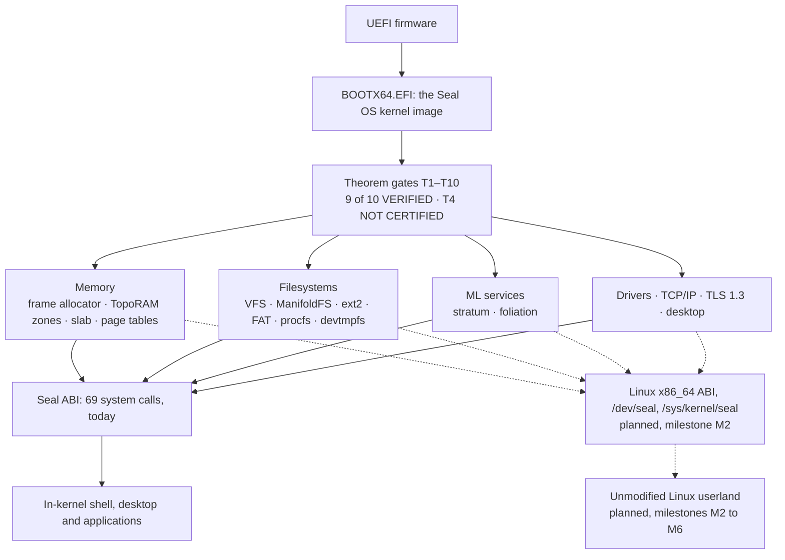
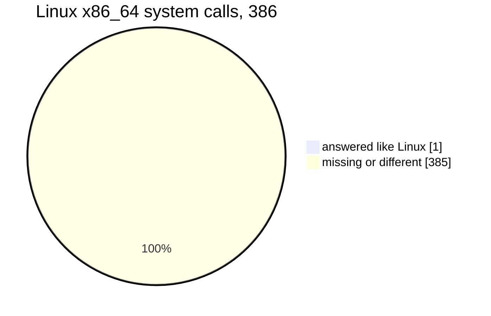
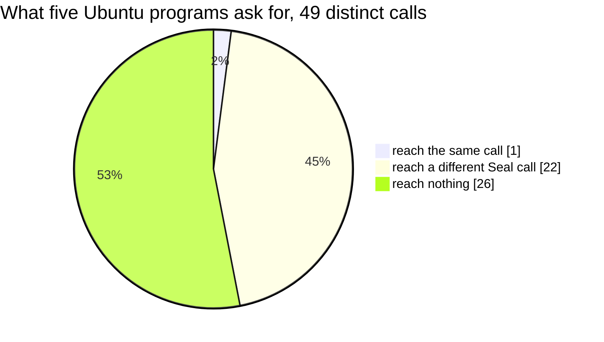
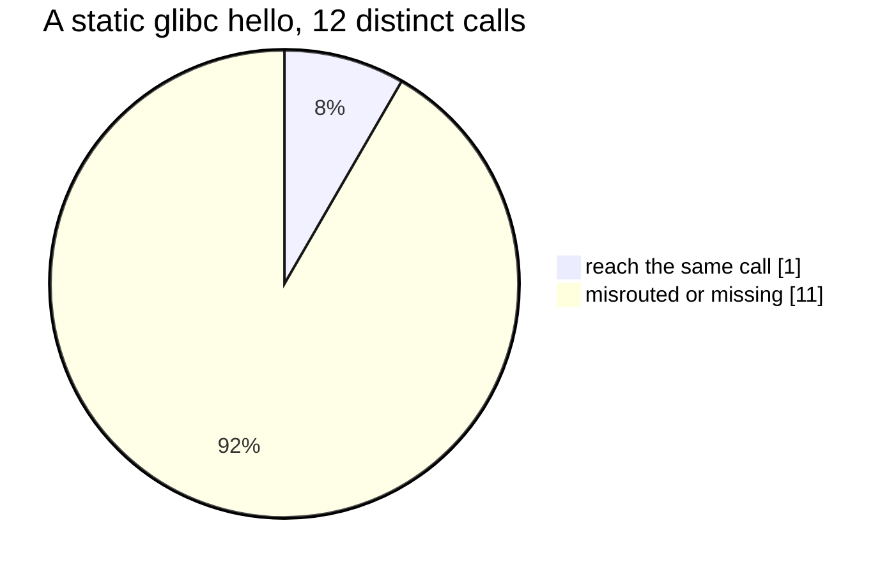
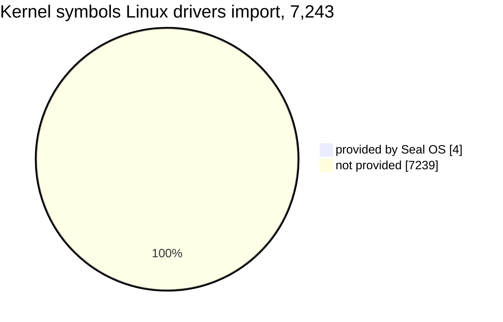
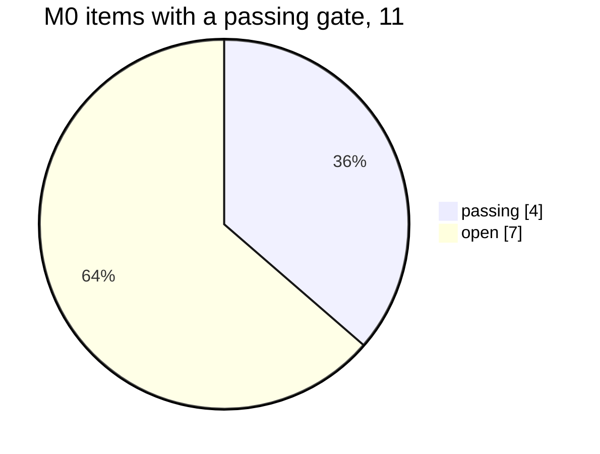

<h1 align="center">Seal OS</h1>

<p align="center"><b>A kernel that reads the shape of what it runs, and would rather say "cannot decide" than guess.</b></p>

<p align="center">A research operating system for x86_64, written in <code>no_std</code> Rust and booted through UEFI.<br>
Its state is geometry on a sphere. Its day job is machine learning. Its answers carry a certificate or a refusal.</p>

<p align="center"><sub>Invented by <b><a href="https://teerthsharma.vercel.app/">Teerth Sharma</a></b> · <a href="mailto:teerths57@gmail.com">teerths57@gmail.com</a> · <a href="https://teerthsharma.github.io/Epsilon-Hollow/">project page, every result drawn live</a></sub></p>

<p align="center">
  <a href="https://github.com/teerthsharma/Epsilon-Hollow/actions/workflows/ci.yml?query=branch%3Amain"></a>
  <a href="LICENSE"></a>
  <a href="https://doi.org/10.5281/zenodo.20264206"></a>
  <a href="#getting-started"></a>
  
  
  <a href="docs/THEOREMS.md"></a>
</p>
<p align="center">
  <a href="#certified-answers"></a>
  <a href="docs/THEOREMS.md#boot-gate"></a>
  <a href="#where-it-is-going"></a>
  <a href="#how-much-of-linux-works-today"></a>
  <a href="https://teerthsharma.github.io/Epsilon-Hollow/"></a>
</p>

---

## The idea

A conventional kernel measures its workload by quantity: resident pages, CPU time, open files, queue depth. It keeps no model of the workload's shape. To Linux, a training run is a process with a large heap and an inference server is a process with a larger one. Whether the run is converging or memorising its training set, and which prefixes a thousand live conversations share, are facts the kernel could compute and never does.

Seal OS starts from the other end. The state it manages is geometry: physical frames, files and tasks are placed on the unit sphere S² as points or small point clouds, each owned by the Voronoi cell of its nearest centroid, and placement and prefetch are read off that geometry. Its day job is machine learning. A trainer hands the kernel two numbers per step, and the kernel names the regime the run is in from the shape of its validation curve. An inference server's KV cache is a prefix tree in kernel memory that shares blocks by construction and gives memory back by collapsing leaves.

Shape is answered in integers: how many components, which k keys, which cell, whether a curve folds back on itself. Those integers are computed in floating point, and near a boundary the rounding of the arithmetic, not the data, picks the answer. Seal OS holds itself to one rule there. A discrete answer leaves the kernel with a certificate that rounding could not have changed it, or as a refusal that names the input that made it undecidable.

The rule binds the kernel's own claims as well. Boot evaluates ten theorems, T1 to T10. T4 promises that the adaptive governor converges; at the step the governor actually runs, its gain margin is 5.01 against a bound of 1, so the boot line reads `NOT CERTIFIED` and CI rejects any log that says `VERIFIED`. Until commit `3c14df0` the same theorem was certified at a step no caller uses.

## Four pillars

Each runs in the kernel today, on synthetic workloads. Validation on real models is the open work.

### `stratum`: a training run has a shape

A trainer passes `(train_loss, val_loss)` once per step through `SYS_FIT_OBSERVE` (121); `SYS_FIT_REGIME` (122) returns `Underfit`, `WellFit`, `Overfit` or `Collapsing`. The kernel sees nothing else of the model: not its weights, activations or gradients.

The test is geometric rather than a threshold. The last 64 validation losses become delay points $`p_t = (v_t, v_{t-1}, v_{t-2})`$. A run that only falls draws an open arc. A run that falls and climbs back through values it already visited draws a V, and once the scale passes $`\sqrt{8/3}`$ times the step the two arms close into loops. Overfitting is revisitation, and revisitation is a cycle. With $`\varepsilon^\ast`$ the longest edge of the window's minimum spanning tree, $`m`$ the number of points after resampling to uniform arc length, $`V`$ the vertices and $`E_\varepsilon`$ the Rips edges at scale $`\varepsilon`$, less the two-step chords a triangle already fills:

```math
\ell = \min\!\left(1,\ \frac{c(\kappa\,\varepsilon^\ast)}{m}\right), \qquad c(\varepsilon) = E_\varepsilon - V + \beta_0, \qquad \sqrt{8/3} < \kappa = 1.68 < \sqrt{3}.
```

A window that is monotone is certified $`\ell = 0`$ before any complex is built. **7 of 7** synthetic runs are classified correctly, including a healthy run with an irreducible validation gap that a train/validation gap threshold flags as overfit and `stratum` does not; each stream costs 4,792 bytes ([evidence](docs/RESULTS.md#ml-services-from-qemu-serial-proof-lines)). It has never seen a real model, and its verdict is advisory: nothing enforces it yet.

### `foliation`: an inference cache is a prefix tree

A sequence's block table is its path down a prefix tree the kernel holds, so two sequences that agree on a block-aligned prefix land on the same blocks. There is no call to share a block; appending identical tokens does it, and only an exact token match counts. Each resident block is a 4 KiB physical frame from the kernel allocator. Eviction may remove only a free face, a block that is resident, unreferenced and has no resident children, so the resident set stays a connected rooted subtree under every policy and policies differ only in which free face they pick.

The foliation policy picks the leaf fewest sequences ever entered, then the deepest, then the oldest. On a trace built so that recency always evicts the shared prefix, it reaches the Belady optimum, a **9.52 %** hit rate where LRU scores 0. On a multi-turn chat trace it loses to LRU, 52.84 % against 80.68 %, so the system-call-facing cache defaults to LRU. Both traces are synthetic, and both results are published ([evidence](docs/RESULTS.md#ml-services-from-qemu-serial-proof-lines)).

### TopoRAM and ManifoldFS: state lives on a sphere

Every physical frame carries an embedding of 16 points on S² (32 quantized angles, 64 bytes), a 64-tick access history, a Voronoi cell and a lifetime class. Memory is split into three zones, below 4 GiB, above it, and PCIe device memory, each with eight seeds; a frame belongs to the cell of its nearest seed, and spectral prefetch, entropy tracking and lifetime classes run per zone. In the boot benchmark **64 of 64** allocations land in their target cell with no fallback ([evidence](docs/RESULTS.md#microbenchmarks)).

ManifoldFS encodes a file's bytes as a point cloud on S² and files the inode in the Voronoi cell of the cloud's first point, while the bytes themselves persist through ext2. In the boot benchmark, on its mock block store, a move within ManifoldFS touches only metadata: at most 7 operations and 0 bytes of file data written, checked at every boot ([evidence](docs/RESULTS.md#boot-proofs-and-gates)). Whether this layout beats a conventional allocator or filesystem has not been measured; no comparison against Linux exists.

### Certified answers

The rule from the idea above, as implemented today. Each quantity comes back with a certificate, or with a refusal that names what made it undecidable:

| Quantity | Certified when | Otherwise |
|---|---|---|
| Component count β₀ at a scale | no merge height of the minimum spanning tree lies in a band around the scale | refuses, naming the tree edge nearest the scale |
| Attention top-k | the kept keys' rounding intervals clear every other key's (Higham's bound) | widens the row to every key the boundary touches |
| Nearest centroid on S² | the query sits farther from every cell edge than the rounding radius | scans every centroid |
| Loop score of a window that never turns back | always: monotonicity is checked exactly, before any complex is built, and the score is 0 | a window that turns is scored from its Rips complex, without a certificate |
| Underfit trend (participation ratio) | the loss varies by more than its own rounding bound | refuses with NaN, and the `Underfit` verdict is withheld |
| Rips β₁ at a scale | every edge's distance interval clears the scale | refuses, naming the undecided pair |
| T4 governor convergence | gain margin below 1 at the runtime step | refuses at boot, printing the margin and step |

For β₀ of $`n`$ points with merge heights $`h_1 \le \dots \le h_{n-1}`$, a scale $`s`$ and a band ratio $`r`$:

```math
\beta_0(X, t) = n - \#\{\,k : h_k < t\,\}, \qquad \text{certified at } s \iff h_k \notin \left[\, s/\sqrt{r},\ s\sqrt{r} \,\right] \text{ for all } k.
```

Before this rule, the nearest-centroid index answered **1,215 of 5,000** seeded queries wrongly while reporting a hit rate of 1.0000. With it, **0** are wrong; 91 queries go to a full scan and the reported rate is 0.9818 ([evidence](docs/RESULTS.md#certify-or-refuse-before-and-after)). Not every lookup follows the rule yet: ManifoldFS places files with its own cell index, `fs/voronoi_cap.rs`, which carries no certificate.

## Getting started

Seal OS builds on Linux and Windows and boots in QEMU. Every command below is the one CI runs or the one the repository's own scripts run. On 2026-09-27, steps 3 and 4 were run on Windows 11 at commit `a50b8d6` with native QEMU 11.1.0; anything not run there says so.

### 1. What you need

- **Rust** through [rustup](https://rustup.rs/): the nightly toolchain with `rust-src` and `llvm-tools-preview` for the kernel (pinned by `kernel/seal-os/rust-toolchain.toml`), and stable for the image builder and the host crates.
- **QEMU** (`qemu-system-x86_64`) and **UEFI firmware** for it (OVMF, from the EDK II project). Seal OS boots only as a UEFI application, so QEMU without the firmware boots nothing.

```bash
rustup toolchain install nightly --component rust-src --component llvm-tools-preview
rustup toolchain install stable
```

| Host | QEMU and firmware | Firmware file |
|---|---|---|
| Debian, Ubuntu | `sudo apt-get install qemu-system-x86 ovmf`, as CI does | `/usr/share/OVMF/OVMF_CODE_4M.fd` (`OVMF_CODE.fd` on older releases) |
| Other Linux | your distribution's QEMU and edk2 or OVMF package | `run-qemu.sh` also looks in `/usr/share/ovmf/`, `/usr/share/edk2/x64/` and `/usr/share/edk2-ovmf/x64/` |
| Windows | the QEMU installer from [qemu.org/download](https://www.qemu.org/download/#windows), which bundles the firmware; or Ubuntu under WSL2 with the Debian packages | `C:\Program Files\qemu\share\edk2-x86_64-code.fd` |
| macOS | not tested | not tested |

### 2. Get the code

```bash
git clone https://github.com/teerthsharma/Epsilon-Hollow
cd Epsilon-Hollow
```

### 3. Build the kernel and the disk image

```bash
cd kernel/seal-os
cargo +nightly build --release
```

This builds `target/x86_64-unknown-uefi/release/seal-os.efi` (the target and `build-std` come from `kernel/seal-os/.cargo/config.toml`, which is why the command runs from inside that directory). Then:

```bash
cd ../seal-mkimage
cargo +stable run --release
```

This writes `kernel/seal-os/target/x86_64-unknown-uefi/release/seal-os.img`, a 128 MB GPT disk with a FAT EFI System Partition holding `EFI/BOOT/BOOTX64.EFI` and a ManifoldFS partition. On the verification machine the kernel built in 1 minute 20 seconds with `rustc 1.99.0-nightly (8ab9fdff5 2026-07-30)`.

### 4. Boot it

The shortest path, from `kernel/seal-os`, opens a QEMU window and prints the serial console in the terminal; it builds the image first if none exists:

```bash
./run-qemu.sh
```

```powershell
powershell -NoProfile -ExecutionPolicy Bypass -File .\run-qemu.ps1
```

`run-qemu.sh` serves Linux and WSL2; `run-qemu.ps1` serves Windows, using native QEMU when it is installed and QEMU inside WSL2 otherwise. Neither was run interactively on the verification machine; the command below was, with the Windows firmware path and the serial log written to a file. To boot exactly as CI does, headless, from the repository root:

```bash
timeout 240 qemu-system-x86_64 -machine q35 -cpu qemu64,+rdrand \
  -drive if=pflash,format=raw,readonly=on,file=/usr/share/OVMF/OVMF_CODE_4M.fd \
  -device ahci,id=seal_sata \
  -drive if=none,id=seal_disk,file=kernel/seal-os/target/x86_64-unknown-uefi/release/seal-os.img,format=raw,media=disk \
  -device ide-hd,drive=seal_disk,bus=seal_sata.0,unit=0 \
  -nographic -m 4G -no-reboot -no-shutdown | tee /tmp/seal-os.log
```

On Windows, replace the firmware path with `C:\Program Files\qemu\share\edk2-x86_64-code.fd`. The serial console should show, among about 200 lines (these are from the verification boot):

```text
[T4/AGCR] Governor online: epsilon = 0.1000 alpha=0.01 beta=0.05 dt=0.01
[THEOREM] T1/TSS VERIFIED
[THEOREM] T4/AGCR NOT CERTIFIED: alpha+beta/dt=5.01 >= 1 at dt=0.01
[BOOT] 9 of 10 theorems VERIFIED; T4/AGCR NOT CERTIFIED; T1-T3, T5 ACTIVE in runtime paths
[execve] '/bin/init' not found; continuing with kernel desktop
[Desktop] 12 windows active (Terminal, IDE, Files, Theorems, Calculator, SealPlayer, Snake, Breakout, Warp Racer, Tensor Viewer, LAAMBA Governor, Aether App)
[BOOT] Seal OS desktop ready.
[EVENT] Entering real event loop — keyboard and mouse active
```

| Line | Meaning |
|---|---|
| `Governor online` | the governor's gains and the step every runtime caller passes; T4 is judged at exactly these values |
| `T1/TSS VERIFIED` | one of the nine theorem checks that hold; any of them failing stops the boot |
| `T4/AGCR NOT CERTIFIED` | the refusal: the gain margin is 5.01, and certifying needs less than 1 |
| `9 of 10 theorems VERIFIED` | the summary CI requires, refusal included |
| `/bin/init not found` | no user program exists on the image yet, so the kernel starts its own desktop |
| `desktop ready`, `event loop` | the boot has finished; QEMU keeps running until `timeout` stops it, which CI counts as success |

Between the theorem lines and the desktop, the `[MLFIT] proof` and `[KVPOLICY] proof` lines replay `stratum` and `foliation` on their synthetic traces; the verification boot printed `correct=7/7`, `hit_bp_foliation=952`, `hit_bp_lru=0` and `chat_hit_bp_lru=8068`, the values recorded in docs/RESULTS.md.

### 5. Try something

The desktop opens with the SealShell terminal and a ManifoldFS browser, which draws the sphere in stereographic projection with its eight Voronoi cells marked and lists each file with its point count and cell. Click the terminal to focus it. The shell's handbook (`help`) lists every command; a few that show the idea, read from `kernel/seal-os/src/apps/shell.rs`:

| Command | What it shows |
|---|---|
| `write notes.txt hello sphere` | stores a file in ManifoldFS |
| `info notes.txt` | how many points on S² the file became, and its Voronoi cell |
| `peek notes.txt \| grep -i sphere` | the file through a pipeline |
| `seal` | the theorem status as ManifoldFS reports it |
| `stats`, `memory`, `ml status` | ManifoldFS counters, heap use, the in-kernel ML runtime |

The desktop, the terminal and the ManifoldFS browser were seen on the verification boot, and the mouse moved focus between windows. Typing was not verified on that machine: keystrokes injected through the QEMU monitor did not reach the terminal.

### 6. Run the checks

Host crates, on the stable toolchain. This does not compile the kernel, which is outside the Cargo workspace:

```bash
cargo test --workspace
```

The kernel's own tests run inside QEMU. On Linux, this builds the `test-mode` kernel, boots it and prints `ALL TESTS PASSED` when every registered in-kernel test passes:

```bash
scripts/test_kernel.sh
```

The serial log from step 4 goes through the same gates CI runs:

```bash
gate() { cargo +stable run --manifest-path kernel/seal-mkimage/Cargo.toml --release -- "$@"; }
gate --check-theorem-log /tmp/seal-os.log
gate --check-kv-policy /tmp/seal-os.log
gate --check-mlfit-proof /tmp/seal-os.log
gate --check-fs-parity /tmp/seal-os.log
gate --check-benchmark-log /tmp/seal-os.log
```

The Linux-replacement starting point is a set of host-runner checks under [tests/linux_parity/](tests/linux_parity/), plus the QEMU scripts `chase_boot.sh` and `cameron_qemu_milestone.sh` beside them. Most fail by design: each is the gate for an open item, and it turns green when that item lands.

```bash
python -m pytest tests/linux_parity -q   # host runner; see CONTRIBUTING.md, Linux-parity gates
```

### 7. Where to go next

- [CONTRIBUTING.md](CONTRIBUTING.md): a failing test first, then the change; every theorem line certified, refused or not checked.
- [FUTURE_PLAN.md, Phase 0](FUTURE_PLAN.md#phase-0-linux-kernel-replacement): each open M0 item names its gate. Pick one.
- [PORTING.md](PORTING.md): bring in upstream kernel code under `ports/`, pinned by hash and licence-gated.
- [docs/design/LINUX-REPLACEMENT.md](docs/design/LINUX-REPLACEMENT.md): the plan every milestone follows.

### 8. Troubleshooting

- **`cargo test --workspace` passes but tested no kernel code.** `kernel/seal-os` is in the workspace `exclude` list. Its tests run only in a `test-mode` image under QEMU (`scripts/test_kernel.sh`); `cargo +nightly test --lib` in the kernel crate is not a kernel test ([kernel/seal-os/TESTING.md](kernel/seal-os/TESTING.md)).
- **Clippy on the kernel fails with thousands of errors.** Run it from inside `kernel/seal-os`, where `.cargo/config.toml` applies, and without `--all-targets`, which pulls in a host test target the kernel cannot build: `cargo +nightly clippy --release --target x86_64-unknown-uefi` ([docs/PARITY-ROADMAP.md](docs/PARITY-ROADMAP.md)).
- **QEMU starts and nothing boots.** The firmware path is wrong or missing; the file name differs by distribution and version (table in step 1).
- **The `[SECURITY-FEATURES]` line reads `result=fail`.** The CPU model lacks RDRAND, so KASLR has no entropy (`kaslr=0`). CI passes `-cpu qemu64,+rdrand`; `run-qemu.sh` and `run-qemu.ps1` do not.
- **A change does not show up at boot.** `run-qemu.sh` builds the image only when none exists. Rebuild with step 3. Boot with `-m 4G`, the memory CI uses.
- **`run-qemu.ps1 -HeadlessProof` fails with `screen.ppm missing or empty`.** Seen on the verification machine with native QEMU 11.1.0: the boot reached `Seal OS desktop ready.`, but the screenshot was not written. The serial log in the run directory under `target/x86_64-unknown-uefi/release/qemu-proof-runs/` is complete.

## How it fits together

Seal OS is a monolithic kernel: drivers, filesystems, the network stack, the desktop and its applications compile into one EFI image.


```mermaid
flowchart TD
    fw["UEFI firmware"] --> img["BOOTX64.EFI: the Seal OS kernel image"]
    img --> gates["Theorem gates T1–T10<br/>9 of 10 VERIFIED · T4 NOT CERTIFIED"]
    gates --> mem["Memory<br/>frame allocator · TopoRAM zones · slab · page tables"]
    gates --> fs["Filesystems<br/>VFS · ManifoldFS · ext2 · FAT · procfs · devtmpfs"]
    gates --> ml["ML services<br/>stratum · foliation"]
    gates --> dev["Drivers · TCP/IP · TLS 1.3 · desktop"]
    mem & fs & ml & dev --> abi["Seal ABI: 69 system calls, today"]
    abi --> apps["In-kernel shell, desktop and applications"]
    mem & fs & ml & dev -.-> lnx["Linux x86_64 ABI, /dev/seal, /sys/kernel/seal<br/>planned, milestone M2"]
    lnx -.-> user["Unmodified Linux userland<br/>planned, milestones M2 to M6"]
```

The surrounding workspace supplies the mathematics and the tooling: `aether-core` (certified β₀, certified top-k, trajectory shape, spherical Voronoi indices), `aether-verified` (the theorem kernels and their Lean 4 sources), Aether-Lang (a scripting language whose `no_std` runtime the kernel embeds) and `seal-mkimage` (the disk-image builder and every boot-log gate). Repository-wide line count, rewritten on each push to `main`:

<!-- RUST_LINE_COUNT_START -->
**189926 lines of Rust** across 507 files | 0 lines of x86 assembly | 1823 lines of Aether-Lang DSL | **191749 total**
<!-- RUST_LINE_COUNT_END -->

## Where it is going

Seal OS is to stand where Linux stands: boot under any Linux distribution as that distribution's kernel, run its userland unmodified, keep its bootloader and initrd tooling working, use its drivers, and port whatever it cannot yet build. This is the accepted plan, [docs/design/LINUX-REPLACEMENT.md](docs/design/LINUX-REPLACEMENT.md). Seven decisions carry it: the Linux x86_64 system-call ABI as the only ABI; the Linux boot protocol; Linux drivers running unmodified inside isolated driver servers; ext4 behind a crash-consistency gate that a stock Linux kernel replays; the geometric subsystems kept, under Linux permissions; progress counted by the Linux Test Project; and pinned, licence-gated ports for whatever is not built natively.

The geometry stays. Under Linux semantics the sphere-based task picker chooses only among tasks Linux makes eligible, `manifold_acl` becomes an audit layer that never denies what Linux permits, and `stratum`, `foliation` and ManifoldFS are reached through `/dev/seal` and `/sys/kernel/seal/`.

Every milestone gate is a QEMU test that fails today, and a box is ticked only when its gate passes:

| | Milestone | Gate | Status |
|---|---|---|---|
| M0 | Substrate and safety: ring 3 runs, a safe system-call entry, user faults kill the process, kernel W^X | `chase_boot.sh usermode-seal`, `wx`, `ext4`; `cameron_qemu_milestone.sh ring3-seal` | **In progress: 4 of 11 items pass** |
| M1 | Process model: address spaces, page cache, file-descriptor tables | a boot-executed test per item | open |
| M2 | Linux ABI core: renumbering, six-argument dispatch, auxv, `execve`, `futex`, `clone` | a static glibc `hello` prints; busybox `sh` runs a script | open |
| M3 | Linux boot protocol, EFI stub, initramfs | GRUB loads Seal OS as `linux` and reaches a busybox prompt | open |
| M4 | Dynamic userland without systemd | Alpine boots to a login prompt | open |
| M5 | ext4 with jbd2 | the crash-consistency gate | open |
| M6 | systemd distributions | Debian, Ubuntu, Fedora and Arch boot to login | open |
| M7 | ACPICA, ECAM, MSI, IOMMU, LKL driver servers | an unmodified Linux driver behind a virtual IOMMU | open |
| M8 | Bare metal | one reference machine boots a distribution to login | open |

The plan needs people who know Linux. Start from [CONTRIBUTING.md](CONTRIBUTING.md) and an unticked box in [FUTURE_PLAN.md, Phase 0](FUTURE_PLAN.md#phase-0-linux-kernel-replacement); upstream code enters through [PORTING.md](PORTING.md).

## How much of Linux works today

A Linux program cannot touch the world by itself. To open a file, print a line or start a thread it asks the kernel, and each kind of request has a number: read is 0, write is 1, open is 2, and so on through 386 of them on x86_64. A kernel covers Linux to the degree that it answers those numbered requests the way Linux does. Today Seal OS answers almost none of them that way, and no Linux program runs on it yet; no instruction has executed in user mode at all.

The counts come from the checks under [tests/linux_parity/](tests/linux_parity/), which fail today by design, and from the Phase 0 boxes in [FUTURE_PLAN.md](FUTURE_PLAN.md#phase-0-linux-kernel-replacement). They were taken at commit `a50b8d6`; every source is in [docs/RESULTS.md](docs/RESULTS.md#linux-coverage-counted).


```mermaid
pie showData
    title Linux x86_64 system calls, 386
    "answered like Linux" : 1
    "missing or different" : 385
```

Only `write`, number 1, means the same call in both tables. Linux count from `syscall_64.tbl` at Linux 7.3.0-rc4; Seal numbering in [kernel/seal-os/src/syscall/table.rs](kernel/seal-os/src/syscall/table.rs).


```mermaid
pie showData
    title What five Ubuntu programs ask for, 49 distinct calls
    "reach the same call" : 1
    "reach a different Seal call" : 22
    "reach nothing" : 26
```

`cat`, a shell pipeline, a static hello, `systemd --version` and `true`, traced on Ubuntu 26.04. A request that lands on a different Seal call is worse than one that lands on nothing: `getgid` reaches Seal's package-removal call.


```mermaid
pie showData
    title A static glibc hello, 12 distinct calls
    "reach the same call" : 1
    "misrouted or missing" : 11
```

The smallest real Linux binary, built with `gcc -static`, makes 12 distinct calls before it prints; one of them is answered the Linux way.


```mermaid
pie showData
    title Kernel symbols Linux drivers import, 7,243
    "provided by Seal OS" : 4
    "not provided" : 7239
```

Seal OS provides 4 of the 7,243 kernel symbols that 480 Linux driver modules import. The plan does not chase this number: Linux drivers are to run unmodified inside separate driver servers built from the Linux kernel as a library (decision D3), so this chart shows why that decision was taken, not a target.


```mermaid
pie showData
    title M0 items with a passing gate, 11
    "passing" : 4
    "open" : 7
```

Passing: kernel W^X, ext2 feature refusal, the privilege check on package removal, and `ports/` with its contributor documents. Milestones passed: **0 of 9**. Distributions that boot on Seal OS: **0**.

## Status and limits

What runs today: the UEFI image boots under QEMU (q35, OVMF, an AHCI disk, 4 GiB), evaluates the ten theorem lines, brings up its drivers, mounts ManifoldFS from disk, starts the network stack and the desktop, and replays the `stratum` and `foliation` proofs. CI boots every build this way and checks each proof line.

What does not, in brief:

- No instruction has executed in user mode, no task is ever scheduled, and the system-call entry is not yet safe to use from ring 3.
- The ML services have only seen synthetic traces, and `foliation` loses to LRU on the chat trace.
- Hardware coverage is one QEMU configuration; the GPU path has run only on its CPU fallback.
- No performance comparison against Linux or Ubuntu has been run; every cycle count is from QEMU's emulator.
- The Lean files prove algebraic side lemmas; no Lean statement is connected to kernel code.
- CI is red: after the proof-line checks, its QEMU job fails at the language-hygiene gate on `scripts/ci_parity.sh`, and the source gates after it do not run.

Every measured number, its provenance, the prior art, the theory and the full list of limits are in [docs/RESULTS.md](docs/RESULTS.md).

## Documentation

| Document | What it holds |
|---|---|
| [docs/RESULTS.md](docs/RESULTS.md) | Every measured result with its provenance, prior art, the theoretical foundation, results imported from related work, and the full limits |
| [docs/THEOREMS.md](docs/THEOREMS.md) | T1 to T10: what each boot line checks, its status at runtime inputs, and the strength of its Lean proof |
| [docs/design/LINUX-REPLACEMENT.md](docs/design/LINUX-REPLACEMENT.md) | The accepted plan: starting point, decisions D1 to D7, milestone gates, reversibility |
| [FUTURE_PLAN.md](FUTURE_PLAN.md) | Every open item as a checkbox, ticked only when its gate passes |
| [CONTRIBUTING.md](CONTRIBUTING.md), [PORTING.md](PORTING.md) | How to contribute a change or a port |
| [kernel/seal-os/ARCHITECTURE.md](kernel/seal-os/ARCHITECTURE.md), [kernel/seal-os/TESTING.md](kernel/seal-os/TESTING.md), [docs/CI.md](docs/CI.md) | Kernel structure, the proof path, every CI job |
| [docs/RECORD.md](docs/RECORD.md) | The development record before 2026-09-27 |
| [Project page](https://teerthsharma.github.io/Epsilon-Hollow/) | Every certify-or-refuse result drawn as a live figure |

| Path | Contents |
|---|---|
| `kernel/seal-os/` | The kernel |
| `kernel/seal-mkimage/` | Disk-image builder and every `--check-*` gate |
| `kernel/epsilon/epsilon/crates/` | `aether-core` (the mathematics), `epsilon` and `epsilon-os` (a host-side model of ManifoldFS) |
| `kernel/aether/` | `aether-verified` (Rust and Lean 4), the Aether-Lang crates, `aether-link` |
| `ports/` | Upstream kernel code Seal OS uses where it has no native implementation, one pinned `PORT.toml` per port |
| `tests/linux_parity/`, `tests/ports/` | The Linux-replacement gates and the port licence gate |

## Citation and license

Cite with [CITATION.cff](CITATION.cff) or DOI [10.5281/zenodo.20264206](https://doi.org/10.5281/zenodo.20264206). Released under the MIT License ([LICENSE](LICENSE)); the tree contains no GPL code, and `deny.toml` bans copyleft licences except LGPL-3.0 for the transitive `wav` crate. Security reports: [SECURITY.md](SECURITY.md).

Invented by Teerth Sharma, https://teerthsharma.vercel.app/
