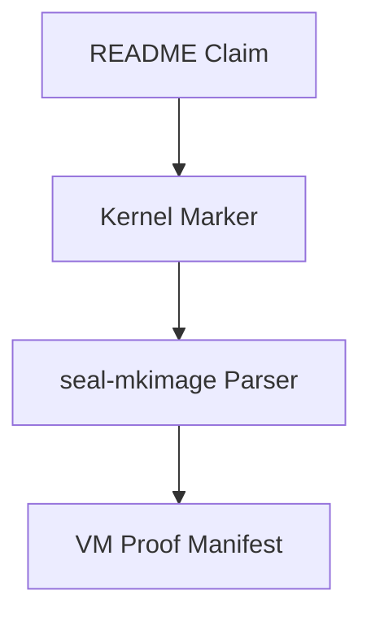

# README Bible Rebuild 50 Agents Implementation Plan

> **For agentic workers:** REQUIRED SUB-SKILL: Use superpowers:subagent-driven-development (recommended) or superpowers:executing-plans to implement this plan task-by-task. Steps use checkbox (`- [ ]`) syntax for tracking.

**Goal:** Rebuild the README into a precise one-person research OS bible with zero unowned pain points and every claim tied to code, proof, or honest scope.

**Architecture:** The README becomes an indexed proof ledger. Each section has one doc agent, one proof source, one acceptance command, and one reviewer. No agent may improve tone by weakening truth; no agent may improve truth by making the README ugly.

**Tech Stack:** Markdown, Rust proof gates, `seal-mkimage` doc contracts, Mermaid, QEMU/VirtualBox proof manifests, GitHub Actions, Aether-Lang, Lean theorem docs.

---

## README Rebuild Parameters

| Parameter | Value |
|---|---|
| Primary file | `README.md` |
| Supporting docs | `docs/CI.md`, `docs/BENCHMARK_PLAN.md`, `docs/THEOREMS.md`, `docs/VM_RUNBOOK.md`, `docs/SEAL_OS_GUIDE.md`, `docs/GPU_ACCELERATION.md`, `docs/MANIFOLDPKG.md`, `docs/CRYPTO_AUDIT.md` |
| Tone | first person singular: `I`, not `we`, when describing the independent researcher story |
| Proof language | claim -> source file -> marker/checker -> command -> status |
| Mermaid rule | every Mermaid graph must render with quoted labels when punctuation appears |
| Forbidden doc behavior | fake certainty, hidden gaps, vague next steps, broken numbering, broad Ubuntu win claims without artifacts |
| Maximum read-only parallelism | 50 agents |
| Maximum README write parallelism | 1 agent; other doc agents submit section patches |
| Verification | `cargo +stable run --manifest-path kernel\seal-mkimage\Cargo.toml -- --check-doc-claim-contract .`; `cargo +stable run --manifest-path kernel\seal-mkimage\Cargo.toml -- --check-language-hygiene .`; `rg -n "benchmark pending|raw Ubuntu artifact pending|out of scope|△|✗" README.md docs` |

## README Section Contract

Every section must answer five questions:

1. What exists today?
2. What proof shows it exists?
3. What exact command checks the proof?
4. What remains outside the proof?
5. Which agent owns the next proof gate?

## 50 README Agents

| Agent | Section Owned | Exact Work | Evidence Source | Acceptance |
|---:|---|---|---|---|
| 01 | Opening identity | Rewrite top summary as one-person independent researcher statement | README intro, git line counts | first-person singular, no team voice |
| 02 | Version status | Align version `0.4.6` surfaces | `README.md`, `kernel/seal-os/src/lib.rs`, release docs | all version text agrees |
| 03 | Claim ledger | Create proof-ledger table with claim/source/gate/status | `kernel/seal-mkimage/src/main.rs` | every ✓ has command |
| 04 | Pain ledger | List every remaining cliff with owner and next marker | README pain rows | no orphan cliff |
| 05 | Theorem summary | Explain T1-T10 runtime vs formal strength | `docs/THEOREMS.md`, Lean files | no equal-strength overclaim |
| 06 | T1 section | Map T1 to memory/fs/scheduler callsites | `--check-runtime-theorems` | source paths named |
| 07 | T2 section | Map T2 to scheduler/render spectral paths | kernel sources | exact functions named |
| 08 | T3 section | Map T3 to ManifoldFS/render mesh integrity | kernel sources | proof strength scoped |
| 09 | T4 section | Map T4 to governor/quality/thermal | kernel sources | boot marker named |
| 10 | T5 section | Map T5 to hyperbolic projection/render | `topo_render.rs` | render marker named |
| 11 | T6-T10 section | Separate boot-verified world-model theorems from runtime callsites | theorem logs | no runtime claim without callsite |
| 12 | Memory chapter | Rewrite allocator claims with bounded probe facts | memory modules and markers | O(1) rows cite marker fields |
| 13 | TopoRAM chapter | Explain target-cell allocation and fallback counters | `[BENCH] toporam-alloc` | fallback fields listed |
| 14 | Contiguous allocation chapter | State capped 64-page truth | allocator proof | no all-sizes claim |
| 15 | COW/KPTI chapter | Tie security memory proof to exact markers | `[MM] cow-proof`, `[SECURITY] hardening proof` | exact invariants listed |
| 16 | Scheduler chapter | Separate selector proof from context-switch proof | scheduler marker | context switch remains owned |
| 17 | Signals chapter | Validate signal claims against code | `process/signal.rs` | missing proof gets owner |
| 18 | Filesystem chapter | Explain ManifoldFS teleport and lookup proofs | `[BENCH] manifold-*` | mock-block scope visible |
| 19 | File parity chapter | Map FAT/ext2 parity gap | fs modules, doc contract | next fixture named |
| 20 | Lypnos chapter | Scope lock/unlock crypto claims | `README.md`, `docs/CRYPTO_AUDIT.md` | AEAD/KDF gap named |
| 21 | Package chapter | Explain `.eph` local package proof and public channel gap | `[ManifoldPkg] proof` | registry gap named |
| 22 | Storage chapter | Keep AHCI proven, NVMe pending | AHCI/NVMe sources | no fake NVMe win |
| 23 | NVMe chapter | Define honest QEMU NVMe proof requirements | NVMe scout evidence | device args and scratch LBA named |
| 24 | Network chapter | Separate TCP demux/roundtrip proof from external network | TCP/TLS markers | external matrix owned |
| 25 | TLS chapter | Scope PSK record proof and PKI/ECDHE gap | `tls.rs`, `[BENCH] tls-encrypt` | no public HTTPS claim |
| 26 | Graphics chapter | Add 3D and tensor render proof language | render markers | software/offscreen scope visible |
| 27 | Desktop chapter | Explain desktop proof and timeout cliff | QEMU serial, desktop markers | 240 s target named |
| 28 | GPU chapter | Keep CPU fallback and hardware gap exact | `[GPU-BENCH]`, GPU docs | no hardware dispatch claim |
| 29 | VRAM chapter | Define VRAM teleport proof contract | GPU/memory docs | GART/BAR proof required |
| 30 | Aether chapter | Present Aether-Lang as OS language with proof map | Aether runtime marker | builder gaps named |
| 31 | LAAMBA chapter | Explain governor app as native kernel app | `[LAAMBA] app proof` | no legacy host-runtime claim |
| 32 | Apps chapter | Inventory daily-driver apps and proof level | app modules | each app has status |
| 33 | Shell chapter | Map shell commands to proof status | `apps/shell.rs` | command matrix owner |
| 34 | IDE chapter | Align IDE completion claim with contract | `seal_ide.rs`, checker | no completion hype without marker |
| 35 | ML chapter | Separate tensor render proof from ML training proof | `ml_engine.rs`, tensor marker | training benchmark owned |
| 36 | HFT chapter | Keep Ubuntu comparison honest | benchmark plan | raw Ubuntu artifact condition visible |
| 37 | VM chapter | QEMU and Oracle support truth | VM runbook, proof manifests | no universal VM claim |
| 38 | CI chapter | Explain hard gates and fail conditions | `docs/CI.md` | marker numbering correct |
| 39 | Security chapter | Threat model, unsafe inventory, entropy | threat/security docs | audit owners named |
| 40 | Crypto chapter | TLS, random, Lypnos crypto | crypto audit | production gaps named |
| 41 | Build chapter | Rust/Aether/Lean build surfaces | build docs | no host-language confusion |
| 42 | Language hygiene chapter | Explain legacy host-script quarantine and Rust/Aether surface | language hygiene checker | no production host-script claim |
| 43 | Mermaid agent | Fix every broken Mermaid diagram | README diagrams | Mermaid render-safe syntax |
| 44 | Tables agent | Fix broken numbering and wide tables | README, docs/CI | no duplicate numbering |
| 45 | Anti-slop agent | Remove hype that lacks proof | README | vivid but exact prose |
| 46 | Line-count agent | Add honest Rust/Aether/Lean line counts | `git ls-files`, `Measure-Object` | counts tied to command |
| 47 | One-man-army agent | Add independent researcher narrative without fake team claim | README intro/history | `I` language present |
| 48 | Proof index agent | Add appendix of all serial markers | mkimage marker list | every marker indexed |
| 49 | Cross-link agent | Add doc links from every big claim | docs folder | links valid by path |
| 50 | Final bible integrator | Merge all section patches into one README | all agent reports | doc gates pass |

## Exact Agent Prompt

Use this prompt for all 50 README agents:

```text
You own Agent <NN> in docs/superpowers/plans/2026-06-03-readme-bible-rebuild-50-agents.md.
Read only unless explicitly promoted to writer.
No host scripts. Use rg and PowerShell.
Return:
1. current README lines for your section,
2. exact source files proving or disproving each claim,
3. exact text patch you recommend,
4. proof command that must pass,
5. one sentence naming what remains outside proof.
Do not invent success. If evidence is missing, say the claim must stay △ or be narrowed.
```

## README Write Sequence

- [ ] **Step 1: Gather 50 section reports**

Run agents 01-50 read-only.

Expected: 50 reports with exact line references and patch text.

- [ ] **Step 2: Build proof index before prose**

Create a local integration note with rows:

```text
claim=<claim>
source=<file.rs>
marker=<serial marker or checker>
command=<verification command>
status=proved|scoped|open
owner_agent=<NN>
```

Expected: every README claim maps to one row.

- [ ] **Step 3: Rewrite the opening**

Use first-person singular:

```markdown
I built Seal OS as a one-person research operating system: a topology-first, bare-metal Rust kernel where the README is not marketing copy. It is the claim ledger. If a claim has no proof gate, I mark it as open and assign the next gate.
```

Expected: no `we built` voice in the identity section.

- [ ] **Step 4: Replace broad adjectives with proof nouns**

Use this transformation rule:

```text
"faster than Ubuntu" -> "faster than the validated Ubuntu artifact for this row"
"GPU native" -> "GPU path exists as CPU fallback unless hardware_dispatch=1 proof exists"
"fully working" -> "boot proof reaches <exact marker list>"
```

Expected: README remains ambitious but does not lie.

- [ ] **Step 5: Fix Mermaid diagrams**

Every Mermaid node with punctuation must be quoted:



Expected: diagrams render in GitHub.

- [ ] **Step 6: Fix marker numbering**

Generate numbering from the current `check_theorem_log` required marker order. Do not handwave; compare against `kernel/seal-mkimage/src/main.rs`.

Expected: README and `docs/CI.md` use the same order.

- [ ] **Step 7: Add zero-pain owner table**

Add a table:

```markdown
| Pain | Current Status | Owner Agent | Next Proof Gate | Pass Command |
|---|---|---:|---|---|
| Context switch | Open | 06 | `[BENCH] context-switch` | `cargo test --manifest-path kernel\seal-mkimage\Cargo.toml` plus QEMU proof |
```

Expected: no open pain lacks owner.

- [ ] **Step 8: Verify README gates**

Run:

```powershell
cargo +stable run --manifest-path kernel\seal-mkimage\Cargo.toml -- --check-doc-claim-contract .
cargo +stable run --manifest-path kernel\seal-mkimage\Cargo.toml -- --check-language-hygiene .
rg -n "benchmark pending|raw Ubuntu artifact pending|out of scope|△|✗" README.md docs
```

Expected: doc gates pass; search output only shows intentionally owned open cliffs with owner and next gate.

- [ ] **Step 9: Commit bible-only patch**

Run:

```powershell
git add README.md docs\CI.md docs\BENCHMARK_PLAN.md docs\THEOREMS.md docs\VM_RUNBOOK.md docs\SEAL_OS_GUIDE.md docs\GPU_ACCELERATION.md docs\MANIFOLDPKG.md docs\CRYPTO_AUDIT.md
git commit -m "docs(readme): rebuild proof ledger"
git push origin feat/seal-os-complete-2026-06-03
```

Expected: docs-only commit unless proof code changed in the same wave and already passed verification.

## Section Patch Standards

Every agent patch must obey this shape:

```markdown
### <Section Name>

**What is real now:** <one paragraph with exact proof marker>

**Proof command:** `<exact command>`

**Still open:** <one paragraph with owner agent and next gate>
```

Expected: reader can tell truth from dream in 10 seconds.

## Final README Acceptance Bar

README has zero pain when:

- every open cliff has owner, proof gate name, and pass command;
- every ✓ has source and checker evidence;
- every △ states why it is not ✓ yet;
- every ✗ has either a deletion plan or a proof owner;
- every Mermaid diagram renders;
- every marker list matches `seal-mkimage`;
- every Ubuntu comparison is row-scoped and artifact-bound;
- every first-person research claim is proud but not fake;
- `--check-doc-claim-contract` passes;
- `--check-language-hygiene` passes.

## Self-Review

- Spec coverage: 50 agents cover README identity, proof ledger, theorem core, memory, scheduler, storage, filesystem, network, graphics, GPU, Aether, LAAMBA, security, package, userland, ML/HFT, VM, CI, Mermaid, tables, and final integration.
- No fake finish: the plan allows open cliffs, but none may be ownerless or vague.
- Type consistency: marker names and commands match the runtime proof plan.
