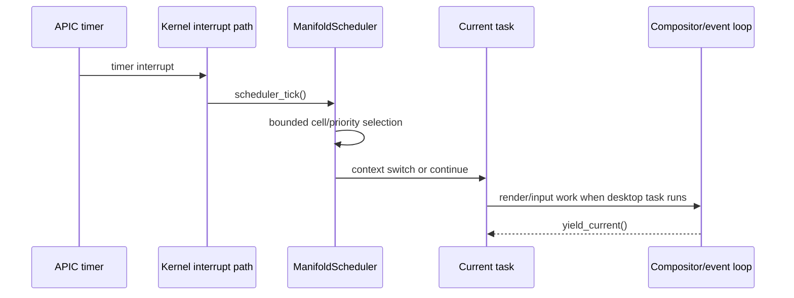

# Boot and Runtime

This page is the operational trace of the current Seal OS boot path. The
authoritative integration code is `kernel/seal-os/src/lib.rs`.

## Entry and state capture

The UEFI entry code is under `kernel/seal-os/src/boot/`. It receives firmware
memory and GOP information, obtains the loaded image range and ACPI RSDP, and
constructs `BootInfo`. `kernel_main` copies that value to the kernel-owned
`BOOT_INFO` static before allocator initialization can reclaim the firmware
stack pages holding the original value.

That copy is not cosmetic: the physical allocator begins making reuse
decisions immediately afterward.

## Initialization sequence

| Phase | Code | Main responsibility | Observable evidence |
| --- | --- | --- | --- |
| 1. Kernel banner | `kernel_main` | Print version and architecture contract | `Seal OS v0.4.7.5` |
| 2. Memory bootstrap | `memory::init`, `phys::init_high` | Heap, memory map, reserved ranges, virtual memory prerequisites | `Heap initialized` |
| 3. Topology metadata | `topo_ram::init` | Attach frame metadata and initialize bounded allocation indexes | `[ALLOC] O(1) proof`, allocator benchmarks |
| 4. SMP | `cpu::smp::smp_init` | Per-CPU state and secondary processor bring-up | `SMP initialised` |
| 5. Firmware hardware | `drivers::acpi::init` | ACPI tables and APIC topology | `ACPI init done` |
| 6. Security | `security::init_security` | SMAP/SMEP, MAC, and audit initialization | `Security subsystem initialised` |
| 7. Interrupts/time | `drivers::interrupts`, RTC, APIC, watchdog | IDT/PIC, clock/timer, watchdog | `IDT + PIC initialized`, `Watchdog initialized` |
| 8. Syscall entry | `process::userspace::init_syscall_msrs` | Program SYSCALL/SYSRET MSRs | `SYSCALL/SYSRET MSRs programmed` |
| 9. Entropy | `drivers::entropy::init` | RDRAND/RDSEED-backed entropy path where available | `Entropy driver initialised` |
| 10. Runtime branch | `boot_graphical` or `boot_serial` | Continue with the framebuffer desktop or serial-only path | framebuffer or serial branch marker |

The exact log text is part of the VM proof contract. If a marker changes, update
the verifier and documentation together; do not silently loosen the gate.

## Graphical path

When `BootInfo` contains a framebuffer address, the kernel initializes the
framebuffer and back buffer, then enters `boot_graphical`.

The graphical path performs the following ordered work:

1. Run `init_theorems` before UI waits or optional device probing can obscure a
   theorem failure.
2. Initialize drivers and the VFS so authentication files can be read.
3. Initialize swap and emit copy-on-write, audit, shadow, and group proof
   markers.
4. Render the login screen and accept keyboard input. The current code also
   has a bounded auto-login path for unattended VM tests.
5. Optionally launch the installer when the installer key is pressed.
6. Run and persist the first-boot welcome state when applicable.
7. Render the splash, initialize the compositor/window manager, and start the
   desktop/event-loop path.

The desktop is a kernel-resident rendering and window-management path. It is
not a separate user-space graphical server. The relevant code is split between
`graphics/`, `wm/`, and `apps/`.

## Serial path

If no framebuffer is available, `boot_serial` skips graphical rendering but does
not skip the core system. It calls, in order:

```text
init_theorems
init_scheduler
init_manifold_pkg
init_aether_lang
init_drivers
fs::init_vfs
swap initialization
USB initialization
prefetch initialization
async runtime initialization
game initialization
```

It then emits `[BOOT] All layers initialized. Seal OS ready.` and remains in
the halt loop. QEMU's `-nographic` lane uses this serial observability path.

## Theorem gate behavior

`init_theorems` calls `verify_topology_theorems` and stores one boolean per
theorem in `THEOREM_STATES`. It also initializes the geometric governor and
performs a test lookup in an eight-cell spherical Voronoi index. A false theorem
result causes a panic:

```text
Seal OS theorem core failed boot verification
```

The boot summary states that all ten are verified while only T1-T5 are active
in runtime paths. This is intentional. It distinguishes “the boot certificate
passed” from “the theorem controls a live hot path.”

## Scheduler startup

The integration root starts the scheduler and creates three kernel tasks:

| Task | Priority | Current role in source |
| --- | ---: | --- |
| `kernel` | 10 | Housekeeping, including swap daemon and health work |
| `compositor` | 8 | Compositor refresh loop |
| `shell` | 5 | Shell input processing |

The task bodies currently yield through the scheduler. Their existence proves
task creation and scheduling integration; it is not evidence that every future
desktop operation has been moved out of the kernel thread.

## Storage startup and persistence

`init_drivers` probes CPU, PCI, AHCI, disk, Wi-Fi, Bluetooth, GPU, NVMe, HDA,
xHCI, and network layers. Some optional probes log failure and continue. The
VFS is initialized after the storage driver path, and the proof runbook requires
the current VM image to show a readable disk identity and persistent ManifoldFS
mount rather than silently accepting a ramfs fallback.

For QEMU, the storage evidence includes the AHCI model, block-device
registration, sector-zero read, and VFS mount markers. See
[`VM_RUNBOOK.md`](VM_RUNBOOK.md) for the exact command and gate.

## Aether runtime probe

The graphical path can load a small Aether script through the app host. The
expected marker is:

```text
[Aether-Lang] runtime proof: parser=ok interpreter=ok app_host=ok script=aether_boot_probe result=seal-topology-ok
```

This marker proves a parser → interpreter → app-host path for the fixture. It
does not certify the entire Aether language, all callbacks, or every script in
the repository.

## Normal runtime loop



Interrupt-driven work and voluntary yields are separate paths. A task that
calls `yield_current` while no regular task is current returns instead of
switching away forever; this protects the boot thread from being lost before it
has entered the scheduler.

## Reading a failed boot

Use the first missing hard marker, not the last line printed:

| First missing area | Inspect |
| --- | --- |
| Banner or heap | UEFI entry, memory map, target/toolchain, relocation |
| IDT/APIC/syscall markers | `drivers/interrupts.rs`, `drivers/apic.rs`, `process/userspace.rs` |
| Theorem lines | `aether_verified`, `verify_topology_theorems`, input constants |
| AHCI/disk/VFS | `drivers/block/ahci.rs`, `drivers/disk`, `fs::init_vfs` |
| Desktop proof frame | framebuffer, renderer, compositor, GOP mode |
| Event-loop or soak marker | task startup, input polling, watchdog, compositor path |

Do not convert a timeout into a success by increasing the timeout. First prove
that the image reached the previous required milestone.
