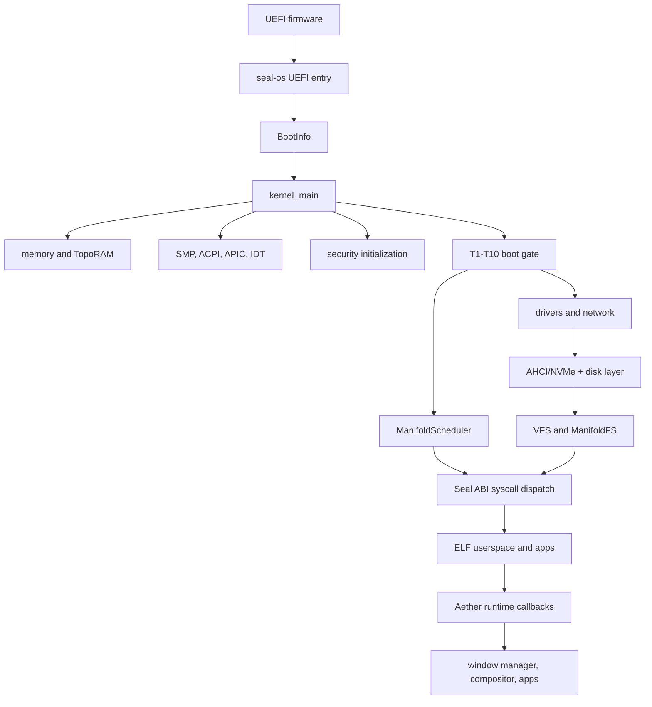

# Epsilon Hollow System Documentation

This is the repository-level documentation for Epsilon Hollow. It describes
the code that is actually present in this checkout: the standalone bare-metal
Seal OS kernel, the stable Rust workspace, the Aether language/runtime line,
the Epsilon research crates, and the proof and image tooling around them.

The central rule is scope matching:

> A claim is only current when its implementation path and its verification
> path are both named.

This site is intentionally separate from the nested Aether-Lang MkDocs site at
`kernel/aether/Aether-Lang/`. The nested site documents the language. This site
documents the repository as a system.

## Start here

| If you need to… | Read |
| --- | --- |
| Understand which components are active and how they connect | [System Architecture](system-architecture.md) |
| Follow execution from UEFI to the desktop or serial shell | [Boot and Runtime](boot-and-runtime.md) |
| Find the authoritative source directory for a subsystem | [Repository Layout](repository-layout.md) |
| Build the host crates, kernel image, or proof artifacts | [Build and Verification](build-and-verify.md) |
| Interpret theorem, O(1), or benchmark claims | [Theorem Reference](THEOREMS.md) and [Topological OS Contract](TOPOLOGICAL_OS_CONTRACT.md) |
| Diagnose a VM boot or proof failure | [VM Runbook](VM_RUNBOOK.md) |

## System at a glance

## What this documentation does not claim

- The root Cargo workspace is not the Seal OS kernel build. `kernel/seal-os`
  is deliberately a standalone nightly workspace with a bare-metal target.
- The `future/` tree is excluded from the root workspace and is not part of
  the current bootable system contract.
- A boot-time theorem check is not the same thing as a fully formal Lean proof.
  The strength of each theorem is tracked in [Theorem Reference](THEOREMS.md).
- A host-side test or example does not prove that the same behavior works in a
  no-std kernel or on physical hardware.
- “O(1)” means bounded by a named constant for the stated path. It does not
  mean every operation in the system is independent of all input sizes.

## Evidence vocabulary

The docs use these labels consistently:

| Label | Meaning |
| --- | --- |
| Implemented | The code path exists in this checkout. |
| Runtime active | The booted Seal OS invokes the path during normal execution. |
| Boot-gated | A verifier runs during boot, but the theorem is not necessarily used by a hot runtime path. |
| Host-only | The behavior is exercised by a normal-OS crate or script. |
| Roadmap | Design intent or future work; not a current capability. |

For the exact acceptance commands, use [Build and Verification](build-and-verify.md)
and [CI Pipeline](CI.md).
