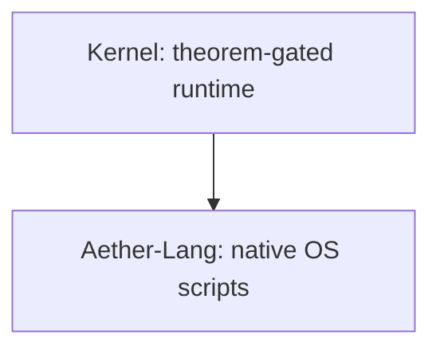

# Seal OS No-Chaos Execution Plan

> **For agentic workers:** REQUIRED SUB-SKILL: Use superpowers:subagent-driven-development (recommended) or superpowers:executing-plans to implement this plan task-by-task. Steps use checkbox (`- [ ]`) syntax for tracking.

**Goal:** Resume Seal OS from the current proved VM baseline and move only through gates that can be mechanically checked.

**Architecture:** README claims are contracts, but `seal-mkimage` proof gates and VM logs are the judge. Bare-metal Rust/no_std Seal OS remains the target; Aether-Lang is the native OS language layer; legacy host Python is quarantined reference/prototype material until replaced by Rust/Aether code and tests.

**Tech Stack:** Rust, no_std, x86_64 UEFI, Aether-Lang, QEMU, Oracle VirtualBox, PowerShell, shell CI scripts, `seal-mkimage` proof gates. No Python commands.

---

## Single Active Cursor

This file is the active execution plan. Older plan files are historical context only unless this plan explicitly points at them.

## Current Truth Baseline

| Area | Status | Evidence |
| --- | --- | --- |
| QEMU desktop boot | Proved | `kernel/seal-os/target/x86_64-unknown-uefi/release/qemu-proof/serial.log` plus `--check-vm-proof` |
| QEMU graphical screen | Proved | `kernel/seal-os/target/x86_64-unknown-uefi/release/qemu-proof/screen.ppm` plus `--check-proof-screen` |
| Oracle VirtualBox desktop boot | Proved on this host | `kernel/seal-os/target/x86_64-unknown-uefi/release/vbox-smoke/serial.log` plus `--check-vbox-proof` |
| AHCI-backed ManifoldFS root | Proved in QEMU and Oracle serial logs | VM proof gates require disk, sector 0, and persistent ManifoldFS |
| T1-T10 boot theorem lines | Proved | theorem log checker requires all ten `VERIFIED` lines |
| T1-T5 runtime theorem coverage | Source-gated | `--check-runtime-theorems .` |
| Aether/Rust migration for selected deleted Epsilon Python modules | Source/test-gated | `--check-aether-migration .` plus `legacy_migration_gate` |
| Legacy host-language-free production surface | Source-gated | `--check-language-hygiene .`; Python is banned from production OS/Rust roots and quarantined by docs/Linguist |
| Single-frame O(1) allocator | Source/boot-gated | `--check-o1-allocator .` plus boot `[ALLOC] O(1) proof:` marker; mutable bitmap access is allocator-private |
| Contiguous DMA allocation | Bounded/capped | 128 candidate probes plus hard 64-page marking cap |
| LAAMBA Governor native app | Partly native | kernel app and Aether file exist; host prototype backlog is classified in `docs/HOST_LANGUAGE_QUARANTINE.md` |
| Desktop compositor readiness | Proof-gated | QEMU and Oracle logs now require `[GFX] desktop-soak`; calibrated frame-pacing benchmark is still pending |
| HFT/ML faster-than-Ubuntu claim | Not proved | allocator comparison harness exists; same-machine Ubuntu artifacts are missing |
| VRAM file teleportation fast path | Design only | implementation and benchmark gate still required |
| Unsafe Rust inventory | Reported, not closed | current report shows hundreds of unsafe sites; policy/gate still pending |

## Hard Rules

- No README check mark without a command, VM log, screenshot gate, test, or source gate that proves the exact claim.
- No broad "better than Ubuntu" claim until a same-machine Ubuntu baseline exists and `seal-mkimage --compare-benchmark-logs` passes for the relevant row.
- No deleting Python files just to reduce language stats. Delete only after a Rust/Aether replacement and a passing migration gate exist.
- No Python commands.
- No POSIX/Linux runtime dependency claims inside the OS. Host tooling must be labeled host-only.
- If a proof gate fails, stop feature work and fix that gate first.
- If the OS does not boot in QEMU or Oracle, "OS working" is red regardless of docs.

## Agent Lanes

Agents inspect independent lanes. The coordinator patches and verifies.

| Agent | Job | Output |
| --- | --- | --- |
| Newton | VM operator: QEMU, Oracle, AHCI disk, desktop proof, screenshots | exact pass/fail lines and artifact paths |
| Noether | theorem and O(1) auditor | T1-T10 status, T1-T5 runtime callsites, allocator bound evidence |
| Hilbert | Aether/Rust migration auditor | Python backlog classified by replacement status |
| Gauss | README/CI truth auditor | false ticks, broken Mermaid, missing gate docs |
| Curie | desktop/graphics auditor | screen defects, frame/readiness issues, no broad renderer rewrite |

## File Map

### Proof gates and CI

- Modify only when a gate is missing: `kernel/seal-mkimage/src/main.rs`
- Modify only when CI drift is found: `.github/workflows/ci.yml`
- Modify only when local CI drift is found: `scripts/local_ci.sh`
- Read proof artifacts: `kernel/seal-os/target/x86_64-unknown-uefi/release/qemu-proof/serial.log`
- Read proof artifacts: `kernel/seal-os/target/x86_64-unknown-uefi/release/qemu-proof/screen.ppm`
- Read proof artifacts: `kernel/seal-os/target/x86_64-unknown-uefi/release/vbox-smoke/serial.log`

### LAAMBA/Aether migration

- Read/modify as needed: `apps/laamba-governor/README.md`
- Read/modify as needed: `apps/laamba-governor/native/governor.aether`
- Read/modify as needed: `apps/laamba-governor/src-tauri/src/main.rs`
- Read/modify as needed: `kernel/seal-os/src/apps/laamba_governor.rs`
- Read/modify as needed: `kernel/seal-os/src/apps/mod.rs`
- Read/modify as needed: `kernel/epsilon/epsilon/crates/aether-core/src/governor.rs`
- Read/modify as needed: `kernel/epsilon/epsilon/crates/aether-core/tests/legacy_migration_gate.rs`

### Epsilon theorem migration

- Read/modify as needed: `kernel/epsilon/epsilon_core/README.md`
- Read/modify as needed: `docs/HOST_LANGUAGE_QUARANTINE.md`
- Read/modify as needed: `kernel/epsilon/epsilon/crates/aether-core/src/lib.rs`
- Read/modify as needed: `kernel/epsilon/epsilon/crates/aether-core/src/hyperbolic_geometry.rs`
- Read/modify as needed: `kernel/epsilon/epsilon/crates/aether-core/src/meta_controller.rs`
- Read/modify as needed: `kernel/epsilon/epsilon/crates/aether-core/src/spectral_entropy.rs`

### VM, allocator, graphics, docs

- Read/modify as needed: `kernel/seal-os/src/memory/phys.rs`
- Read/modify as needed: `kernel/seal-os/src/memory/topo_ram.rs`
- Read/modify as needed: `kernel/seal-os/src/fs/manifold_fs.rs`
- Read/modify as needed: `kernel/seal-os/src/wm/compositor.rs`
- Read/modify as needed: `kernel/seal-os/src/wm/desktop.rs`
- Read/modify as needed: `README.md`
- Read/modify as needed: `docs/SEAL_OS_GUIDE.md`
- Read/modify as needed: `docs/VM_RUNBOOK.md`
- Read/modify as needed: `docs/BENCHMARK_PLAN.md`
- Read/modify as needed: `docs/VRAM_TOPOLOGY_FAST_PATH.md`

## Task 1: Freeze The Current Proof Baseline

**Files:**
- Read: `git status --short`
- Read: proof artifacts listed in File Map
- Modify: none

- [x] **Step 1: Confirm dirty tree without reverting user work**

Run:

```powershell
git status --short
```

Result: passed on 2026-05-29. Output is large; unrelated/user/prior-agent changes were not reverted.

- [x] **Step 2: Run source proof gates**

Run:

```powershell
cargo +stable run --manifest-path kernel\seal-mkimage\Cargo.toml --release -- --check-seal-abi .
cargo +stable run --manifest-path kernel\seal-mkimage\Cargo.toml --release -- --check-language-hygiene .
cargo +stable run --manifest-path kernel\seal-mkimage\Cargo.toml --release -- --check-aether-migration .
cargo +stable run --manifest-path kernel\seal-mkimage\Cargo.toml --release -- --check-o1-allocator .
cargo +stable run --manifest-path kernel\seal-mkimage\Cargo.toml --release -- --check-runtime-theorems .
```

Result: passed on 2026-05-29. `--check-seal-abi`, `--check-language-hygiene`, `--check-aether-migration`, `--check-o1-allocator`, and `--check-runtime-theorems` all exited 0.

- [x] **Step 3: Run existing VM artifact proof gates**

Run:

```powershell
cargo +stable run --manifest-path kernel\seal-mkimage\Cargo.toml --release -- --check-vm-proof kernel\seal-os\target\x86_64-unknown-uefi\release\qemu-proof\serial.log
cargo +stable run --manifest-path kernel\seal-mkimage\Cargo.toml --release -- --check-proof-screen kernel\seal-os\target\x86_64-unknown-uefi\release\qemu-proof\screen.ppm
cargo +stable run --manifest-path kernel\seal-mkimage\Cargo.toml --release -- --check-vbox-proof kernel\seal-os\target\x86_64-unknown-uefi\release\vbox-smoke\serial.log
```

Result: passed on 2026-05-29. `--check-vm-proof`, `--check-proof-screen`, and `--check-vbox-proof` all exited 0 against existing proof artifacts.

- [x] **Step 4: Run Rust/Aether library checks**

Run:

```powershell
cargo +stable test --manifest-path kernel\epsilon\epsilon\crates\aether-core\Cargo.toml
cargo +stable check --manifest-path kernel\epsilon\epsilon\crates\aether-core\Cargo.toml --no-default-features --features no_std
```

Result: passed on 2026-05-29. Full `aether-core` test suite and `no_std` check exited 0.

- [x] **Step 5: Run diff hygiene**

Run:

```powershell
git diff --check
```

Result: passed on 2026-05-29. `git diff --check` exited 0 with only host git ignore permission and LF-to-CRLF warnings.

## Task 2: Audit LAAMBA Before Any Rewrite

**Files:**
- Read: `apps/laamba-governor/README.md`
- Read: `apps/laamba-governor/native/governor.aether`
- Read: `apps/laamba-governor/src-tauri/src/main.rs`
- Read: `kernel/seal-os/src/apps/laamba_governor.rs`
- Read: `kernel/epsilon/epsilon/crates/aether-core/src/governor.rs`
- Modify only after audit: `kernel/seal-mkimage/src/main.rs`
- Modify only after audit: `kernel/epsilon/epsilon/crates/aether-core/tests/legacy_migration_gate.rs`

- [ ] **Step 1: Count LAAMBA host Python backlog**

Run:

```powershell
rg --files apps\laamba-governor -g "*.py" -g "*.pyw"
```

Expected: list host prototype files. Treat them as backlog, not runtime.

- [ ] **Step 2: Map native replacement surfaces**

Run:

```powershell
rg -n "LAAMBA|Lambda|governor|telemetry|risk|epsilon|formula|topological" apps\laamba-governor\native apps\laamba-governor\src-tauri kernel\seal-os\src\apps kernel\epsilon\epsilon\crates\aether-core\src
```

Expected: native Rust/Aether symbols exist for the app shell, governor math, and kernel desktop surface.

- [x] **Step 3: Classify each Python file**

Create a short table in `docs/HOST_LANGUAGE_QUARANTINE.md` with columns:

```markdown
| Host file | Runtime replacement | Status |
| --- | --- | --- |
| `apps/laamba-governor/topological_governor_ml.py` | `kernel/epsilon/epsilon/crates/aether-core/src/governor.rs` | migrate/test before delete |
```

Result: passed on 2026-05-29. `docs/HOST_LANGUAGE_QUARANTINE.md` now contains the LAAMBA migration table and the next native command target.

- [ ] **Step 4: Add or strengthen the migration gate only after the table exists**

If the audit shows a missing gate, extend `--check-aether-migration .` so it requires the Rust/Aether replacement symbol named in the table.

Expected: `--check-aether-migration .` fails when a claimed replacement disappears.

## Task 3: Audit Epsilon Core Migration Before More Deletions

**Files:**
- Read: `kernel/epsilon/epsilon_core/README.md`
- Read: `kernel/epsilon/epsilon_core`
- Read: `kernel/epsilon/epsilon/crates/aether-core/src`
- Modify only after audit: `kernel/epsilon/epsilon/crates/aether-core/tests/legacy_migration_gate.rs`
- Modify only after audit: `docs/HOST_LANGUAGE_QUARANTINE.md`

- [ ] **Step 1: List remaining Epsilon Python**

Run:

```powershell
rg --files kernel\epsilon\epsilon_core -g "*.py" -g "*.pyw"
```

Expected: list remaining host-side Epsilon files.

- [ ] **Step 2: Confirm deleted Python modules have Rust replacements**

Run:

```powershell
rg -n "Hyperbolic|MetaController|SpectralEntropy|spectral|governor|convergence|topological_state_sync" kernel\epsilon\epsilon\crates\aether-core\src kernel\epsilon\epsilon\crates\aether-core\tests
```

Expected: replacements and migration tests exist for modules already deleted from `kernel/epsilon/epsilon_core`.

- [ ] **Step 3: Block deletion without replacement**

Before deleting any remaining Python file, add the replacement module and a Rust migration test first.

Expected: `cargo +stable test --manifest-path kernel\epsilon\epsilon\crates\aether-core\Cargo.toml --test legacy_migration_gate` passes after each migration.

## Task 4: Implement Only One Narrow Closure Per Pass

**Files:**
- Modify: the smallest files identified by Task 2 or Task 3
- Modify: matching migration tests
- Modify: matching docs/gates

- [ ] **Step 1: Choose one red item**

Allowed first red item:

```text
LAAMBA Python file with clear Rust/Aether target
```

Expected: one file or one small cluster, not a rewrite of the app.

- [ ] **Step 2: Write the Rust/Aether test gate first**

Use one of these commands depending on target:

```powershell
cargo +stable test --manifest-path kernel\epsilon\epsilon\crates\aether-core\Cargo.toml --test legacy_migration_gate
cargo +stable run --manifest-path kernel\seal-mkimage\Cargo.toml --release -- --check-aether-migration .
```

Expected: the test or gate fails before implementation if the replacement is missing.

- [ ] **Step 3: Implement the minimal Rust/Aether replacement**

Expected: no Python runtime path is added. No host Python command is run.

- [ ] **Step 4: Prove the closure**

Run:

```powershell
cargo +stable test --manifest-path kernel\epsilon\epsilon\crates\aether-core\Cargo.toml
cargo +stable check --manifest-path kernel\epsilon\epsilon\crates\aether-core\Cargo.toml --no-default-features --features no_std
cargo +stable run --manifest-path kernel\seal-mkimage\Cargo.toml --release -- --check-aether-migration .
cargo +stable run --manifest-path kernel\seal-mkimage\Cargo.toml --release -- --check-language-hygiene .
```

Expected: all commands exit 0.

## Task 5: Keep README And Mermaid Honest

**Files:**
- Modify: `README.md`
- Modify: `docs/SEAL_OS_GUIDE.md`
- Modify: `docs/VM_RUNBOOK.md`

- [ ] **Step 1: Search public claim drift**

Run:

```powershell
rg -n "better than Ubuntu|faster than Ubuntu|complete proof|proved superior|Python-free|O\(1\) for everything|VRAM|LAAMBA|Lambda|Mermaid|```mermaid" README.md docs
```

Expected: find claims that need proof wording or Mermaid syntax review.

- [ ] **Step 2: Fix only claims tied to passed gates**

Allowed wording:

```markdown
| HFT/ML Ubuntu superiority | RED | Same-machine benchmark evidence missing |
| VRAM file teleportation | DESIGN | Fast path documented; implementation and benchmark pending |
| Legacy host-language-free production surface | GATED | Production roots ban Python; host prototypes remain quarantined |
```

Expected: README tells the truth and does not pretend design is shipped runtime.

- [ ] **Step 3: Fix Mermaid labels with punctuation**

Use quoted labels:



Expected: GitHub renders the diagram.

## Task 6: Benchmark And VRAM Are Separate Mountains

**Files:**
- Modify later: `docs/BENCHMARK_PLAN.md`
- Modify later: `docs/VRAM_TOPOLOGY_FAST_PATH.md`
- Modify later: `kernel/seal-os/src/fs/manifold_fs.rs`
- Modify later: `kernel/seal-os/src/graphics/framebuffer.rs`

- [ ] **Step 1: Do not implement VRAM teleportation until the baseline proof pack is green**

Expected: no filesystem storage rewrite while VM proof or migration gates are red.

- [x] **Step 2: Define benchmark before claiming victory**

Minimum benchmark categories:

```text
allocation p50/p95/p99/p999
ManifoldFS metadata teleport latency
bulk file persistence latency
desktop frame/readiness latency
HFT tick-to-decision simulation
ML tensor movement simulation
```

Expected: Seal OS can claim superiority only for measured categories with Ubuntu baseline numbers.

Result on 2026-05-29: the allocator row now has a Rust-only Ubuntu harness
(`tools/ubuntu-alloc-bench`) and machine gates:
`seal-mkimage --check-ubuntu-benchmark-log` and
`seal-mkimage --compare-benchmark-logs`. Full HFT/ML, VRAM, filesystem, and
desktop benchmark rows still need artifacts.

## Task 7: Final Proof Pack And Audit

**Files:**
- Read: proof artifacts
- Read: `git status --short`
- Modify: none

- [ ] **Step 1: Rebuild kernel and image after code changes**

Run:

```powershell
cargo +nightly build --manifest-path kernel\seal-os\Cargo.toml --release
cargo +stable run --manifest-path kernel\seal-mkimage\Cargo.toml --release
```

Expected: both commands exit 0.

- [ ] **Step 2: Run QEMU proof if kernel or boot image changed**

Run from `kernel\seal-os`:

```powershell
powershell -NoProfile -ExecutionPolicy Bypass -File .\run-qemu.ps1 -HeadlessProof -ProofSeconds 240
```

Expected: QEMU proof completes and generates updated `qemu-proof` artifacts.

- [ ] **Step 3: Run Oracle proof if VM boot or storage changed**

Run from `kernel\seal-os`:

```powershell
powershell -NoProfile -ExecutionPolicy Bypass -File .\build-vbox.ps1
powershell -NoProfile -ExecutionPolicy Bypass -File .\smoke-vbox.ps1 -SkipBuild -Seconds 240 -VBoxCommandTimeoutSeconds 30
```

Expected: VirtualBox proof completes and generates updated `vbox-smoke` artifacts.

- [ ] **Step 4: Report green/red truth**

Final report must include:

```markdown
| Area | Status | Evidence |
| --- | --- | --- |
| QEMU OS boot | GREEN/RED | command and artifact |
| Oracle VM boot | GREEN/RED | command and artifact |
| T1-T10 boot theorems | GREEN/RED | checker |
| T1-T5 runtime theorem coverage | GREEN/RED | checker |
| O(1) allocator contract | GREEN/RED | checker and boot marker |
| LAAMBA native migration | GREEN/RED/PARTIAL | replacement/gate |
| Ubuntu superiority | GREEN/RED | benchmark artifact |
```

Expected: user sees what works, what is still red, and what exact next strike matters.

## Execution Mode

Default mode is subagent-driven audit lanes, then coordinator patches. If subagent tooling is unavailable, execute inline with the same task boundaries and checkpoint after each task.
