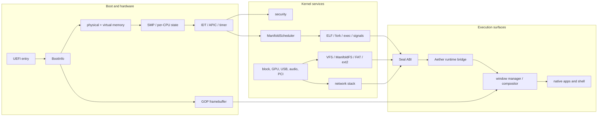

# System Architecture

## Scope and source of truth

Epsilon Hollow is a monorepo with several related products and experiments.
The bootable product is the `seal-os` crate under `kernel/seal-os`. The root
Cargo workspace contains reusable and host-side crates, but it intentionally
excludes the kernel because the kernel needs a different toolchain, target, and
workspace boundary.

This page describes relationships that can be traced to source. It does not
merge the research model, the language roadmap, and the running kernel into one
fictional executable.

## Top-level components

| Component | Build boundary | Responsibility | Current evidence boundary |
| --- | --- | --- | --- |
| `kernel/seal-os` | Standalone nightly Cargo workspace | Bare-metal x86_64 kernel, UEFI entry, memory, scheduler, drivers, VFS, syscalls, graphics, apps | Kernel build and QEMU/VM proof gates |
| `kernel/seal-mkimage` | Standalone stable host crate | Creates the raw GPT/UEFI image and runs repository audit/proof gates | Host command output and generated image checks |
| `aether-core` | Root stable workspace | Topology, manifold, theorem-adjacent math, memory and ML primitives | Rust tests, feature builds, and Miri lanes where configured |
| `aether_verified` | Root stable workspace | Rust-side theorem checkers and proof-facing helpers | Rust verifier tests plus Lean artifacts with separately tracked strength |
| `aether-lang` | Root stable workspace | Lexer, parser, AST, interpreter, bytecode/VM and callback contracts | Crate tests and the Seal OS Aether runtime probe |
| `epsilon` / `epsilon-os` | Root stable workspace | Context-transfer research API and host/user-space runtime experiments | Crate APIs and tests; not a kernel capability by itself |
| `aether-link` | Root stable workspace | I/O and prefetch research crate | Benchmarks and crate tests; no blanket hardware claim |
| `kernel/epsilon/epsilon_core` | Host Python compatibility area | Legacy/reference shims during migration to Rust/Aether | Explicitly non-authoritative; see its README |
| `future/` | Excluded research tree | Future APEIRON/runtime tracks | Roadmap unless a specific artifact is separately verified |

## Layered model

The modules in the diagram are declared by `kernel/seal-os/src/lib.rs` and
their submodule files. The important architectural fact is that these are
kernel modules inside one `no_std` crate, not independent microservices.

## Compile graph and ownership

The root workspace is declared in `Cargo.toml`. Its members
include `aether-core`, `epsilon`, `epsilon-os`, `aether-link`,
`aether_verified`, the Aether language crates, and the Ubuntu allocator
benchmark. The root workspace uses the stable toolchain pinned by
`rust-toolchain.toml`.

The kernel has its own empty `[workspace]` declaration in
`kernel/seal-os/Cargo.toml`, uses nightly plus
`rust-src` and `llvm-tools-preview`, and depends on the no-std feature paths of
`aether-core` and `aether-lang`. This separation matters: `cargo test --workspace`
does not build the bootable kernel.

`seal-mkimage` is the host-side bridge. Its `aether_build` module discovers
Aether sources and produces object metadata for the image pipeline; its CLI
also owns several source, proof-log, manifest, and release-contract checks.

## Boot-to-runtime dependency order

`kernel/seal-os/src/lib.rs` is the integration root. The order is observable in
`kernel_main`, `kernel_main_continue`, `boot_graphical`, and `boot_serial`.

1. **Capture firmware state.** The UEFI entry code constructs `BootInfo`,
   including the memory map, kernel range, framebuffer information, and ACPI
   RSDP address. The kernel copies it into static storage before the physical
   allocator can reuse the original firmware stack pages.
2. **Initialize memory.** `memory::init`, `memory::phys::init_high`, the static
   page pinning path, and `memory::topo_ram::init` establish the heap, physical
   frame truth store, virtual mappings, and topology metadata.
3. **Bring up CPUs.** `cpu::smp::smp_init` establishes per-CPU state. ACPI and
   APIC initialization then discover and program interrupt/timer topology.
4. **Install kernel entry paths.** Security initialization, IDT/PIC, RTC,
   local APIC timer, watchdog, syscall MSRs, and entropy are initialized before
   the normal desktop or serial path continues.
5. **Select the display mode.** If GOP supplied a framebuffer, the graphical
   path initializes the framebuffer and renderer. Otherwise the serial path
   still runs theorem, scheduler, package, language, driver, filesystem, and
   runtime initialization without desktop rendering.
6. **Verify the theorem core.** `init_theorems` calls
   `verify_topology_theorems`, updates the ten live state flags, initializes the
   governor and an eight-cell spherical Voronoi index, then panics if any check
   fails.
7. **Initialize storage and services.** Drivers, VFS, swap, authentication
   databases, scheduler tasks, package registry, Aether runtime, networking,
   USB, prefetch, async runtime, and games are initialized in the paths that
   support them.
8. **Enter the event loop.** The graphical path creates the compositor and
   dispatches input/render events. The serial path emits readiness markers and
   the kernel remains in its halt loop while interrupts drive work.

## Subsystem contracts

### Memory

The source of truth for physical frame ownership is the bitmap in
`kernel/seal-os/src/memory/phys.rs`. The topology index is an accelerator and
must be kept consistent with the bitmap. `topo_ram.rs` attaches spherical
coordinates, Voronoi cells, access history, and lifetime metadata to frames.
Virtual memory, page tables, `mmap`, demand paging, swap, slab allocation, and
the heap live under `kernel/seal-os/src/memory/`.

The documented bounded claims are narrower than “all memory work is O(1)”.
Single-frame allocation uses a fixed eight-cell index; contiguous allocation is
bounded by fixed candidate probes and a maximum run length; larger transfers
must use a different strategy. The exact constants and acceptance markers are
tracked in [`TOPOLOGICAL_OS_CONTRACT.md`](TOPOLOGICAL_OS_CONTRACT.md).

### Scheduling and processes

`ManifoldScheduler` stores tasks in eight spherical cells. Each cell has fixed
priority buckets. Selection first probes the predicted cell and then chooses
the highest-priority ready cell; the scheduler source documents the resulting
bounded selector as the reason for the scoped O(1) claim.

The process layer adds task context, context switching, ELF loading, userspace
entry, fork/clone, signals, and syscall MSR setup. The scheduler exposes both
kernel-task spawning and ELF-backed userspace spawning. A timer interrupt calls
`scheduler_tick`; voluntary yields call `yield_current`.

### Filesystems and storage

The VFS is the common interface. The implementation includes block storage,
buffer cache, journal, path cache, directory hashing, inode allocation,
ManifoldFS, FAT, ext2, pipes, procfs, sysfs, devtmpfs, encoding, TopCrypt, and
Voronoi capability support. The source is under `kernel/seal-os/src/fs/`.

The storage dependency chain is: PCI/device discovery → AHCI/NVMe or another
block provider → disk layer → VFS mount → filesystem operations. ManifoldFS is
not a synonym for every filesystem implementation; it is one filesystem and
topological metadata path behind the VFS.

The “metadata teleport” claim is specifically a same-inode metadata move with
bounded bookkeeping. It is not a claim that file payload bytes physically move
in zero time, nor a claim that every cross-filesystem rename has the same cost.

### Drivers and network

The driver registry covers ACPI, APIC, CPU discovery, block and disk devices,
entropy, GPU, interrupts, PCI, serial, RTC, USB, audio, networking, watchdog,
Wi-Fi, and Bluetooth. Drivers are initialized from `init_drivers` in a fixed
sequence; optional hardware failures log a warning and the boot path may
continue.

The network stack under `kernel/seal-os/src/net/` contains ARP, DHCP, DNS,
firewall, ICMP, IPv4, IPv6, TCP, UDP, and topological helpers. The network
driver boundary is separate from the protocol modules. The boot benchmarks for
TCP demux, TCP loopback, and TLS are fixture/proof paths; read them as evidence
for those fixtures, not as a production Internet interoperability statement.

### Syscalls and ABI

Seal OS exposes a Seal-defined syscall table in
`kernel/seal-os/src/syscall/table.rs`. It includes process, file, memory,
identity, signal, pipe, time, watchdog, ioctl, synchronization, resource-limit,
network/device, package, settings, and Epsilon extension calls. Familiar
numeric names do not make this a POSIX or Linux ABI.

The dispatcher receives one syscall number and three machine-word arguments and
returns a `SyscallResult`. Pointer validation, copy-in/copy-out, current-task
identity, and subsystem-specific error mapping occur in the dispatch path or
the delegated module. The stable external reference is
[`SYSCALLS.md`](SYSCALLS.md); the source table remains authoritative when the
reference and implementation disagree.

### Aether integration

`kernel/seal-os/src/lang/mod.rs` constructs an `AetherRuntime`, registers
filesystem/process/network/hardware callbacks, and attaches graphics, window,
and input callback tables to the interpreter. MMIO callbacks are accepted only
for ranges minted by kernel driver code and require alignment and containment.

This boundary lets the same language crate run in host tests and in a no-std
kernel embedding. It does not make every host feature available in the kernel.
The boot probe is a deliberately small parser/interpreter/app-host check; it is
evidence for that integration path, not a proof of the complete language or
every application.

## Theorem ownership

The theorem pipeline has three distinct layers:

1. `aether-core` provides reusable mathematical and state primitives.
2. `aether_verified` provides Rust-side checks consumed by Seal OS boot.
3. The Lean tree records formalization status, which may be full, layered,
   partial, or placeholder depending on the theorem.

Seal OS currently treats T1-T5 as active runtime influences in TopoRAM,
ManifoldFS, scheduling, memory, compositor, swap, and related paths. T6-T10
are boot-gated checks for the HFT/ML theorem surface, not universal hot-path
governors. Consult [`THEOREMS.md`](THEOREMS.md) for the per-theorem callsite and
formal-strength ledger.

## Failure and observability model

The primary kernel diagnostic channel is serial output. Boot markers are emitted
around initialization boundaries and the proof tooling parses those markers.
The framebuffer is visual evidence; it is not a substitute for serial proof.
The QEMU proof path captures both, while VirtualBox smoke captures a screenshot
but has a deliberately different evidence contract.

When debugging, preserve the first failure and the image identity. Do not start
from a late “desktop ready” timeout if an earlier memory, theorem, driver, or
storage marker is missing.

## Architectural non-goals

- No POSIX compatibility promise and no libc target.
- No assumption that `future/` code is linked into the shipped kernel.
- No claim that all theorem formalizations have equal Lean strength.
- No claim that fixture benchmarks establish universal workload superiority.
- No claim that optional hardware drivers are proven on hardware merely because
  their source module exists.
