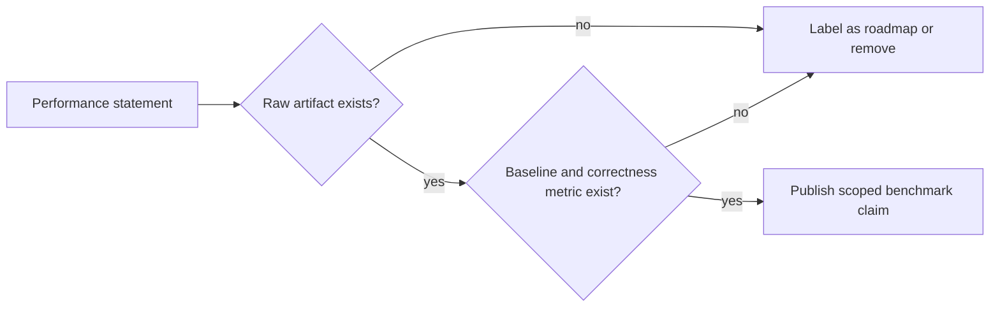

# Benchmark Policy

Benchmark documentation records evidence. It does not create evidence.

The previous benchmark page mixed placeholder rows and speedup claims without
raw artifacts. This MkDocs page uses the stricter policy: timing claims stay out
of the active docs until a reproducible artifact records the environment,
baseline, command, correctness check, and raw result.

## Required Artifact Fields

Full benchmark artifacts should record:

- repository commit;
- command;
- crate or runtime path;
- CPU, GPU, memory, operating system, and compiler versions;
- input size and random seed;
- baseline implementation;
- correctness metric;
- p50, p95, p99, or equivalent timing distribution when timing is claimed;
- warning list and skipped runtime gates.

## Current Benchmark Status

| Workload | Status | Allowed claim | Missing evidence for stronger claim |
| --- | --- | --- | --- |
| Parser 10k-line stress | Active test-level evidence | Parser can process generated large input under the crate test condition | Separate artifact with machine details and repeated timing |
| Geometric regression examples | Example/prototype | Scripts describe regression workflows | Correctness baseline and raw timing artifact |
| Betti/topology examples | Example/prototype | Scripts and functions expose topology-oriented data paths | External TDA baseline parity and artifact |
| LLM examples | Roadmap/prototype | Files exist for LLM-oriented experiments | Model, hardware, command, memory, correctness, and baseline artifact |
| Seal OS integration | Repository-level proof gated | OS claims require Seal OS proof markers | Fresh proof bundle for each OS-level claim |

## Claim Gate

No page in the MkDocs navigation should claim a speedup until the benchmark
artifact exists and the benchmark page links the exact command and baseline.

