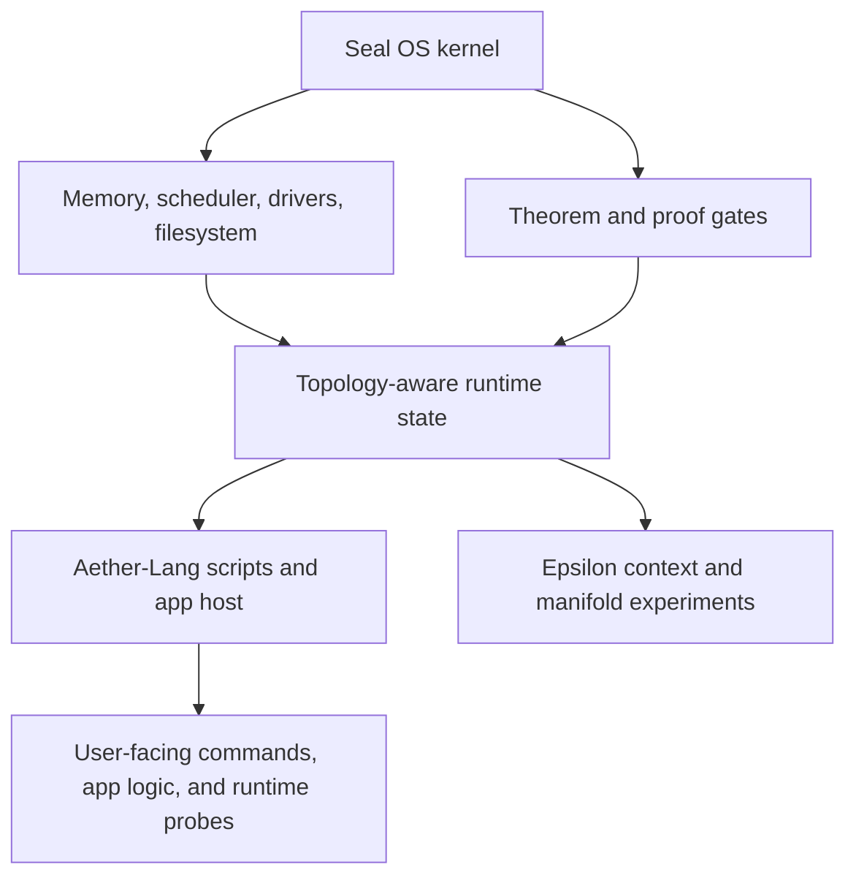

# Epsilon Hollow

Epsilon Hollow is the surrounding research system for Aether-Lang. It combines
bare-metal Rust, topology-aware memory and filesystem experiments, theorem
gates, and language runtime experiments into a single operating-system research
tree.

The useful framing is mechanical: Epsilon Hollow treats parts of the OS as
state embedded in a constrained geometric model. That model is used to express
bounded allocation paths, topological filesystem metadata, theorem-gated boot
checks, and language-mediated control surfaces.

## System Boundary

## Role Of Aether-Lang

Aether-Lang does not replace the kernel. It provides a constrained language
surface for describing runtime actions and topology-oriented data operations.
In the current repository it is best read as:

- a parser and interpreter for a small declarative/runtime language;
- a host-call bridge used by Seal OS app and script experiments;
- a place to prototype manifold, regression, and rendering commands;
- a future self-hosting candidate, not a completed self-hosted compiler.

## Engineering Benefit

The benefit emerges from separation of concerns:

- Rust owns memory safety boundaries, hardware access, and proof gates.
- Aether-Lang owns script shape, runtime orchestration, and user-level commands.
- Topology metadata gives the OS and language a shared vocabulary for
  allocation, movement, locality, and convergence.

This is an engineering structure, not a performance claim by itself. Performance
claims require benchmark artifacts and comparison baselines.

## Claim Boundary

Current documentation may say that Aether-Lang participates in Epsilon Hollow
runtime experiments. It should not say that Aether-Lang is production-ready,
self-hosting, hardware-accelerated, or faster than other runtimes unless a
current artifact proves that narrower statement.
