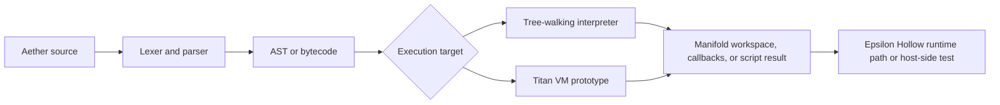

# Aether Language

Aether-Lang is a small research language and runtime surface used inside
Epsilon Hollow for topology-oriented scripting, interpreter experiments, and
kernel-adjacent orchestration.

Epsilon Hollow treats selected operating-system state as geometric or
topological state. Aether-Lang is the language layer in that system: it parses
declarations, creates manifold workspaces, extracts block metadata, executes
scripted control flow, and connects scripts to host or kernel callbacks when a
runtime supplies those callbacks.

The documentation separates active behavior from roadmap behavior. Active means
there is code in this repository and a local command can exercise the claim.
Roadmap means the interface or design is documented, but a stronger runtime,
hardware, benchmark, or self-hosting claim still needs evidence.

## Pipeline View

## What Is Active Today

- Lexer and parser support for Aether statements, expressions, imports,
  functions, loops, classes, and recoverable parse errors.
- Tree-walking interpreter support for arithmetic, control flow, functions,
  closures, arrays, dictionaries, class/object operations, native callbacks,
  manifold declarations, block extraction, rendering metadata, and regression
  statements.
- Titan VM bytecode structures, verification, peephole compaction, trace cache
  scaffolding, and focused VM execution tests.
- `aether-kernel` components for sparse scheduling, hardware topology scanning,
  ELF header checks, binary topology checks, serial output, and allocator setup.
- `aegis-core` memory and autograd experiments with Rust unit tests.
- Example `.aegis` and `.ag` scripts for manifold, benchmark, visualization,
  and Seal OS integration experiments.

## What Is Roadmap

- Full self-hosting of the Aether compiler and build path.
- Production-grade hardware acceleration claims.
- Broad LLM inference or model-training performance claims.
- Stable package distribution and Docker image claims for this nested checkout.
- Complete formal proof coverage for the language runtime.

## Learning Path

1. Start with the Epsilon Hollow concept page to understand why the language is
   attached to an operating-system research project.
2. Read the manifold model before using `manifold`, `block`, or `regress`.
3. Read the syntax and runtime-surface pages for the active language contract.
4. Use the architecture page to locate the lexer, parser, interpreter, VM, and
   kernel-adjacent crates.
5. Check benchmark and backend pages before repeating performance or hardware
   claims.

## Evidence Policy

Every active documentation claim should have one of three forms:

- a Rust unit test or workspace command;
- a checked runtime, VM, or benchmark artifact;
- a docs-only statement clearly labeled as theory or roadmap.

This policy keeps the language documentation usable without turning planned
system behavior into current capability.
