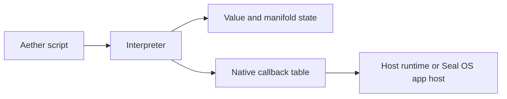

# Runtime Surface

The runtime surface consists of a parser, AST, interpreter, bytecode/VM
prototype, native callback tables, and manifold workspace structures.

## Active Components

| Component | Source | Active behavior |
| --- | --- | --- |
| Lexer | `crates/aether-lang/src/lexer.rs` | Tokenizes keywords, identifiers, literals, operators, comments, and terminators |
| Parser | `crates/aether-lang/src/parser.rs` | Builds ASTs and supports recoverable parse errors |
| AST | `crates/aether-lang/src/ast.rs` | Represents language statements, expressions, types, ranges, config blocks, and declarations |
| Interpreter | `crates/aether-lang/src/interpreter.rs` | Executes scripts against values, functions, callbacks, manifold workspaces, and render metadata |
| Type checker | `crates/aether-lang/src/typecheck.rs` | Provides type inference and unification scaffolding |
| Bytecode | `crates/aether-lang/src/bytecode.rs` | Defines opcodes, bytecode verification, peephole optimization, and trace cache scaffolding |
| Titan VM | `crates/aether-lang/src/vm.rs` | Executes a focused bytecode subset and has unit tests |

## Callback Boundary

The interpreter defines callback groups for filesystem, process, network,
hardware, graphics, window, and input operations. These callbacks are the
boundary between language code and the runtime that embeds it.

The docs should describe callback availability only for the runtime that
actually installs those callbacks.

## Kernel Boundary

`aether-kernel` is a separate crate with no-std-oriented components for sparse
scheduling, boot topology, ELF checks, and serial output. It is not the same as
the full Seal OS kernel. Documentation should name the crate-level boundary
before making OS-level claims.
