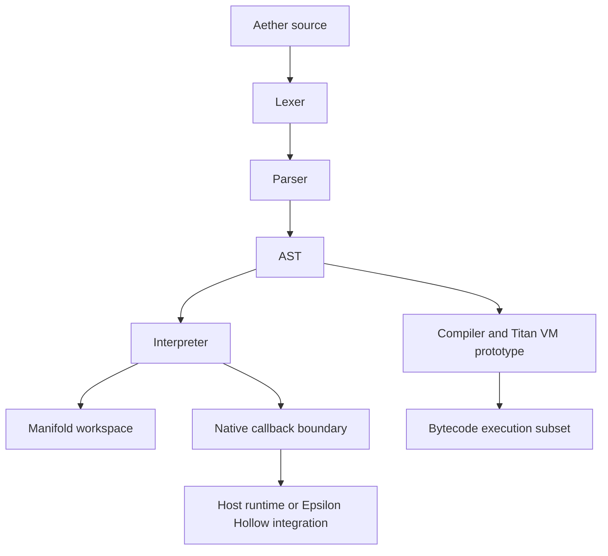

# Architecture

Aether is organized as a set of Rust crates around a language front end,
interpreter runtime, VM prototype, core experiments, and kernel-adjacent
components.

## Layer View

## Crate Map

| Crate | Role | Claim boundary |
| --- | --- | --- |
| `aether-lang` | Language front end, interpreter, VM prototype, rendering/export helpers | Active language behavior is bounded by crate tests and source APIs |
| `aether-kernel` | No-std kernel-adjacent scheduler, loader, boot topology, serial, allocator setup | Crate-level kernel support, not a complete OS by itself |
| `aegis-core` | Memory and autograd experiments | Experimental core utilities with unit tests |
| `repl-core` | Host-side REPL and file runner support | Host tool surface |
| `aether-cli` / `aegis-cli` | CLI front ends | Excluded from the workspace root in the current checkout |

## Data Flow

1. Source text is tokenized by the lexer.
2. The parser builds an AST or returns recoverable errors.
3. The interpreter evaluates statements directly, or compiler/VM paths handle a
   focused bytecode subset.
4. Runtime operations either update interpreter-owned state or cross through a
   callback table supplied by the embedding runtime.
5. Epsilon Hollow integration claims begin only after the callback or app-host
   path is exercised by the OS proof tooling.

## Design Constraint

The architecture keeps high-risk operations outside the language core when
possible. Filesystem, process, network, graphics, and hardware operations enter
through callback tables. That makes the same parser/interpreter usable in host
tests and in constrained runtime experiments without making every host feature a
kernel feature.
