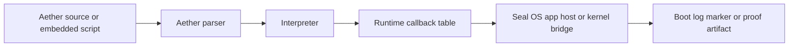

# OS Integration

Aether-Lang is documented as an Epsilon Hollow language surface when it is used
by the Seal OS app host or boot/runtime proof path. That integration must be
claimed through OS-level evidence, not only through host-side examples.

## Integration Path



## Active Boundary

The wider Epsilon Hollow repository documents an Aether runtime proof marker in
the Seal OS boot path. That marker is the kind of evidence needed for OS
integration claims.

Language docs should keep these claims narrow:

- Aether-Lang has parser and interpreter code in this checkout.
- Seal OS has runtime proof tooling that can check Aether runtime markers.
- Aether scripts can be used as app or boot probes when the embedding runtime
  wires the callback boundary.

## Non-Claims

The current docs should not imply:

- Aether fully builds Epsilon Hollow by itself.
- Aether replaces Rust in the kernel.
- Every Aether host command is available inside Seal OS.
- Hardware acceleration is active for language execution.
- Docker or package distribution proves kernel integration.

## Verification Commands

Use crate-level commands for language behavior:

```powershell
cargo test --manifest-path crates/aether-lang/Cargo.toml
cargo build --manifest-path crates/aether-kernel/Cargo.toml --target x86_64-unknown-none
```

Use repository-level Seal OS proof commands only when the claim crosses into the
operating-system runtime. Those commands live at the Epsilon Hollow repository
root and should be cited with the exact marker or verifier they check.
